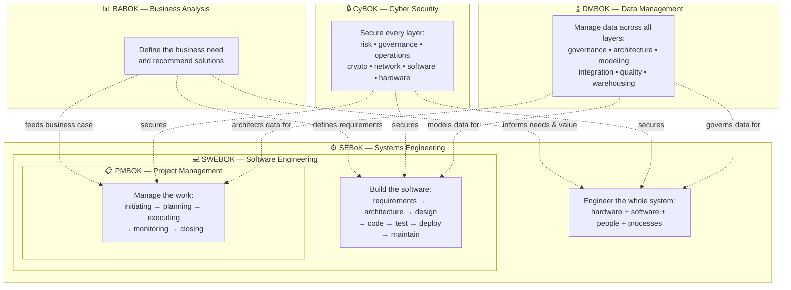

# Body of Knowledge — Overview

> **Purpose:** A curated collection of five major Bodies of Knowledge covering the full spectrum of modern engineering, business, and security disciplines — Software Engineering, Project Management, Systems Engineering, Business Analysis, and Cyber Security. Each BOK is a comprehensive, chapter-organized vault with deep cross-linking via .

## The Five Bodies of Knowledge

| BOK | Source | Edition | Files | Size | Focus |
|---|---|---|---|---|---|
| 💻 **SWEBOK** | IEEE Computer Society | v4 (2024) | 20 | ~200 KB | Software Engineering — 18 Knowledge Areas |
| 📋 **PMBOK** | Project Management Institute | v8 (2025) | 19 | ~274 KB | Project Management — 7 Performance Domains |
| ⚙️ **SEBoK** | BKCASE | v2 (2025) | 23 | ~366 KB | Systems Engineering — 8 Parts, 30+ Knowledge Areas |
| 📊 **BABOK** | International Institute of Business Analysis | v3 (2015) | 11 | ~257 KB | Business Analysis — 6 Knowledge Areas |
| 🔒 **CyBOK** | NCSC (UK Government) | v1.1 (2021) | 22 | ~262 KB | Cyber Security — 21 Knowledge Areas |
| 🗄️ **DMBOK** | DAMA International | v2 (2017) | 13 | ~200 KB | Data Management — 11 Knowledge Areas |

## SWEBOK v4 — Software Engineering

[[SWEBOK v4 - Overview|→ Full Overview]]

The **Software Engineering Body of Knowledge** defines the generally accepted knowledge of the software engineering discipline. 18 Knowledge Areas organized in three tiers:

| Tier | Knowledge Areas |
|---|---|
| 🔧 **Core Engineering** | Requirements, Architecture, Design, Construction, Testing, Operations, Maintenance |
| 📋 **Management & Process** | Configuration Management, Engineering Management, Engineering Process |
| 🎯 **Quality & Cross-Cutting** | Models & Methods, Quality, Security |
| 👤 **Professional Practice** | Professional Practice, Economics |
| 🧮 **Foundations** | Computing, Mathematical, Engineering |

**Vault:** `SWEBOK\` — 20 files | **Essential Docs:** [[SWEBOK Essential Documents|Document checklist]]

## PMBOK® Guide v8 — Project Management

[[PMBOK v8 - Overview|→ Full Overview]]

The **Project Management Body of Knowledge** is the ANSI-accredited global standard for project management. Two parts in one volume:

| Part | Content |
|---|---|
| **The Standard** | Introduction, Value Delivery System, 6 Principles, Project Life Cycles & Focus Areas |
| **The Guide** | 7 Performance Domains (Governance, Scope, Schedule, Finance, Stakeholders, Resources, Risk), Tailoring, I/O Catalog, Tools Catalog |
| **Appendices** | PMO, AI in Projects, Procurement, Evolution of PMBOK |

**Vault:** `PMBOK\` — 19 files | **Essential Docs:** [[PMBOK Essential Documents|Document checklist]]

## SEBoK v2 — Systems Engineering

[[SEBoK v2 - Overview|→ Full Overview]]

The **Systems Engineering Body of Knowledge** is the definitive reference for the systems engineering discipline. 8 Parts spanning foundations to emerging knowledge:

| Part | Content |
|---|---|
| **Part 1** | SEBoK Introduction |
| **Part 2** | Foundations (Fundamentals, Nature of Systems, Systems Science, Thinking, Models, Approach) |
| **Part 3** | SE & Management (Life Cycles, Processes, Architecture, Realization, Standards) |
| **Part 4** | Applications (Product, Service, Enterprise, SoS, Healthcare) |
| **Part 5** | Enabling SE (Businesses, Teams, Individuals) |
| **Part 6** | Related Disciplines (PM, SWE, Quality, Engineering Disciplines) |
| **Part 7** | Implementation Examples (Case Studies) |
| **Part 8** | Emerging Knowledge (AI, Digital Engineering, MBSE, SE Transformation) |

**Vault:** `System Engineer BOK\\` — 23 files | **Essential Docs:** [[SEBOK Essential Documents|Document checklist]]

## BABOK® Guide v3 — Business Analysis

[[BABOK v3 - Overview|→ Full Overview]]

The **Business Analysis Body of Knowledge** is the IIBA global standard defining the BA profession. 6 Knowledge Areas with 30 tasks, 50 techniques, and 5 perspectives. **Vault:** `BABOK\\` — 11 files

## CyBOK v1.1 — Cyber Security

[[CyBOK v1 - Overview|→ Full Overview]]

The **Cyber Security Body of Knowledge** is the NCSC reference mapping the foundations of cyber security. 21 Knowledge Areas:

| Category | Knowledge Areas |
|---|---|
| 🔐 **Governance & Risk** | Risk Management & Governance, Law & Regulation, Privacy |
| 👤 **Human & Adversarial** | Human Factors, Adversarial Behaviours, Malware & Attack Technologies |
| 🛡️ **Defensive** | Security Operations & Incident Management, Forensics |
| ⚙️ **Systems Security** | Software Security, OS & Virtualisation, Distributed Systems, Hardware, CPS, Physical Layer |
| 🔑 **Security Engineering** | AAA, Applied Cryptography, Formal Methods, Secure Software Lifecycle, Web & Mobile, Network Security |

**Vault:** `CyBOK\\` — 22 files

## How These BOKs Relate

- **PMBOK** tells you *how to manage the work*
- **SWEBOK** tells you *how to build the software*
- **SEBoK** tells you *how to engineer the whole system*
- **BABOK** tells you *how to define the business need and solution*
- **CyBOK** tells you *how to secure it all*
- **DMBOK** tells you *how to manage the data*

They're complementary — a large initiative typically draws from all six.

## Reading Paths

- **New software engineer:** SWEBOK → PMBOK (essentials)
- **Senior engineer / tech lead:** SWEBOK (architecture, quality, security) → SEBoK (foundations, systems thinking)
- **Project manager:** PMBOK → SEBoK (SE & PM) → SWEBOK (understanding the work being managed)
- **Systems engineer:** SEBoK → SWEBOK (SE & SWE) → PMBOK (SE & PM)
- **Business analyst:** BABOK → SWEBOK (understanding the solution) → PMBOK (project context)
- **Security engineer:** CyBOK → SWEBOK (software security) → SEBoK (system-level security)
- **Data engineer:** DMBOK → SWEBOK (data modeling) → SEBoK (system data architecture)
- **Quick document checklist:** [[Essential Documents - Overview|Essential Documents →]]

## Related

- [[Essential Documents - Overview|Essential Documents]] — Document-only checklists extracted from these BOKs
