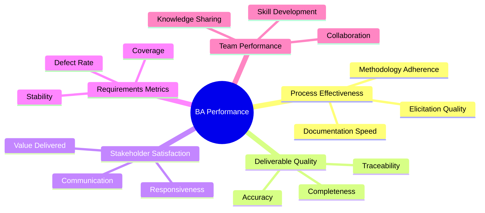

# BA Performance Assessment

> **Project:** [Project Name]
> **Version:** [X.Y] | **Status:** [Draft | Under Review | Approved | Archived]
> **Last Updated:** [YYYY-MM-DD]

---

## Document Control

| Field | Value |
|-------|-------|
| Document Owner | [Name / Role] |
| BA Lead | [Name / Role] |
| Project Manager | [Name / Role] |

### Revision History

| Version | Date | Author | Change Description |
|---------|------|--------|--------------------|
| 0.1 | [YYYY-MM-DD] | [Name] | Initial draft |
| 1.0 | [YYYY-MM-DD] | [Name] | Approved version |

### Approvals

| Role | Name | Signature | Date |
|------|------|-----------|------|
| BA Lead | | | |
| Project Manager | | | |
| Business Owner | | | |

---

## Table of Contents

1. [Executive Summary](#1-executive-summary)
2. [Assessment Framework](#2-assessment-framework)
3. [Process Effectiveness](#3-process-effectiveness)
4. [Deliverable Quality](#4-deliverable-quality)
5. [Stakeholder Satisfaction](#5-stakeholder-satisfaction)
6. [Requirements Metrics](#6-requirements-metrics)
7. [Team Performance](#7-team-performance)
8. [Improvement Actions](#8-improvement-actions)
9. [Lessons Learned](#9-lessons-learned)

---

## 1. Executive Summary

| Field | Detail |
|-------|--------|
| Assessment Period | [YYYY-MM-DD] to [YYYY-MM-DD] |
| Overall BA Performance | 🟢 Effective / 🟡 Needs Improvement / 🔴 Ineffective |
| Overall Score | [X/5.0] |
| Strongest Area | [e.g., Stakeholder Satisfaction — 4.5/5] |
| Weakest Area | [e.g., Requirements Stability — 3.0/5] |
| Key Achievements | [Count] |
| Improvement Areas | [Count] |

### Performance Dashboard

| Dimension | Score | Status | Trend |
|-----------|-------|--------|-------|
| Process Effectiveness | [X/5] | 🟢🟡🔴 | ↑↓→ |
| Deliverable Quality | [X/5] | 🟢🟡🔴 | ↑↓→ |
| Stakeholder Satisfaction | [X/5] | 🟢🟡🔴 | ↑↓→ |
| Requirements Metrics | [X/5] | 🟢🟡🔴 | ↑↓→ |
| Team Performance | [X/5] | 🟢🟡🔴 | ↑↓→ |
| **Overall** | **[X/5]** | **🟢🟡🔴** | **↑↓→** |

---

## 2. Assessment Framework

### 2.1 Assessment Dimensions

### 2.2 Scoring Scale

| Score | Rating | Description |
|-------|--------|-------------|
| 5 | Excellent | [Consistently exceeds expectations] |
| 4 | Good | [Meets expectations with some excellence] |
| 3 | Adequate | [Meets expectations] |
| 2 | Marginal | [Below expectations, improvement needed] |
| 1 | Poor | [Significantly below expectations] |

---

## 3. Process Effectiveness

### 3.1 Process Metrics

| Metric | Target | Actual | Status | Notes |
|--------|--------|--------|--------|-------|
| [Elicitation sessions conducted] | [X] | [Y] | 🟢🟡🔴 | |
| [Requirements documented per sprint] | [X] | [Y] | 🟢🟡🔴 | |
| [Average time to document requirement] | [X hours] | [Y hours] | 🟢🟡🔴 | |
| [Review cycle time] | [X days] | [Y days] | 🟢🟡🔴 | |
| [Stakeholder meeting attendance rate] | [≥80%] | [X%] | 🟢🟡🔴 | |
| [BA process adherence] | [100%] | [X%] | 🟢🟡🔴 | |

### 3.2 Process Effectiveness Score

| Factor | Weight | Score (1-5) | Weighted Score |
|--------|--------|------------|---------------|
| Methodology Adherence | 30% | [X] | [X × 0.30] |
| Elicitation Quality | 30% | [X] | [X × 0.30] |
| Documentation Speed | 20% | [X] | [X × 0.20] |
| Process Improvement | 20% | [X] | [X × 0.20] |
| **Total** | **100%** | | **[Sum]/5.0** |

---

## 4. Deliverable Quality

### 4.1 Quality Metrics

| Metric | Target | Actual | Status | Notes |
|--------|--------|--------|--------|-------|
| [Requirements completeness] | [100%] | [X%] | 🟢🟡🔴 | [% with all attributes filled] |
| [Requirements accuracy] | [<5% rework] | [X% rework] | 🟢🟡🔴 | [% requiring correction after approval] |
| [Traceability coverage] | [100%] | [X%] | 🟢🟡🔴 | [% of requirements traced to objectives and tests] |
| [Peer review findings] | [<X per document] | [Y per document] | 🟢🟡🔴 | [Average findings per review] |
| [Stakeholder rejection rate] | [<10%] | [X%] | 🟢🟡🔴 | [% of requirements rejected in review] |
| [Document turnaround time] | [X days] | [Y days] | 🟢🟡🔴 | [Time from draft to approval] |

### 4.2 Deliverable Quality Score

| Factor | Weight | Score (1-5) | Weighted Score |
|--------|--------|------------|---------------|
| Completeness | 25% | [X] | [X × 0.25] |
| Accuracy | 25% | [X] | [X × 0.25] |
| Traceability | 20% | [X] | [X × 0.20] |
| Review Outcome | 15% | [X] | [X × 0.15] |
| Timeliness | 15% | [X] | [X × 0.15] |
| **Total** | **100%** | | **[Sum]/5.0** |

### 4.3 Deliverable Inventory

| Deliverable | Planned | Produced | Approved | Quality Rating |
|------------|---------|---------|---------|---------------|
| [Business Requirements] | ✅ | ✅ | ✅ | [X/5] |
| [SRS] | ✅ | ✅ | ✅ | [X/5] |
| [RTM] | ✅ | ✅ | ✅ | [X/5] |
| [Acceptance Criteria] | ✅ | [X of Y] | [X of Y] | [X/5] |
| [UAT Plan] | ✅ | ✅ | ✅ | [X/5] |

---

## 5. Stakeholder Satisfaction

### 5.1 Satisfaction Survey Results

| Stakeholder Group | Response Rate | Overall Satisfaction | Communication | Responsiveness | Value |
|-------------------|--------------|---------------------|---------------|----------------|-------|
| [Executive Sponsor] | [X%] | [X/5] | [X/5] | [X/5] | [X/5] |
| [Business Owner] | [X%] | [X/5] | [X/5] | [X/5] | [X/5] |
| [End Users] | [X%] | [X/5] | [X/5] | [X/5] | [X/5] |
| [Development Team] | [X%] | [X/5] | [X/5] | [X/5] | [X/5] |
| [QA Team] | [X%] | [X/5] | [X/5] | [X/5] | [X/5] |
| **Average** | **[X%]** | **[X/5]** | **[X/5]** | **[X/5]** | **[X/5]** |

### 5.2 Stakeholder Feedback

| Source | Feedback | Category | Action Taken |
|--------|---------|----------|-------------|
| [e.g., Business Owner] | ["Requirements were clear and well-structured"] | Positive | [Maintain approach] |
| [e.g., Dev Team] | ["Some requirements lacked technical detail"] | Improvement | [Added technical notes section] |
| [e.g., End Users] | ["Felt involved in the process"] | Positive | [Continue workshops] |
| [e.g., QA Team] | ["Acceptance criteria were very helpful"] | Positive | [Maintain BDD format] |

### 5.3 Satisfaction Score

| Factor | Weight | Score (1-5) | Weighted Score |
|--------|--------|------------|---------------|
| Overall Satisfaction | 30% | [X] | [X × 0.30] |
| Communication Quality | 25% | [X] | [X × 0.25] |
| Responsiveness | 25% | [X] | [X × 0.25] |
| Value Delivered | 20% | [X] | [X × 0.20] |
| **Total** | **100%** | | **[Sum]/5.0** |

---

## 6. Requirements Metrics

### 6.1 Requirements Statistics

| Metric | Value | Target | Status |
|--------|-------|--------|--------|
| Total Requirements Documented | [X] | — | — |
| 🔴 Must Have | [X] ([Y%]) | — | — |
| 🟡 Should Have | [X] ([Y%]) | — | — |
| 🟢 Could Have | [X] ([Y%]) | — | — |
| ⚪ Won't Have | [X] ([Y%]) | — | — |
| Requirements Approved | [X] ([Y%]) | [100%] | 🟢🟡🔴 |
| Requirements Changed After Baseline | [X] ([Y%]) | [<15%] | 🟢🟡🔴 |
| Requirements Traceability Coverage | [X%] | [100%] | 🟢🟡🔴 |

### 6.2 Requirements Stability

| Period | Added | Modified | Deleted | Stability Index |
|--------|-------|----------|---------|----------------|
| [Sprint/Phase 1] | [X] | [Y] | [Z] | [Stable %] |
| [Sprint/Phase 2] | [X] | [Y] | [Z] | [Stable %] |
| [Sprint/Phase 3] | [X] | [Y] | [Z] | [Stable %] |
| **Total** | **[X]** | **[Y]** | **[Z]** | **[Avg %]** |

> **Stability Index** = (Total - Changes) / Total × 100. Target: ≥85%

### 6.3 Requirements Defects

| Defect Type | Count | % of Total | Root Cause |
|------------|-------|-----------|-----------|
| [Ambiguous requirement] | [X] | [Y%] | [Insufficient review] |
| [Missing requirement] | [X] | [Y%] | [Incomplete elicitation] |
| [Incorrect requirement] | [X] | [Y%] | [Misunderstood need] |
| [Conflicting requirement] | [X] | [Y%] | [Multiple sources not reconciled] |
| **Total** | **[X]** | **100%** | |

### 6.4 Requirements Metrics Score

| Factor | Weight | Score (1-5) | Weighted Score |
|--------|--------|------------|---------------|
| Requirements Stability | 30% | [X] | [X × 0.30] |
| Traceability Coverage | 25% | [X] | [X × 0.25] |
| Defect Rate | 25% | [X] | [X × 0.25] |
| Approval Rate | 20% | [X] | [X × 0.20] |
| **Total** | **100%** | | **[Sum]/5.0** |

---

## 7. Team Performance

### 7.1 Team Metrics

| Metric | Target | Actual | Status |
|--------|--------|--------|--------|
| [Team velocity — requirements/sprint] | [X] | [Y] | 🟢🟡🔴 |
| [Knowledge sharing sessions conducted] | [X] | [Y] | 🟢🟡🔴 |
| [Cross-training completed] | [X skills] | [Y skills] | 🟢🟡🔴 |
| [BA certification progress] | [X certs] | [Y certs] | 🟢🟡🔴 |
| [Team satisfaction score] | [≥4/5] | [X/5] | 🟢🟡🔴 |

### 7.2 Individual Performance

| Team Member | Role | Strengths | Development Areas | Overall |
|------------|------|-----------|------------------|---------|
| [Name] | Senior BA | [e.g., Stakeholder management] | [e.g., Technical modeling] | [X/5] |
| [Name] | BA | [e.g., Documentation quality] | [e.g., Elicitation techniques] | [X/5] |
| [Name] | Junior BA | [e.g., Enthusiasm, learning speed] | [e.g., Requirements analysis] | [X/5] |

### 7.3 Team Performance Score

| Factor | Weight | Score (1-5) | Weighted Score |
|--------|--------|------------|---------------|
| Collaboration | 25% | [X] | [X × 0.25] |
| Knowledge Sharing | 25% | [X] | [X × 0.25] |
| Skill Development | 25% | [X] | [X × 0.25] |
| Team Satisfaction | 25% | [X] | [X × 0.25] |
| **Total** | **100%** | | **[Sum]/5.0** |

---

## 8. Improvement Actions

### 8.1 Improvement Register

| ID | Area | Finding | Action | Owner | Due Date | Status |
|----|------|---------|--------|-------|----------|--------|
| IMP-01 | [e.g., Requirements stability] | [15% change rate after baseline] | [Add requirements validation workshop before baseline] | [BA Lead] | [YYYY-MM-DD] | ☐ |
| IMP-02 | [e.g., Stakeholder engagement] | [User attendance at 60%] | [Schedule sessions 2 weeks ahead, get manager commitment] | [BA] | [YYYY-MM-DD] | ☐ |
| IMP-03 | [e.g., Technical detail] | [Dev team feedback on missing detail] | [Add technical notes section to requirements template] | [BA Lead] | [YYYY-MM-DD] | ☐ |
| IMP-04 | [e.g., Traceability] | [85% coverage vs 100% target] | [Weekly traceability audit, mandatory for all new requirements] | [BA] | [YYYY-MM-DD] | ☐ |
| IMP-05 | | | | | | |

### 8.2 Improvement Priority Matrix

| Impact \ Effort | Low Effort | Medium Effort | High Effort |
|----------------|-----------|--------------|------------|
| **High Impact** | 🟢 Quick Wins IMP-03, IMP-04 | 🟡 Strategic IMP-01 | 🔴 Major  |
| **Medium Impact** | 🟢 Quick Wins IMP-02 | 🟡 Strategic  | 🔴 Major  |
| **Low Impact** | 🟢 Fill-Ins | 🟡 Strategic  | 🔴 Avoid  |

---

## 9. Lessons Learned

### 9.1 What Worked Well

| # | Lesson | Evidence | Recommendation |
|---|--------|---------|---------------|
| 1 | [e.g., Workshop-based elicitation] | [80% of requirements from workshops] | [Continue workshops for complex requirements] |
| 2 | [e.g., BDD acceptance criteria format] | [Zero ambiguity-related defects] | [Adopt BDD as standard format] |
| 3 | [e.g., Early prototyping] | [Reduced late-stage changes by 40%] | [Prototype for all UI requirements] |
| 4 | [e.g., Weekly stakeholder newsletter] | [90% stakeholder awareness score] | [Continue for all projects] |

### 9.2 What Needs Improvement

| # | Lesson | Evidence | Recommendation |
|---|--------|---------|---------------|
| 1 | [e.g., Requirements documentation speed] | [20% slower than target] | [Use more templates, reduce perfectionism] |
| 2 | [e.g., Technical requirements depth] | [Dev team feedback — missing NFRs] | [Add technical review checkpoint] |
| 3 | [e.g., Change control process] | [15% post-baseline changes] | [Tighter validation before baseline] |
| 4 | [e.g., Stakeholder availability] | [60% attendance rate] | [Get manager commitment, send calendar blocks] |

### 9.3 Recommendations for Future Projects

| # | Recommendation | Priority | Applicability |
|---|---------------|----------|--------------|
| 1 | [e.g., Start stakeholder engagement in Week 1] | 🔴 | All projects |
| 2 | [e.g., Use BDD format for all acceptance criteria] | 🔴 | All projects |
| 3 | [e.g., Add technical review checkpoint before baseline] | 🟡 | Medium+ complexity |
| 4 | [e.g., Prototype UI requirements early] | 🟡 | Projects with UI |
| 5 | [e.g., Weekly traceability audit] | 🟢 | Large/regulated projects |

---

## Overall Performance Summary

| Dimension | Score | Weight | Weighted Score |
|-----------|-------|--------|---------------|
| Process Effectiveness | [X/5] | 20% | [X × 0.20] |
| Deliverable Quality | [X/5] | 25% | [X × 0.25] |
| Stakeholder Satisfaction | [X/5] | 25% | [X × 0.25] |
| Requirements Metrics | [X/5] | 20% | [X × 0.20] |
| Team Performance | [X/5] | 10% | [X × 0.10] |
| **Overall** | | **100%** | **[Sum]/5.0** |

---

## Related Documents

| Document | Relationship |
|----------|-------------|
| [[Business Analysis Approach]] | BA approach being assessed |
| [[Governance Approach]] | Governance framework being followed |
| [[Requirements Traceability Matrix]] | Source of traceability metrics |
| [[Stakeholder Engagement Approach]] | Source of satisfaction data |
| [[Lessons Learned Register]] | Detailed lessons captured during project |

---

> **Template Standard:** Based on BABOK v3 (BA Planning & Monitoring), ISO/IEC 33000 (SPICE)
> **Usage:** Conduct this assessment at project milestones (not just at the end). Mid-project assessments allow course correction. Use findings to improve BA processes for the current and future projects.
