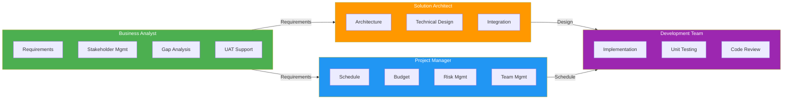
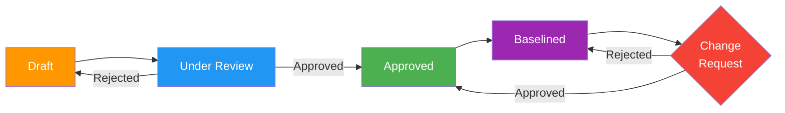
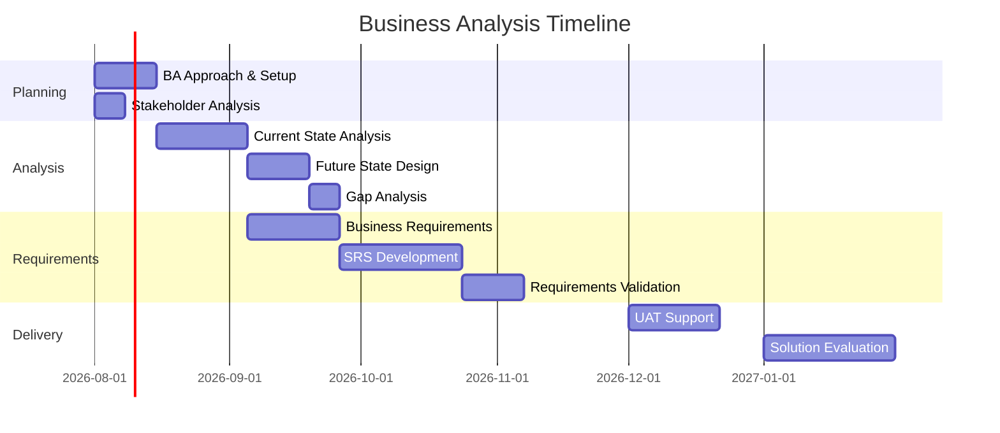
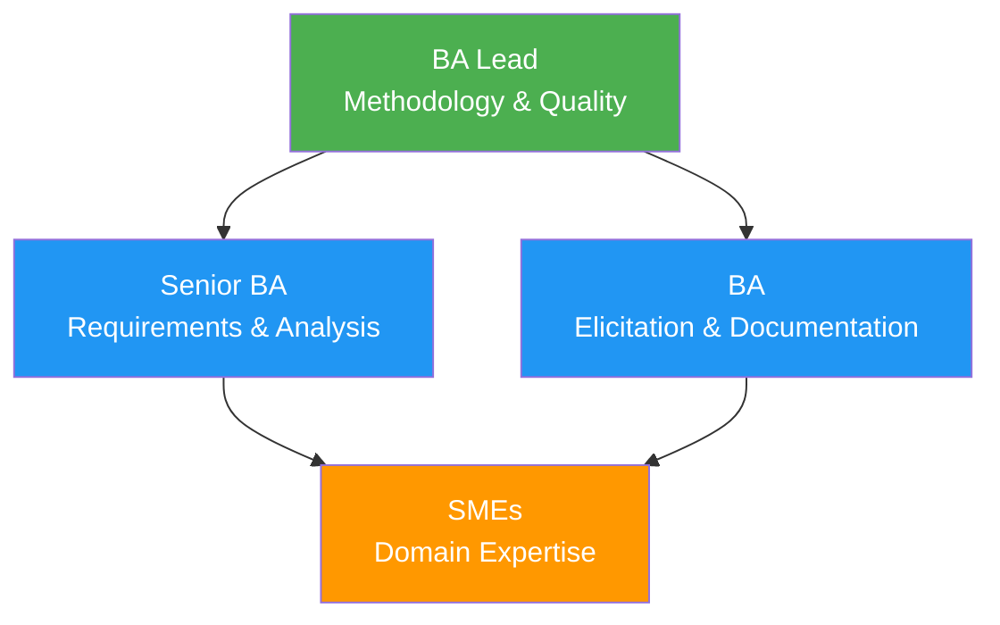

# Business Analysis Approach

> **Project:** [Project Name]
> **Version:** [X.Y] | **Status:** [Draft | Under Review | Approved | Archived]
> **Last Updated:** [YYYY-MM-DD]

---

## Document Control

| Field | Value |
|-------|-------|
| Document Owner | [Name / Role] |
| Business Analyst | [Name / Role] |
| Project Manager | [Name / Role] |
| Sponsor | [Name / Role] |

### Revision History

| Version | Date | Author | Change Description |
|---------|------|--------|--------------------|
| 0.1 | [YYYY-MM-DD] | [Name] | Initial draft |
| 1.0 | [YYYY-MM-DD] | [Name] | Approved version |

### Approvals

| Role | Name | Signature | Date |
|------|------|-----------|------|
| Project Sponsor | | | |
| Project Manager | | | |
| BA Lead | | | |

---

## Table of Contents

1. [Executive Summary](#1-executive-summary)
2. [BA Methodology](#2-ba-methodology)
3. [BA Scope & Boundaries](#3-ba-scope--boundaries)
4. [Elicitation Approach](#4-elicitation-approach)
5. [Requirements Management](#5-requirements-management)
6. [Stakeholder Engagement](#6-stakeholder-engagement)
7. [BA Deliverables](#7-ba-deliverables)
8. [BA Tools & Techniques](#8-ba-tools--techniques)
9. [BA Timeline](#9-ba-timeline)
10. [BA Team & Responsibilities](#10-ba-team--responsibilities)
11. [Quality Assurance](#11-quality-assurance)
12. [Risks & Assumptions](#12-risks--assumptions)

---

## 1. Executive Summary

| Field | Detail |
|-------|--------|
| BA Approach | [e.g., Hybrid — Agile for requirements, Waterfall for formal deliverables] |
| Key Methodology | [e.g., BABOK v3 + Scrum] |
| BA Team Size | [X BAs, Y SMEs] |
| Duration | [X months] |
| Key Deliverables | [SRS, RTM, Business Requirements, Acceptance Criteria] |
| Stakeholder Count | [X stakeholder groups, Y individuals] |

---

## 2. BA Methodology

### 2.1 Selected Approach

| Aspect | Approach | Rationale |
|--------|---------|-----------|
| **Overall** | [e.g., Hybrid] | [Regulatory requirements need formal docs; team is Agile-capable] |
| **Requirements Gathering** | [e.g., Agile — iterative sprints] | [Faster feedback, evolving understanding] |
| **Formal Documentation** | [e.g., Waterfall — phase-gated] | [Compliance requires signed-off baselines] |
| **Stakeholder Engagement** | [e.g., Continuous] | [Complex stakeholder landscape] |
| **Change Management** | [e.g., Integrated with PM] | [High organizational impact] |

### 2.2 BABOK Knowledge Areas Coverage

| Knowledge Area | Approach | Activities |
|---------------|----------|-----------|
| **BA Planning & Monitoring** | Formal | [Approach definition, stakeholder ID, governance setup] |
| **Elicitation & Collaboration** | Iterative | [Workshops, interviews, prototyping, observation] |
| **Requirements Life Cycle Mgmt** | Formal | [Traceability, change control, version management] |
| **Strategy Analysis** | Formal | [Current/future state, gap analysis, business case] |
| **Requirements Analysis & Design** | Iterative | [Modeling, validation, verification, solution design] |
| **Solution Evaluation** | Continuous | [KPI tracking, benefits realization, performance monitoring] |

### 2.3 Methodology Decision Matrix

| Factor | Consideration | Decision |
|--------|--------------|----------|
| Project complexity | [High — multiple systems, stakeholders] | [Hybrid approach] |
| Regulatory requirements | [Moderate — audit trail needed] | [Formal documentation] |
| Team Agile maturity | [Medium — some Agile experience] | [Lightweight Agile ceremonies] |
| Stakeholder availability | [Limited — competing priorities] | [Focused workshops, async reviews] |
| Requirements stability | [Low — expect evolution] | [Iterative refinement] |

---

## 3. BA Scope & Boundaries

### 3.1 BA Work Scope

| In Scope | Out of Scope |
|----------|-------------|
| [Business requirements elicitation and documentation] | [Technical architecture design] |
| [Stakeholder analysis and engagement] | [Project management activities] |
| [Current/future state analysis] | [System development] |
| [Gap analysis and solution scoping] | [Testing execution] |
| [Requirements traceability] | [Change management execution] |
| [Acceptance criteria definition] | [Training delivery] |
| [UAT support and facilitation] | [Vendor management] |
| [Solution evaluation] | [Procurement execution] |

### 3.2 BA Boundaries with Other Roles

---

## 4. Elicitation Approach

### 4.1 Elicitation Techniques

| Technique | When to Use | Participants | Output | Frequency |
|-----------|------------|-------------|--------|-----------|
| **Workshops** | Complex requirements, cross-functional needs | [BA, SMEs, Stakeholders] | [Workshop minutes, requirements] | [Bi-weekly] |
| **Interviews** | Deep-dive on specific areas, sensitive topics | [BA, Individual stakeholder] | [Interview notes, requirements] | [As needed] |
| **Observation** | Understanding current processes | [BA, End users] | [Process maps, pain points] | [Phase 1] |
| **Prototyping** | UI/UX requirements, complex workflows | [BA, Designer, Users] | [Wireframes, mockups] | [Iterative] |
| **Document Analysis** | Existing system docs, regulations, standards | [BA] | [Requirements, constraints] | [Phase 1] |
| **Surveys** | Large stakeholder groups, quantitative data | [BA, Stakeholders] | [Survey results, priorities] | [As needed] |
| **Focus Groups** | User experience, satisfaction, needs | [BA, User groups] | [Insights, requirements] | [Phase 1] |
| **Brainstorming** | Solution ideation, creative problem-solving | [BA, Cross-functional team] | [Ideas, options] | [As needed] |

### 4.2 Elicitation Calendar

| Week | Activity | Participants | Deliverable |
|------|----------|-------------|------------|
| 1-2 | [Stakeholder interviews — executives] | [BA, Sponsor, VPs] | [Strategic requirements] |
| 3-4 | [Process observation — operations] | [BA, Ops team] | [Current state maps] |
| 5-6 | [Requirements workshops — core team] | [BA, SMEs, Users] | [Draft requirements] |
| 7-8 | [Prototype review — UI/UX] | [BA, Designer, Users] | [Validated wireframes] |
| 9-10 | [Requirements validation] | [BA, All stakeholders] | [Approved requirements] |
| 11+ | [Iterative refinement] | [BA, Agile team] | [Updated backlog] |

### 4.3 Elicitation Output Standards

| Output | Format | Quality Criteria | Storage |
|--------|--------|-----------------|---------|
| Workshop Minutes | [Markdown template] | [Attendees, decisions, action items] | [Project repo] |
| Interview Notes | [Markdown template] | [Key quotes, requirements, follow-ups] | [Project repo] |
| Requirements | [User stories / Use cases] | [INVEST criteria, acceptance criteria] | [Requirements tool] |
| Process Maps | [Mermaid / BPMN] | [Start/end, decisions, handoffs] | [Project repo] |

---

## 5. Requirements Management

### 5.1 Requirements Lifecycle

### 5.2 Requirements Attributes

| Attribute | Description | Example |
|-----------|-------------|---------|
| **ID** | Unique identifier | BR-001, NFR-003 |
| **Title** | Short descriptive name | Customer Registration |
| **Description** | Detailed requirement text | "The system shall allow..." |
| **Priority** | MoSCoW classification | 🔴 Must Have |
| **Source** | Origin of requirement | Stakeholder interview, regulation |
| **Status** | Current lifecycle state | Approved |
| **Owner** | Responsible stakeholder | Product Owner |
| **Acceptance Criteria** | Testable conditions | Given/When/Then |
| **Traceability** | Links to objectives, design, tests | OBJ-01, HLD-03, TC-045 |

### 5.3 Requirements Tool

| Tool | Purpose | Access |
|------|---------|--------|
| [e.g., Jira] | [Backlog management, user stories] | [BA, Dev, QA, PO] |
| [e.g., Confluence] | [Documentation, meeting notes] | [All stakeholders] |
| [e.g., Excel/Sheets] | [RTM, traceability matrix] | [BA, QA] |
| [e.g., Figma] | [Wireframes, prototypes] | [BA, Designer, Users] |

---

## 6. Stakeholder Engagement

### 6.1 Stakeholder Identification

| Stakeholder | Role | Interest | Influence | Engagement Strategy |
|------------|------|----------|----------|-------------------|
| [Executive Sponsor] | Decision maker | High | High | [Monthly steering committee] |
| [Business Owner] | Requirements owner | High | High | [Weekly 1:1, workshops] |
| [Operations Manager] | Process expert | High | Medium | [Bi-weekly workshops] |
| [End Users] | System users | High | Low | [Workshops, UAT, training] |
| [IT Lead] | Technical feasibility | Medium | Medium | [Architecture reviews] |
| [Compliance Officer] | Regulatory requirements | Medium | High | [Requirements review] |

### 6.2 Communication Matrix

| Stakeholder | What | When | How | Owner |
|------------|------|------|-----|-------|
| Sponsor | Progress, risks, decisions | Weekly | [Email + meeting] | BA |
| Business Owner | Requirements status, issues | Bi-weekly | [Workshop] | BA |
| End Users | Updates, training schedule | Monthly | [Newsletter, town hall] | Change Mgr |
| Dev Team | Requirements, clarifications | Daily standup | [Agile ceremony] | BA |
| Steering Committee | Overall status, escalations | Monthly | [Dashboard + presentation] | PM |

---

## 7. BA Deliverables

### 7.1 Deliverable Register

| # | Deliverable | Description | Timing | Template |
|---|------------|-------------|--------|----------|
| 1 | [Business Analysis Approach] | [This document] | [Project start] | [Standard] |
| 2 | [Stakeholder Register] | [All stakeholders identified] | [Week 1] | [Standard] |
| 3 | [Current State Description] | [As-is analysis] | [Week 2-4] | [Standard] |
| 4 | [Future State Description] | [To-be vision] | [Week 3-5] | [Standard] |
| 5 | [Gap Analysis] | [Current vs future gaps] | [Week 5] | [Standard] |
| 6 | [Business Requirements] | [High-level business needs] | [Week 4-6] | [Standard] |
| 7 | [SRS] | [Software requirements] | [Week 6-10] | [IEEE 29148] |
| 8 | [Requirements Traceability Matrix] | [Bidirectional traceability] | [Ongoing] | [Standard] |
| 9 | [Acceptance Criteria] | [Testable conditions per requirement] | [With each requirement] | [BDD format] |
| 10 | [UAT Plan & Support] | [Test plan, facilitation] | [Pre-go-live] | [Standard] |

### 7.2 Deliverable Review Process

| Deliverable | Review Type | Reviewers | Approval Authority |
|------------|------------|----------|-------------------|
| [Business Requirements] | Formal review | [Sponsor, Business Owner, SMEs] | [Sponsor] |
| [SRS] | Peer review + formal | [BA team, Tech Lead, QA] | [Business Owner] |
| [RTM] | Peer review | [BA team, QA] | [BA Lead] |
| [Acceptance Criteria] | Peer review | [BA, QA, PO] | [PO] |

---

## 8. BA Tools & Techniques

### 8.1 Modeling Techniques

| Technique | When Used | Tool | Output |
|-----------|----------|------|--------|
| **Process Modeling** | Current/future state | [Mermaid, BPMN tool] | [Process flows] |
| **Data Modeling** | Data requirements | [ERD tool, Mermaid] | [ERD, data dictionary] |
| **Use Case Modeling** | Functional requirements | [PlantUML, Mermaid] | [Use case diagrams] |
| **User Story Mapping** | Agile requirements | [Jira, physical board] | [Story map, backlog] |
| **State Modeling** | Entity lifecycle | [Mermaid] | [State diagrams] |
| **Decision Tables** | Complex business rules | [Excel, Markdown] | [Decision tables] |
| **Wireframing** | UI requirements | [Figma, Balsamiq] | [Wireframes, mockups] |

### 8.2 Analysis Techniques

| Technique | Purpose | Application |
|-----------|--------|-------------|
| **SWOT Analysis** | Strategic positioning | [Strategy analysis] |
| **Root Cause Analysis** | Problem investigation | [Issue resolution] |
| **MoSCoW Prioritization** | Requirement prioritization | [Backlog management] |
| **Kano Model** | Customer satisfaction drivers | [Feature prioritization] |
| **Decision Analysis** | Option evaluation | [Solution selection] |
| **Benchmarking** | Performance comparison | [Target setting] |

---

## 9. BA Timeline

### 9.1 BA Work Breakdown

### 9.2 BA Milestones

| Milestone | Date | Deliverable | Gate |
|-----------|------|------------|------|
| BA Planning Complete | [YYYY-MM-DD] | [Approach, stakeholder register] | — |
| Current State Approved | [YYYY-MM-DD] | [Current State Description] | Gate 1 |
| Requirements Baselined | [YYYY-MM-DD] | [SRS, RTM] | Gate 2 |
| UAT Complete | [YYYY-MM-DD] | [UAT Sign-off] | Gate 3 |
| Solution Evaluated | [YYYY-MM-DD] | [Evaluation Report] | Gate 4 |

---

## 10. BA Team & Responsibilities

### 10.1 BA Team Structure

### 10.2 RACI Matrix — BA Activities

| Activity | BA Lead | Senior BA | BA | PM | Sponsor | SME |
|----------|---------|----------|-----|-----|---------|-----|
| BA Approach | **A** | R | C | C | I | I |
| Stakeholder Analysis | A | **R** | C | C | I | I |
| Elicitation | A | **R** | R | I | I | C |
| Requirements Documentation | **A** | R | R | I | I | C |
| Requirements Review | **A** | R | R | C | I | C |
| Traceability Management | A | R | **R** | I | I | I |
| UAT Facilitation | A | **R** | R | C | I | R |
| Solution Evaluation | **A** | R | C | C | I | C |

> **R** = Responsible | **A** = Accountable | **C** = Consulted | **I** = Informed

---

## 11. Quality Assurance

### 11.1 BA Quality Standards

| Standard | Description | Verification |
|----------|-------------|-------------|
| **Completeness** | [All requirements address business objectives] | [RTM review] |
| **Consistency** | [No conflicting requirements] | [Cross-reference check] |
| **Traceability** | [Every requirement traces to objective and test] | [RTM validation] |
| **Testability** | [Every requirement has acceptance criteria] | [AC review] |
| **Feasibility** | [Requirements are technically and economically feasible] | [Architect review] |
| **Unambiguity** | [Requirements have one interpretation] | [Peer review] |

### 11.2 Review Process

| Review Type | When | Participants | Purpose |
|------------|------|-------------|---------|
| **Peer Review** | Before formal review | [BA team] | [Quality check, consistency] |
| **Stakeholder Review** | After peer review | [Business stakeholders] | [Validation, approval] |
| **Technical Review** | After stakeholder approval | [Tech Lead, Architect] | [Feasibility check] |
| **Formal Sign-off** | After all reviews | [Sponsor, Business Owner] | [Baseline approval] |

---

## 12. Risks & Assumptions

### 12.1 BA-Specific Risks

| ID | Risk | Probability | Impact | Mitigation |
|----|------|------------|--------|-----------|
| BAR-01 | [Stakeholder availability limited] | High | High | [Focused sessions, async reviews] |
| BAR-02 | [Requirements volatility] | Medium | Medium | [Iterative approach, change control] |
| BAR-03 | [SME knowledge gaps] | Medium | Medium | [Multiple sources, documentation review] |
| BAR-04 | [Scope creep via requirements] | High | High | [MoSCoW, change control] |

### 12.2 Assumptions

| # | Assumption | Impact if Invalid |
|---|-----------|-------------------|
| A-01 | [Stakeholders available as per communication plan] | [Delays in requirements gathering] |
| A-02 | [Existing documentation is accurate] | [Additional validation effort] |
| A-03 | [BA tools and licenses approved] | [Productivity impact] |

---

## Related Documents

| Document | Relationship |
|----------|-------------|
| [[Stakeholder Engagement Approach]] | Detailed stakeholder management strategy |
| [[Information Management Approach]] | How BA artifacts are stored and managed |
| [[Governance Approach]] | Decision-making and approval authority |
| [[Requirements Traceability Matrix]] | Living traceability document |
| [[Business Requirements]] | Primary BA deliverable |
| [[SRS]] | Detailed software requirements |

---

> **Template Standard:** Based on BABOK v3 (BA Planning & Monitoring), PMBOK v8 (Integration Management), ISO/IEC/IEEE 29148
> **Usage:** This document defines *how* business analysis will be performed. It should be approved before requirements elicitation begins and revisited if the project approach changes significantly.
