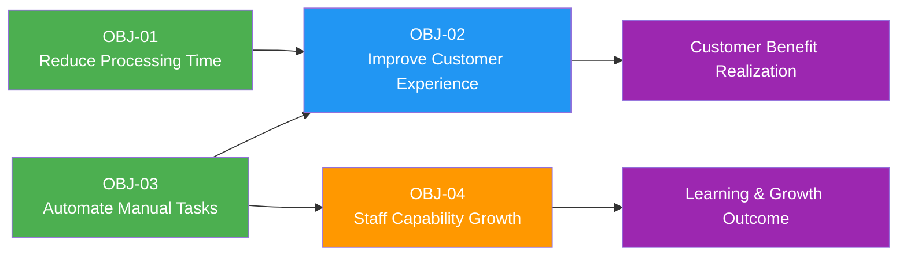

# Business Objectives

> **Project:** [Project Name]
> **Version:** [X.Y] | **Status:** [Draft | Under Review | Approved | Archived]
> **Last Updated:** [YYYY-MM-DD]

---

## Document Control

| Field | Value |
|-------|-------|
| Document Owner | [Name / Role] |
| Sponsor | [Name / Role] |
| Business Analyst | [Name / Role] |

### Revision History

| Version | Date | Author | Change Description |
|---------|------|--------|--------------------|
| 0.1 | [YYYY-MM-DD] | [Name] | Initial draft |
| 1.0 | [YYYY-MM-DD] | [Name] | Approved version |

### Approvals

| Role | Name | Signature | Date |
|------|------|-----------|------|
| Project Sponsor | | | |
| Business Owner | | | |
| Strategy Lead | | | |

---

## Table of Contents

1. [Executive Summary](#1-executive-summary)
2. [Strategic Alignment](#2-strategic-alignment)
3. [Business Objectives](#3-business-objectives)
4. [KPI Framework](#4-kpi-framework)
5. [Baseline & Target Measurements](#5-baseline--target-measurements)
6. [Objective Dependencies](#6-objective-dependencies)
7. [Risk to Objectives](#7-risk-to-objectives)
8. [Objective Tracking](#8-objective-tracking)
9. [Appendices](#9-appendices)

---

## 1. Executive Summary

> Brief overview of what this project aims to achieve at the business level.

| Field | Detail |
|-------|--------|
| Purpose | [Why this project exists — 1-2 sentences] |
| Expected Outcome | [What the business will look like after success] |
| Number of Objectives | [X] |
| Strategic Theme | [e.g., Digital Transformation / Operational Excellence / Customer Experience] |
| Target Completion | [YYYY-MM-DD] |

---

## 2. Strategic Alignment

> Every objective must trace to an organizational strategy. This section shows the alignment.

### 2.1 Organizational Strategy Map

```
Vision
  └── Strategic Theme: [Name]
        └── Strategic Goal: [Name]
              ├── Business Objective: OBJ-01
              ├── Business Objective: OBJ-02
              └── Business Objective: OBJ-03
```

### 2.2 Strategy Traceability

| Strategic Theme | Strategic Goal | Business Objective | Contribution |
|----------------|---------------|-------------------|-------------|
| [e.g., Digital Transformation] | [e.g., Automate 80% of manual processes] | OBJ-01 | [Directly enables automation target] |
| [e.g., Customer Experience] | [e.g., Increase NPS to 70+] | OBJ-02 | [Reduces onboarding friction] |
| [e.g., Operational Excellence] | [e.g., Reduce operating cost by 15%] | OBJ-03 | [Eliminates manual rework] |
| | | | |

### 2.3 Balanced Scorecard Perspective

> Categorize objectives by perspective to ensure balanced coverage.

| Perspective | Objective Count | Objectives |
|------------|----------------|-----------|
| 💰 **Financial** | [X] | OBJ-03 |
| 👥 **Customer** | [X] | OBJ-02 |
| ⚙️ **Internal Process** | [X] | OBJ-01 |
| 📚 **Learning & Growth** | [X] | OBJ-04 |

---

## 3. Business Objectives

> Each objective must be **SMART**: Specific, Measurable, Achievable, Relevant, Time-bound.

### 3.1 Objective Register

| ID | Objective | Specific | Measurable | Achievable | Relevant | Time-Bound | Priority |
|----|-----------|----------|-----------|-----------|----------|-----------|----------|
| OBJ-01 | [e.g., Reduce order processing time] | [What exactly will change] | [Metric + target] | [Why feasible] | [Strategic link] | [Deadline] | 🔴 |
| OBJ-02 | | | | | | | |
| OBJ-03 | | | | | | | |
| OBJ-04 | | | | | | | |

### 3.2 Detailed Objective Cards

#### OBJ-01: [Objective Name]

| Field | Detail |
|-------|--------|
| **Statement** | [Clear, concise statement of what will be achieved] |
| **Specific** | [Exactly what will be done, by whom, where] |
| **Measurable** | [How success will be measured — metric + target] |
| **Achievable** | [Why this is realistic given resources and constraints] |
| **Relevant** | [Which strategic goal this supports] |
| **Time-Bound** | [Target completion date] |
| **Owner** | [Name / Role] |
| **Priority** | 🔴 Must Have / 🟡 Should Have / 🟢 Could Have |
| **Baseline** | [Current state measurement] |
| **Target** | [Desired state measurement] |
| **Unit** | [%, hours, dollars, count, score, etc.] |
| **Source** | [Where the objective originated — strategy, regulation, stakeholder] |

> **Repeat this card for each objective**

---

## 4. KPI Framework

> Key Performance Indicators that measure objective achievement.

### 4.1 KPI Register

| ID | KPI | Description | Formula | Unit | Frequency | Data Source | Owner |
|----|-----|-------------|---------|------|-----------|-------------|-------|
| KPI-01 | [e.g., Average Order Processing Time] | [Time from order receipt to fulfillment] | [Sum of processing times / Order count] | Hours | Daily | [Order System] | [Ops Manager] |
| KPI-02 | [e.g., Customer Onboarding Duration] | [Days from application to activation] | [Activation date - Application date] | Days | Weekly | [CRM] | [BA] |
| KPI-03 | [e.g., Manual Task Reduction %] | [Reduction in manual steps] | [(Old steps - New steps) / Old steps × 100] | % | Monthly | [Process Audit] | [Ops Manager] |
| KPI-04 | [e.g., Error Rate] | [Errors per 1000 transactions] | [Errors / Transactions × 1000] | Per 1000 | Weekly | [Quality System] | [QA Lead] |
| KPI-05 | | | | | | | |

### 4.2 KPI Dashboard Mockup

| KPI | Current | Target | Status | Trend |
|-----|---------|--------|--------|-------|
| [KPI-01] | [Value] | [Target] | 🟢 On Track / 🟡 At Risk / 🔴 Behind | ↑↓→ |
| [KPI-02] | | | | |
| [KPI-03] | | | | |
| [KPI-04] | | | | |

### 4.3 Leading vs Lagging Indicators

| Type | KPI | What It Predicts / Confirms |
|------|-----|----------------------------|
| **Leading** | [e.g., Training completion rate] | [Predicts adoption success] |
| **Leading** | [e.g., Test coverage %] | [Predicts quality at go-live] |
| **Lagging** | [e.g., Customer satisfaction score] | [Confirms experience improvement] |
| **Lagging** | [e.g., Cost savings realized] | [Confirms financial benefit] |

---

## 5. Baseline & Target Measurements

> Document current state (baseline) and desired state (targets) for each objective.

### 5.1 Baseline Measurements

| ID | Metric | Baseline Value | Measurement Date | Measurement Method | Confidence |
|----|--------|---------------|-----------------|-------------------|-----------|
| OBJ-01 | [e.g., Order processing time] | [4.5 hours] | [YYYY-MM-DD] | [System logs, 30-day average] | High |
| OBJ-02 | [e.g., Customer onboarding time] | [12 days] | [YYYY-MM-DD] | [CRM report, 90-day average] | High |
| OBJ-03 | [e.g., Manual tasks per order] | [15 steps] | [YYYY-MM-DD] | [Process observation, 10 orders] | Medium |
| OBJ-04 | | | | | |

### 5.2 Target Measurements

| ID | Metric | Target Value | Target Date | Rationale | Stretch Goal |
|----|--------|-------------|-------------|-----------|-------------|
| OBJ-01 | [e.g., Order processing time] | [≤ 2 hours] | [YYYY-Qn] | [50% reduction based on benchmarking] | [≤ 1 hour] |
| OBJ-02 | [e.g., Customer onboarding time] | [≤ 3 days] | [YYYY-Qn] | [Industry best practice] | [≤ 1 day] |
| OBJ-03 | [e.g., Manual tasks per order] | [≤ 5 steps] | [YYYY-Qn] | [Automation of 10 steps] | [≤ 2 steps] |
| OBJ-04 | | | | | |

### 5.3 Measurement Plan

| ID | Metric | Data Collection Method | Tool / System | Responsible | Collection Frequency | Reporting Format |
|----|--------|----------------------|---------------|-------------|--------------------|--------------------|
| OBJ-01 | [Processing time] | [Automated log extraction] | [ELK Stack] | [Data Analyst] | Daily | Dashboard |
| OBJ-02 | [Onboarding time] | [CRM pipeline report] | [Salesforce] | [BA] | Weekly | Report |
| OBJ-03 | [Task count] | [Process audit] | [Manual observation] | [Ops Lead] | Monthly | Spreadsheet |
| OBJ-04 | | | | | | |

---

## 6. Objective Dependencies

> Dependencies between objectives and external factors.

### 6.1 Inter-Objective Dependencies

| Dependent Objective | Depends On | Relationship | Impact if Blocked |
|--------------------|-----------|-------------|-------------------|
| OBJ-02 | OBJ-01 | [OBJ-01 must complete before OBJ-02 can start] | [Delayed customer benefits] |
| OBJ-04 | OBJ-03 | [OBJ-04 metrics require OBJ-03 data] | [Cannot measure learning impact] |
| | | | |

### 6.2 Dependency Diagram



### 6.3 External Dependencies

| ID | Dependency | Type | Affected Objectives | Mitigation |
|----|-----------|------|-------------------|-----------|
| DEP-01 | [e.g., Vendor API availability] | External | OBJ-01 | [Fallback manual process] |
| DEP-02 | [e.g., Staff training completion] | Internal | OBJ-02, OBJ-04 | [Accelerated training program] |
| DEP-03 | | | | |

---

## 7. Risk to Objectives

> Risks that could prevent objective achievement.

### 7.1 Objective Risk Matrix

| ID | Objective | Risk | Probability | Impact | Risk Level | Mitigation | Owner |
|----|-----------|------|------------|--------|-----------|-----------|-------|
| OR-01 | OBJ-01 | [e.g., Legacy system integration delays] | Medium | High | 🟠 | [Early integration testing] | [Tech Lead] |
| OR-02 | OBJ-02 | [e.g., Low user adoption] | High | High | 🔴 | [Change management program] | [Change Manager] |
| OR-03 | OBJ-03 | [e.g., Scope creep adding manual steps] | Medium | Medium | 🟡 | [Strict change control] | [PM] |
| OR-04 | | | | | | | |

### 7.2 Risk Heat Map

| Impact \ Probability | Low | Medium | High |
|---------------------|-----|--------|------|
| **High** | 🟡 | 🟠 OR-01 | 🔴 OR-02 |
| **Medium** | 🟢 | 🟡 OR-03 | 🟠 |
| **Low** | 🟢 | 🟢 | 🟡 |

> **Legend:** 🔴 Critical — Immediate action required | 🟠 High — Mitigation plan required | 🟡 Medium — Monitor and manage | 🟢 Low — Accept and monitor

---

## 8. Objective Tracking

### 8.1 Objective Status Summary

| ID | Objective | Status | % Complete | Last Updated | Notes |
|----|-----------|--------|-----------|-------------|-------|
| OBJ-01 | [Name] | ⏳ In Progress | [X%] | [YYYY-MM-DD] | |
| OBJ-02 | [Name] | ⬜ Not Started | 0% | [YYYY-MM-DD] | |
| OBJ-03 | [Name] | ✅ Complete | 100% | [YYYY-MM-DD] | |
| OBJ-04 | [Name] | ⚠️ At Risk | [X%] | [YYYY-MM-DD] | [Reason] |

### Status Legend

| Status | Meaning |
|--------|---------|
| ✅ Complete | Objective achieved, KPIs met |
| ⏳ In Progress | Work underway, on track |
| ⚠️ At Risk | Behind schedule or below target |
| 🔴 Blocked | Cannot proceed — escalation needed |
| ⬜ Not Started | Not yet begun |
| ❌ Cancelled | No longer pursuing |

### 8.2 Benefits Realization Tracker

| ID | Benefit | Expected Value | Actual Value | Realization % | Status | Review Date |
|----|---------|---------------|-------------|--------------|--------|------------|
| OBJ-01 | [e.g., Cost savings] | [$100K/year] | [$75K/year] | 75% | 🟡 Partially Realized | [YYYY-MM-DD] |
| OBJ-02 | [e.g., Time savings] | [50% reduction] | [45% reduction] | 90% | 🟢 Largely Realized | [YYYY-MM-DD] |
| OBJ-03 | | | | | | |

### 8.3 Review Cadence

| Review Type | Frequency | Participants | Purpose |
|------------|-----------|-------------|---------|
| KPI Review | Weekly | BA, Ops Lead | Track leading indicators |
| Objective Progress | Monthly | PM, Sponsor, BA | Assess overall objective health |
| Benefits Realization | Quarterly | Sponsor, Finance, BA | Validate actual vs expected benefits |
| Strategic Alignment Check | Semi-annually | Strategy Lead, Sponsor | Confirm objectives still align with strategy |

---

## 9. Appendices

### Appendix A: Objective Elicitation Sources

| Source | Type | Date | Objectives Derived |
|--------|------|------|--------------------|
| [e.g., Executive Strategy Workshop] | Workshop | [YYYY-MM-DD] | OBJ-01, OBJ-03 |
| [e.g., Customer Feedback Analysis] | Research | [YYYY-MM-DD] | OBJ-02 |
| [e.g., Regulatory Requirement X] | Compliance | [YYYY-MM-DD] | OBJ-04 |

### Appendix B: Benchmarking Data

| Metric | Industry Average | Best-in-Class | Our Baseline | Our Target |
|--------|-----------------|---------------|-------------|-----------|
| [e.g., Order processing time] | [3 hours] | [30 minutes] | [4.5 hours] | [2 hours] |
| [e.g., Customer onboarding] | [7 days] | [1 day] | [12 days] | [3 days] |

### Appendix C: Glossary

| Term | Definition |
|------|-----------|
| SMART | Specific, Measurable, Achievable, Relevant, Time-bound |
| KPI | Key Performance Indicator |
| Baseline | Current state measurement before changes |
| Target | Desired future state measurement |
| Stretch Goal | Ambitious target beyond the primary goal |
| Leading Indicator | Metric that predicts future performance |
| Lagging Indicator | Metric that confirms past performance |

---

## Related Documents

| Document | Relationship |
|----------|-------------|
| [[Business-Case]] | Objectives justify the investment in the Business Case |
| [[Business-Requirements]] | Business requirements support objective achievement |
| [[Current-State-Description]] | Baseline measurements come from current state analysis |
| [[Future-State-Description]] | Targets defined in future state vision |
| [[Gap-Analysis]] | Gaps identified between baseline and target |
| [[Benefits-Management-Plan]] | Detailed benefits realization planning |
| [[Stakeholder-Register]] | Objective owners and stakeholders |
| [[Quality-Metrics]] | Operational tracking of objective metrics |

---

> **Template Standard:** Based on BABOK v3 (Strategy Analysis), PMBOK v8 (Initiating), ISO/IEC/IEEE 29148
> **Usage:** This document focuses on *what* the business wants to achieve. For *how* to achieve it, see [[Business-Requirements]] and [[Change-Strategy]].
