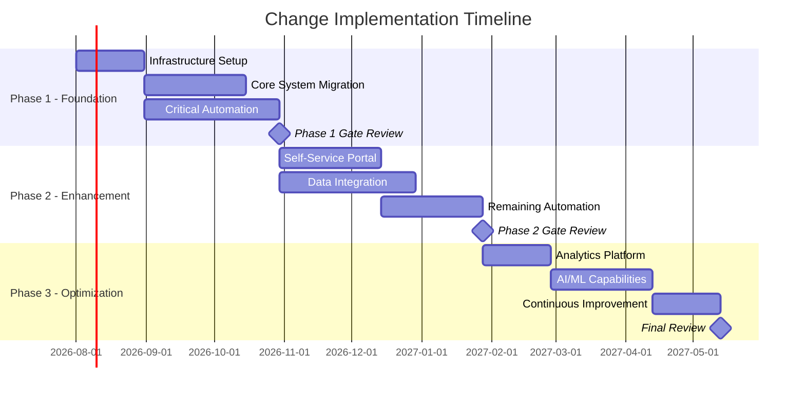
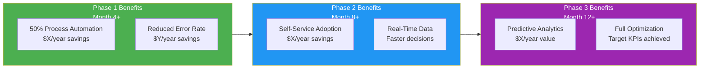
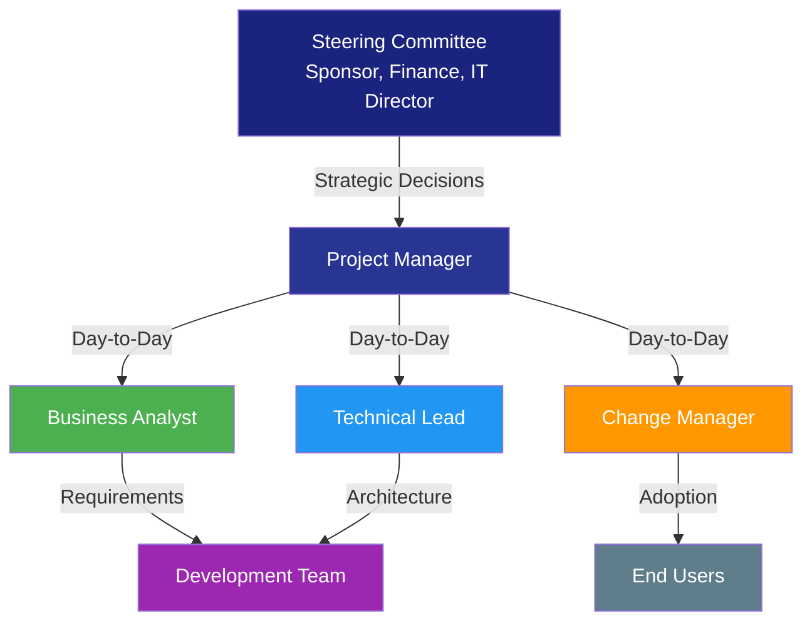

# Change Strategy

> **Project:** [Project Name]
> **Version:** [X.Y] | **Status:** [Draft | Under Review | Approved | Archived]
> **Last Updated:** [YYYY-MM-DD]

---

## Document Control

| Field | Value |
|-------|-------|
| Document Owner | [Name / Role] |
| Sponsor | [Name / Role] |
| Business Analyst | [Name / Role] |
| Change Manager | [Name / Role] |

### Revision History

| Version | Date | Author | Change Description |
|---------|------|--------|--------------------|
| 0.1 | [YYYY-MM-DD] | [Name] | Initial draft |
| 1.0 | [YYYY-MM-DD] | [Name] | Approved version |

### Approvals

| Role | Name | Signature | Date |
|------|------|-----------|------|
| Project Sponsor | | | |
| Business Owner | | | |
| Finance Director | | | |
| Change Manager | | | |

---

## Table of Contents

1. [Executive Summary](#1-executive-summary)
2. [Change Context](#2-change-context)
3. [Solution Options](#3-solution-options)
4. [Recommended Approach](#4-recommended-approach)
5. [Transition Strategy](#5-transition-strategy)
6. [Change Management Approach](#6-change-management-approach)
7. [Investment & Resources](#7-investment--resources)
8. [Risk & Mitigation](#8-risk--mitigation)
9. [Value Realization Plan](#9-value-realization-plan)
10. [Governance & Decision Framework](#10-governance--decision-framework)

---

## 1. Executive Summary

| Field | Detail |
|-------|--------|
| Current State | [1 sentence — what exists today] |
| Future State | [1 sentence — what we're building] |
| Recommended Approach | [Strategy name — e.g., Phased / Big Bang / Pilot → Scale] |
| Investment | $[Total — CAPEX + OPEX] |
| Timeline | [X months] |
| Expected ROI | [X%] |
| Key Risk | [Top risk and mitigation] |
| Decision Requested | [Approve strategy + funding] |

---

## 2. Change Context

### 2.1 Change Drivers

| Driver | Type | Urgency | Impact |
|--------|------|---------|--------|
| [e.g., Regulatory deadline] | External | 🔴 Critical | [Must comply by YYYY-MM-DD] |
| [e.g., Customer complaints] | External | 🟡 High | [Losing X% customers/year] |
| [e.g., Operational cost] | Internal | 🟡 High | [$X/year in avoidable costs] |
| [e.g., Competitive pressure] | External | 🟡 High | [Competitors 3x faster] |
| [e.g., Technical debt] | Internal | 🟢 Medium | [Support ending YYYY] |

### 2.2 Current → Future Summary

| Dimension | Current State | Future State | Gap Severity |
|-----------|--------------|-------------|-------------|
| **Process** | [Manual, 15 steps, 12 days] | [Automated, 3 steps, 1 day] | 🔴 Critical |
| **Technology** | [Legacy, end-of-life] | [Modern, cloud-native] | 🔴 Critical |
| **Data** | [Siloed, inconsistent] | [Integrated, governed] | 🟡 High |
| **People** | [Manual skills, capacity constrained] | [Digital skills, right-sized] | 🟡 High |
| **Compliance** | [No audit trail] | [Full audit logging] | 🔴 Critical |

### 2.3 Gap Analysis Summary

| Gap ID | Current | Future | Gap | Severity | Approach |
|--------|---------|--------|-----|----------|----------|
| GAP-01 | [12-day onboarding] | [1-day onboarding] | [Process automation] | 🔴 | Automate |
| GAP-02 | [Legacy CRM] | [Cloud CRM] | [System replacement] | 🔴 | Replace |
| GAP-03 | [No real-time data] | [Live dashboards] | [Data platform] | 🟡 | Build |
| GAP-04 | [Manual compliance] | [Automated audit trail] | [Logging + controls] | 🔴 | Build |
| GAP-05 | [No self-service] | [Customer portal] | [New capability] | 🟡 | Build |

---

## 3. Solution Options

### 3.1 Option Overview

| Criteria (Weight) | Option A: Do Nothing | Option B: Phased Approach | Option C: Big Bang | Option D: Pilot → Scale |
|-------------------|---------------------|--------------------------|-------------------|----------------------|
| **Description** | No change | Incremental delivery in 3 phases | All-at-once replacement | Pilot with 1 unit, then scale |
| **Cost** | $0 (ongoing losses) | $[X] | $[Y] | $[Z] |
| **Timeline** | N/A | 12 months | 8 months | 10 months |
| **Risk** | 🔴 Critical | 🟡 Medium | 🔴 High | 🟢 Low-Medium |
| **Disruption** | None | Low | High | Very Low |
| **Time to Value** | Never | Phase 1: 4 months | 8 months | Pilot: 3 months |
| **Strategic Fit** | ❌ None | ✅ Strong | ✅ Strong | ✅ Strong |

### 3.2 Weighted Scoring

| Criterion | Weight | A: Do Nothing | B: Phased | C: Big Bang | D: Pilot→Scale |
|-----------|--------|--------------|-----------|-------------|---------------|
| Strategic Alignment | 25% | 1 | 4 | 5 | 4 |
| Financial Return | 25% | 1 | 4 | 3 | 4 |
| Implementation Risk | 20% | 5 | 4 | 2 | 5 |
| Time to Value | 15% | 1 | 4 | 3 | 5 |
| Organizational Impact | 15% | 5 | 4 | 2 | 4 |
| **Weighted Score** | **100%** | **2.3** | **4.0** | **3.1** | **4.4** |

---

## 4. Recommended Approach

### 4.1 Recommendation

**Recommended:** Option [B/D] — [Phased Approach / Pilot → Scale]

**Rationale:** [2-3 sentences explaining why this approach best balances risk, cost, speed, and organizational capacity]

### 4.2 Approach Overview

```mermaid
flowchart LR
    subgraph Phase1["Phase 1: Foundation<br>Months 1-4"]
        P1A[Infrastructure Setup]
        P1B[Core System Migration]
        P1C[Process Automation - Critical]
    end

    subgraph Phase2["Phase 2: Enhancement<br>Months 5-8"]
        P2A[Self-Service Portal]
        P2B[Data Integration]
        P2C[Process Automation - Remaining]
    end

    subgraph Phase3["Phase 3: Optimization<br>Months 9-12"]
        P3A[Advanced Analytics]
        P3B[AI/ML Capabilities]
        P3C[Continuous Improvement]
    end

    Phase1 --> Phase2 --> Phase3

    style Phase1 fill:#4CAF50,color:#fff
    style Phase2 fill:#2196F3,color:#fff
    style Phase3 fill:#9C27B0,color:#fff
```

### 4.3 Phase Detail

#### Phase 1: Foundation (Months 1-4)

| Deliverable | Description | Success Criteria | Dependencies |
|------------|-------------|-----------------|-------------|
| [Infrastructure] | [Cloud environment, CI/CD pipeline] | [Environment operational] | [Budget approval] |
| [Core Migration] | [Migrate CRM to cloud platform] | [Data migrated, users trained] | [Vendor selection] |
| [Critical Automation] | [Automate top 3 pain point processes] | [50% reduction in manual effort] | [Process mapping complete] |

**Phase 1 Investment:** $[X] | **Phase 1 Benefits:** $[Y]/year

#### Phase 2: Enhancement (Months 5-8)

| Deliverable | Description | Success Criteria | Dependencies |
|------------|-------------|-----------------|-------------|
| [Self-Service Portal] | [Customer-facing portal] | [30% adoption in 3 months] | [Phase 1 complete] |
| [Data Integration] | [Real-time sync across systems] | [Zero data discrepancies] | [Phase 1 complete] |
| [Remaining Automation] | [Automate remaining processes] | [80% automation achieved] | [Phase 1 complete] |

**Phase 2 Investment:** $[X] | **Phase 2 Benefits:** $[Y]/year

#### Phase 3: Optimization (Months 9-12)

| Deliverable | Description | Success Criteria | Dependencies |
|------------|-------------|-----------------|-------------|
| [Analytics Platform] | [Real-time dashboards, self-service BI] | [All KPIs on dashboard] | [Phase 2 complete] |
| [AI/ML Capabilities] | [Predictive analytics, intelligent automation] | [X% accuracy achieved] | [Phase 2 complete] |
| [Continuous Improvement] | [Feedback loops, optimization process] | [Improvement backlog established] | [Phase 2 complete] |

**Phase 3 Investment:** $[X] | **Phase 3 Benefits:** $[Y]/year

### 4.4 Milestone Schedule

---

## 5. Transition Strategy

### 5.1 Transition Approach

| Aspect | Strategy |
|--------|---------|
| **Data Migration** | [e.g., ETL-based migration with validation — parallel run for 2 weeks] |
| **System Cutover** | [e.g., Phased by department — not big bang] |
| **Parallel Running** | [e.g., Old + new system run simultaneously for 4 weeks] |
| **Rollback Plan** | [e.g., Can revert to old system within 24 hours if critical issues] |
| **Go-Live Strategy** | [e.g., Soft launch with pilot group → full rollout] |

### 5.2 Data Migration Plan

| Phase | Activity | Duration | Validation |
|-------|----------|----------|-----------|
| 1. Extract | [Extract data from legacy systems] | [X days] | [Record count reconciliation] |
| 2. Transform | [Clean, deduplicate, reformat] | [X days] | [Data quality checks] |
| 3. Load | [Load into target systems] | [X days] | [Referential integrity checks] |
| 4. Validate | [Business validation of migrated data] | [X days] | [UAT by business users] |
| 5. Cutover | [Switch to new system] | [1 day] | [Smoke tests] |

### 5.3 Cutover Plan

| Day | Activity | Owner | Go/No-Go Criteria |
|-----|----------|-------|-------------------|
| D-5 | [Final data extract] | [Data Team] | [All records extractable] |
| D-3 | [Load to staging] | [Data Team] | [Record count matches] |
| D-1 | [Load to production] | [Data Team] | [Validation passed] |
| D-0 | [Go-Live] | [PM] | [All checks green] |
| D+1 | [Hypercare begins] | [Support Team] | [No P1 issues] |
| D+14 | [Parallel run ends] | [PM] | [Old system decommissioned] |

### 5.4 Rollback Triggers

| Trigger | Threshold | Action | Decision Maker |
|---------|----------|--------|---------------|
| [e.g., Data integrity failure] | [>0.1% records corrupted] | [Rollback to legacy] | [PM + Sponsor] |
| [e.g., System unavailability] | [>4 hours downtime] | [Rollback to legacy] | [PM + IT Lead] |
| [e.g., Critical process failure] | [Core process non-functional] | [Rollback to legacy] | [PM + Sponsor] |

---

## 6. Change Management Approach

### 6.1 ADKAR Assessment

| Element | Current State | Target | Gap | Strategy |
|---------|--------------|--------|-----|----------|
| **Awareness** | [30% aware of change] | [100%] | [-70%] | [Communication campaign] |
| **Desire** | [20% supportive] | [80%] | [-60%] | [WIIFM messaging, champion network] |
| **Knowledge** | [10% trained] | [90%] | [-80%] | [Training program] |
| **Ability** | [5% capable] | [85%] | [-80%] | [Hands-on practice, coaching] |
| **Reinforcement** | [None] | [Sustained] | [Full gap] | [Recognition, metrics, feedback] |

### 6.2 Stakeholder Engagement Plan

| Stakeholder Group | Current Sentiment | Target Sentiment | Strategy | Key Messages |
|-------------------|------------------|-----------------|----------|-------------|
| [Executive Sponsors] | 🟢 Supportive | 🟢 Champion | [Regular updates, decision involvement] | [ROI, strategic alignment] |
| [Middle Management] | 🟡 Cautious | 🟢 Supportive | [Involvement in design, early wins] | [Team productivity, reduced escalations] |
| [Operations Staff] | 🔴 Resistant | 🟡 Accepting | [Training, involvement, addressing concerns] | [Job enhancement, not replacement] |
| [IT Team] | 🟡 Cautious | 🟢 Supportive | [Technical training, architecture involvement] | [Modern skills, reduced firefighting] |
| [Customers] | 🟢 Unaware | 🟢 Positive | [Communication at go-live] | [Better service, self-service] |

### 6.3 Communication Plan

| Audience | Message | Channel | Frequency | Owner |
|----------|---------|---------|-----------|-------|
| All Staff | [Project overview, timeline, impact] | [Town hall, email] | [Monthly] | [PM] |
| Affected Teams | [Detailed changes, training schedule] | [Workshop, team meeting] | [Bi-weekly] | [Change Manager] |
| Management | [Progress, risks, decisions needed] | [Dashboard, steering committee] | [Weekly] | [PM] |
| Customers | [Service improvements, new capabilities] | [Email, portal notification] | [At milestones] | [Marketing] |

### 6.4 Training Plan

| Audience | Training Type | Duration | Delivery | Timeline |
|----------|--------------|----------|----------|----------|
| [Operations Staff] | [System training + new processes] | [3 days] | [Classroom + sandbox] | [2 weeks before go-live] |
| [IT Team] | [Technical training + operations] | [5 days] | [Workshop + hands-on] | [1 month before go-live] |
| [Management] | [Dashboard + reporting] | [1 day] | [Workshop] | [1 week before go-live] |
| [Customers] | [Self-service portal] | [30 min] | [Video + guide] | [At go-live] |

### 6.5 Resistance Management

| Resistance Type | Source | Strategy | Owner |
|----------------|--------|----------|-------|
| [e.g., Fear of job loss] | [Operations staff] | [Clarify: roles evolve, not eliminated; reskilling provided] | [HR + Change Manager] |
| [e.g., "We've always done it this way"] | [Long-tenured staff] | [Involve in design, show quick wins, peer champions] | [Change Manager] |
| [e.g., Technology anxiety] | [Non-technical staff] | [Hands-on training, buddy system, patience] | [Training Lead] |
| [e.g., Workload during transition] | [All] | [Protected time for training, temporary staff if needed] | [PM] |

---

## 7. Investment & Resources

### 7.1 Investment Summary

| Category | Phase 1 | Phase 2 | Phase 3 | Total |
|----------|---------|---------|---------|-------|
| Technology (CAPEX) | $[X] | $[X] | $[X] | $[Sum] |
| Services (Implementation) | $[X] | $[X] | $[X] | $[Sum] |
| Training | $[X] | $[X] | $[X] | $[Sum] |
| Change Management | $[X] | $[X] | $[X] | $[Sum] |
| Contingency (15%) | $[X] | $[X] | $[X] | $[Sum] |
| **Total Investment** | **$[Sum]** | **$[Sum]** | **$[Sum]** | **$[Grand Total]** |

### 7.2 Resource Plan

| Role | Phase 1 | Phase 2 | Phase 3 | Source |
|------|---------|---------|---------|--------|
| Project Manager | 1 FTE | 1 FTE | 0.5 FTE | Internal |
| Business Analyst | 1 FTE | 1 FTE | 0.5 FTE | Internal |
| Solution Architect | 1 FTE | 0.5 FTE | 0.25 FTE | Internal / External |
| Developers | 3 FTE | 4 FTE | 2 FTE | Internal + Vendor |
| QA Engineer | 1 FTE | 2 FTE | 1 FTE | Internal |
| Change Manager | 0.5 FTE | 0.5 FTE | 0.25 FTE | Internal |
| Training Lead | 0.25 FTE | 0.5 FTE | 0.25 FTE | Internal |

### 7.3 Vendor Strategy

| Component | Approach | Rationale |
|-----------|---------|-----------|
| [e.g., CRM Platform] | [Buy — Salesforce] | [Industry-leading, faster time-to-market] |
| [e.g., Integration Layer] | [Buy — MuleSoft] | [Pre-built connectors, reduced development] |
| [e.g., Self-Service Portal] | [Build — custom] | [Competitive differentiation] |
| [e.g., Analytics] | [Buy — Tableau/PowerBI] | [Best-in-class, self-service] |

---

## 8. Risk & Mitigation

### 8.1 Change Risks

| ID | Risk | Probability | Impact | Level | Mitigation | Owner |
|----|------|------------|--------|-------|-----------|-------|
| CR-01 | [e.g., User adoption below target] | High | High | 🔴 | [Change management program, champions] | [Change Manager] |
| CR-02 | [e.g., Data migration quality issues] | Medium | High | 🟠 | [Parallel run, extensive validation] | [Data Architect] |
| CR-03 | [e.g., Scope creep] | High | Medium | 🟠 | [Strict change control, MoSCoW] | [PM] |
| CR-04 | [e.g., Key resource unavailability] | Medium | Medium | 🟡 | [Cross-training, backup resources] | [PM] |
| CR-05 | [e.g., Vendor delivery delays] | Medium | High | 🟠 | [Contractual SLAs, penalty clauses] | [PM] |

### 8.2 Risk Heat Map

| Impact \ Probability | Low | Medium | High |
|---------------------|-----|--------|------|
| **High** | 🟡 | 🟠 CR-02, CR-05 | 🔴 CR-01 |
| **Medium** | 🟢 | 🟡 CR-04 | 🟠 CR-03 |
| **Low** | 🟢 | 🟢 | 🟡 |

> **Legend:** 🔴 Critical — Immediate action required | 🟠 High — Mitigation plan required | 🟡 Medium — Monitor and manage | 🟢 Low — Accept and monitor

---

## 9. Value Realization Plan

### 9.1 Benefits Timeline

### 9.2 Benefits Tracking

| Benefit | Expected Value | Measurement Method | Realization Target | Owner |
|---------|---------------|-------------------|-------------------|-------|
| [Process automation savings] | $[X]/year | [Hours saved × hourly rate] | [Phase 1 + 3 months] | [Ops Manager] |
| [Error reduction savings] | $[Y]/year | [Rework cost reduction] | [Phase 1 + 1 month] | [QA Lead] |
| [Self-service savings] | $[Z]/year | [Support call reduction] | [Phase 2 + 3 months] | [Customer Service] |
| [Revenue from faster onboarding] | $[W]/year | [Additional customers × revenue] | [Phase 2 + 6 months] | [Sales] |

### 9.3 Post-Implementation Review

| Review | Timing | Purpose | Participants |
|--------|--------|---------|-------------|
| 30-Day Review | Go-live + 30 days | [Stabilization check, quick fixes] | [PM, BA, Support] |
| 90-Day Review | Go-live + 90 days | [KPI assessment, adoption check] | [PM, Sponsor, BA] |
| 6-Month Review | Go-live + 6 months | [Benefits realization, ROI check] | [Sponsor, Finance, BA] |
| 12-Month Review | Go-live + 12 months | [Full value assessment, lessons learned] | [Sponsor, Strategy, BA] |

---

## 10. Governance & Decision Framework

### 10.1 Governance Structure

### 10.2 Decision Authority Matrix

| Decision Type | Authority | Escalation |
|--------------|----------|-----------|
| [Scope change — minor] | [PM] | [Steering Committee if >X days impact] |
| [Scope change — major] | [Steering Committee] | N/A |
| [Budget variance >10%] | [Steering Committee] | N/A |
| [Timeline change >2 weeks] | [Steering Committee] | N/A |
| [Technical architecture] | [Technical Lead] | [PM if cross-team impact] |
| [Go/No-Go decisions] | [Steering Committee] | N/A |

### 10.3 Phase Gate Criteria

| Gate | Criteria | Decision |
|------|---------|----------|
| **Phase 1 → 2** | [All Phase 1 deliverables complete] AND [KPIs trending positive] AND [No P1 open issues] | [Proceed / Adjust / Pause] |
| **Phase 2 → 3** | [All Phase 2 deliverables complete] AND [Adoption ≥ X%] AND [No P1 open issues] | [Proceed / Adjust / Pause] |
| **Phase 3 → Close** | [All KPIs at target] AND [Benefits realized ≥ X%] AND [Stakeholder sign-off] | [Close / Extend] |

---

## Related Documents

| Document | Relationship |
|----------|-------------|
| [[Business Case]] | This strategy delivers the benefits in the Business Case |
| [[Business Objectives]] | Strategy is designed to achieve these objectives |
| [[Current State Description]] | The starting point this strategy transforms from |
| [[Future State Description]] | The destination this strategy delivers |
| [[Gap Analysis]] | Gaps drive the strategy priorities |
| [[Solution Scope]] | Defines what is included in this change |
| [[Risk Analysis Results]] | Risks inform strategy selection |
| [[Stakeholder Register]] | Stakeholders drive change management approach |

---

> **Template Standard:** Based on BABOK v3 (Strategy Analysis), PMBOK v8 (Integration Management), ISO/IEC/IEEE 12207
> **Usage:** This document bridges the gap between *where we are* and *where we want to be*. It focuses on the *how* — approach, transition, change management, and value realization.
