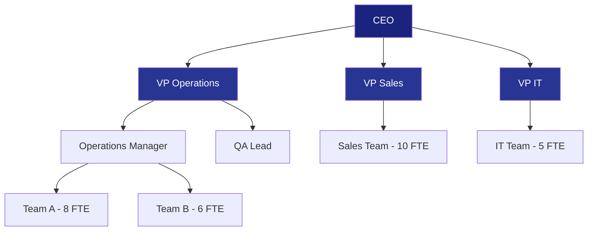
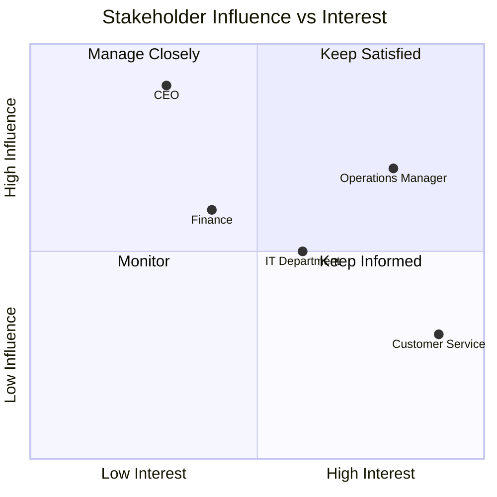
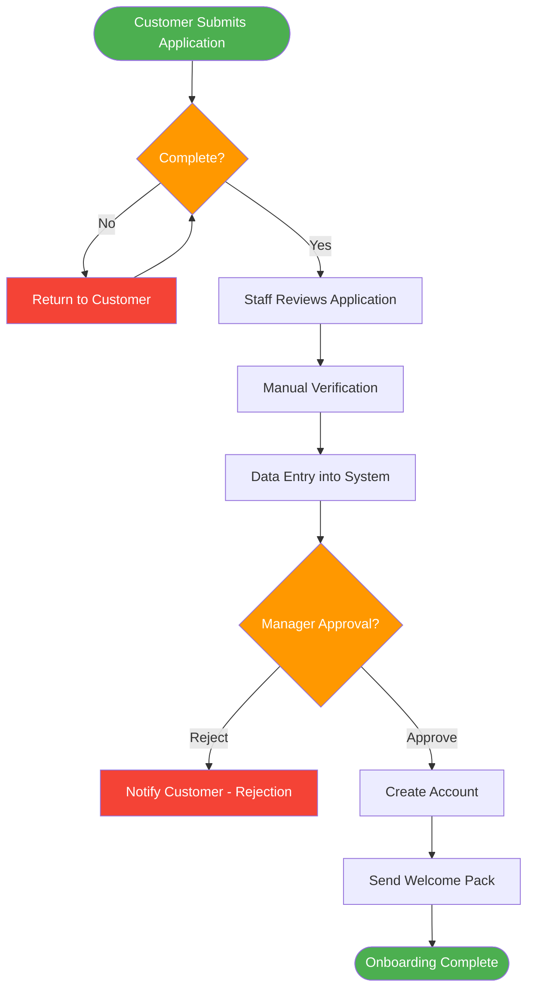
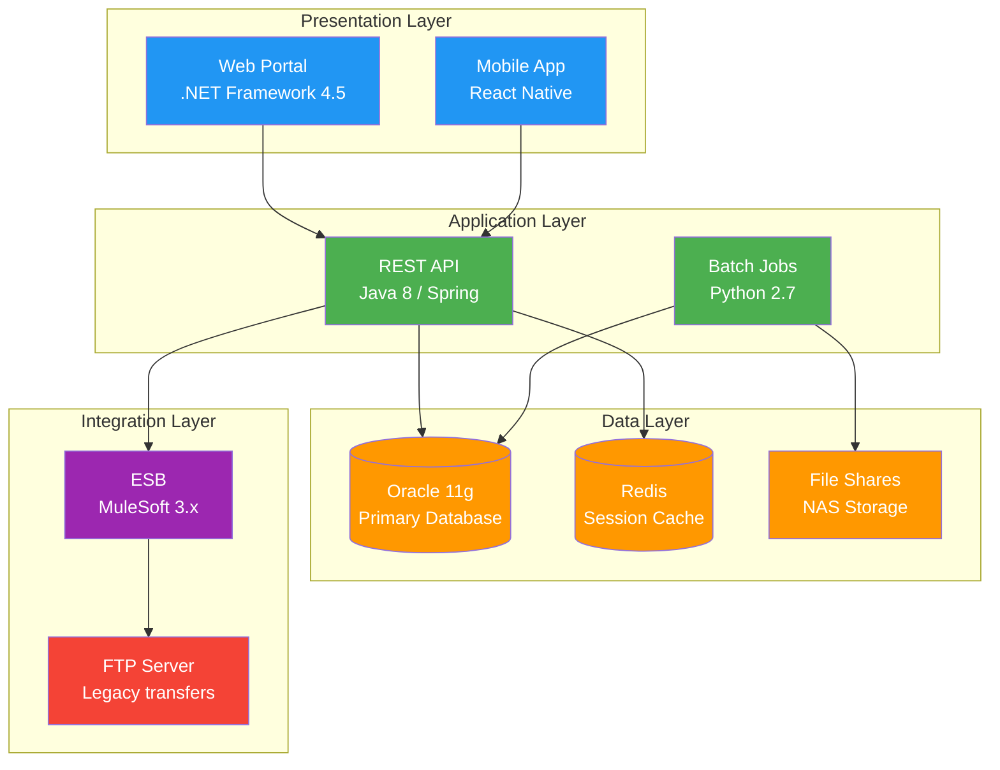

# Current State Description (As-Is)

> **Project:** [Project Name]
> **Version:** [X.Y] | **Status:** [Draft | Under Review | Approved | Archived]
> **Last Updated:** [YYYY-MM-DD]

---

## Document Control

| Field | Value |
|-------|-------|
| Document Owner | [Name / Role] |
| Business Analyst | [Name / Role] |
| SME Contributors | [Names] |

### Revision History

| Version | Date | Author | Change Description |
|---------|------|--------|--------------------|
| 0.1 | [YYYY-MM-DD] | [Name] | Initial draft |
| 1.0 | [YYYY-MM-DD] | [Name] | Approved version |

### Approvals

| Role | Name | Signature | Date |
|------|------|-----------|------|
| Business Owner | | | |
| Process Owner | | | |
| BA Lead | | | |

---

## Table of Contents

1. [Executive Summary](#1-executive-summary)
2. [Business Context](#2-business-context)
3. [Organizational Structure](#3-organizational-structure)
4. [Current Processes](#4-current-processes)
5. [Current Systems & Technology](#5-current-systems--technology)
6. [Current Data Landscape](#6-current-data-landscape)
7. [Current Performance Metrics](#7-current-performance-metrics)
8. [Pain Points & Issues](#8-pain-points--issues)
9. [Current Costs](#9-current-costs)
10. [External Environment](#10-external-environment)
11. [Summary](#11-summary)

---

## 1. Executive Summary

| Field | Detail |
|-------|--------|
| Scope of Analysis | [Which business area, department, or process is being assessed] |
| Time of Assessment | [When the analysis was conducted] |
| Key Finding | [1-2 sentence summary of the most critical insight] |
| Overall Health | 🔴 Critical / 🟡 Degraded / 🟢 Stable |
| Primary Pain Points | [Count] issues identified, [X] critical |

---

## 2. Business Context

### 2.1 Business Overview

| Aspect | Description |
|--------|-------------|
| Organization | [Name, size, industry] |
| Business Unit | [Department or division in scope] |
| Mission | [What this business unit does] |
| Key Products / Services | [What is delivered to customers] |
| Customer Segments | [Who the customers are] |
| Revenue Model | [How the business generates revenue] |
| Market Position | [Competitive landscape position] |

### 2.2 Business Model Canvas

| Block | Current State |
|-------|--------------|
| **Value Propositions** | [What value is currently delivered] |
| **Customer Segments** | [Who is currently served] |
| **Channels** | [How customers are currently reached] |
| **Customer Relationships** | [How relationships are currently managed] |
| **Revenue Streams** | [Current revenue sources] |
| **Key Resources** | [Current critical resources] |
| **Key Activities** | [Current critical activities] |
| **Key Partnerships** | [Current strategic partners] |
| **Cost Structure** | [Current major cost drivers] |

---

## 3. Organizational Structure

### 3.1 Org Chart (Current)

### 3.2 Roles & Responsibilities

| Role | Count | Key Responsibilities | Skills Gap |
|------|-------|---------------------|-----------|
| [e.g., Operations Manager] | 1 | [Process oversight, team management] | None |
| [e.g., Data Entry Clerk] | 8 | [Manual data input, verification] | Automation skills |
| [e.g., Customer Service Rep] | 6 | [Inquiry handling, issue resolution] | System proficiency |
| [e.g., IT Support] | 2 | [System maintenance, troubleshooting] | Capacity |

### 3.3 Stakeholder Map

---

## 4. Current Processes

### 4.1 Process Inventory

| ID | Process | Owner | Frequency | Volume | Efficiency |
|----|---------|-------|-----------|--------|-----------|
| P-01 | [e.g., Customer Onboarding] | [Ops Manager] | Daily | [50/day] | 🔴 Inefficient |
| P-02 | [e.g., Order Processing] | [Team Lead] | Daily | [200/day] | 🟡 Moderate |
| P-03 | [e.g., Invoice Generation] | [Finance] | Weekly | [500/week] | 🟡 Moderate |
| P-04 | [e.g., Reporting] | [Analyst] | Monthly | [10/month] | 🔴 Inefficient |
| P-05 | | | | | |

### 4.2 Process Detail: [Process Name]

> **Repeat this section for each key process.**

**Process Overview**

| Field | Detail |
|-------|--------|
| Process Name | [e.g., Customer Onboarding] |
| Owner | [Name / Role] |
| Trigger | [What starts the process] |
| Outcome | [What the process delivers] |
| Duration | [Average end-to-end time] |
| Handoffs | [Number of handoffs between people/systems] |
| Error Rate | [% of cases requiring rework] |

**Process Flow**

**Process Issues**

| Step | Issue | Impact | Frequency |
|------|-------|--------|-----------|
| [e.g., Manual Verification] | [No automated checks] | [Errors slip through] | [Daily] |
| [e.g., Data Entry] | [Duplicate entry across systems] | [Wasted time, data inconsistency] | [Every case] |
| [e.g., Manager Approval] | [Single point of failure] | [Bottleneck, delays] | [When manager absent] |

### 4.3 Process Maturity Assessment

| Process | Maturity Level | Description |
|---------|---------------|-------------|
| [Process 1] | Level 1 — Initial | [Ad hoc, unpredictable, reactive] |
| [Process 2] | Level 2 — Managed | [Repeatable but reactive] |
| [Process 3] | Level 3 — Defined | [Proactive, defined standards] |
| [Process 4] | Level 4 — Quantitatively Managed | [Measured and controlled] |
| [Process 5] | Level 5 — Optimizing | [Continuous improvement] |

---

## 5. Current Systems & Technology

### 5.1 Application Landscape

| ID | System | Type | Version | Vendor | Users | Status | Support Status |
|----|--------|------|---------|--------|-------|--------|---------------|
| SYS-01 | [e.g., SAP ERP] | ERP | [v6.0] | [SAP] | [50] | 🟢 Active | 🟡 Vendor support ending 2027 |
| SYS-02 | [e.g., Custom CRM] | CRM | [v2.3] | [In-house] | [20] | 🟡 Degraded | 🔴 No vendor support |
| SYS-03 | [e.g., Excel Spreadsheets] | Manual | N/A | [Microsoft] | [30] | 🔴 Critical | N/A |
| SYS-04 | | | | | | | |

### 5.2 Technology Stack

### 5.3 System Integration Map

| Source System | Target System | Integration Type | Frequency | Reliability |
|--------------|--------------|-----------------|-----------|------------|
| [SAP ERP] | [Custom CRM] | [Batch file — nightly] | Daily | 🟡 Occasional failures |
| [Custom CRM] | [Email System] | [API — real-time] | Real-time | 🟢 Reliable |
| [Excel] | [SAP ERP] | [Manual — copy/paste] | Ad hoc | 🔴 Error-prone |

### 5.4 Technical Debt Inventory

| ID | System | Debt Type | Description | Impact | Remediation Cost |
|----|--------|-----------|-------------|--------|-----------------|
| TD-01 | [Custom CRM] | Technology | [Unsupported framework] | 🔴 Security risk | [$X] |
| TD-02 | [Batch Jobs] | Code | [No error handling] | 🟡 Silent failures | [$X] |
| TD-03 | [Database] | Infrastructure | [End-of-life version] | 🔴 No patches | [$X] |
| TD-04 | | | | | |

---

## 6. Current Data Landscape

### 6.1 Data Sources

| ID | Data Source | Type | Owner | Volume | Quality |
|----|-----------|------|-------|--------|---------|
| DS-01 | [e.g., Customer Database] | Relational DB | [IT] | [500K records] | 🟡 Inconsistent |
| DS-02 | [e.g., Transaction Logs] | Files | [Operations] | [2M records/year] | 🟢 Good |
| DS-03 | [e.g., Spreadsheet Reports] | Manual | [Finance] | [50 files/month] | 🔴 Error-prone |
| DS-04 | | | | | |

### 6.2 Data Quality Issues

| Issue | Affected Data | Impact | Frequency | Root Cause |
|-------|--------------|--------|-----------|-----------|
| [e.g., Duplicate records] | [Customer data] | [Incorrect reporting] | [~5% of records] | [No dedup rules] |
| [e.g., Missing fields] | [Order data] | [Manual follow-up] | [~10% of orders] | [No validation] |
| [e.g., Inconsistent format] | [Address data] | [Failed deliveries] | [~3% of orders] | [Free-text entry] |

### 6.3 Data Flow (Current State)

---

## 7. Current Performance Metrics

### 7.1 KPI Summary

| KPI | Current Value | Industry Benchmark | Gap | Status |
|-----|--------------|-------------------|-----|--------|
| [e.g., Customer Onboarding Time] | [12 days] | [3 days] | [-9 days] | 🔴 |
| [e.g., Order Processing Time] | [4.5 hours] | [1 hour] | [-3.5 hours] | 🔴 |
| [e.g., Error Rate] | [8%] | [<1%] | [-7%] | 🔴 |
| [e.g., Customer Satisfaction (NPS)] | [35] | [60+] | [-25] | 🟡 |
| [e.g., System Uptime] | [97%] | [99.9%] | [-2.9%] | 🟡 |
| [e.g., Manual Tasks per Transaction] | [15 steps] | [3 steps] | [-12 steps] | 🔴 |

### 7.2 Performance Trend (12 Months)

| Month | KPI-01 | KPI-02 | KPI-03 | Notes |
|-------|--------|--------|--------|-------|
| [Month 1] | [Value] | [Value] | [Value] | |
| [Month 2] | | | | |
| ... | | | | |
| [Month 12] | | | | |
| **Trend** | ↑ Worsening | → Stable | ↓ Improving | |

---

## 8. Pain Points & Issues

### 8.1 Issue Register

| ID | Issue | Severity | Impact | Frequency | Affected Stakeholders | Root Cause |
|----|-------|----------|--------|-----------|----------------------|-----------|
| ISS-01 | [e.g., Manual data entry errors] | 🔴 High | [Rework, customer complaints] | Daily | Operations, Customers | [No validation, no automation] |
| ISS-02 | [e.g., System downtime] | 🔴 High | [Lost revenue, SLA breach] | Monthly | All | [Outdated infrastructure] |
| ISS-03 | [e.g., Reporting delays] | 🟡 Medium | [Late decisions] | Weekly | Management | [Manual report generation] |
| ISS-04 | [e.g., No audit trail] | 🔴 High | [Compliance risk] | Constant | Compliance, Audit | [No logging in legacy system] |
| ISS-05 | | | | | | |

### 8.2 Issue Heat Map

| Impact \ Frequency | Rare | Occasional | Frequent | Constant |
|-------------------|------|-----------|----------|---------|
| **Critical** | 🟡 | 🟠 | 🔴 ISS-01 | 🔴 ISS-04 |
| **Major** | 🟢 | 🟡 ISS-02 | 🟠 | 🔴 |
| **Moderate** | 🟢 | 🟢 | 🟡 ISS-03 | 🟠 |
| **Minor** | 🟢 | 🟢 | 🟢 | 🟡 |

> **Legend:** 🔴 Critical — Immediate action required | 🟠 High — Mitigation plan required | 🟡 Medium — Monitor and manage | 🟢 Low — Accept and monitor

### 8.3 Voice of the Stakeholder

| Stakeholder | Quote / Feedback | Source | Date |
|------------|-----------------|--------|------|
| [e.g., Operations Manager] | ["We spend 60% of our time fixing data errors instead of serving customers"] | [Interview] | [YYYY-MM-DD] |
| [e.g., Customer] | ["I've been waiting 2 weeks for my account to be activated"] | [Survey] | [YYYY-MM-DD] |
| [e.g., Compliance Officer] | ["We have no way to prove who changed what and when"] | [Workshop] | [YYYY-MM-DD] |

---

## 9. Current Costs

### 9.1 Cost of Operations (Annual)

| Category | Cost | % of Total | Notes |
|----------|------|-----------|-------|
| **Labor — Operations** | $[X] | [X%] | [FTE count × loaded cost] |
| **Labor — IT Support** | $[X] | [X%] | [Maintenance, troubleshooting] |
| **Technology — Licensing** | $[X] | [X%] | [ERP, CRM, tools] |
| **Technology — Infrastructure** | $[X] | [X%] | [Servers, hosting, network] |
| **Rework / Error Correction** | $[X] | [X%] | [Estimated from error rate] |
| **Compliance / Penalties** | $[X] | [X%] | [Audit costs, fines if any] |
| **Opportunity Cost** | $[X] | [X%] | [Lost revenue from delays] |
| **Total Annual Cost** | **$[Sum]** | **100%** | |

### 9.2 Cost per Transaction

| Transaction Type | Volume/Year | Cost/Transaction | Annual Cost |
|-----------------|------------|-----------------|------------|
| [e.g., Customer Onboarding] | [X] | $[Y] | $[X×Y] |
| [e.g., Order Processing] | [X] | $[Y] | $[X×Y] |
| [e.g., Invoice Generation] | [X] | $[Y] | $[X×Y] |

---

## 10. External Environment

### 10.1 Regulatory Landscape

| Regulation | Requirement | Current Compliance | Gap |
|-----------|-------------|-------------------|-----|
| [e.g., GDPR] | [Data protection, right to erasure] | 🟡 Partial | [No automated deletion] |
| [e.g., Industry Standard X] | [Audit trail for all changes] | 🔴 Non-compliant | [No logging] |
| [e.g., Local Law Y] | [Report submission by deadline] | 🟢 Compliant | None |

### 10.2 Competitive Landscape

| Competitor | Capability | Our Position | Gap |
|-----------|-----------|-------------|-----|
| [Competitor A] | [24-hour onboarding] | [12-day onboarding] | [-11.5 days] |
| [Competitor B] | [Real-time reporting] | [Weekly Excel reports] | [Significant] |
| [Competitor C] | [Self-service portal] | [Phone/email only] | [No self-service] |

### 10.3 Market Trends

| Trend | Impact on Current State | Urgency |
|-------|------------------------|---------|
| [e.g., Digital-first customer expectations] | [Current manual processes misaligned] | 🔴 High |
| [e.g., Regulatory tightening] | [Current gaps will worsen] | 🟡 Medium |
| [e.g., AI/ML adoption in industry] | [No capability exists] | 🟢 Low (for now) |

---

## 11. Summary

### Current State Assessment

| Dimension | Health | Key Issue |
|-----------|--------|-----------|
| **Processes** | 🔴 Critical | [Manual, error-prone, slow] |
| **Technology** | 🔴 Critical | [Legacy systems, end-of-life] |
| **Data** | 🟡 Degraded | [Inconsistent, siloed] |
| **People** | 🟡 Degraded | [Skills gaps, capacity constraints] |
| **Performance** | 🔴 Critical | [All KPIs below benchmark] |
| **Compliance** | 🔴 Critical | [Audit trail gaps] |

### Top 5 Issues Driving Change

1. [e.g., Manual processes causing 8% error rate — $X annual rework cost]
2. [e.g., 12-day onboarding vs 3-day industry benchmark — losing customers]
3. [e.g., No audit trail — compliance risk and potential fines]
4. [e.g., Legacy systems — vendor support ending, security vulnerabilities]
5. [e.g., No real-time visibility — management decisions based on week-old data]

### Recommendation

> These findings justify the initiative described in the [[Business-Case]] and drive the requirements in [[Business-Requirements]].

---

## Related Documents

| Document | Relationship |
|----------|-------------|
| [[Business-Case]] | Current state problems justify the investment |
| [[Business-Requirements]] | Requirements address identified pain points |
| [[Future-State-Description]] | Future state resolves current state issues |
| [[Gap-Analysis]] | Gaps are derived from current → future comparison |
| [[Risk-Analysis-Results]] | Current state risks feed into risk assessment |

---

> **Template Standard:** Based on BABOK v3 (Strategy Analysis), ISO/IEC/IEEE 12207
> **Usage:** Document what exists today — resist the urge to propose solutions. Solutions belong in [[Future-State-Description]] and [[Change-Strategy]].
