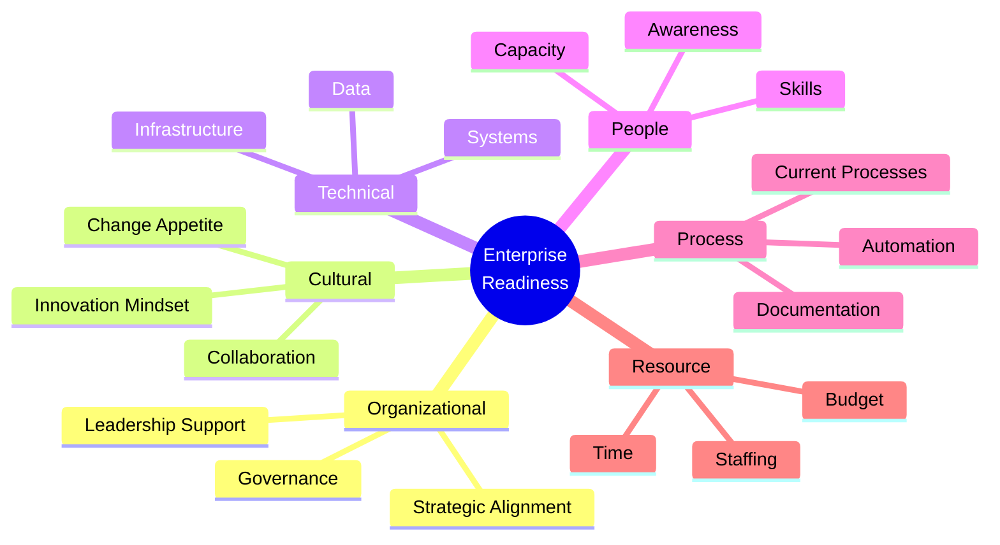
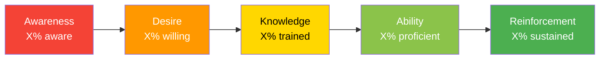
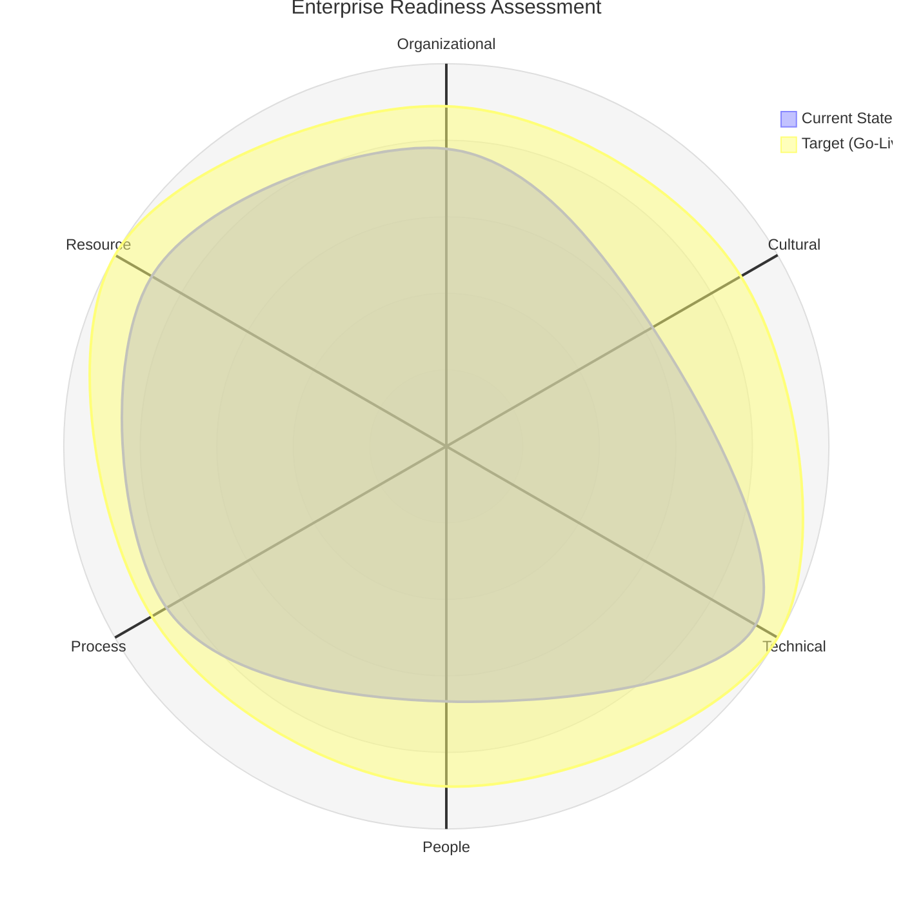
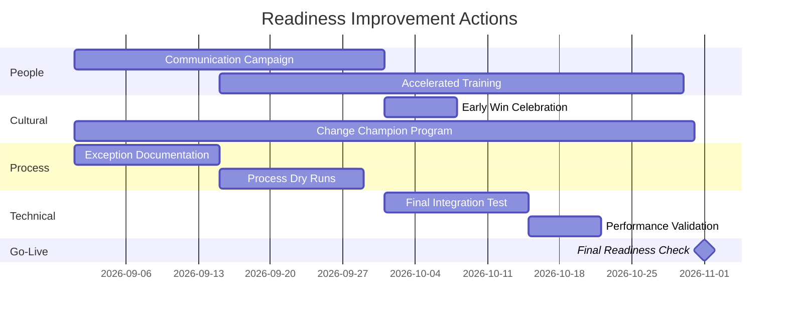

# Enterprise Readiness Assessment

> **Project:** [Project Name]
> **Version:** [X.Y] | **Status:** [Draft | Under Review | Approved | Archived]
> **Last Updated:** [YYYY-MM-DD]

---

## Document Control

| Field | Value |
|-------|-------|
| Document Owner | [Name / Role] |
| Business Analyst | [Name / Role] |
| Change Manager | [Name / Role] |
| Sponsor | [Name / Role] |

### Revision History

| Version | Date | Author | Change Description |
|---------|------|--------|--------------------|
| 0.1 | [YYYY-MM-DD] | [Name] | Initial draft |
| 1.0 | [YYYY-MM-DD] | [Name] | Approved version |

### Approvals

| Role | Name | Signature | Date |
|------|------|-----------|------|
| Project Sponsor | | | |
| Business Owner | | | |
| Change Manager | | | |
| HR Director | | | |

---

## Table of Contents

1. [Executive Summary](#1-executive-summary)
2. [Readiness Dimensions](#2-readiness-dimensions)
3. [Organizational Readiness](#3-organizational-readiness)
4. [Cultural Readiness](#4-cultural-readiness)
5. [Technical Readiness](#5-technical-readiness)
6. [People Readiness](#6-people-readiness)
7. [Process Readiness](#7-process-readiness)
8. [Resource Readiness](#8-resource-readiness)
9. [Readiness Score Summary](#9-readiness-score-summary)
10. [Readiness Improvement Plan](#10-readiness-improvement-plan)
11. [Go/No-Go Criteria](#11-gono-go-criteria)

---

## 1. Executive Summary

| Field | Detail |
|-------|--------|
| Assessment Date | [YYYY-MM-DD] |
| Overall Readiness Score | [X/5.0] — [Ready / Partially Ready / Not Ready] |
| Strongest Dimension | [e.g., Technical Readiness — 4.2/5] |
| Weakest Dimension | [e.g., Cultural Readiness — 2.8/5] |
| Key Blockers | [Count] critical readiness gaps |
| Recommended Actions | [Count] actions before go-live |
| Go-Live Recommendation | ✅ Ready / ⚠️ Conditional / ❌ Not Ready |

### Readiness Dashboard

| Dimension | Score | Status | Trend |
|-----------|-------|--------|-------|
| Organizational | [X/5] | 🟢🟡🔴 | ↑↓→ |
| Cultural | [X/5] | 🟢🟡🔴 | ↑↓→ |
| Technical | [X/5] | 🟢🟡🔴 | ↑↓→ |
| People | [X/5] | 🟢🟡🔴 | ↑↓→ |
| Process | [X/5] | 🟢🟡🔴 | ↑↓→ |
| Resource | [X/5] | 🟢🟡🔴 | ↑↓→ |
| **Overall** | **[X/5]** | **🟢🟡🔴** | **↑↓→** |

---

## 2. Readiness Dimensions

### 2.1 Assessment Framework

### 2.2 Scoring Scale

| Score | Level | Description |
|-------|-------|-------------|
| 5 | **Fully Ready** | [All prerequisites met, no barriers] |
| 4 | **Mostly Ready** | [Minor gaps, manageable with current resources] |
| 3 | **Partially Ready** | [Moderate gaps, requires targeted intervention] |
| 2 | **Significantly Not Ready** | [Major gaps, requires significant effort] |
| 1 | **Not Ready** | [Critical barriers, go-live risk] |

---

## 3. Organizational Readiness

### 3.1 Assessment

| Factor | Score (1-5) | Evidence | Gap | Action Required |
|--------|------------|---------|-----|----------------|
| **Executive Sponsorship** | [X] | [Sponsor actively engaged, present at key meetings] | [None / Minor / Major] | |
| **Strategic Alignment** | [X] | [Project aligned with organizational strategy] | | |
| **Governance Structure** | [X] | [Steering committee established, meeting regularly] | | |
| **Decision-Making Authority** | [X] | [Clear decision rights defined] | | |
| **Organizational Stability** | [X] | [No major restructuring planned] | | |
| **Regulatory Compliance** | [X] | [Compliance requirements understood and addressed] | | |

### 3.2 Organizational Readiness Score

| Factor | Weight | Score | Weighted Score |
|--------|--------|-------|---------------|
| Executive Sponsorship | 25% | [X] | [X × 0.25] |
| Strategic Alignment | 20% | [X] | [X × 0.20] |
| Governance Structure | 20% | [X] | [X × 0.20] |
| Decision-Making Authority | 15% | [X] | [X × 0.15] |
| Organizational Stability | 10% | [X] | [X × 0.10] |
| Regulatory Compliance | 10% | [X] | [X × 0.10] |
| **Total** | **100%** | | **[Sum]/5.0** |

---

## 4. Cultural Readiness

### 4.1 Assessment

| Factor | Score (1-5) | Evidence | Gap | Action Required |
|--------|------------|---------|-----|----------------|
| **Change Appetite** | [X] | [History of change adoption, survey results] | | |
| **Collaboration Culture** | [X] | [Cross-team cooperation, silo level] | | |
| **Innovation Mindset** | [X] | [Openness to new ways of working] | | |
| **Communication Openness** | [X] | [Transparent communication, feedback culture] | | |
| **Trust in Leadership** | [X] | [Employee survey, change history] | | |
| **Change Fatigue Level** | [X] | [Number of recent changes, survey] | | |

### 4.2 Cultural Readiness Score

| Factor | Weight | Score | Weighted Score |
|--------|--------|-------|---------------|
| Change Appetite | 25% | [X] | [X × 0.25] |
| Collaboration Culture | 20% | [X] | [X × 0.20] |
| Innovation Mindset | 15% | [X] | [X × 0.15] |
| Communication Openness | 15% | [X] | [X × 0.15] |
| Trust in Leadership | 15% | [X] | [X × 0.15] |
| Change Fatigue Level | 10% | [X] | [X × 0.10] |
| **Total** | **100%** | | **[Sum]/5.0** |

---

## 5. Technical Readiness

### 5.1 Assessment

| Factor | Score (1-5) | Evidence | Gap | Action Required |
|--------|------------|---------|-----|----------------|
| **Infrastructure Ready** | [X] | [Cloud environment provisioned, network configured] | | |
| **Systems Integration Ready** | [X] | [APIs tested, integration verified] | | |
| **Data Migration Ready** | [X] | [Data cleansed, migration scripts tested] | | |
| **Security Implemented** | [X] | [Security controls in place, pen test passed] | | |
| **Monitoring & Alerting** | [X] | [Monitoring configured, alerts working] | | |
| **Backup & Recovery** | [X] | [Backup tested, recovery procedures documented] | | |
| **Performance Validated** | [X] | [Load testing completed, NFRs met] | | |

### 5.2 Technical Readiness Score

| Factor | Weight | Score | Weighted Score |
|--------|--------|-------|---------------|
| Infrastructure Ready | 20% | [X] | [X × 0.20] |
| Systems Integration Ready | 20% | [X] | [X × 0.20] |
| Data Migration Ready | 15% | [X] | [X × 0.15] |
| Security Implemented | 15% | [X] | [X × 0.15] |
| Monitoring & Alerting | 10% | [X] | [X × 0.10] |
| Backup & Recovery | 10% | [X] | [X × 0.10] |
| Performance Validated | 10% | [X] | [X × 0.10] |
| **Total** | **100%** | | **[Sum]/5.0** |

---

## 6. People Readiness

### 6.1 Assessment

| Factor | Score (1-5) | Evidence | Gap | Action Required |
|--------|------------|---------|-----|----------------|
| **Awareness of Change** | [X] | [Survey: % aware of upcoming change] | | |
| **Desire to Adopt** | [X] | [Survey: % supportive of change] | | |
| **Knowledge (Trained)** | [X] | [% of users completed training] | | |
| **Ability (Practiced)** | [X] | [% of users proficient in sandbox] | | |
| **Reinforcement Plan** | [X] | [Support structure in place] | | |
| **Staffing Adequate** | [X] | [All roles filled, no critical vacancies] | | |
| **Capacity Available** | [X] | [Staff have time allocated for transition] | | |

### 6.2 ADKAR Assessment

### 6.3 People Readiness Score

| Factor | Weight | Score | Weighted Score |
|--------|--------|-------|---------------|
| Awareness of Change | 15% | [X] | [X × 0.15] |
| Desire to Adopt | 15% | [X] | [X × 0.15] |
| Knowledge (Trained) | 20% | [X] | [X × 0.20] |
| Ability (Practiced) | 20% | [X] | [X × 0.20] |
| Reinforcement Plan | 10% | [X] | [X × 0.10] |
| Staffing Adequate | 10% | [X] | [X × 0.10] |
| Capacity Available | 10% | [X] | [X × 0.10] |
| **Total** | **100%** | | **[Sum]/5.0** |

---

## 7. Process Readiness

### 7.1 Assessment

| Factor | Score (1-5) | Evidence | Gap | Action Required |
|--------|------------|---------|-----|----------------|
| **New Processes Documented** | [X] | [SOPs, process maps, work instructions] | | |
| **Process Testing Complete** | [X] | [Dry runs, simulation, UAT] | | |
| **Exception Handling Defined** | [X] | [Edge cases, escalation paths documented] | | |
| **Support Model Established** | [X] | [Help desk, L1/L2/L3 support defined] | | |
| **Rollback Procedures** | [X] | [Documented, tested, decision criteria defined] | | |
| **Compliance Processes** | [X] | [Audit trail, regulatory processes validated] | | |

### 7.2 Process Readiness Score

| Factor | Weight | Score | Weighted Score |
|--------|--------|-------|---------------|
| New Processes Documented | 25% | [X] | [X × 0.25] |
| Process Testing Complete | 25% | [X] | [X × 0.25] |
| Exception Handling Defined | 15% | [X] | [X × 0.15] |
| Support Model Established | 15% | [X] | [X × 0.15] |
| Rollback Procedures | 10% | [X] | [X × 0.10] |
| Compliance Processes | 10% | [X] | [X × 0.10] |
| **Total** | **100%** | | **[Sum]/5.0** |

---

## 8. Resource Readiness

### 8.1 Assessment

| Factor | Score (1-5) | Evidence | Gap | Action Required |
|--------|------------|---------|-----|----------------|
| **Budget Approved** | [X] | [Remaining budget sufficient for go-live] | | |
| **Go-Live Team Assigned** | [X] | [All go-live roles filled and briefed] | | |
| **Vendor Support Confirmed** | [X] | [Vendor on standby for go-live] | | |
| **Hypercare Team Ready** | [X] | [Post-go-live support team assigned] | | |
| **Contingency Available** | [X] | [Budget and resources for unexpected issues] | | |
| **Time Allocated** | [X] | [Go-live window secured, no conflicts] | | |

### 8.2 Resource Readiness Score

| Factor | Weight | Score | Weighted Score |
|--------|--------|-------|---------------|
| Budget Approved | 20% | [X] | [X × 0.20] |
| Go-Live Team Assigned | 25% | [X] | [X × 0.25] |
| Vendor Support Confirmed | 15% | [X] | [X × 0.15] |
| Hypercare Team Ready | 15% | [X] | [X × 0.15] |
| Contingency Available | 15% | [X] | [X × 0.15] |
| Time Allocated | 10% | [X] | [X × 0.10] |
| **Total** | **100%** | | **[Sum]/5.0** |

---

## 9. Readiness Score Summary

### 9.1 Overall Readiness Matrix

| Dimension | Score | Weight | Weighted Score | Status |
|-----------|-------|--------|---------------|--------|
| Organizational | [X/5] | 20% | [X × 0.20] | 🟢🟡🔴 |
| Cultural | [X/5] | 15% | [X × 0.15] | 🟢🟡🔴 |
| Technical | [X/5] | 25% | [X × 0.25] | 🟢🟡🔴 |
| People | [X/5] | 20% | [X × 0.20] | 🟢🟡🔴 |
| Process | [X/5] | 10% | [X × 0.10] | 🟢🟡🔴 |
| Resource | [X/5] | 10% | [X × 0.10] | 🟢🟡🔴 |
| **Overall** | | **100%** | **[Sum]/5.0** | **🟢🟡🔴** |

### 9.2 Readiness Radar

### 9.3 Status Thresholds

| Score Range | Status | Interpretation |
|------------|--------|---------------|
| 4.0 - 5.0 | 🟢 Ready | [Proceed with go-live] |
| 3.0 - 3.9 | 🟡 Conditional | [Proceed with targeted interventions] |
| 2.0 - 2.9 | 🟠 At Risk | [Delay go-live until gaps addressed] |
| 1.0 - 1.9 | 🔴 Not Ready | [Significant barriers — major remediation needed] |

---

## 10. Readiness Improvement Plan

### 10.1 Gap Remediation Actions

| ID | Dimension | Gap | Action | Owner | Due Date | Status |
|----|-----------|-----|--------|-------|----------|--------|
| R-01 | People | [Awareness at 30%] | [Communication campaign — town hall, email series] | [Change Manager] | [YYYY-MM-DD] | ☐ |
| R-02 | People | [Training at 40%] | [Accelerated training schedule, mandatory completion] | [Training Lead] | [YYYY-MM-DD] | ☐ |
| R-03 | Cultural | [Change fatigue high] | [Phased approach, celebrate early wins] | [Change Manager] | [YYYY-MM-DD] | ☐ |
| R-04 | Process | [Exception handling gaps] | [Document edge cases, test with scenarios] | [BA] | [YYYY-MM-DD] | ☐ |
| R-05 | | | | | | |

### 10.2 Improvement Timeline

---

## 11. Go/No-Go Criteria

### 11.1 Go-Live Readiness Checklist

| # | Criterion | Required Level | Current | Status |
|---|----------|---------------|---------|--------|
| 1 | [Overall readiness score ≥ 3.5] | [3.5/5.0] | [X/5.0] | ✅❌ |
| 2 | [No dimension below 2.5] | [≥ 2.5 each] | [Min: X] | ✅❌ |
| 3 | [Training completion ≥ 80%] | [80%] | [X%] | ✅❌ |
| 4 | [All 🔴 critical gaps resolved] | [0 open] | [X open] | ✅❌ |
| 5 | [Technical go-live checklist complete] | [100%] | [X%] | ✅❌ |
| 6 | [Rollback plan tested] | [Tested] | [Status] | ✅❌ |
| 7 | [Support team briefed and ready] | [Ready] | [Status] | ✅❌ |
| 8 | [Stakeholder communication sent] | [Sent] | [Status] | ✅❌ |
| 9 | [Sponsor go-live approval] | [Approved] | [Status] | ✅❌ |
| 10 | [No blocking risks open] | [0 open] | [X open] | ✅❌ |

### 11.2 Decision Matrix

| Result | Criteria Met | Decision | Action |
|--------|------------|----------|--------|
| **Go** | [8-10 criteria met] | ✅ Proceed with go-live | [Execute go-live plan] |
| **Conditional Go** | [6-7 criteria met] | ⚠️ Proceed with conditions | [Address gaps in parallel, enhanced monitoring] |
| **No-Go** | [<6 criteria met] | ❌ Delay go-live | [Remediate gaps, reassess in X weeks] |

### 11.3 Decision Record

| Field | Detail |
|-------|--------|
| Assessment Date | [YYYY-MM-DD] |
| Assessed By | [Names] |
| Overall Score | [X/5.0] |
| Decision | [Go / Conditional Go / No-Go] |
| Conditions (if any) | [List conditions for conditional go] |
| Next Review Date | [YYYY-MM-DD] |
| Approved By | [Sponsor Name / Signature] |

---

## Related Documents

| Document | Relationship |
|----------|-------------|
| [[Change-Strategy]] | Readiness assessment validates change strategy effectiveness |
| [[Business-Analysis-Approach]] | BA approach includes readiness activities |
| [[Governance-Approach]] | Governance structure is a readiness factor |
| [[Risk-Analysis-Results]] | Readiness gaps become risks |
| [[Skill-Matrix]] | Training completion is a readiness metric |
| [[Enterprise-Readiness-Assessment]] | Operational readiness for go-live |

---

> **Template Standard:** Based on BABOK v3 (Strategy Analysis), PMBOK v8 (Stakeholder Management), Prosci ADKAR Model
> **Usage:** Assess readiness at 3 points: (1) mid-project to identify gaps early, (2) 4 weeks before go-live to validate readiness, (3) 1 week before go-live for final go/no-go. The assessment drives targeted interventions — not just a score.
