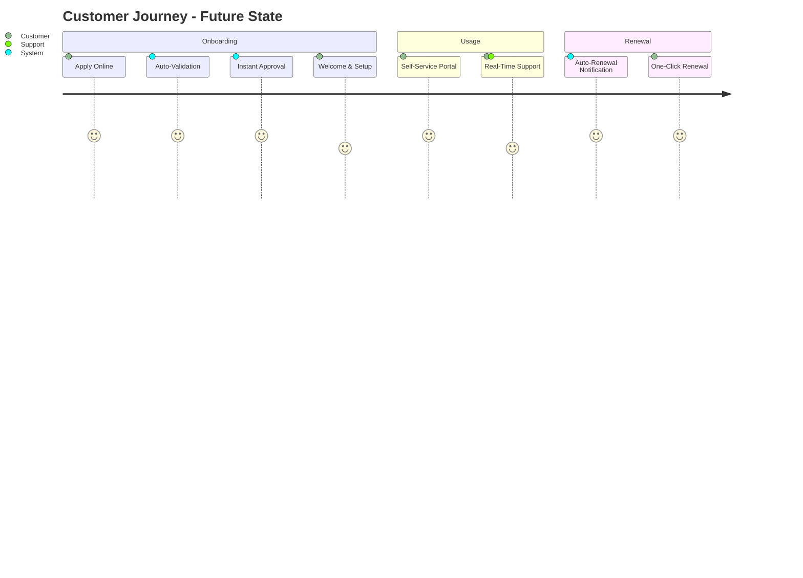
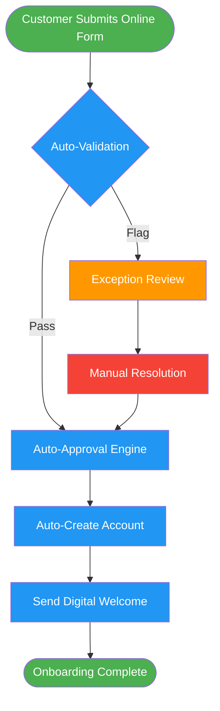
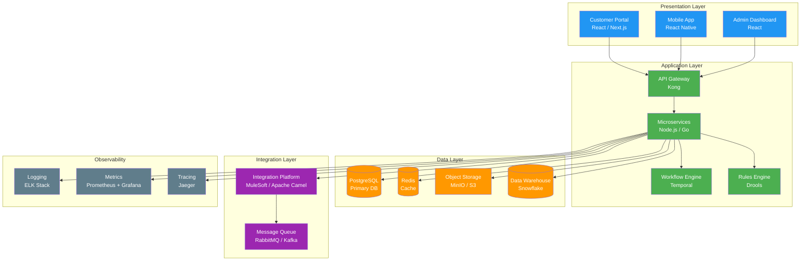
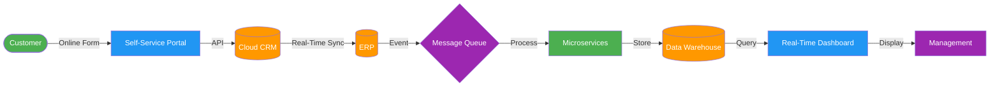
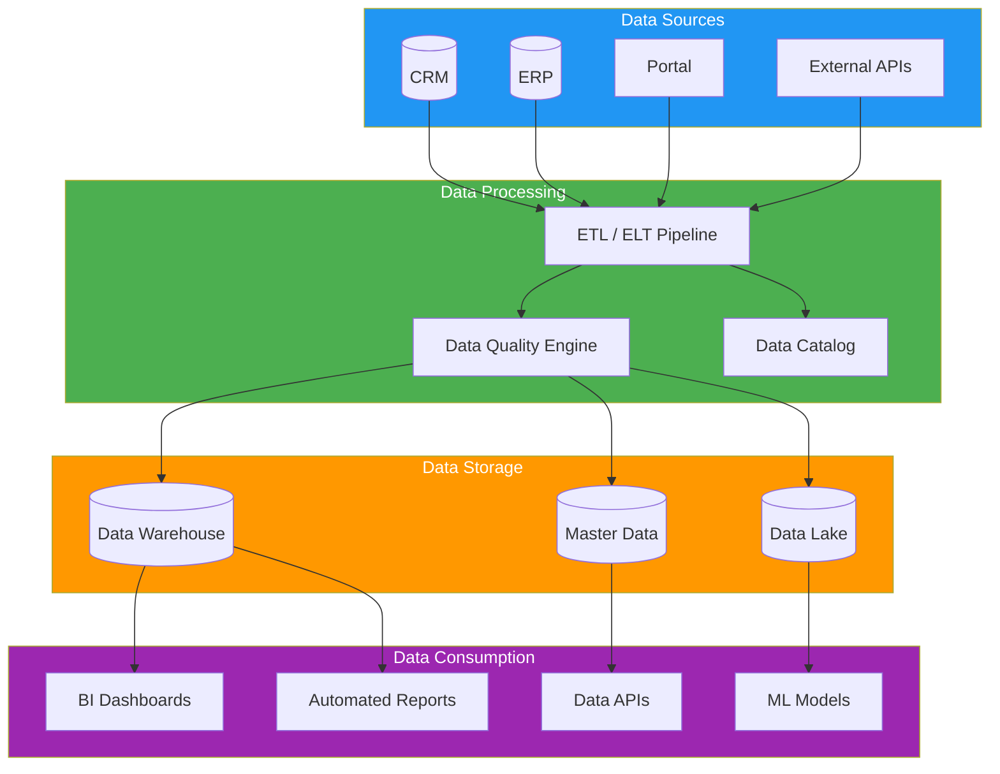

# Future State Description (To-Be)

> **Project:** [Project Name]
> **Version:** [X.Y] | **Status:** [Draft | Under Review | Approved | Archived]
> **Last Updated:** [YYYY-MM-DD]

---

## Document Control

| Field | Value |
|-------|-------|
| Document Owner | [Name / Role] |
| Business Analyst | [Name / Role] |
| Sponsor | [Name / Role] |

### Revision History

| Version | Date | Author | Change Description |
|---------|------|--------|--------------------|
| 0.1 | [YYYY-MM-DD] | [Name] | Initial draft |
| 1.0 | [YYYY-MM-DD] | [Name] | Approved version |

### Approvals

| Role | Name | Signature | Date |
|------|------|-----------|------|
| Project Sponsor | | | |
| Business Owner | | | |
| Solution Architect | | | |
| BA Lead | | | |

---

## Table of Contents

1. [Executive Summary](#1-executive-summary)
2. [Vision Statement](#2-vision-statement)
3. [Future Business Model](#3-future-business-model)
4. [Future Processes](#4-future-processes)
5. [Future Systems & Technology](#5-future-systems--technology)
6. [Future Data Landscape](#6-future-data-landscape)
7. [Future Performance Targets](#7-future-performance-targets)
8. [Future Cost Projections](#8-future-cost-projections)
9. [Capability Requirements](#9-capability-requirements)
10. [Success Criteria](#10-success-criteria)

---

## 1. Executive Summary

| Field | Detail |
|-------|--------|
| Vision | [1-2 sentence description of the desired future state] |
| Key Transformation | [What fundamentally changes] |
| Expected Outcome | [Quantified — e.g., "50% faster, 80% fewer errors, $X savings"] |
| Target Date | [YYYY-MM-DD] |
| Confidence | 🔴 Ambitious / 🟡 Achievable / 🟢 Conservative |

---

## 2. Vision Statement

### 2.1 Vision

> A clear, inspiring description of what the future looks like.

**"In [target year], [organization] will [achieve what] by [how], resulting in [measurable outcome] for [whom]."**

[Write the vision statement here]

### 2.2 Design Principles

> Guiding principles for all future state decisions.

| # | Principle | Description | Rationale |
|---|----------|-------------|-----------|
| 1 | [e.g., Customer-First] | [All processes designed around customer needs] | [NPS improvement target] |
| 2 | [e.g., Automate the Routine] | [Manual tasks eliminated where possible] | [Error reduction, speed] |
| 3 | [e.g., Data-Driven Decisions] | [Real-time data accessible to all decision-makers] | [Faster, better decisions] |
| 4 | [e.g., Built to Scale] | [Solutions handle 3x current volume without re-architecture] | [Growth readiness] |
| 5 | [e.g., Secure by Design] | [Security embedded from day one, not bolted on] | [Compliance, risk reduction] |

---

## 3. Future Business Model

### 3.1 Business Model Canvas (Future State)

| Block | Current State | Future State | Change |
|-------|--------------|-------------|--------|
| **Value Propositions** | [Current] | [Future] | [+What improves] |
| **Customer Segments** | [Current] | [Future] | [+New segments] |
| **Channels** | [Current] | [Future] | [+New channels] |
| **Customer Relationships** | [Current] | [Future] | [+Self-service, automation] |
| **Revenue Streams** | [Current] | [Future] | [+New revenue] |
| **Key Resources** | [Current] | [Future] | [+New capabilities] |
| **Key Activities** | [Current] | [Future] | [+New activities] |
| **Key Partnerships** | [Current] | [Future] | [+New partners] |
| **Cost Structure** | [Current] | [Future] | [Cost reduction areas] |

### 3.2 Target Customer Experience

---

## 4. Future Processes

### 4.1 Process Transformation Summary

| Process | Current State | Future State | Improvement |
|---------|--------------|-------------|-------------|
| [e.g., Customer Onboarding] | [12 days, 15 manual steps] | [1 day, 3 automated steps] | [90% faster, 80% fewer steps] |
| [e.g., Order Processing] | [4.5 hours, manual] | [30 min, automated] | [89% faster] |
| [e.g., Reporting] | [Weekly, manual Excel] | [Real-time, automated dashboard] | [Instant vs weekly] |
| | | | |

### 4.2 Future Process Detail: [Process Name]

> **Repeat this section for each transformed process.**

**Process Overview**

| Field | Current | Future | Improvement |
|-------|---------|--------|-------------|
| Duration | [4.5 hours] | [30 minutes] | [89% reduction] |
| Steps | [15] | [3] | [80% reduction] |
| Handoffs | [5] | [1] | [80% reduction] |
| Error Rate | [8%] | [<1%] | [88% reduction] |
| Automation Level | [10%] | [90%] | [9x improvement] |

**Future Process Flow**

**Automation Opportunities**

| Manual Step (Current) | Automation (Future) | Technology | Savings |
|----------------------|--------------------|-----------|---------|
| [e.g., Manual data entry] | [Online form + OCR] | [Form builder + AI] | [4 hrs/day] |
| [e.g., Manual verification] | [Rule-based auto-check] | [Business rules engine] | [2 hrs/day] |
| [e.g., Manager approval] | [Auto-approve within rules] | [Workflow engine] | [1 hr/day] |

---

## 5. Future Systems & Technology

### 5.1 Target Application Landscape

| ID | System | Type | Purpose | Status |
|----|--------|------|---------|--------|
| SYS-01 | [e.g., Cloud CRM — Salesforce] | SaaS | [Customer management] | 🆕 New |
| SYS-02 | [e.g., Integration Platform — MuleSoft] | iPaaS | [System integration] | 🔄 Replace |
| SYS-03 | [e.g., Self-Service Portal] | Custom | [Customer self-service] | 🆕 New |
| SYS-04 | [e.g., Analytics Platform] | SaaS | [Real-time reporting] | 🆕 New |
| SYS-05 | [e.g., SAP ERP — upgraded] | ERP | [Core operations] | 🔄 Upgrade |

### 5.2 Target Technology Stack

### 5.3 System Integration Map (Future)

### 5.4 Technical Debt Resolution

| Debt (Current) | Resolution (Future) | Approach | Priority |
|---------------|--------------------|---------:|----------|
| [e.g., Unsupported framework] | [Upgrade to supported version] | [Phased migration] | 🔴 |
| [e.g., No error handling] | [Implement structured error handling] | [Code refactor] | 🟡 |
| [e.g., End-of-life database] | [Migrate to modern RDBMS] | [Lift-and-shift → optimize] | 🔴 |

---

## 6. Future Data Landscape

### 6.1 Target Data Architecture

### 6.2 Data Quality Targets

| Dimension | Current | Target | Improvement Strategy |
|-----------|---------|--------|---------------------|
| Accuracy | [~85%] | [≥99%] | [Validation rules, dedup] |
| Completeness | [~70%] | [≥95%] | [Required fields, defaults] |
| Timeliness | [24hr delay] | [Real-time] | [Event-driven sync] |
| Consistency | [Varies by system] | [100%] | [Master data management] |
| Accessibility | [Manual reports] | [Self-service] | [BI platform + data APIs] |

### 6.3 Master Data Management

| Data Entity | Current State | Future State | MDM Approach |
|------------|--------------|-------------|-------------|
| [Customer] | [Duplicated across 3 systems] | [Single golden record] | [Hub-and-spoke MDM] |
| [Product] | [Manual sync via spreadsheets] | [Centralized catalog] | [MDM hub] |
| [Employee] | [HR system + manual] | [Single source of truth] | [System of record] |

---

## 7. Future Performance Targets

### 7.1 Target KPIs

| KPI | Current | Target | Improvement | Measurement |
|-----|---------|--------|-------------|-------------|
| [Customer Onboarding Time] | [12 days] | [≤1 day] | [92% faster] | [System timestamp] |
| [Order Processing Time] | [4.5 hours] | [≤30 min] | [89% faster] | [System timestamp] |
| [Error Rate] | [8%] | [<1%] | [88% reduction] | [Error log analysis] |
| [Customer Satisfaction (NPS)] | [35] | [60+] | [+25 points] | [Quarterly survey] |
| [System Uptime] | [97%] | [99.9%] | [+2.9%] | [Monitoring system] |
| [Manual Tasks per Transaction] | [15 steps] | [≤3 steps] | [80% reduction] | [Process audit] |
| [Report Generation Time] | [Weekly] | [Real-time] | [Instant] | [Dashboard latency] |
| [Cost per Transaction] | [$X] | [$Y] | [Z% reduction] | [Finance report] |

### 7.2 Maturity Target

| Dimension | Current Level | Target Level | Gap |
|-----------|--------------|-------------|-----|
| Process Maturity | Level 1 — Initial | Level 3 — Defined | +2 levels |
| Data Maturity | Level 1 — Ad hoc | Level 3 — Managed | +2 levels |
| Technology Maturity | Level 2 — Legacy | Level 4 — Modern | +2 levels |
| Security Maturity | Level 1 — Basic | Level 3 — Defined | +2 levels |

---

## 8. Future Cost Projections

### 8.1 Target Operating Cost (Annual)

| Category | Current Cost | Future Cost | Change | Notes |
|----------|-------------|------------|--------|-------|
| Labor — Operations | $[X] | $[Y] | [-Z%] | [Automation reduces headcount] |
| Labor — IT Support | $[X] | $[Y] | [-Z%] | [Managed services, less maintenance] |
| Technology — Licensing | $[X] | $[Y] | [+Z%] | [New SaaS subscriptions] |
| Technology — Infrastructure | $[X] | $[Y] | [-Z%] | [Cloud reduces on-prem costs] |
| Rework / Error Correction | $[X] | $[Y] | [-Z%] | [Fewer errors] |
| Compliance / Penalties | $[X] | $[Y] | [-Z%] | [Automated compliance] |
| **Total Annual Cost** | **$[Sum]** | **$[Sum]** | **[-Z%]** | |

### 8.2 Cost per Transaction (Future)

| Transaction Type      | Current Cost | Future Cost | Reduction |
| --------------------- | ------------ | ----------- | --------- |
| [Customer Onboarding] | $[X]         | $[Y]        | [-Z%]     |
| [Order Processing]    | $[X]         | $[Y]        | [-Z%]     |
| [Invoice Generation]  | $[X]         | $[Y]        | [-Z%]     |

---

## 9. Capability Requirements

### 9.1 New Capabilities Required

| ID | Capability | Description | Current State | Gap |
|----|-----------|-------------|--------------|-----|
| CAP-01 | [e.g., Online Self-Service] | [Customer-facing portal for account management] | [Does not exist] | Full gap |
| CAP-02 | [e.g., Automated Workflow] | [Rule-based process automation] | [Manual only] | Full gap |
| CAP-03 | [e.g., Real-Time Analytics] | [Live dashboards and automated reporting] | [Weekly Excel] | Full gap |
| CAP-04 | [e.g., API Integration] | [Real-time system connectivity] | [Batch file only] | Partial gap |
| CAP-05 | | | | |

### 9.2 Skills & Training Requirements

| Role | New Skills Needed | Training Approach | Timeline |
|------|------------------|------------------|----------|
| [Operations Staff] | [New system proficiency, exception handling] | [Formal training + sandbox] | [2 weeks] |
| [IT Team] | [Cloud ops, API management, DevOps] | [Certification + mentoring] | [3 months] |
| [Management] | [Data-driven decision making, BI tools] | [Workshop + coaching] | [1 week] |

---

## 10. Success Criteria

### 10.1 Definition of Done

| # | Criterion | Verification Method | Owner |
|---|----------|-------------------|-------|
| 1 | [e.g., All KPIs at target level for 3 consecutive months] | [KPI dashboard review] | [BA] |
| 2 | [e.g., Zero compliance audit findings] | [Audit report] | [Compliance] |
| 3 | [e.g., Customer NPS ≥ 60] | [Survey] | [Product Owner] |
| 4 | [e.g., All critical processes automated] | [Process audit] | [Ops Manager] |
| 5 | [e.g., System uptime ≥ 99.9%] | [Monitoring] | [IT Lead] |

### 10.2 Future State Readiness Checklist

| # | Readiness Item | Owner | Target Date | Status |
|---|---------------|-------|-------------|--------|
| 1 | [e.g., Target architecture approved] | [Architect] | | ☐ |
| 2 | [e.g., Vendor contracts signed] | [Procurement] | | ☐ |
| 3 | [e.g., Training plan developed] | [Training Lead] | | ☐ |
| 4 | [e.g., Data migration strategy defined] | [Data Architect] | | ☐ |
| 5 | [e.g., Change management plan approved] | [Change Manager] | | ☐ |

---

## Related Documents

| Document | Relationship |
|----------|-------------|
| [[Business-Case]] | Future state benefits justify the investment |
| [[Business-Objectives]] | Objectives define what the future state achieves |
| [[Business-Requirements]] | Requirements define what the future state must deliver |
| [[Current-State-Description]] | The baseline this future state improves upon |
| [[Gap-Analysis]] | Gaps between current and future drive the change strategy |
| [[Change-Strategy]] | How to get from current to future state |
| [[Solution-Scope]] | What is included in the transformation |

---

> **Template Standard:** Based on BABOK v3 (Strategy Analysis), ISO/IEC/IEEE 12207
> **Usage:** Document *what* the future looks like, not *how* to get there. The "how" belongs in [[Change-Strategy]]. Avoid vendor-specific language — focus on capabilities and outcomes.
