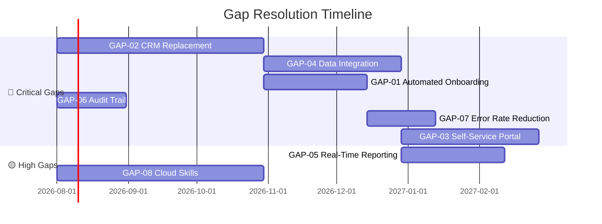
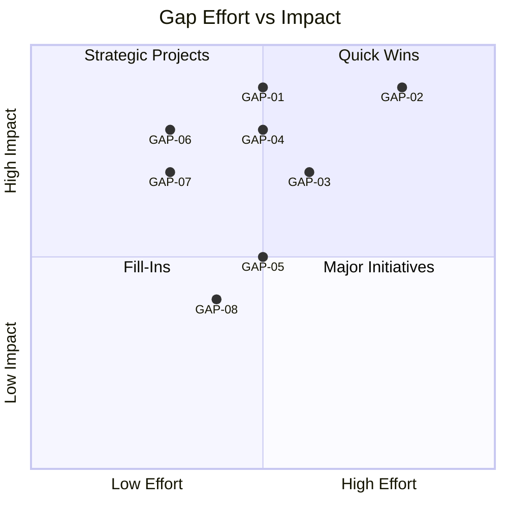
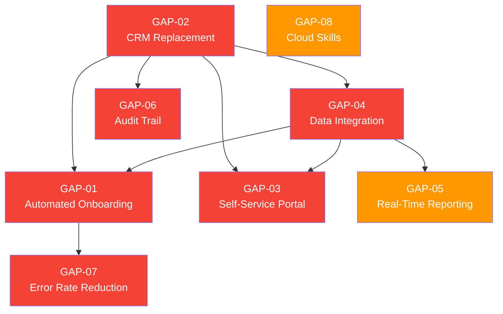

# Gap Analysis

> **Project:** [Project Name]
> **Version:** [X.Y] | **Status:** [Draft | Under Review | Approved | Archived]
> **Last Updated:** [YYYY-MM-DD]

---

## Document Control

| Field | Value |
|-------|-------|
| Document Owner | [Name / Role] |
| Business Analyst | [Name / Role] |
| Solution Architect | [Name / Role] |

### Revision History

| Version | Date | Author | Change Description |
|---------|------|--------|--------------------|
| 0.1 | [YYYY-MM-DD] | [Name] | Initial draft |
| 1.0 | [YYYY-MM-DD] | [Name] | Approved version |

### Approvals

| Role | Name | Signature | Date |
|------|------|-----------|------|
| Business Owner | | | |
| Solution Architect | | | |
| BA Lead | | | |

---

## Table of Contents

1. [Executive Summary](#1-executive-summary)
2. [Analysis Method](#2-analysis-method)
3. [Gap Register](#3-gap-register)
4. [Gap Detail Cards](#4-gap-detail-cards)
5. [Gap Prioritization](#5-gap-prioritization)
6. [Gap Resolution Map](#6-gap-resolution-map)
7. [Effort & Impact Matrix](#7-effort--impact-matrix)
8. [Dependencies Between Gaps](#8-dependencies-between-gaps)
9. [Summary](#9-summary)

---

## 1. Executive Summary

| Field | Detail |
|-------|--------|
| Total Gaps Identified | [X] |
| Critical Gaps | [X] — must resolve for go-live |
| High Gaps | [X] — should resolve for full benefit |
| Medium Gaps | [X] — resolve if resources permit |
| Low Gaps | [X] — defer to future phase |
| Source Documents | [[Current-State-Description]], [[Future-State-Description]] |

---

## 2. Analysis Method

### 2.1 Approach

> Gaps were identified by comparing the current state (as documented in [[Current-State-Description]]) against the future state (as documented in [[Future-State-Description]]) across six dimensions.

### 2.2 Analysis Dimensions

| Dimension | Current State Source | Future State Source |
|-----------|--------------------|--------------------|
| **Processes** | Section 4: Current Processes | Section 4: Future Processes |
| **Technology** | Section 5: Current Systems | Section 5: Future Systems |
| **Data** | Section 6: Current Data | Section 6: Future Data |
| **People & Skills** | Section 3: Org Structure | Section 9: Capability Requirements |
| **Performance** | Section 7: Current Metrics | Section 7: Target KPIs |
| **Compliance** | Section 10: External Environment | Section 5: Future Systems |

### 2.3 Gap Classification

| Type | Definition | Example |
|------|-----------|---------|
| **Capability Gap** | A capability that does not exist today but is needed | [No self-service portal] |
| **Performance Gap** | Current performance below target | [12-day onboarding vs 1-day target] |
| **Technology Gap** | Technology missing, outdated, or misaligned | [Legacy CRM, end-of-life] |
| **Data Gap** | Data missing, poor quality, or inaccessible | [No real-time data, siloed systems] |
| **Skills Gap** | Skills or knowledge not present in the team | [No cloud operations experience] |
| **Compliance Gap** | Regulatory or standards requirement not met | [No audit trail] |

---

## 3. Gap Register

| ID | Gap | Type | Current State | Future State | Severity | Priority | Resolution Approach |
|----|-----|------|--------------|-------------|----------|----------|-------------------|
| GAP-01 | [No automated onboarding] | Capability | [Manual, 12 days, 15 steps] | [Automated, 1 day, 3 steps] | 🔴 Critical | 🔴 Must Have | Automate |
| GAP-02 | [Legacy CRM] | Technology | [On-prem, unsupported, no API] | [Cloud CRM, API-enabled] | 🔴 Critical | 🔴 Must Have | Replace |
| GAP-03 | [No customer self-service] | Capability | [Phone/email only] | [Web portal + mobile] | 🟡 High | 🔴 Must Have | Build |
| GAP-04 | [Siloed data] | Data | [3 systems, no sync, duplicates] | [Integrated, single source of truth] | 🟡 High | 🔴 Must Have | Integrate |
| GAP-05 | [No real-time reporting] | Capability | [Weekly Excel reports] | [Live dashboards] | 🟡 High | 🟡 Should Have | Build |
| GAP-06 | [No audit trail] | Compliance | [No logging] | [Full audit logging] | 🔴 Critical | 🔴 Must Have | Build |
| GAP-07 | [8% error rate] | Performance | [Manual data entry errors] | [<1% error rate] | 🟡 High | 🔴 Must Have | Automate |
| GAP-08 | [No cloud skills] | Skills | [On-prem only experience] | [Cloud-native operations] | 🟢 Medium | 🟡 Should Have | Train |
| GAP-09 | | | | | | | |

---

## 4. Gap Detail Cards

> **Repeat this card for each critical/high gap.**

### GAP-01: [Gap Name]

| Field | Detail |
|-------|--------|
| **Gap Type** | [Capability / Performance / Technology / Data / Skills / Compliance] |
| **Current State** | [What exists today — specific, measurable] |
| **Future State** | [What needs to exist — specific, measurable] |
| **Gap Description** | [What is missing or inadequate] |
| **Severity** | 🔴 Critical / 🟡 High / 🟢 Medium |
| **Impact if Not Resolved** | [Business consequence — cost, risk, lost opportunity] |
| **Resolution Approach** | [Build / Buy / Automate / Integrate / Train / Process Change] |
| **Estimated Effort** | [X weeks, Y FTEs] |
| **Estimated Cost** | $[X] |
| **Dependencies** | [Other gaps that must resolve first] |
| **Related Requirements** | [BR-XX, NFR-XX] |
| **Related Objectives** | [OBJ-XX] |

---

## 5. Gap Prioritization

### 5.1 Prioritization Criteria

| Criterion | Weight | Description |
|-----------|--------|-------------|
| Business Impact | 30% | Revenue, cost, compliance impact if gap persists |
| Risk Severity | 25% | Security, operational, regulatory risk |
| Dependency | 20% | Other gaps or deliverables blocked by this gap |
| Effort | 15% | Time and cost to close the gap |
| Strategic Alignment | 10% | How directly it supports strategic objectives |

### 5.2 Priority Scoring

| ID | Gap | Business Impact (30%) | Risk (25%) | Dependency (20%) | Effort (15%) | Strategy (10%) | Score | Priority |
|----|-----|---------------------|-----------|-----------------|-------------|---------------|-------|----------|
| GAP-01 | Automated Onboarding | 5 | 4 | 5 | 3 | 5 | **4.4** | 🔴 |
| GAP-02 | CRM Replacement | 5 | 4 | 5 | 2 | 4 | **4.2** | 🔴 |
| GAP-03 | Self-Service Portal | 4 | 3 | 3 | 3 | 4 | **3.5** | 🔴 |
| GAP-04 | Data Integration | 4 | 4 | 5 | 3 | 3 | **4.0** | 🔴 |
| GAP-05 | Real-Time Reporting | 3 | 2 | 2 | 3 | 3 | **2.6** | 🟡 |
| GAP-06 | Audit Trail | 4 | 5 | 3 | 3 | 3 | **3.8** | 🔴 |
| GAP-07 | Error Rate Reduction | 4 | 3 | 4 | 3 | 4 | **3.7** | 🔴 |
| GAP-08 | Cloud Skills | 2 | 2 | 3 | 4 | 3 | **2.6** | 🟡 |

### 5.3 Priority Distribution

| Priority | Count | Gaps |
|----------|-------|------|
| 🔴 Must Have | [6] | GAP-01, GAP-02, GAP-03, GAP-04, GAP-06, GAP-07 |
| 🟡 Should Have | [2] | GAP-05, GAP-08 |
| 🟢 Could Have | [0] | — |
| **Total** | **[8]** | |

---

## 6. Gap Resolution Map

### 6.1 Resolution by Approach

| Approach | Gaps | Description |
|----------|------|-------------|
| 🆕 **Build** | GAP-03, GAP-05, GAP-06 | [Create new capability from scratch] |
| 🔄 **Replace** | GAP-02 | [Replace legacy system with modern solution] |
| ⚡ **Automate** | GAP-01, GAP-07 | [Automate manual processes] |
| 🔗 **Integrate** | GAP-04 | [Connect existing systems] |
| 📚 **Train** | GAP-08 | [Upskill existing team] |

### 6.2 Resolution Timeline

### 6.3 Gap-to-Deliverable Mapping

| Gap | Resolution | Deliverable | Phase |
|-----|-----------|------------|-------|
| GAP-01 | Automate | D-04 Automated Onboarding Process | Phase 1 |
| GAP-02 | Replace | D-01 Cloud CRM Platform | Phase 1 |
| GAP-03 | Build | D-03 Customer Self-Service Portal | Phase 2 |
| GAP-04 | Integrate | D-02 API Integration Layer | Phase 1 |
| GAP-05 | Build | D-08 Real-Time Dashboard | Phase 3 |
| GAP-06 | Build | D-01 (embedded in CRM) | Phase 1 |
| GAP-07 | Automate | D-04 (embedded in onboarding) | Phase 1 |
| GAP-08 | Train | D-06 Training Materials | Phase 1 |

---

## 7. Effort & Impact Matrix

### 7.1 Matrix

| | Low Effort | Medium Effort | High Effort |
|---|-----------|--------------|------------|
| **High Impact** | 🟢 Quick Wins GAP-06, GAP-07 | 🟡 Strategic Projects GAP-01, GAP-04 | 🔴 Major Initiatives GAP-02 |
| **Medium Impact** | 🟢 Quick Wins GAP-08 | 🟡 Strategic Projects GAP-03, GAP-05 | 🔴 Major Initiatives |
| **Low Impact** | 🟢 Fill-Ins | 🟡 Strategic Projects | 🔴 Avoid |

### 7.2 Effort vs Impact Chart

---

## 8. Dependencies Between Gaps

### 8.1 Dependency Matrix

| Gap | Depends On | Blocks | Relationship |
|-----|-----------|--------|-------------|
| GAP-01 | GAP-02 | — | [Onboarding automation requires CRM] |
| GAP-03 | GAP-02, GAP-04 | — | [Portal needs CRM + integrated data] |
| GAP-04 | GAP-02 | GAP-01, GAP-03 | [Integration needs CRM first] |
| GAP-05 | GAP-04 | — | [Reporting needs integrated data] |
| GAP-06 | GAP-02 | — | [Audit trail built into new CRM] |
| GAP-07 | GAP-01 | — | [Error reduction via automation] |
| GAP-08 | — | — | [Independent — can run in parallel] |

### 8.2 Dependency Diagram

> **Critical Path:** GAP-02 → GAP-04 → GAP-01 → GAP-07 (CRM must be replaced first)

---

## 9. Summary

### Gap Analysis Summary

| Metric | Count |
|--------|-------|
| Total Gaps | [8] |
| 🔴 Critical | [6] |
| 🟡 High | [2] |
| 🟢 Medium | [0] |
| Quick Wins (High Impact, Low Effort) | [3] — GAP-06, GAP-07, GAP-08 |
| Critical Path Items | [1] — GAP-02 (CRM Replacement) |
| Estimated Total Effort | [X person-months] |
| Estimated Total Cost | $[X] |

### Key Insights

1. **[e.g., CRM is the foundation]** — [GAP-02 blocks 5 other gaps; must be prioritized]
2. **[e.g., Quick wins available]** — [GAP-06 and GAP-07 can deliver value early with low effort]
3. **[e.g., Data integration is critical]** — [GAP-04 enables multiple downstream capabilities]
4. **[e.g., People matter as much as technology]** — [GAP-08 skills gap must be addressed for sustainability]

---

## Related Documents

| Document | Relationship |
|----------|-------------|
| [[Current-State-Description]] | Source of "current state" data |
| [[Future-State-Description]] | Source of "future state" data |
| [[Business-Requirements]] | Requirements address identified gaps |
| [[Solution-Scope]] | Scope defines which gaps will be resolved |
| [[Change-Strategy]] | Strategy defines how gaps will be closed |
| [[Business-Objectives]] | Gaps map to objectives being achieved |
| [[Risk-Analysis-Results]] | Unresolved gaps become risks |

---

> **Template Standard:** Based on BABOK v3 (Strategy Analysis), PMBOK v8 (Scope Baseline), ISO/IEC/IEEE 15288
> **Usage:** This document bridges [[Current-State-Description]] and [[Future-State-Description]]. Every gap should trace to a business requirement and a deliverable. If a gap has no owner or resolution, it's a risk.
