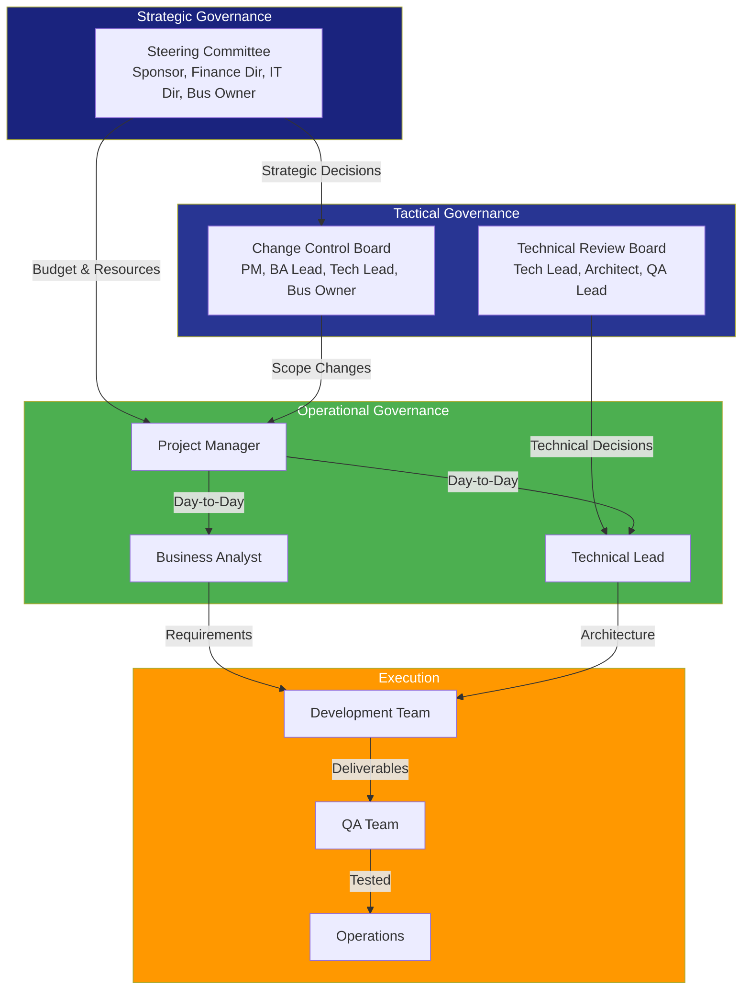
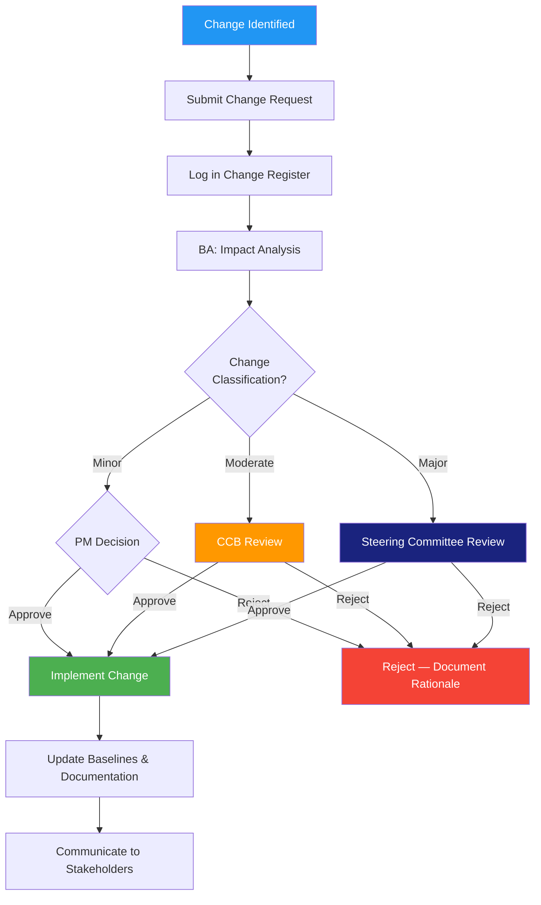
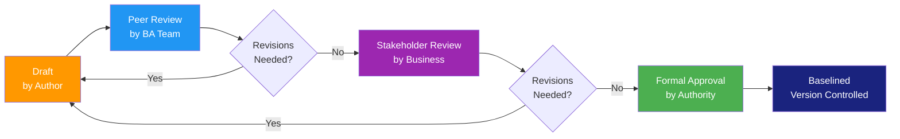
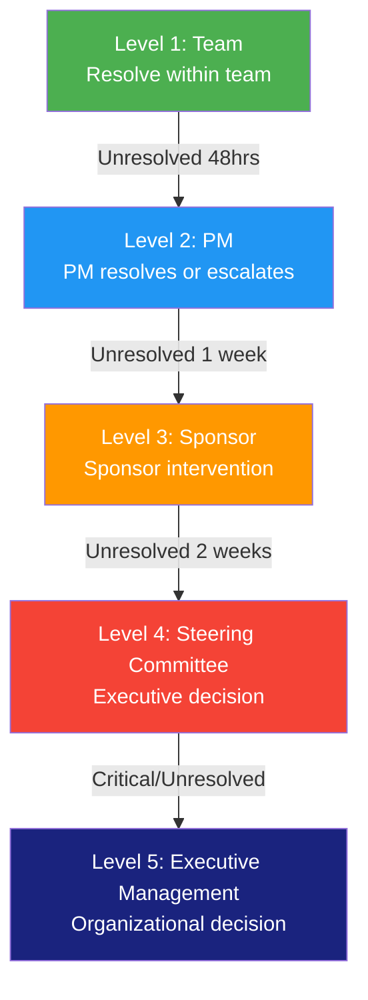

# Governance Approach

> **Project:** [Project Name]
> **Version:** [X.Y] | **Status:** [Draft | Under Review | Approved | Archived]
> **Last Updated:** [YYYY-MM-DD]

---

## Document Control

| Field | Value |
|-------|-------|
| Document Owner | [Name / Role] |
| Project Manager | [Name / Role] |
| Business Analyst | [Name / Role] |
| Sponsor | [Name / Role] |

### Revision History

| Version | Date | Author | Change Description |
|---------|------|--------|--------------------|
| 0.1 | [YYYY-MM-DD] | [Name] | Initial draft |
| 1.0 | [YYYY-MM-DD] | [Name] | Approved version |

### Approvals

| Role | Name | Signature | Date |
|------|------|-----------|------|
| Project Sponsor | | | |
| Project Manager | | | |
| BA Lead | | | |
| Steering Committee Chair | | | |

---

## Table of Contents

1. [Executive Summary](#1-executive-summary)
2. [Governance Structure](#2-governance-structure)
3. [Decision Authority](#3-decision-authority)
4. [Steering Committee](#4-steering-committee)
5. [Change Control](#5-change-control)
6. [Approval Process](#6-approval-process)
7. [Escalation Framework](#7-escalation-framework)
8. [Reporting & Communication](#8-reporting--communication)
9. [Compliance & Audit](#9-compliance--audit)
10. [Roles & Responsibilities](#10-roles--responsibilities)

---

## 1. Executive Summary

| Field | Detail |
|-------|--------|
| Governance Model | [e.g., Hierarchical with Steering Committee] |
| Decision-Making Style | [e.g., Consensus for strategy, delegated for operations] |
| Key Governance Bodies | [Steering Committee, Change Control Board, Technical Review Board] |
| Meeting Cadence | [Weekly standup, Monthly steering, Quarterly review] |
| Escalation Levels | [4 levels — Team → PM → Sponsor → Steering Committee] |

---

## 2. Governance Structure

### 2.1 Governance Model

### 2.2 Governance Bodies

| Body | Purpose | Chair | Members | Frequency |
|------|---------|-------|---------|-----------|
| **Steering Committee** | Strategic direction, funding, major decisions | [Sponsor] | [Sponsor, Finance Dir, IT Dir, Bus Owner] | Monthly |
| **Change Control Board (CCB)** | Scope change approval, baseline management | [PM] | [PM, BA Lead, Tech Lead, Bus Owner] | Bi-weekly |
| **Technical Review Board (TRB)** | Architecture decisions, technical standards | [Tech Lead] | [Tech Lead, Architect, QA Lead, Security] | As needed |
| **Project Team** | Day-to-day delivery, issue resolution | [PM] | [PM, BA, Dev, QA, Ops] | Daily/Weekly |

---

## 3. Decision Authority

### 3.1 Decision Authority Matrix (RACI)

| Decision | Steering Committee | CCB | PM | BA Lead | Tech Lead |
|----------|-------------------|-----|-----|---------|-----------|
| Project charter approval | **A** | C | R | C | I |
| Budget allocation | **A** | I | R | I | I |
| Scope baseline approval | **A** | R | R | R | C |
| Major scope change (>10%) | **A** | R | R | R | C |
| Minor scope change (<10%) | I | **A** | R | R | C |
| Requirements approval | I | C | C | **A** | C |
| Architecture decision | I | C | I | C | **A** |
| Go/No-Go (phase gate) | **A** | C | R | R | R |
| Go/No-Go (go-live) | **A** | C | R | R | R |
| Vendor selection | **A** | C | R | I | C |
| Resource allocation | C | I | **A** | C | C |
| Risk acceptance (critical) | **A** | C | R | C | C |
| Risk mitigation (medium) | I | C | **A** | C | C |

> **R** = Responsible | **A** = Accountable | **C** = Consulted | **I** = Informed

### 3.2 Decision Types

| Type | Definition | Authority | Timeline | Documentation |
|------|-----------|----------|----------|--------------|
| **Strategic** | Affects project viability, funding, or direction | Steering Committee | [Within 2 weeks] | [Decision record, minutes] |
| **Tactical** | Affects scope, schedule, or budget within baselines | CCB / PM | [Within 1 week] | [Change request, decision log] |
| **Operational** | Day-to-day project decisions | PM / BA / Tech Lead | [Within 48 hours] | [Action item, Slack/email] |
| **Technical** | Architecture, design, technology choices | Tech Lead / TRB | [Within 1 week] | [ADR, design doc] |
| **Requirements** | Requirements clarification, prioritization | BA Lead / PO | [Within 48 hours] | [Requirements update, backlog] |

---

## 4. Steering Committee

### 4.1 Charter

| Field | Detail |
|-------|--------|
| Purpose | [Provide strategic direction, resolve escalations, approve major decisions] |
| Authority | [Approve/reject scope changes >10%, budget variances >15%, go/no-go decisions] |
| Accountability | [Project success, benefits realization, organizational alignment] |
| Meeting Frequency | [Monthly — first Thursday, 10:00 AM] |
| Quorum | [3 of 5 members including Sponsor] |

### 4.2 Members

| Role | Name | Responsibility | Voting Rights |
|------|------|---------------|--------------|
| Chair / Sponsor | [Name] | [Final decision authority, escalation point] | ✅ Yes |
| Finance Director | [Name] | [Budget oversight, financial viability] | ✅ Yes |
| IT Director | [Name] | [Technical feasibility, resource allocation] | ✅ Yes |
| Business Owner | [Name] | [Business requirements, acceptance] | ✅ Yes |
| PM (Secretary) | [Name] | [Agenda, minutes, status reporting] | ❌ No (advisory) |
| BA Lead (Advisor) | [Name] | [Requirements status, stakeholder input] | ❌ No (advisory) |

### 4.3 Meeting Format

| Item | Duration | Description |
|------|----------|-------------|
| Status Update | 15 min | [PM presents dashboard — schedule, budget, risks] |
| Decision Items | 20 min | [Formal decisions requiring committee approval] |
| Escalations | 15 min | [Issues escalated from PM/CCB] |
| Strategic Discussion | 10 min | [Market changes, organizational priorities] |
| **Total** | **60 min** | |

### 4.4 Decision-Making Rules

| Rule | Description |
|------|-------------|
| **Consensus** | Preferred — all voting members agree |
| **Majority** | If consensus not reached — 3 of 5 voting members |
| **Sponsor Override** | Sponsor has tie-breaking authority |
| **Absent Members** | May submit written vote in advance |
| **Emergency Decisions** | Sponsor may decide unilaterally — ratified at next meeting |

---

## 5. Change Control

### 5.1 Change Control Process

### 5.2 Change Classification

| Level | Criteria | Authority | Timeline | Examples |
|-------|---------|----------|----------|---------|
| **Minor** | Clarification, no cost/schedule/quality impact | PM | [Same day] | [Requirement wording clarification] |
| **Moderate** | <10% budget impact, <2 weeks schedule impact | CCB | [Within 1 week] | [Feature addition/removal, priority change] |
| **Major** | >10% budget impact, >2 weeks schedule impact, or baseline change | Steering Committee | [Within 2 weeks] | [Scope expansion, technology change, timeline extension] |
| **Emergency** | Critical issue requiring immediate action | Sponsor (ratified later) | [Immediate] | [Security patch, regulatory mandate] |

### 5.3 Change Register

| CR ID | Date | Requestor | Description | Classification | Impact | Decision | Date | Authority |
|-------|------|-----------|-------------|---------------|--------|----------|------|-----------|
| CR-001 | [YYYY-MM-DD] | [Name] | [Description] | [Minor/Moderate/Major] | [Scope/Schedule/Cost] | [Approved/Rejected/Deferred] | [YYYY-MM-DD] | [PM/CCB/Steering] |
| | | | | | | | | |

---

## 6. Approval Process

### 6.1 Document Approval Workflow

### 6.2 Document Approval Matrix

| Document | Author | Reviewer | Approver | Baseline Required |
|----------|--------|----------|----------|------------------|
| Business Case | BA | BA Lead, Finance | Sponsor | ✅ Yes |
| Business Requirements | BA | BA Lead, SMEs | Business Owner | ✅ Yes |
| SRS | BA | BA Lead, Tech Lead, QA | Business Owner + Tech Lead | ✅ Yes |
| Architecture Document | Architect | Tech Lead, TRB | Steering Committee | ✅ Yes |
| Test Plan | QA Lead | BA, Tech Lead | PM | ✅ Yes |
| Change Request | Requestor | BA (impact analysis) | PM / CCB / Steering | ❌ No (logged) |
| Meeting Minutes | BA | Participants | PM | ❌ No (filed) |

### 6.3 Approval Criteria

| Criterion | Description |
|-----------|-------------|
| **Completeness** | [All sections addressed, no placeholders in approved version] |
| **Accuracy** | [Information verified by subject matter experts] |
| **Consistency** | [No conflicts with other approved documents] |
| **Traceability** | [Requirements traced to objectives and tests] |
| **Feasibility** | [Technical and financial feasibility confirmed] |
| **Stakeholder Agreement** | [All impacted stakeholders consulted] |

---

## 7. Escalation Framework

### 7.1 Escalation Levels

### 7.2 Escalation Triggers

| Trigger | Escalation Level | Response Time | Example |
|---------|-----------------|---------------|---------|
| Requirements clarification | Level 1 | [24 hours] | [Ambiguous requirement] |
| Resource conflict | Level 2 | [48 hours] | [SME unavailable] |
| Scope dispute | Level 3 | [1 week] | [Stakeholder disagreement] |
| Budget overrun >15% | Level 4 | [Within 2 weeks] | [Cost increase] |
| Schedule delay >1 month | Level 4 | [Within 2 weeks] | [Critical path impact] |
| Critical risk realized | Level 4 | [Within 48 hours] | [Major blocker] |
| Regulatory issue | Level 5 | [Immediate] | [Compliance finding] |

### 7.3 Escalation Template

| Field | Content |
|-------|---------|
| **Escalation ID** | [ESC-XXX] |
| **Date** | [YYYY-MM-DD] |
| **Escalated By** | [Name / Role] |
| **Escalated To** | [Name / Role / Body] |
| **Issue Description** | [Clear, factual description] |
| **Impact** | [What is affected — scope, schedule, cost, quality] |
| **Options Considered** | [What was tried or proposed] |
| **Recommendation** | [Preferred resolution] |
| **Decision Needed By** | [Date] |
| **Decision** | [Recorded decision] |

---

## 8. Reporting & Communication

### 8.1 Reporting Cadence

| Report | Audience | Frequency | Owner | Format |
|--------|----------|-----------|-------|--------|
| **Daily Standup** | Project Team | Daily | PM | [15-min verbal] |
| **Weekly Status** | PM, Sponsor | Weekly | PM | [Email + dashboard] |
| **Monthly Steering** | Steering Committee | Monthly | PM | [Presentation + dashboard] |
| **Phase Gate Report** | Steering Committee | Per phase | PM | [Formal report] |
| **Risk Report** | Sponsor, Steering | Bi-weekly | PM | [Risk register snapshot] |
| **Requirements Status** | BA, PM, PO | Weekly | BA | [Backlog dashboard] |

### 8.2 Status Dashboard Metrics

| Category | Metric | Target | Reporting |
|----------|--------|--------|-----------|
| **Schedule** | [% complete vs plan] | [On track] | 🟢🟡🔴 |
| **Budget** | [Actual vs baseline] | [Within 10%] | 🟢🟡🔴 |
| **Scope** | [Requirements completed / total] | [On track] | 🟢🟡🔴 |
| **Quality** | [Defect density] | [<X per feature] | 🟢🟡🔴 |
| **Risks** | [Open critical/high risks] | [Decreasing] | 🟢🟡🔴 |
| **Stakeholder** | [Engagement score] | [≥4/5] | 🟢🟡🔴 |

---

## 9. Compliance & Audit

### 9.1 Compliance Requirements

| Requirement | Standard | Evidence | Frequency |
|------------|---------|----------|-----------|
| [e.g., Requirements traceability] | [ISO/IEC/IEEE 29148] | [RTM] | [Continuous] |
| [e.g., Change control] | [ISO 9001] | [Change register] | [Per change] |
| [e.g., Review records] | [ISO/IEC 20246] | [Review minutes] | [Per review] |
| [e.g., Decision documentation] | [ISO 9001] | [Decision log] | [Per decision] |
| [e.g., Version control] | [ISO 9001] | [Version history] | [Continuous] |

### 9.2 Audit Trail Requirements

| Artifact | Retention | Storage | Access |
|----------|-----------|---------|--------|
| [Approved documents] | [Project + 7 years] | [Document management system] | [All stakeholders] |
| [Change requests] | [Project + 7 years] | [Change register] | [PM, BA, CCB] |
| [Decision records] | [Project + 7 years] | [Decision log] | [PM, Steering Committee] |
| [Meeting minutes] | [Project + 3 years] | [Project repository] | [All stakeholders] |
| [Email communications] | [Project + 3 years] | [Email archive] | [PM, BA] |

---

## 10. Roles & Responsibilities

### 10.1 Governance Roles

| Role | Governance Responsibility | Authority Level |
|------|--------------------------|----------------|
| **Steering Committee Chair (Sponsor)** | Final decision authority, escalation point | Strategic |
| **Steering Committee Members** | Strategic direction, funding approval | Strategic |
| **Project Manager** | Day-to-day governance, change control, reporting | Tactical |
| **Business Analyst** | Requirements governance, stakeholder coordination | Operational |
| **Technical Lead** | Technical governance, architecture decisions | Technical |
| **Change Control Board** | Scope change approval, baseline management | Tactical |
| **Quality Assurance** | Quality governance, compliance verification | Operational |

### 10.2 Governance Principles

| # | Principle | Description |
|---|----------|-------------|
| 1 | **Transparency** | [All decisions documented and communicated] |
| 2 | **Accountability** | [Clear ownership for every decision and deliverable] |
| 3 | **Proportionality** | [Governance overhead proportional to risk and impact] |
| 4 | **Traceability** | [Every decision traces to a rationale and authority] |
| 5 | **Timeliness** | [Decisions made within defined timelines] |
| 6 | **Consistency** | [Same process applied regardless of who requests] |

---

## Related Documents

| Document | Relationship |
|----------|-------------|
| [[Business Analysis Approach]] | BA methodology this governance supports |
| [[Stakeholder Engagement Approach]] | Stakeholder management within governance |
| [[Information Management Approach]] | How governance artifacts are stored |
| [[Change Management Plan]] | Detailed change control procedures |
| [[Communications Management Plan]] | Reporting and communication details |
| [[Risk Management Plan]] | Risk governance and escalation |
| [[Project Charter]] | Governance authority source |

---

> **Template Standard:** Based on BABOK v3 (BA Planning & Monitoring), PMBOK v8 (Governance), ISO 9001
> **Usage:** This document defines *how decisions are made* — not what the decisions are. It should be established at project start and referenced whenever a decision, change, or escalation occurs.
