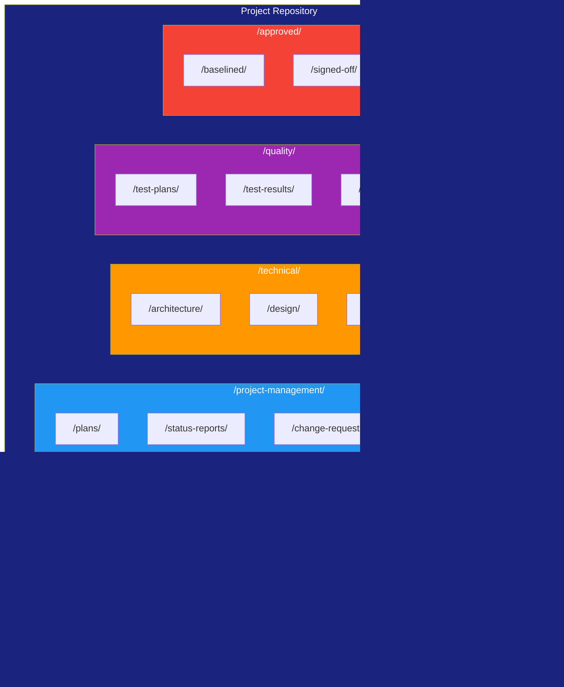
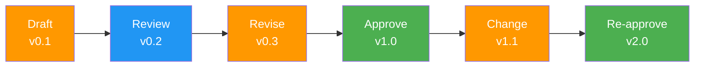
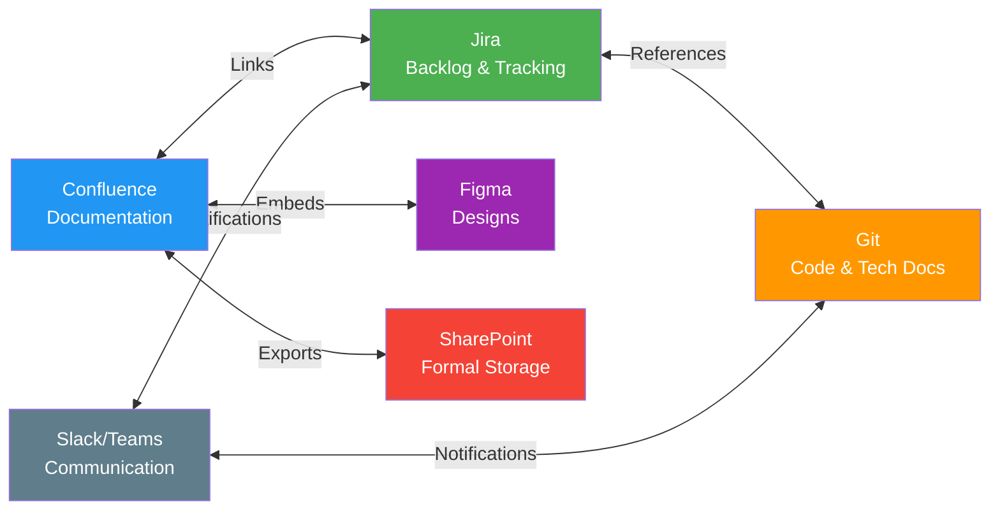

# Information Management Approach

> **Project:** [Project Name]
> **Version:** [X.Y] | **Status:** [Draft | Under Review | Approved | Archived]
> **Last Updated:** [YYYY-MM-DD]

---

## Document Control

| Field | Value |
|-------|-------|
| Document Owner | [Name / Role] |
| Business Analyst | [Name / Role] |
| Project Manager | [Name / Role] |

### Revision History

| Version | Date | Author | Change Description |
|---------|------|--------|--------------------|
| 0.1 | [YYYY-MM-DD] | [Name] | Initial draft |
| 1.0 | [YYYY-MM-DD] | [Name] | Approved version |

### Approvals

| Role | Name | Signature | Date |
|------|------|-----------|------|
| Project Manager | | | |
| BA Lead | | | |
| IT / Security | | | |

---

## Table of Contents

1. [Executive Summary](#1-executive-summary)
2. [Information Classification](#2-information-classification)
3. [Storage & Repository Structure](#3-storage--repository-structure)
4. [Access Control](#4-access-control)
5. [Document Standards](#5-document-standards)
6. [Version Control](#6-version-control)
7. [Knowledge Sharing](#7-knowledge-sharing)
8. [Retention & Archival](#8-retention--archival)
9. [Tools & Platforms](#9-tools--platforms)

---

## 1. Executive Summary

| Field | Detail |
|-------|--------|
| Repository Platform | [e.g., Confluence + Git + SharePoint] |
| Document Format | [Markdown (.md) — primary; PDF for formal approvals] |
| Naming Convention | [e.g., `[ProjectID]_[DocType]_[Name]_v[X.Y]`] |
| Access Model | [e.g., Role-based — view/edit per stakeholder group] |
| Retention Period | [Project + 7 years for formal artifacts] |

---

## 2. Information Classification

### 2.1 Classification Levels

| Level | Label | Description | Handling Rules |
|-------|-------|-------------|---------------|
| 4 | 🔴 **Restricted** | [Sensitive business data, PII, financial details] | [Encrypted, need-to-know, no external sharing, audit trail] |
| 3 | 🟠 **Confidential** | [Internal strategy, draft requirements, risk assessments] | [Internal only, NDA if shared externally, access logged] |
| 2 | 🟡 **Internal** | [Project plans, meeting notes, status reports] | [Internal only, no external sharing without approval] |
| 1 | 🟢 **Public** | [Published documentation, training materials] | [No restrictions] |

### 2.2 Document Classification Matrix

| Document Type | Classification | Rationale |
|--------------|---------------|-----------|
| [Business Case] | 🟠 Confidential | [Contains financial projections, strategy] |
| [Business Requirements] | 🟠 Confidential | [Internal business needs] |
| [SRS] | 🟡 Internal | [Technical requirements] |
| [Meeting Minutes] | 🟡 Internal | [Internal decisions] |
| [Status Reports] | 🟡 Internal | [Project progress] |
| [Risk Register] | 🟠 Confidential | [Business risks] |
| [Architecture Documents] | 🟡 Internal | [Technical design] |
| [Training Materials] | 🟢 Public | [End-user guidance] |
| [Customer Data Samples] | 🔴 Restricted | [PII — GDPR/privacy] |
| [Financial Models] | 🟠 Confidential | [Budget, ROI] |

---

## 3. Storage & Repository Structure

### 3.1 Repository Architecture



### 3.2 Folder Structure

| Folder | Purpose | Owner | Retention |
|--------|---------|-------|-----------|
| `/business-analysis/requirements/` | [All requirements documents] | [BA] | [Project + 7 years] |
| `/business-analysis/current-state/` | [As-is analysis artifacts] | [BA] | [Project + 3 years] |
| `/business-analysis/stakeholder/` | [Stakeholder registers, engagement plans] | [BA] | [Project + 3 years] |
| `/business-analysis/meeting-notes/` | [Workshop and meeting minutes] | [BA] | [Project + 3 years] |
| `/project-management/plans/` | [Project plan, subsidiary plans] | [PM] | [Project + 7 years] |
| `/project-management/status-reports/` | [Weekly/monthly status] | [PM] | [Project + 3 years] |
| `/project-management/change-requests/` | [CR forms and decisions] | [PM] | [Project + 7 years] |
| `/project-management/risk-register/` | [Risk register and analysis] | [PM] | [Project + 7 years] |
| `/technical/architecture/` | [SAD, ADRs, views] | [Architect] | [Project + 7 years] |
| `/technical/design/` | [HLD, LLD, diagrams] | [Tech Lead] | [Project + 7 years] |
| `/technical/api-specs/` | [OpenAPI, contracts] | [Tech Lead] | [Project + 7 years] |
| `/quality/test-plans/` | [Test strategy, plans] | [QA Lead] | [Project + 7 years] |
| `/quality/test-results/` | [Test reports, defect logs] | [QA Lead] | [Project + 7 years] |
| `/approved/baselined/` | [Signed-off baseline versions] | [PM] | [Project + 7 years] |
| `/approved/signed-off/` | [Formal sign-off records] | [PM] | [Project + 7 years] |

---

## 4. Access Control

### 4.1 Role-Based Access Matrix

| Folder | BA | PM | Dev Team | QA | Sponsor | External Vendor |
|--------|-----|-----|---------|-----|---------|----------------|
| `/business-analysis/` | ✅ Edit | ✅ View | ✅ View | ✅ View | ✅ View | ❌ None |
| `/project-management/` | ✅ View | ✅ Edit | ✅ View | ✅ View | ✅ View | ❌ None |
| `/technical/` | ✅ View | ✅ View | ✅ Edit | ✅ View | ✅ View | ⚠️ Limited |
| `/quality/` | ✅ View | ✅ View | ✅ View | ✅ Edit | ✅ View | ❌ None |
| `/approved/` | ✅ View | ✅ Edit | ✅ View | ✅ View | ✅ View | ❌ None |
| [Customer data samples] | ⚠️ Masked | ❌ None | ⚠️ Masked | ⚠️ Masked | ❌ None | ❌ None |

### 4.2 Access Management

| Action | Authority | Process |
|--------|----------|---------|
| Grant access | [PM or BA Lead] | [Request → Approval → Provision] |
| Revoke access | [PM] | [On role change or project exit] |
| External access | [PM + Sponsor] | [NDA signed → Limited scope → Time-limited] |
| Restricted data access | [Sponsor + Data Owner] | [Justification → Approval → Audit trail] |

---

## 5. Document Standards

### 5.1 Naming Convention

```
[ProjectID]_[DocType]_[DocumentName]_v[Major.Minor].[ext]
```

| Component | Format | Example |
|-----------|--------|---------|
| Project ID | [Short code] | `PROJ001` |
| Doc Type | [3-5 letter code] | `BR`, `SRS`, `ADR`, `MIN`, `CR` |
| Document Name | [Descriptive, hyphenated] | `Business-Requirements` |
| Version | `v[Major.Minor]` | `v1.0`, `v0.3` |
| Extension | `.md`, `.pdf` | `.md` |

**Examples:**
- `PROJ001_BR_Business-Requirements_v1.0.md`
- `PROJ001_SRS_Software-Requirements_v2.1.md`
- `PROJ001_MIN_Workshop-2026-08-15_v1.0.md`
- `PROJ001_CR_Change-Request-003_v1.0.md`

### 5.2 Document Type Codes

| Code | Document Type | Code | Document Type |
|------|-------------|------|-------------|
| BR | Business Requirements | SRS | Software Requirements Specification |
| BC | Business Case | ADR | Architecture Decision Record |
| CS | Current State | FS | Future State |
| GA | Gap Analysis | PV | Potential Value |
| RA | Risk Analysis | RM | Risk Register |
| SA | Solution Scope | CS | Change Strategy |
| MIN | Meeting Minutes | CR | Change Request |
| SR | Status Report | TP | Test Plan |
| TR | Test Report | DR | Design Review |

### 5.3 Document Template Standards

| Element | Standard |
|---------|---------|
| **Format** | [Markdown (.md) — primary format] |
| **Frontmatter** | [YAML metadata — doc_type, version, status, author, dates, tags] |
| **Sections** | [Numbered headings, consistent across document types] |
| **Tables** | [Standard headers per document type] |
| **Diagrams** | [Mermaid for flowcharts, sequences, Gantt; draw.io for complex architecture] |
| **Placeholders** | `[Square brackets]` for fill-in values |
| **Status** | [Draft | Under Review | Approved | Archived] |
| **Approvals** | [Table with role, name, signature, date] |

---

## 6. Version Control

### 6.1 Version Numbering

| Type | When | Example |
|------|------|---------|
| **Major** (X.0) | Approved/baselined version | v1.0, v2.0 |
| **Minor** (0.X) | Draft revisions, corrections | v0.1, v0.2, v0.3 |
| **Patch** (X.Y.Z) | Typo/formatting fixes only | v1.0.1 |

### 6.2 Version Control Workflow



### 6.3 Version History Table

> Every document includes this table in the Document Control section.

| Version | Date | Author | Change Description | Status |
|---------|------|--------|--------------------|--------|
| 0.1 | [YYYY-MM-DD] | [Name] | Initial draft | Draft |
| 0.2 | [YYYY-MM-DD] | [Name] | Incorporated peer review feedback | Draft |
| 1.0 | [YYYY-MM-DD] | [Name] | Approved and baselined | Approved |
| 1.1 | [YYYY-MM-DD] | [Name] | CR-005: Updated section 4.2 | Approved |

---

## 7. Knowledge Sharing

### 7.1 Knowledge Sharing Channels

| Channel | Purpose | Audience | Frequency |
|---------|---------|----------|-----------|
| [Confluence Wiki] | [Central knowledge base] | [All stakeholders] | [Continuous] |
| [Slack/Teams Channel] | [Quick questions, discussions] | [Project team] | [Daily] |
| [Weekly Newsletter] | [Progress summary, key decisions] | [All stakeholders] | [Weekly] |
| [Knowledge Sessions] | [Deep-dive on specific topics] | [Relevant stakeholders] | [Bi-weekly] |
| [Lessons Learned Register] | [Captured insights and improvements] | [Project team] | [Ongoing] |

### 7.2 Knowledge Capture Plan

| Knowledge Type | Capture Method | Owner | Storage |
|---------------|---------------|-------|---------|
| [Requirements decisions] | [Decision log in requirements doc] | [BA] | [Confluence] |
| [Architecture decisions] | [ADR documents] | [Architect] | [Git repo] |
| [Process knowledge] | [Process maps, SOPs] | [BA] | [Confluence] |
| [Technical knowledge] | [README, runbooks, ADRs] | [Dev team] | [Git repo] |
| [Lessons learned] | [Lessons learned register] | [PM] | [Confluence] |
| [Stakeholder insights] | [Meeting notes, interview summaries] | [BA] | [Confluence] |

---

## 8. Retention & Archival

### 8.1 Retention Schedule

| Document Category | Retention Period | Disposal Method | Legal Basis |
|------------------|-----------------|----------------|-------------|
| [Formal deliverables (approved)] | [Project + 7 years] | [Secure deletion after archival] | [Contractual, regulatory] |
| [Working drafts] | [Project + 1 year] | [Secure deletion] | [Internal policy] |
| [Meeting minutes] | [Project + 3 years] | [Secure deletion] | [Internal policy] |
| [Status reports] | [Project + 3 years] | [Secure deletion] | [Internal policy] |
| [Financial records] | [Project + 7 years] | [Secure deletion] | [Tax/regulatory] |
| [Customer data] | [As per data policy] | [Anonymize or delete] | [GDPR/privacy] |

### 8.2 Archival Process

| Step | Activity | Owner | Timing |
|------|----------|-------|--------|
| 1 | [Identify documents for archival] | [PM] | [Project closure] |
| 2 | [Verify all versions are final] | [BA] | [Project closure] |
| 3 | [Archive to long-term storage] | [IT] | [Within 30 days of closure] |
| 4 | [Update metadata and index] | [PM] | [Within 30 days of closure] |
| 5 | [Remove from active repositories] | [IT] | [After archive confirmed] |
| 6 | [Schedule disposal date] | [PM] | [Per retention schedule] |

---

## 9. Tools & Platforms

### 9.1 Tool Stack

| Tool | Purpose | Access | License |
|------|---------|--------|---------|
| [Confluence] | [Wiki, documentation, knowledge base] | [All stakeholders] | [Enterprise] |
| [Git (GitHub/GitLab)] | [Version control, code, technical docs] | [Dev team, BA] | [Enterprise] |
| [Jira] | [Backlog, requirements, change requests] | [Project team] | [Enterprise] |
| [SharePoint] | [Document storage, formal approvals] | [All stakeholders] | [M365] |
| [Figma] | [Wireframes, prototypes, design] | [BA, Designers, Users] | [Team] |
| [Slack/Teams] | [Communication, quick questions] | [Project team] | [Enterprise] |
| [Draw.io] | [Architecture diagrams, complex flows] | [BA, Architects] | [Free/Enterprise] |

### 9.2 Tool Integration



---

## Related Documents

| Document | Relationship |
|----------|-------------|
| [[Governance Approach]] | Governance defines authority; this defines how information is managed |
| [[Business Analysis Approach]] | BA methodology references this for artifact storage |
| [[Configuration Management Plan]] | CM handles version control at project level |
| [[Communications Management Plan]] | Communication channels and cadence |
| [[Data Retention Policy]] | Organizational retention requirements |

---

> **Template Standard:** Based on BABOK v3 (BA Planning & Monitoring), ISO 9001, ISO/IEC/IEEE 12207
> **Usage:** This document ensures all project information is stored, versioned, accessed, and retained consistently. Establish this at project start — retrofitting information management is painful.
