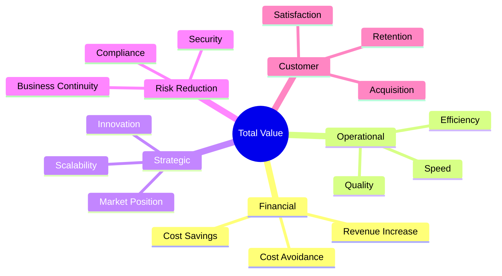
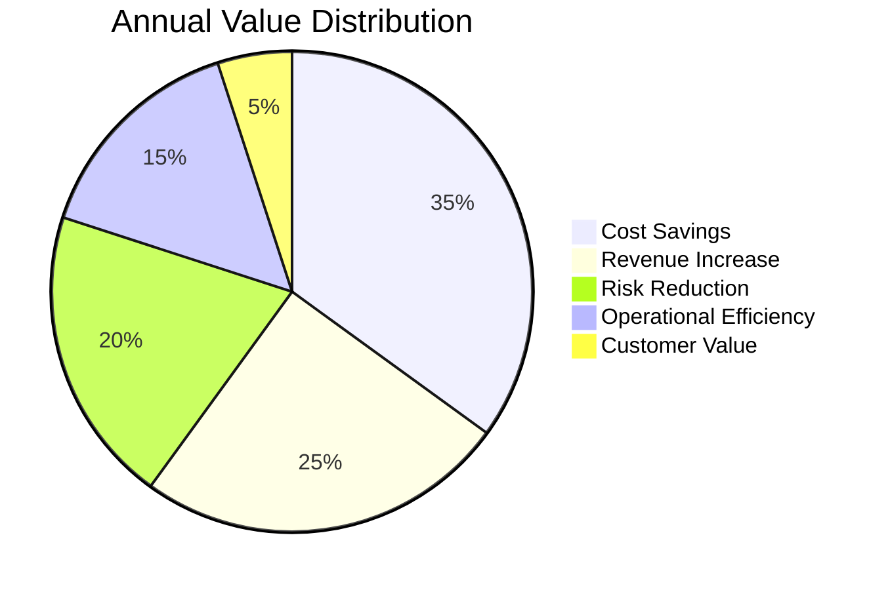
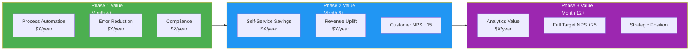

# Potential Value

> **Project:** [Project Name]
> **Version:** [X.Y] | **Status:** [Draft | Under Review | Approved | Archived]
> **Last Updated:** [YYYY-MM-DD]

---

## Document Control

| Field | Value |
|-------|-------|
| Document Owner | [Name / Role] |
| Sponsor | [Name / Role] |
| Business Analyst | [Name / Role] |
| Finance Analyst | [Name / Role] |

### Revision History

| Version | Date | Author | Change Description |
|---------|------|--------|--------------------|
| 0.1 | [YYYY-MM-DD] | [Name] | Initial draft |
| 1.0 | [YYYY-MM-DD] | [Name] | Approved version |

### Approvals

| Role | Name | Signature | Date |
|------|------|-----------|------|
| Project Sponsor | | | |
| Finance Director | | | |
| Business Owner | | | |
| BA Lead | | | |

---

## Table of Contents

1. [Executive Summary](#1-executive-summary)
2. [Value Framework](#2-value-framework)
3. [Financial Value](#3-financial-value)
4. [Operational Value](#4-operational-value)
5. [Strategic Value](#5-strategic-value)
6. [Risk Reduction Value](#6-risk-reduction-value)
7. [Customer Value](#7-customer-value)
8. [Value Summary](#8-value-summary)
9. [Value Realization Tracking](#9-value-realization-tracking)
10. [Sensitivity & Scenarios](#10-sensitivity--scenarios)

---

## 1. Executive Summary

| Field | Detail |
|-------|--------|
| Total Estimated Annual Value | $[X] |
| Financial Value | $[X] — cost savings + revenue |
| Operational Value | [X]% efficiency improvement |
| Strategic Value | [Qualitative — competitive position, market access] |
| Risk Reduction Value | $[X] — avoided costs |
| Customer Value | [NPS +X, retention +Y%] |
| Investment Required | $[X] |
| Net Value (Year 1) | $[X] |
| ROI | [X%] |
| Payback Period | [X months] |

---

## 2. Value Framework

### 2.1 Value Categories

> Value is measured across five dimensions — not just financial return.

### 2.2 Value Measurement Approach

| Category | Measurement Type | Method | Confidence |
|----------|-----------------|--------|-----------|
| Financial | Quantitative — $ | Cost analysis, revenue modeling | 🟢 High |
| Operational | Quantitative — % / time | Process measurement, time studies | 🟢 High |
| Strategic | Qualitative + Quantitative | Market analysis, competitive benchmarking | 🟡 Medium |
| Risk Reduction | Quantitative — $ | Risk assessment, probability × impact | 🟡 Medium |
| Customer | Quantitative — score / % | Surveys, retention analysis | 🟡 Medium |

---

## 3. Financial Value

### 3.1 Cost Savings

| ID | Savings Area | Current Cost | Future Cost | Annual Savings | Confidence | Realization Timeline |
|----|-------------|-------------|------------|---------------|-----------|---------------------|
| FS-01 | [e.g., Manual labor — data entry] | $[X]/year | $[Y]/year | $[X-Y] | 🟢 High | [Phase 1 + 3 months] |
| FS-02 | [e.g., Error rework costs] | $[X]/year | $[Y]/year | $[X-Y] | 🟢 High | [Phase 1 + 1 month] |
| FS-03 | [e.g., Legacy system maintenance] | $[X]/year | $[Y]/year | $[X-Y] | 🟡 Medium | [Phase 1 complete] |
| FS-04 | [e.g., Paper/printing costs] | $[X]/year | $[Y]/year | $[X-Y] | 🟢 High | [Phase 1 + 1 month] |
| FS-05 | [e.g., Support call reduction] | $[X]/year | $[Y]/year | $[X-Y] | 🟡 Medium | [Phase 2 + 3 months] |
| **Total Cost Savings** | | | | **$[Sum]** | | |

### 3.2 Revenue Increase

| ID | Revenue Source | Current Revenue | Projected Revenue | Annual Increase | Confidence | Realization Timeline |
|----|---------------|----------------|------------------|----------------|-----------|---------------------|
| FR-01 | [e.g., Faster onboarding → more customers] | $[X]/year | $[Y]/year | $[Y-X] | 🟡 Medium | [Phase 1 + 6 months] |
| FR-02 | [e.g., Self-service → higher conversion] | $[X]/year | $[Y]/year | $[Y-X] | 🟡 Medium | [Phase 2 + 6 months] |
| FR-03 | [e.g., New digital channel] | $0 | $[Y]/year | $[Y] | 🔴 Low | [Phase 2 + 12 months] |
| **Total Revenue Increase** | | | | **$[Sum]** | | |

### 3.3 Cost Avoidance

| ID | Avoided Cost | Description | Amount | Confidence | Trigger |
|----|-------------|-------------|--------|-----------|---------|
| FA-01 | [e.g., Regulatory fine avoidance] | [Non-compliance penalty if audit fails] | $[X]/year | 🟡 Medium | [Regulatory deadline] |
| FA-02 | [e.g., Legacy system end-of-life] | [Emergency replacement cost if delayed] | $[X] one-time | 🟢 High | [Vendor EOL date] |
| FA-03 | [e.g., Security breach avoidance] | [Average breach cost in industry] | $[X] probability-weighted | 🔴 Low | [Ongoing] |
| **Total Cost Avoidance** | | | **$[Sum]** | | |

### 3.4 Financial Summary

| Category | Year 1 | Year 2 | Year 3 | Year 4 | Year 5 | Total |
|----------|--------|--------|--------|--------|--------|-------|
| Cost Savings | $ | $ | $ | $ | $ | $ |
| Revenue Increase | $ | $ | $ | $ | $ | $ |
| Cost Avoidance | $ | $ | $ | $ | $ | $ |
| **Total Financial Value** | **$** | **$** | **$** | **$** | **$** | **$** |

---

## 4. Operational Value

### 4.1 Efficiency Improvements

| ID | Process | Current | Target | Improvement | Value |
|----|---------|---------|--------|-------------|-------|
| OE-01 | [e.g., Customer Onboarding] | [12 days] | [1 day] | [92% faster] | [X more customers/month] |
| OE-02 | [e.g., Order Processing] | [4.5 hours] | [30 min] | [89% faster] | [X more orders/day] |
| OE-03 | [e.g., Report Generation] | [Weekly, manual] | [Real-time, auto] | [Instant] | [X hours/week saved] |
| OE-04 | [e.g., Error Resolution] | [8% error rate] | [<1%] | [88% reduction] | [X hours/week saved] |

### 4.2 Productivity Gains

| ID | Area | Current Productivity | Target Productivity | Gain | Annual Value |
|----|------|---------------------|--------------------|-------|----|
| OP-01 | [e.g., Operations team] | [X transactions/FTE/day] | [Y transactions/FTE/day] | [+Z%] | $[FTE savings or capacity increase] |
| OP-02 | [e.g., Management decision time] | [Week-old data] | [Real-time data] | [Faster decisions] | [Qualitative] |
| OP-03 | [e.g., IT maintenance] | [X hours/week firefighting] | [Y hours/week] | [-Z%] | $[Redirected to innovation] |

### 4.3 Quality Improvements

| ID | Quality Metric | Current | Target | Improvement | Value |
|----|---------------|---------|--------|-------------|-------|
| OQ-01 | [e.g., Data accuracy] | [85%] | [99%] | [+14%] | [Fewer errors, better decisions] |
| OQ-02 | [e.g., Process compliance] | [60%] | [95%] | [+35%] | [Audit readiness] |
| OQ-03 | [e.g., First-call resolution] | [50%] | [80%] | [+30%] | [Customer satisfaction] |

---

## 5. Strategic Value

### 5.1 Competitive Advantage

| ID | Strategic Benefit | Description | Impact | Measurement |
|----|------------------|-------------|--------|-------------|
| SV-01 | [e.g., Digital-first experience] | [Self-service portal matches competitors] | 🟡 High | [Competitive feature parity] |
| SV-02 | [e.g., Speed to market] | [New products launched in days, not months] | 🟡 High | [Time-to-market metric] |
| SV-03 | [e.g., Data-driven decisions] | [Real-time analytics enable proactive strategy] | 🟡 High | [Decision cycle time] |
| SV-04 | [e.g., Scalability] | [Platform handles 3x volume without re-architecture] | 🟢 Medium | [Capacity testing] |

### 5.2 Market Position

| Factor | Current Position | Target Position | Impact |
|--------|-----------------|----------------|--------|
| [e.g., Digital capability ranking] | [#X in market] | [#Y in market] | [Competitive differentiation] |
| [e.g., Customer experience score] | [Below average] | [Above average] | [Customer acquisition] |
| [e.g., Time-to-onboard vs competitors] | [Slowest] | [Among fastest] | [Market share protection] |

### 5.3 Innovation Enablement

| Capability Unlocked | Description | Future Value |
|--------------------|-------------|-------------|
| [e.g., API-first architecture] | [Enables partner ecosystem, marketplace] | [New revenue channels] |
| [e.g., Data platform] | [Enables AI/ML, predictive analytics] | [Operational intelligence] |
| [e.g., Cloud infrastructure] | [Enables rapid scaling, global expansion] | [Market expansion] |

---

## 6. Risk Reduction Value

### 6.1 Risk Avoidance

| ID | Risk | Current Exposure | Probability | Impact | Reduced Exposure | Annual Value |
|----|------|-----------------|------------|--------|-----------------|-------------|
| RV-01 | [e.g., Regulatory non-compliance] | [No audit trail] | [High — 70%] | $[X] | [Full compliance] | $[X × 0.7] |
| RV-02 | [e.g., Data breach] | [Legacy security] | [Medium — 30%] | $[Y] | [Modern security] | $[Y × 0.3] |
| RV-03 | [e.g., System failure] | [End-of-life systems] | [High — 60%] | $[Z] | [Supported platform] | $[Z × 0.6] |
| RV-04 | [e.g., Key person dependency] | [Knowledge in 2 heads] | [Medium — 40%] | $[W] | [Documented, automated] | $[W × 0.4] |
| **Total Risk Reduction** | | | | | | **$[Sum]** |

### 6.2 Compliance Value

| Regulation | Current Risk | Mitigation | Value |
|-----------|-------------|-----------|-------|
| [e.g., GDPR] | [No automated deletion] | [Data management platform] | [Fine avoidance — $X] |
| [e.g., Industry standard] | [No audit trail] | [Full logging] | [Certification readiness] |
| [e.g., Data retention law] | [Manual, inconsistent] | [Automated retention policy] | [Compliance assurance] |

---

## 7. Customer Value

### 7.1 Customer Experience Improvement

| ID | Metric | Current | Target | Impact |
|----|--------|---------|--------|--------|
| CV-01 | [e.g., Net Promoter Score (NPS)] | [35] | [60+] | [Customer loyalty] |
| CV-02 | [e.g., Customer Satisfaction (CSAT)] | [3.2/5] | [4.5/5] | [Retention] |
| CV-03 | [e.g., Customer Effort Score (CES)] | [High effort] | [Low effort] | [Reduced churn] |
| CV-04 | [e.g., Onboarding Experience] | [Frustrating, slow] | [Fast, self-service] | [First impression] |

### 7.2 Customer Retention & Acquisition

| ID | Impact | Current | Projected | Value |
|----|--------|---------|-----------|-------|
| CA-01 | [e.g., Customer retention rate] | [X%] | [Y%] | [Retained customers × avg revenue] |
| CA-02 | [e.g., New customer acquisition] | [X/month] | [Y/month] | [Additional customers × avg revenue] |
| CA-03 | [e.g., Customer lifetime value] | $[X] | $[Y] | [Increased CLV × customer base] |

### 7.3 Customer Feedback Supporting Value

| Source | Feedback | Date | Implication |
|--------|---------|------|------------|
| [Customer Survey] | ["I would switch to a competitor with online self-service"] | [YYYY-MM-DD] | [Churn risk without portal] |
| [Support Tickets] | ["Why does it take 2 weeks to activate my account?"] | [YYYY-MM-DD] | [Onboarding friction] |
| [NPS Verbatim] | ["Your process is stuck in the 1990s"] | [YYYY-MM-DD] | [Brand perception] |

---

## 8. Value Summary

### 8.1 Total Value Summary

| Value Category | Annual Value | Confidence | % of Total |
|---------------|-------------|-----------|-----------|
| 💰 Financial (Cost Savings) | $[X] | 🟢 High | [X%] |
| 💰 Financial (Revenue Increase) | $[X] | 🟡 Medium | [X%] |
| 💰 Financial (Cost Avoidance) | $[X] | 🟡 Medium | [X%] |
| ⚙️ Operational (Efficiency) | $[X] | 🟢 High | [X%] |
| 🎯 Strategic | [Qualitative] | 🟡 Medium | — |
| 🛡️ Risk Reduction | $[X] | 🟡 Medium | [X%] |
| 👥 Customer | $[X] | 🟡 Medium | [X%] |
| **Total Annual Value** | **$[Sum]** | | **100%** |

### 8.2 Value vs Investment

| Metric | Value |
|--------|-------|
| Total Investment | $[X] |
| Total Annual Value | $[Y] |
| Simple ROI | [((Y - X) / X) × 100]% |
| Payback Period | [X / (Y/12)] months |
| NPV (5-year, X% discount) | $[Z] |
| Value-to-Investment Ratio | [Y:X] |

### 8.3 Value Composition

---

## 9. Value Realization Tracking

### 9.1 Benefits Realization Plan

| ID | Benefit | Expected Value | Measurement Method | Baseline | Target | Realization Date | Owner |
|----|---------|---------------|-------------------|----------|--------|-----------------|-------|
| BR-01 | [Cost savings — labor] | $[X]/year | [Hours saved × rate] | [Current hours] | [Target hours] | [Date] | [Ops Manager] |
| BR-02 | [Revenue — faster onboarding] | $[X]/year | [Additional customers × revenue] | [Current rate] | [Target rate] | [Date] | [Sales Lead] |
| BR-03 | [Risk — compliance] | $[X]/year | [Avoided fines] | [Current risk] | [Target risk] | [Date] | [Compliance] |
| BR-04 | [Customer — NPS] | +25 points | [Quarterly survey] | [NPS 35] | [NPS 60] | [Date] | [Product Owner] |

### 9.2 Value Realization Timeline

### 9.3 Value Review Cadence

| Review | Timing | Participants | Focus |
|--------|--------|-------------|-------|
| Value Check | Monthly | BA, Finance | [Leading indicators trending?] |
| Benefits Review | Quarterly | Sponsor, BA, Finance | [Actual vs expected value] |
| Full Value Assessment | Semi-annually | Steering Committee | [ROI recalculation, strategy alignment] |
| Post-Implementation | 12 months post-go-live | All stakeholders | [Full value realization report] |

---

## 10. Sensitivity & Scenarios

### 10.1 Sensitivity Analysis

| Scenario | Change | Impact on Annual Value | Impact on ROI | Likelihood |
|----------|--------|----------------------|--------------|-----------|
| **Base Case** | As estimated | $[X] | [Y]% | Most likely |
| **Pessimistic** | Benefits -30%, Costs +20% | $[X × 0.7] | [Lower]% | Possible |
| **Optimistic** | Benefits +20%, Costs -10% | $[X × 1.2] | [Higher]% | Possible |
| **Delayed (6 months)** | Benefits start 6 months late | $[X × 0.75] | [Lower]% | Risk |
| **Partial Adoption** | Only 60% user adoption | $[X × 0.6] | [Lower]% | Risk |

### 10.2 Scenario Outcomes

| Scenario | Annual Value | ROI | Payback | NPV (5-yr) |
|----------|-------------|-----|---------|-----------|
| 🟢 Optimistic | $[X] | [Y]% | [Z] months | $[W] |
| 🟡 Base Case | $[X] | [Y]% | [Z] months | $[W] |
| 🟠 Conservative | $[X] | [Y]% | [Z] months | $[W] |
| 🔴 Pessimistic | $[X] | [Y]% | [Z] months | $[W] |

### 10.3 Break-Even Analysis

| Variable | Break-Even Point | Current Estimate | Margin |
|----------|-----------------|-----------------|--------|
| [e.g., User adoption rate] | [X%] | [Y%] | [+Z% buffer] |
| [e.g., Cost savings realization] | [X%] of projected | [Y%] expected | [+Z% buffer] |
| [e.g., Implementation cost] | [≤ $X] | [$Y estimated] | [$Z buffer] |

---

## Related Documents

| Document | Relationship |
|----------|-------------|
| [[Business-Case]] | Potential value justifies the investment in the Business Case |
| [[Business-Objectives]] | Value measures objective achievement |
| [[Business-Requirements]] | Requirements deliver the value described here |
| [[Current-State-Description]] | Current costs and performance establish the baseline |
| [[Future-State-Description]] | Future state delivers the value described here |
| [[Change-Strategy]] | Strategy realization plan aligns with value timeline |
| [[Benefits-Management-Plan]] | Detailed benefits tracking and ownership |

---

> **Template Standard:** Based on BABOK v3 (Strategy Analysis), PMBOK v8 (Benefits Management), ISO 21505
> **Usage:** This document quantifies the *why* — the value that justifies the investment. All figures should be traceable to source data (interviews, benchmarks, financial reports). Use confidence levels honestly — inflated projections erode trust.
