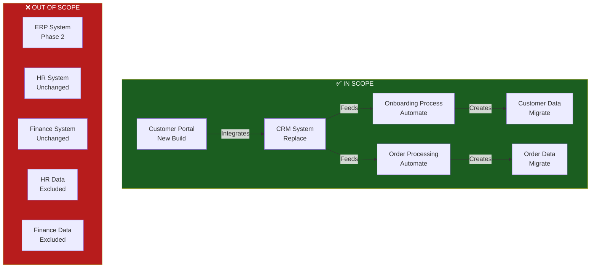
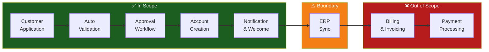
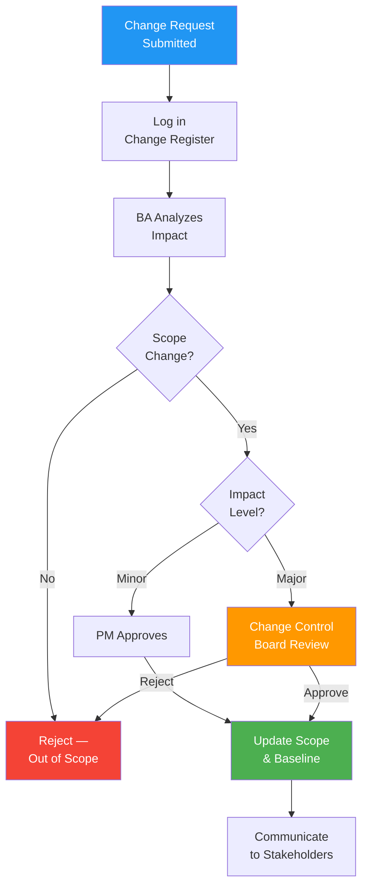

# Solution Scope

> **Project:** [Project Name]
> **Version:** [X.Y] | **Status:** [Draft | Under Review | Approved | Archived]
> **Last Updated:** [YYYY-MM-DD]

---

## Document Control

| Field | Value |
|-------|-------|
| Document Owner | [Name / Role] |
| Sponsor | [Name / Role] |
| Business Analyst | [Name / Role] |
| Solution Architect | [Name / Role] |

### Revision History

| Version | Date | Author | Change Description |
|---------|------|--------|--------------------|
| 0.1 | [YYYY-MM-DD] | [Name] | Initial draft |
| 1.0 | [YYYY-MM-DD] | [Name] | Approved version |

### Approvals

| Role | Name | Signature | Date |
|------|------|-----------|------|
| Project Sponsor | | | |
| Business Owner | | | |
| Solution Architect | | | |
| BA Lead | | | |

---

## Table of Contents

1. [Executive Summary](#1-executive-summary)
2. [Scope Overview](#2-scope-overview)
3. [In Scope](#3-in-scope)
4. [Out of Scope](#4-out-of-scope)
5. [Scope Boundaries](#5-scope-boundaries)
6. [Deliverables](#6-deliverables)
7. [Exclusions & Rationale](#7-exclusions--rationale)
8. [Scope Constraints](#8-scope-constraints)
9. [Scope Change Control](#9-scope-change-control)
10. [Assumptions](#10-assumptions)

---

## 1. Executive Summary

| Field | Detail |
|-------|--------|
| Solution Overview | [1-2 sentence description of what the solution delivers] |
| Boundaries | [What is included and excluded — high level] |
| Affected Areas | [Departments, systems, processes in scope] |
| Estimated Effort | [X months, Y FTEs] |
| Key Constraint | [Most significant scope constraint] |

---

## 2. Scope Overview

### 2.1 Scope Definition

> The solution scope defines the boundaries of the change — what the solution will and will not include. It serves as the baseline for requirements gathering, design, and change control.

### 2.2 Scope Dimensions

| Dimension | In Scope | Out of Scope |
|-----------|----------|-------------|
| **Business Processes** | [List processes being transformed] | [List processes explicitly excluded] |
| **Organizational Units** | [Departments/teams affected] | [Departments/teams not affected] |
| **Technology / Systems** | [Systems being replaced/upgraded] | [Systems remaining unchanged] |
| **Data** | [Data entities being managed] | [Data outside scope] |
| **Geography** | [Regions/countries included] | [Regions/countries excluded] |
| **Users** | [User groups being served] | [User groups not served in this phase] |

### 2.3 Scope Visualization

---

## 3. In Scope

### 3.1 Scope Items

| ID | Scope Item | Category | Description | Priority | Phase |
|----|-----------|----------|-------------|----------|-------|
| S-01 | [e.g., Customer Onboarding Process] | Process | [Automate end-to-end onboarding from application to activation] | 🔴 | Phase 1 |
| S-02 | [e.g., CRM System Replacement] | Technology | [Replace legacy CRM with cloud platform] | 🔴 | Phase 1 |
| S-03 | [e.g., Customer Self-Service Portal] | Technology | [New web portal for customer account management] | 🔴 | Phase 2 |
| S-04 | [e.g., Order Processing Automation] | Process | [Automate order validation, pricing, fulfillment] | 🔴 | Phase 2 |
| S-05 | [e.g., Customer Data Migration] | Data | [Migrate 500K customer records to new platform] | 🔴 | Phase 1 |
| S-06 | [e.g., Real-Time Dashboard] | Technology | [Management dashboard with live KPIs] | 🟡 | Phase 3 |
| S-07 | [e.g., API Integration Layer] | Technology | [Connect CRM, ERP, portal via APIs] | 🔴 | Phase 1 |
| S-08 | | | | | |

### 3.2 Scope by Capability

| Capability | Included | Details |
|-----------|----------|---------|
| [Customer Registration] | ✅ Yes | [Full automation — online form, validation, approval] |
| [Customer Account Management] | ✅ Yes | [Self-service portal — profile, preferences, history] |
| [Order Processing] | ✅ Yes | [Automated validation, pricing, routing] |
| [Invoice Generation] | ⚠️ Partial | [Basic only — advanced billing in Phase 2] |
| [Reporting & Analytics] | ⚠️ Partial | [Standard dashboards only — advanced analytics in Phase 3] |
| [Inventory Management] | ❌ No | [Out of scope — managed by ERP] |
| [HR & Payroll] | ❌ No | [Out of scope — managed by HR system] |

---

## 4. Out of Scope

### 4.1 Excluded Items

| ID | Excluded Item | Category | Rationale | Future Phase |
|----|--------------|----------|-----------|-------------|
| O-01 | [e.g., ERP System Upgrade] | Technology | [Separate initiative — funded independently] | Phase 2 |
| O-02 | [e.g., HR System Changes] | Technology | [No business case — current system adequate] | TBD |
| O-03 | [e.g., International Expansion] | Business | [Domestic launch first — international in Phase 2] | Phase 2 |
| O-04 | [e.g., Advanced Analytics / AI/ML] | Technology | [Foundation must be built first] | Phase 3 |
| O-05 | [e.g., Legacy System Decommission] | Technology | [Post-migration stability period required] | Phase 2 |
| O-06 | [e.g., Finance System Integration] | Technology | [Manual process acceptable for now] | Phase 2 |
| O-07 | | | | |

### 4.2 Explicit Non-Goals

> Things this solution will **not** do — stated clearly to prevent scope creep.

| # | Non-Goal | Why Not |
|---|---------|---------|
| 1 | [e.g., Replace the ERP system] | [Out of budget, separate program] |
| 2 | [e.g., Support international customers] | [Domestic market first] |
| 3 | [e.g., Build custom billing engine] | [COTS solution sufficient] |
| 4 | [e.g., Provide 24/7 support] | [Business hours only for Phase 1] |

---

## 5. Scope Boundaries

### 5.1 System Boundaries

| System | Boundary Type | Interaction |
|--------|-------------|-------------|
| [New CRM] | **Internal** — fully within scope | Build, configure, migrate, maintain |
| [Customer Portal] | **Internal** — fully within scope | Build, deploy, maintain |
| [ERP System] | **Boundary** — integration only | Read/write via API — no changes to ERP |
| [Finance System] | **External** — out of scope | No integration in Phase 1 |
| [HR System] | **External** — out of scope | No interaction |
| [Email/SMS Gateway] | **External** — consume only | Use for notifications — no changes |

### 5.2 Process Boundaries

### 5.3 Data Boundaries

| Data Entity | Scope | Action | Volume |
|------------|-------|--------|--------|
| [Customer Profile] | ✅ In Scope | [Migrate + manage] | [500K records] |
| [Order History] | ✅ In Scope | [Migrate + manage] | [2M records] |
| [Product Catalog] | ⚠️ Boundary | [Read from ERP — no changes] | [50K SKUs] |
| [Employee Data] | ❌ Out of Scope | [No access] | N/A |
| [Financial Data] | ❌ Out of Scope | [No access] | N/A |

### 5.4 User Group Boundaries

| User Group | Scope | Access Level |
|-----------|-------|-------------|
| [External Customers] | ✅ In Scope | [Self-service portal] |
| [Operations Staff] | ✅ In Scope | [CRM + admin portal] |
| [Management] | ✅ In Scope | [Dashboard + reports] |
| [Finance Team] | ❌ Out of Scope | [No access to new systems] |
| [HR Team] | ❌ Out of Scope | [No access to new systems] |

---

## 6. Deliverables

### 6.1 Deliverable Register

| ID | Deliverable | Type | Description | Acceptance Criteria | Phase |
|----|------------|------|-------------|-------------------|-------|
| D-01 | [Cloud CRM Platform] | System | [Configured, migrated, operational CRM] | [All users onboarded, data migrated] | 1 |
| D-02 | [API Integration Layer] | System | [REST APIs connecting CRM, ERP, portal] | [All integrations tested, <2s response] | 1 |
| D-03 | [Customer Self-Service Portal] | System | [Web portal for customer account management] | [30% adoption in 3 months] | 2 |
| D-04 | [Automated Onboarding Process] | Process | [End-to-end automated onboarding] | [<1 day processing, <1% error rate] | 1 |
| D-05 | [Data Migration] | Data | [Customer + order data migrated and validated] | [100% record reconciliation] | 1 |
| D-06 | [Training Materials] | Documentation | [User guides, videos, sandbox environment] | [90% training completion] | 1 |
| D-07 | [Operations Runbook] | Documentation | [System operations and troubleshooting guide] | [IT team sign-off] | 1 |
| D-08 | [Real-Time Dashboard] | System | [Management KPI dashboard] | [All KPIs displaying correctly] | 3 |
| D-09 | | | | | |

### 6.2 Deliverable Traceability

| Deliverable | Business Objective | Business Requirement | Stakeholder Need |
|------------|-------------------|---------------------|-----------------|
| D-01 CRM | OBJ-01, OBJ-02 | BR-01, BR-02 | SN-01, SN-02 |
| D-02 APIs | OBJ-01 | BR-02 | SN-02 |
| D-03 Portal | OBJ-02 | BR-01 | SN-01 |
| D-04 Onboarding | OBJ-01 | BR-01 | SN-01 |
| D-05 Migration | OBJ-01, OBJ-02 | BR-02 | SN-02 |

---

## 7. Exclusions & Rationale

### 7.1 Exclusion Decision Log

| Item | Decision | Rationale | Impact | Approved By |
|------|----------|-----------|--------|------------|
| [e.g., ERP upgrade] | Excluded — Phase 2 | [Separate budget, separate timeline] | [Manual sync required] | [Sponsor] |
| [e.g., International support] | Excluded — Phase 2 | [Domestic market validation first] | [Limited to domestic customers] | [Sponsor] |
| [e.g., Custom billing] | Excluded permanently | [COTS solution meets 90% of needs] | [10% edge cases handled manually] | [Sponsor] |
| [e.g., 24/7 support] | Excluded — Phase 1 | [Cost prohibitive, business hours sufficient] | [After-hours issues wait until morning] | [Sponsor] |

---

## 8. Scope Constraints

| ID | Constraint | Type | Impact on Scope | Mitigation |
|----|-----------|------|----------------|-----------|
| SC-01 | [e.g., Budget cap $500K] | Financial | [Limits technology choices] | [Prioritize 🔴 items, defer 🟡] |
| SC-02 | [e.g., Go-live by YYYY-MM-DD] | Time | [Limits scope to essentials] | [Phased approach] |
| SC-03 | [e.g., Must integrate with existing ERP] | Technical | [API dependency] | [Early integration testing] |
| SC-04 | [e.g., No new headcount] | Resource | [Limits parallel workstreams] | [Vendor augmentation] |
| SC-05 | [e.g., Data sovereignty — must stay in-country] | Legal | [Limits hosting options] | [Local cloud region] |

---

## 9. Scope Change Control

### 9.1 Change Control Process

### 9.2 Change Classification

| Level | Definition | Authority | Timeline Impact | Budget Impact |
|-------|-----------|----------|----------------|--------------|
| **Minor** | Clarification, no cost/schedule impact | PM | None | None |
| **Moderate** | Adds/removes feature, <10% budget impact | PM + Sponsor | <2 weeks | <10% |
| **Major** | Significant scope change, >10% budget impact | Steering Committee | >2 weeks | >10% |

### 9.3 Change Register

| CR ID | Date | Description | Impact | Decision | Approved By |
|-------|------|-------------|--------|----------|------------|
| CR-001 | [YYYY-MM-DD] | [Description] | [Scope/Schedule/Cost impact] | [Approved/Rejected/Deferred] | [Name] |
| | | | | | |

---

## 10. Assumptions

| # | Assumption | Impact if Invalid | Validation Method | Status |
|---|-----------|-------------------|-------------------|--------|
| A-01 | [e.g., ERP API will remain stable] | [Integration rework] | [Vendor confirmation] | ✅ |
| A-02 | [e.g., Key staff available for UAT] | [Delayed acceptance] | [Resource plan confirmed] | ⏳ |
| A-03 | [e.g., Data quality is sufficient for migration] | [Extended cleansing effort] | [Data profiling report] | ⏳ |
| A-04 | [e.g., No regulatory changes during project] | [Scope change] | [Regulatory monitoring] | ⏳ |

---

## Related Documents

| Document | Relationship |
|----------|-------------|
| [[Business-Case]] | Scope delivers the benefits in the Business Case |
| [[Business-Objectives]] | Scope items trace to business objectives |
| [[Business-Requirements]] | Requirements must fit within this scope |
| [[Current-State-Description]] | Defines what exists today |
| [[Future-State-Description]] | Defines what the solution will become |
| [[Change-Strategy]] | Strategy delivers this scope in phases |
| [[Gap-Analysis]] | Gaps inform scope priorities |
| [[WBS-WBS-Dictionary]] | Work Breakdown Structure decomposes this scope |
| [[Requirements-Traceability-Matrix]] | Requirements traced within scope boundaries |

---

> **Template Standard:** Based on BABOK v3 (Strategy Analysis), PMBOK v8 (Scope Management), ISO/IEC/IEEE 12207
> **Usage:** This is the **baseline** for change control. All requirements, design, and development must stay within these boundaries unless a formal change request is approved.
