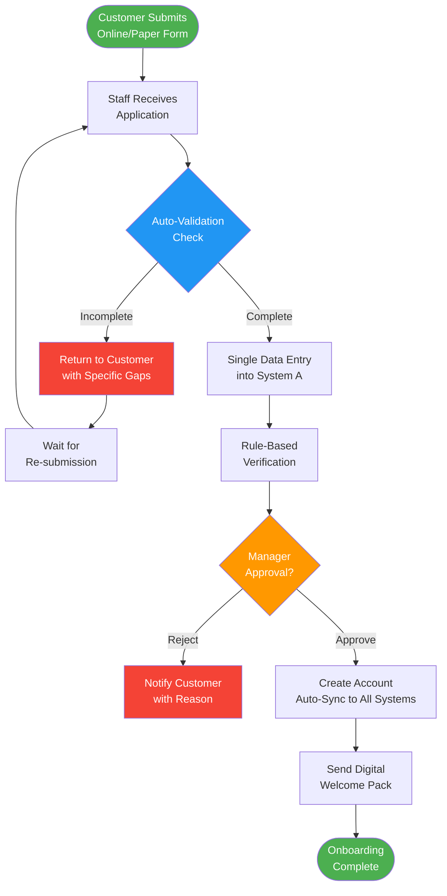

# Elicitation Results (Confirmed)

> **Project:** [Project Name]
> **Version:** [X.Y] | **Status:** [Draft | Under Review | Approved]
> **Last Updated:** [YYYY-MM-DD]
>
> ✅ **Note:** These outputs have been validated with stakeholders and are confirmed as accurate representations of captured information.

---

## Document Control

| Field | Value |
|-------|-------|
| Document Owner | [Name / Role] |
| Business Analyst | [Name / Role] |
| Source Document | [[Elicitation-Results-Unconfirmed]] |

### Revision History

| Version | Date | Author | Change Description |
|---------|------|--------|--------------------|
| 0.1 | [YYYY-MM-DD] | [Name] | Initial compilation from unconfirmed results |
| 1.0 | [YYYY-MM-DD] | [Name] | Confirmed by stakeholders |

### Confirmations

| Output | Confirmed By | Date | Method |
|--------|-------------|------|--------|
| [Process Map] | [Operations Manager] | [YYYY-MM-DD] | [Walkthrough session] |
| [Business Rules] | [Operations Team] | [YYYY-MM-DD] | [Workshop] |
| [Requirements] | [All Stakeholders] | [YYYY-MM-DD] | [Review session] |
| [Pain Points] | [Operations Manager] | [YYYY-MM-DD] | [Workshop] |

---

## Table of Contents

1. [Confirmation Summary](#1-confirmation-summary)
2. [Confirmed Process Map](#2-confirmed-process-map)
3. [Confirmed Requirements](#3-confirmed-requirements)
4. [Confirmed Business Rules](#4-confirmed-business-rules)
5. [Confirmed Pain Points](#5-confirmed-pain-points)
6. [Confirmed Needs](#6-confirmed-needs)
7. [Resolved Questions](#7-resolved-questions)
8. [Changes from Unconfirmed](#8-changes-from-unconfirmed)
9. [Traceability](#9-traceability)

---

## 1. Confirmation Summary

| Field | Detail |
|-------|--------|
| Source Document | [[Elicitation-Results-Unconfirmed]] — ACT-XX |
| Original Activity Date | [YYYY-MM-DD] |
| Confirmation Date(s) | [YYYY-MM-DD] |
| Confirmation Method | [Workshop walkthrough + individual review] |
| Participants in Confirmation | [Names and roles] |
| Items Confirmed | [X of Y] |
| Items Changed During Confirmation | [X] |
| Items Still Pending | [X] |

### Confirmation Statistics

| Category | Unconfirmed | Confirmed | Changed | Pending |
|----------|------------|----------|---------|---------|
| Requirements | [X] | [Y] | [Z] | [W] |
| Business Rules | [X] | [Y] | [Z] | [W] |
| Pain Points | [X] | [Y] | [Z] | [W] |
| Needs | [X] | [Y] | [Z] | [W] |
| **Total** | **[Sum]** | **[Sum]** | **[Sum]** | **[Sum]** |

---

## 2. Confirmed Process Map

### 2.1 Current Process (Confirmed)

### 2.2 Process Metrics (Confirmed)

| Metric | Current State | Source | Confidence |
|--------|--------------|--------|-----------|
| Average processing time | [10-15 business days] | [Operations Manager] | 🟢 High |
| Application completion rate (first attempt) | [70%] | [CS Lead] | 🟢 High |
| Manager approval bottleneck | [2-3 days average] | [Observation] | 🟢 High |
| Duplicate data entry | [3 systems] | [Observation] | 🟢 High |
| Customer calls during onboarding | [3 calls average] | [CS Lead] | 🟡 Medium |

---

## 3. Confirmed Requirements

| Req ID | Description | Type | Priority | Source | Confirmed By | Date | Traceability |
|--------|-------------|------|----------|--------|-------------|------|-------------|
| BR-01 | [System shall allow online application submission] | Functional | 🔴 | DREQ-01 | [Ops Manager] | [YYYY-MM-DD] | OBJ-01 |
| BR-02 | [System shall validate application completeness in real-time] | Functional | 🔴 | DREQ-02 | [Ops Team] | [YYYY-MM-DD] | OBJ-01 |
| BR-03 | [System shall provide application status to customers via portal] | Functional | 🔴 | DREQ-03 | [CS Lead] | [YYYY-MM-DD] | OBJ-02 |
| BR-04 | [System shall auto-route applications based on business rules] | Functional | 🔴 | DREQ-04 | [Ops Manager] | [YYYY-MM-DD] | OBJ-01 |
| BR-05 | [System shall reduce onboarding time to ≤3 business days] | Non-Functional | 🔴 | DREQ-05 | [Sponsor] | [YYYY-MM-DD] | OBJ-01 |
| BR-06 | [System shall send notifications at each status change] | Functional | 🟡 | DREQ-06 | [CS Lead] | [YYYY-MM-DD] | OBJ-02 |
| BR-07 | [System shall support bulk application upload for corporate clients] | Functional | 🟡 | [New in confirmation] | [Ops Manager] | [YYYY-MM-DD] | OBJ-03 |
| BR-08 | | | | | | | |

### Changes from Unconfirmed

| Original | Change | Reason |
|---------|--------|--------|
| DREQ-01 | [Added "Online" to submission methods] | [Stakeholder confirmed online is primary channel] |
| DREQ-04 | [Added "based on business rules"] | [Clarified that routing is rule-based, not manual] |
| DREQ-05 | [Changed from "3 days" to "3 business days"] | [Compliance clarification — calendar vs business days] |
| [New] BR-07 | [Bulk upload for corporate clients] | [Raised during confirmation — missed in original session] |

---

## 4. Confirmed Business Rules

| Rule ID | Rule | Source | Exceptions | Confirmed By | Date |
|---------|------|--------|-----------|-------------|------|
| BUR-01 | [Applications with missing required fields must be rejected with specific field identification] | DBR-01 | [None — strict rule] | [Ops Team] | [YYYY-MM-DD] |
| BUR-02 | [Applications > $10K require manager approval] | DBR-02 | [VIP customers (pre-approved) — auto-approve up to $25K] | [Ops Manager] | [YYYY-MM-DD] |
| BUR-03 | [Duplicate applications (same customer, 30 days) must be flagged for review] | DBR-03 | [Re-submission after rejection — allowed] | [Ops Team] | [YYYY-MM-DD] |
| BUR-04 | [Applications processed in FIFO order] | DBR-04 | [Priority customers — jump queue; Regulatory deadlines — jump queue] | [Ops Manager] | [YYYY-MM-DD] |
| BUR-05 | [Customer data retained for 7 years after account closure] | [New] | [Legal hold — retain indefinitely] | [Compliance] | [YYYY-MM-DD] |
| BUR-06 | | | | | |

### Changes from Unconfirmed

| Original | Change | Reason |
|---------|--------|--------|
| DBR-02 | [Added VIP threshold — $25K] | [Ops Manager clarified VIP policy during confirmation] |
| DBR-04 | [Added regulatory deadline exception] | [Compliance Officer confirmed regulatory requirement] |
| [New] BUR-05 | [Data retention rule] | [Compliance Officer raised during confirmation] |

---

## 5. Confirmed Pain Points

| ID | Pain Point | Severity | Frequency | Impact | Confirmed By | Date |
|----|-----------|----------|-----------|--------|-------------|------|
| PP-01 | [Manual data entry into 3 systems] | 🔴 High | Every application | [2 hours/day wasted, error-prone] | [Ops Manager] | [YYYY-MM-DD] |
| PP-02 | [Manager approval bottleneck] | 🔴 High | 60% of applications | [2-3 day delay per application] | [Ops Manager] | [YYYY-MM-DD] |
| PP-03 | [No visibility into application status] | 🟡 Medium | Daily | [3 calls per application, customer frustration] | [CS Lead] | [YYYY-MM-DD] |
| PP-04 | [Inconsistent rule application] | 🟡 Medium | Daily | [Compliance risk, unfair treatment] | [Ops Manager] | [YYYY-MM-DD] |
| PP-05 | [Paper forms lost/damaged] | 🟢 Low | Monthly | [~3 applications/month lost] | [Ops Team] | [YYYY-MM-DD] |

### Pain Point Prioritization (Confirmed)

| Rank | Pain Point | Severity × Frequency | Addressed By |
|------|-----------|---------------------|-------------|
| 1 | [Manual data entry] | [🔴 × Daily] | BR-02, BR-04 |
| 2 | [Manager bottleneck] | [🔴 × Frequent] | BR-04 |
| 3 | [No status visibility] | [🟡 × Daily] | BR-03, BR-06 |
| 4 | [Inconsistent rules] | [🟡 × Daily] | BR-02 |
| 5 | [Paper forms] | [🟢 × Monthly] | BR-01 |

---

## 6. Confirmed Needs

| ID | Need | Stakeholder | Priority | Confirmed By | Addressed By |
|----|------|------------|----------|-------------|-------------|
| N-01 | [Online application submission] | [Customers, CS] | 🔴 | [CS Lead] | BR-01 |
| N-02 | [Real-time status tracking] | [Customers, CS] | 🔴 | [CS Lead] | BR-03, BR-06 |
| N-03 | [Automated validation] | [Operations] | 🔴 | [Ops Manager] | BR-02 |
| N-04 | [Rule-based auto-routing] | [Operations] | 🔴 | [Ops Manager] | BR-04 |
| N-05 | [Mobile access] | [Operations] | 🟡 | [Ops Manager] | [Deferred — Phase 2] |

---

## 7. Resolved Questions

| # | Question (From Unconfirmed) | Answer | Source | Date | Impact |
|---|---------------------------|--------|--------|------|--------|
| Q-01 | [What is the approval threshold for VIP customers?] | [$25K auto-approve for pre-approved VIPs] | [Ops Manager] | [YYYY-MM-DD] | [Business rule updated] |
| Q-02 | [How many applications per day?] | [Average 50, peak 120 (month-end)] | [Ops Manager] | [YYYY-MM-DD] | [Performance requirement] |
| Q-03 | [Regulatory data retention requirements?] | [7 years after closure, legal hold overrides] | [Compliance Officer] | [YYYY-MM-DD] | [Business rule added] |
| Q-04 | [Maximum processing time mandated?] | [No regulatory mandate, but SLA is 5 business days] | [Compliance Officer] | [YYYY-MM-DD] | [Target adjusted] |
| Q-05 | | | | | |

---

## 8. Changes from Unconfirmed

### 8.1 Change Log

| # | Item | Original (Unconfirmed) | Changed To | Reason | Impact |
|---|------|----------------------|-----------|--------|--------|
| 1 | [DREQ-01] | [System shall allow application submission] | [System shall allow **online** application submission] | [Stakeholder clarification] | [Scope — online is primary] |
| 2 | [DREQ-05] | [≤3 days] | [≤3 **business** days] | [Compliance clarification] | [Target adjusted] |
| 3 | [DBR-02] | [>$10K requires approval] | [>$10K requires approval; **VIP auto-approve ≤$25K**] | [Ops Manager clarification] | [Business rule expanded] |
| 4 | [DBR-04] | [FIFO order] | [FIFO order; **regulatory deadline exception**] | [Compliance requirement] | [Business rule expanded] |
| 5 | [New BR-07] | [Not captured] | [Bulk upload for corporate clients] | [Missed in original session] | [New requirement] |
| 6 | [New BUR-05] | [Not captured] | [7-year data retention] | [Compliance requirement] | [New business rule] |

### 8.2 Items Still Pending

| # | Item | Reason | Next Step | Owner | Due Date |
|---|------|--------|-----------|-------|----------|
| 1 | [Mobile access requirements] | [Deferred to Phase 2] | [Document for Phase 2 backlog] | [BA] | [Phase 2 start] |
| 2 | [Corporate bulk upload details] | [Need more detail on format/volume] | [Follow-up interview with Ops Manager] | [BA] | [YYYY-MM-DD] |

---

## 9. Traceability

### 9.1 Source Traceability

| Confirmed Item | Source Activity | Unconfirmed Item | Confirmation Method |
|---------------|----------------|-----------------|-------------------|
| BR-01 | ACT-01 Workshop | DREQ-01 | [Workshop walkthrough] |
| BR-02 | ACT-01 Workshop | DREQ-02 | [Workshop walkthrough] |
| BR-03 | ACT-01 Workshop | DREQ-03 | [Workshop walkthrough] |
| BR-04 | ACT-01 Workshop | DREQ-04 | [Workshop walkthrough] |
| BR-05 | ACT-02 Interview | DREQ-05 | [Sponsor review] |
| BR-07 | ACT-01 Workshop | [New] | [Ops Manager confirmation] |

### 9.2 Forward Traceability

| Confirmed Item | Business Objective | Business Requirement | Solution Component |
|---------------|-------------------|---------------------|-------------------|
| BR-01 | OBJ-01 | Business Requirements §3 | [Online Portal] |
| BR-02 | OBJ-01 | Business Requirements §3 | [Validation Engine] |
| BR-03 | OBJ-02 | Business Requirements §3 | [Status Tracking] |
| BR-04 | OBJ-01 | Business Requirements §3 | [Workflow Engine] |
| BR-05 | OBJ-01 | Business Requirements §3 | [Process Automation] |
| BR-06 | OBJ-02 | Business Requirements §3 | [Notification Service] |
| BR-07 | OBJ-03 | Business Requirements §3 | [Bulk Upload Module] |

---

## Related Documents

| Document | Relationship |
|----------|-------------|
| [[Elicitation-Activity-Plan]] | Plan that scheduled the source activity |
| [[Elicitation-Results-Unconfirmed]] | Raw outputs that were confirmed here |
| [[Business-Requirements]] | Requirements derived from these confirmed results |
| [[Requirements-Traceability-Matrix]] | Full traceability from objectives to tests |
| [[Current-State-Description]] | Current state data confirmed here |
| [[Gap-Analysis]] | Pain points inform gap identification |

---

> **Template Standard:** Based on BABOK v3 (Elicitation & Collaboration), ISO/IEC/IEEE 29148
> **Usage:** This document transforms raw elicitation outputs into *validated* results. Every item here has been confirmed by at least one stakeholder. Track what changed during confirmation — it reveals elicitation quality and stakeholder alignment.
