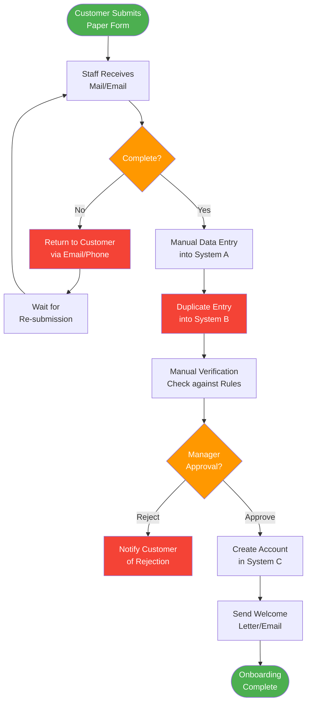

# Elicitation Results (Unconfirmed)

> **Project:** [Project Name]
> **Version:** [X.Y] | **Status:** [Draft — Pending Confirmation]
> **Last Updated:** [YYYY-MM-DD]
>
> ⚠️ **Note:** These are raw outputs from elicitation activities. They have NOT been confirmed with stakeholders and should not be used as approved requirements. See [[Elicitation Results (Confirmed)]] for validated outputs.

---

## Document Control

| Field | Value |
|-------|-------|
| Document Owner | [Name / Role] |
| Business Analyst | [Name / Role] |
| Source Activity | [Activity ID / Name] |

### Revision History

| Version | Date | Author | Change Description |
|---------|------|--------|--------------------|
| 0.1 | [YYYY-MM-DD] | [Name] | Raw capture from elicitation session |

---

## Table of Contents

1. [Activity Summary](#1-activity-summary)
2. [Raw Findings](#2-raw-findings)
3. [Requirements Identified](#3-requirements-identified)
4. [Business Rules Captured](#4-business-rules-captured)
5. [Process Observations](#5-process-observations)
6. [Stakeholder Quotes](#6-stakeholder-quotes)
7. [Open Questions](#7-open-questions)
8. [Parking Lot Items](#8-parking-lot-items)
9. [Confirmation Plan](#9-confirmation-plan)

---

## 1. Activity Summary

| Field | Detail |
|-------|--------|
| Activity ID | [ACT-XX] |
| Activity Type | [Workshop / Interview / Observation / Focus Group / Survey] |
| Date | [YYYY-MM-DD] |
| Duration | [X hours] |
| Facilitator | [Name] |
| Scribe | [Name] |
| Participants | [Names and roles] |
| Objective | [What we set out to learn] |
| Method | [How the session was conducted] |
| Recording | [Yes/No — location of recording if applicable] |

### Participants

| Name | Role | Attendance |
|------|------|-----------|
| [Name] | [Operations Manager] | ✅ Full |
| [Name] | [Customer Service Lead] | ✅ Full |
| [Name] | [End User] | ⚠️ Left early (30 min) |
| [Name] | [End User] | ✅ Full |
| [Name] | [IT Architect] | ❌ Absent — send summary |

---

## 2. Raw Findings

### 2.1 Key Observations

| # | Finding | Category | Source | Confidence |
|---|---------|----------|--------|-----------|
| F-01 | [e.g., Onboarding takes 10-15 business days] | Process | [Operations Manager] | 🟢 High |
| F-02 | [e.g., 30% of applications are incomplete on first submission] | Quality | [Customer Service Lead] | 🟢 High |
| F-03 | [e.g., Staff use personal spreadsheets to track progress] | Workaround | [Observation] | 🟢 High |
| F-04 | [e.g., Manager approval is a bottleneck — often 2-3 day delay] | Process | [End Users] | 🟡 Medium |
| F-05 | [e.g., Customers call 3x on average during onboarding] | Customer Impact | [Customer Service Lead] | 🟡 Medium |
| F-06 | [e.g., Duplicate data entry across 3 systems] | Inefficiency | [Observation] | 🟢 High |
| F-07 | | | | |

### 2.2 Pain Points Identified

| # | Pain Point | Severity | Frequency | Affected Stakeholder | Quote |
|---|-----------|----------|-----------|---------------------|-------|
| PP-01 | [e.g., Manual data entry is error-prone] | 🔴 High | Daily | [Operations] | ["I spend 2 hours a day fixing typos"] |
| PP-02 | [e.g., No visibility into application status] | 🟡 Medium | Daily | [Customers, CS] | ["Customers call asking 'where is my application?'"] |
| PP-03 | [e.g., Manager approval creates bottleneck] | 🔴 High | Weekly | [Operations] | ["If the manager is out, everything stops"] |
| PP-04 | [e.g., Paper forms lost or damaged] | 🟡 Medium | Monthly | [Operations] | ["We lost 3 applications last month to coffee spills"] |
| PP-05 | | | | | |

### 2.3 Needs Expressed

| # | Need | Stakeholder | Priority (Their View) | Quote |
|----|------|------------|---------------------|-------|
| N-01 | [e.g., Online application form] | [Customers, CS] | 🔴 Must Have | ["Why can't customers just apply online?"] |
| N-02 | [e.g., Real-time status tracking] | [Customers, CS] | 🔴 Must Have | ["I want to see where my application is"] |
| N-03 | [e.g., Automated validation] | [Operations] | 🔴 Must Have | ["Catch errors before I have to"] |
| N-04 | [e.g., Mobile access] | [Operations] | 🟡 Nice to Have | ["I'd like to check status from my phone"] |
| N-05 | | | | |

---

## 3. Requirements Identified

> ⚠️ These are **draft** requirements — pending confirmation.

| Draft ID | Description | Type | Source | Priority | Confidence | Confirmation Status |
|----------|-------------|------|--------|----------|-----------|-------------------|
| DREQ-01 | [e.g., System shall allow online application submission] | Functional | [Workshop] | 🔴 | 🟢 High | ⏳ Pending |
| DREQ-02 | [e.g., System shall validate application completeness in real-time] | Functional | [Workshop] | 🔴 | 🟡 Medium | ⏳ Pending |
| DREQ-03 | [e.g., System shall provide application status to customers] | Functional | [Workshop] | 🔴 | 🟢 High | ⏳ Pending |
| DREQ-04 | [e.g., System shall auto-route applications for approval] | Functional | [Workshop] | 🔴 | 🟡 Medium | ⏳ Pending |
| DREQ-05 | [e.g., System shall reduce onboarding time to ≤3 days] | Non-Functional | [Interview] | 🔴 | 🟡 Medium | ⏳ Pending |
| DREQ-06 | [e.g., System shall send notifications at each status change] | Functional | [Workshop] | 🟡 | 🟢 High | ⏳ Pending |
| DREQ-07 | | | | | | |

---

## 4. Business Rules Captured

> ⚠️ These are **draft** rules — pending validation.

| Draft ID | Rule | Source | Exceptions | Confidence | Confirmation Status |
|----------|------|--------|-----------|-----------|-------------------|
| DBR-01 | [e.g., Applications with missing required fields must be rejected] | [Ops Manager] | [None] | 🟢 High | ⏳ Pending |
| DBR-02 | [e.g., Applications > $10K require manager approval] | [Ops Manager] | [VIP customers — auto-approve] | 🟡 Medium | ⏳ Pending |
| DBR-03 | [e.g., Duplicate applications (same customer, 30 days) must be flagged] | [CS Lead] | [Re-submission after rejection] | 🟡 Medium | ⏳ Pending |
| DBR-04 | [e.g., Applications must be processed in FIFO order] | [Ops Manager] | [Priority customers — jump queue] | 🟡 Medium | ⏳ Pending |
| DBR-05 | | | | | |

---

## 5. Process Observations

### 5.1 Current Process Flow (Observed)

### 5.2 Observed Issues

| Step | Issue Observed | Impact | Frequency |
|------|---------------|--------|-----------|
| [Data Entry] | [Same data typed into 3 systems] | [Wasted time, errors] | [Every application] |
| [Manager Approval] | [Paper form sits on manager's desk for 2-3 days] | [Delay] | [60% of applications] |
| [Verification] | [Staff check rules from memory, no reference] | [Inconsistent decisions] | [Daily] |
| [Return to Customer] | [No tracking — lost in email] | [Customer complaints] | [~10% of applications] |

---

## 6. Stakeholder Quotes

> Direct quotes from stakeholders — useful for context and validation.

| Stakeholder | Quote | Context | Implication |
|------------|-------|---------|-------------|
| [Ops Manager] | ["We've been doing it this way for 10 years. It works, but it's slow."] | [Discussing current process] | [Open to change but needs evidence] |
| [CS Lead] | ["Customers are frustrated. They want transparency."] | [Discussing customer experience] | [Self-service is a must] |
| [End User] | ["If the system could just catch the obvious errors, that would save me hours."] | [Discussing data entry pain] | [Validation rules are high value] |
| [IT Architect] | ["The legacy system has no API. Any integration will be painful."] | [Discussing technical constraints] | [Integration is a risk] |

---

## 7. Open Questions

> Questions that arose during the session but could not be answered.

| # | Question | Raised By | Who Can Answer | Priority | Due Date |
|---|---------|-----------|---------------|----------|----------|
| Q-01 | [e.g., What is the approval threshold for VIP customers?] | [BA] | [Operations Manager] | 🔴 | [YYYY-MM-DD] |
| Q-02 | [e.g., How many applications are received per day on average?] | [BA] | [Operations Manager] | 🟡 | [YYYY-MM-DD] |
| Q-03 | [e.g., What regulatory requirements apply to data retention?] | [BA] | [Compliance Officer] | 🔴 | [YYYY-MM-DD] |
| Q-04 | [e.g., Is there a maximum application processing time mandated?] | [CS Lead] | [Compliance Officer] | 🟡 | [YYYY-MM-DD] |
| Q-05 | | | | | |

---

## 8. Parking Lot Items

> Items raised but outside the scope of this session.

| # | Item | Raised By | Reason Parked | Follow-Up |
|---|------|-----------|--------------|-----------|
| P-01 | [e.g., Billing integration] | [Ops Manager] | [Out of scope — Phase 2] | [Document for Phase 2 planning] |
| P-02 | [e.g., Mobile app for field staff] | [End User] | [Out of scope — future consideration] | [Add to backlog] |
| P-03 | [e.g., AI-powered document scanning] | [IT Architect] | [Out of scope — Phase 3] | [Document for Phase 3 planning] |
| P-04 | | | | |

---

## 9. Confirmation Plan

### 9.1 Confirmation Activities

| # | Activity | Output to Confirm | Method | Participants | Deadline |
|---|---------|------------------|--------|-------------|----------|
| 1 | [Validate process map] | [Current process flow] | [Walkthrough session] | [Ops Manager, CS Lead] | [YYYY-MM-DD] |
| 2 | [Validate business rules] | [Decision table] | [Workshop] | [Operations team] | [YYYY-MM-DD] |
| 3 | [Validate requirements] | [Draft requirements list] | [Review session] | [All stakeholders] | [YYYY-MM-DD] |
| 4 | [Resolve open questions] | [Answers to Q-01 through Q-05] | [Interview / email] | [Subject matter experts] | [YYYY-MM-DD] |
| 5 | [Confirm pain points] | [Prioritized pain point list] | [Survey / workshop] | [Operations team] | [YYYY-MM-DD] |

### 9.2 Confirmation Status

| Output | Confirmed | Date | Confirmed By | Changes Made |
|--------|----------|------|-------------|-------------|
| Process map | ⏳ Pending | | | |
| Business rules | ⏳ Pending | | | |
| Requirements (DREQ-01 to 06) | ⏳ Pending | | | |
| Open questions resolved | ⏳ Pending | | | |

---

## Related Documents

| Document | Relationship |
|----------|-------------|
| [[Elicitation Activity Plan]] | Plan that scheduled this activity |
| [[Elicitation Results (Confirmed)]] | Validated version of these results |
| [[Business Requirements]] | Requirements derived from confirmed results |
| [[Current State Description]] | Current state observations feed this document |
| [[Gap Analysis]] | Pain points inform gap identification |

---

> **Template Standard:** Based on BABOK v3 (Elicitation & Collaboration), ISO/IEC/IEEE 29148
> **Usage:** Capture raw outputs *immediately* after each elicitation session. Do not wait — details fade fast. This document is a working draft, not a deliverable. It becomes a deliverable only after confirmation.
