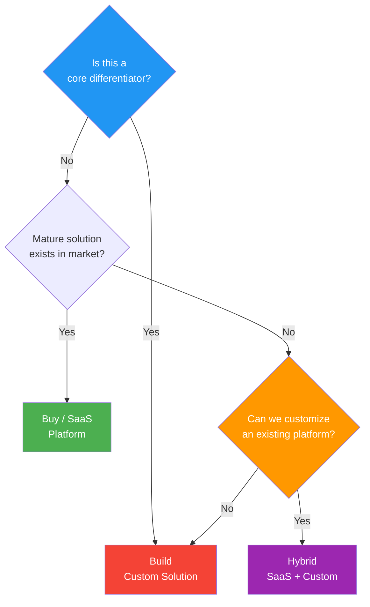

# Market Analysis / Technology Assessment

> **Project:** [Project Name]
> **Version:** [X.Y] | **Status:** [Draft | Under Review | Approved | Archived]
> **Last Updated:** [YYYY-MM-DD]

---

## Document Control

| Field | Value |
|-------|-------|
| Document Owner | [Name / Role] |
| Systems Engineer | [Name / Role] |
| Solution Architect | [Name / Role] |

### Revision History

| Version | Date | Author | Change Description |
|---------|------|--------|--------------------|
| 0.1 | [YYYY-MM-DD] | [Name] | Initial draft |
| 1.0 | [YYYY-MM-DD] | [Name] | Approved version |

### Approvals

| Role | Name | Signature | Date |
|------|------|-----------|------|
| Project Sponsor | | | |
| Solution Architect | | | |
| Procurement | | | |

---

## Table of Contents

1. [Executive Summary](#1-executive-summary)
2. [Market Landscape](#2-market-landscape)
3. [Technology Options](#3-technology-options)
4. [Make vs Buy Analysis](#4-make-vs-buy-analysis)
5. [Vendor Assessment](#5-vendor-assessment)
6. [Technology Readiness](#6-technology-readiness)
7. [Recommendation](#7-recommendation)

---

## 1. Executive Summary

| Field | Detail |
|-------|--------|
| Market Size | [e.g., $X billion — growing Y% annually] |
| Options Evaluated | [X vendors + build option] |
| Recommended Approach | [Buy / Build / Hybrid] |
| Recommended Vendor | [If buy — vendor name] |
| Key Finding | [e.g., SaaS platforms mature enough; custom build only for differentiators] |

---

## 2. Market Landscape

### 2.1 Market Overview

| Aspect | Description |
|--------|-------------|
| **Market Segment** | [e.g., Customer Relationship Management, BPM, Low-Code] |
| **Market Size** | [$X billion, growing Y% CAGR] |
| **Key Trends** | [Cloud-first, AI/ML integration, API-first, low-code] |
| **Maturity** | [Mature / Growing / Emerging] |
| **Vendor Landscape** | [Fragmented / Consolidated / Dominant players] |

### 2.2 Competitive Landscape

| Vendor | Market Position | Revenue | Customers | Strengths | Weaknesses |
|--------|---------------|---------|-----------|-----------|------------|
| [Vendor A] | Market Leader | $[X]B | [Y,000+] | [Feature richness, ecosystem] | [Cost, complexity] |
| [Vendor B] | Challenger | $[X]M | [Y,000] | [Innovation, UX] | [Smaller ecosystem] |
| [Vendor C] | Niche Player | $[X]M | [Y00] | [Domain expertise, customization] | [Scale, resources] |
| [Open Source A] | Community | N/A | [Y,000+] | [Cost, flexibility] | [Support, maturity] |

### 2.3 Technology Trends

| Trend | Maturity | Impact | Relevance |
|-------|----------|--------|----------|
| [Cloud-native SaaS] | Mature | High | 🔴 Critical — must adopt |
| [API-first architecture] | Mature | High | 🔴 Critical — integration needs |
| [AI/ML automation] | Growing | Medium | 🟡 Nice to have — Phase 3 |
| [Low-code/no-code] | Growing | Medium | 🟡 Nice to have — for citizen developers |
| [Event-driven architecture] | Mature | High | 🟡 Important — real-time processing |

---

## 3. Technology Options

### 3.1 Option Overview

| ID | Option | Type | Description | TCO (5-year) |
|----|--------|------|-------------|-------------|
| OPT-A | [Vendor A — SaaS] | Buy | [Enterprise SaaS platform] | $[X] |
| OPT-B | [Vendor B — SaaS] | Buy | [Mid-market SaaS platform] | $[X] |
| OPT-C | [Custom Development] | Build | [In-house development on cloud] | $[X] |
| OPT-D | [Open Source + Customize] | Open Source | [Open source platform with customization] | $[X] |
| OPT-E | [Hybrid — SaaS + Custom] | Hybrid | [SaaS core + custom portal] | $[X] |

### 3.2 Feature Comparison

| Feature | Must Have | OPT-A | OPT-B | OPT-C | OPT-D | OPT-E |
|---------|----------|-------|-------|-------|-------|-------|
| [Online submission] | 🔴 | ✅ | ✅ | ✅ Build | ✅ Config | ✅ Custom |
| [Auto-validation] | 🔴 | ✅ | ✅ | ✅ Build | ⚠️ Plugin | ✅ SaaS |
| [Workflow engine] | 🔴 | ✅ | ✅ | ✅ Build | ✅ Built-in | ✅ SaaS |
| [Self-service portal] | 🔴 | ✅ | ⚠️ Basic | ✅ Build | ✅ Custom | ✅ Custom |
| [Real-time dashboard] | 🟡 | ✅ | ✅ | ✅ Build | ⚠️ Plugin | ✅ SaaS |
| [ERP integration] | 🔴 | ✅ Pre-built | ⚠️ Custom | ✅ Build | ✅ Build | ✅ Build |
| [Audit trail] | 🔴 | ✅ | ✅ | ✅ Build | ⚠️ Config | ✅ SaaS |
| [Mobile support] | 🟡 | ✅ | ✅ Responsive | ✅ Build | ⚠️ Custom | ✅ Portal |
| **Coverage** | | **100%** | **75%** | **100%** | **65%** | **95%** |

### 3.3 Technology Stack Comparison

| Aspect | OPT-A SaaS | OPT-B SaaS | OPT-C Custom | OPT-D Open Source | OPT-E Hybrid |
|--------|-----------|-----------|-------------|------------------|-------------|
| **Frontend** | [Vendor-provided] | [Vendor-provided] | [React/Next.js] | [Configurable] | [Custom React] |
| **Backend** | [Vendor-managed] | [Vendor-managed] | [Node.js/Go] | [Platform] | [SaaS + custom] |
| **Database** | [Vendor-managed] | [Vendor-managed] | [PostgreSQL] | [PostgreSQL/MySQL] | [SaaS + custom] |
| **Hosting** | [Vendor cloud] | [Vendor cloud] | [AWS/Azure] | [Self-managed] | [Hybrid] |
| **Integration** | [REST API, webhooks] | [REST API] | [Custom REST] | [REST, plugins] | [REST API] |

---

## 4. Make vs Buy Analysis

### 4.1 Decision Framework

| Criterion | Weight | Make (Build) | Buy (SaaS) | Hybrid |
|-----------|--------|-------------|-----------|--------|
| **Time to market** | 20% | [Slow — 9-12 months] | [Fast — 3-4 months] | [Medium — 6 months] |
| **Total cost (5-year)** | 20% | [Higher — dev + maintenance] | [Lower — subscription] | [Medium] |
| **Customization** | 15% | [Full control] | [Limited to config] | [Custom for differentiators] |
| **Vendor dependency** | 15% | [None] | [High] | [Medium] |
| **Maintenance burden** | 15% | [Self-managed] | [Vendor-managed] | [Shared] |
| **Innovation** | 10% | [Self-paced] | [Vendor innovation] | [Both] |
| **Risk** | 5% | [Higher — team dependent] | [Lower — proven platform] | [Medium] |
| **Weighted Score** | **100%** | **[X]** | **[Y]** | **[Z]** |

### 4.2 Make vs Buy Decision Tree

---

## 5. Vendor Assessment

### 5.1 Vendor Evaluation Matrix

| Criterion | Weight | Vendor A | Vendor B | Vendor C | Open Source |
|-----------|--------|---------|---------|---------|------------|
| **Functional Fit** | 25% | [4/5] | [3/5] | [4/5] | [3/5] |
| **Total Cost (5-year)** | 20% | [3/5] | [4/5] | [3/5] | [5/5] |
| **Vendor Viability** | 15% | [5/5] | [4/5] | [3/5] | [3/5] |
| **Implementation Risk** | 15% | [4/5] | [4/5] | [3/5] | [2/5] |
| **Integration Capability** | 10% | [5/5] | [3/5] | [4/5] | [4/5] |
| **Support Quality** | 10% | [4/5] | [4/5] | [4/5] | [2/5] |
| **Innovation Roadmap** | 5% | [5/5] | [4/5] | [3/5] | [3/5] |
| **Weighted Score** | **100%** | **[X]** | **[Y]** | **[Z]** | **[W]** |
| **Rank** | | **[#]** | **[#]** | **[#]** | **[#]** |

### 5.2 Vendor Viability Assessment

| Vendor | Revenue | Growth | Customers | Financial Health | Roadmap | Risk |
|--------|---------|--------|-----------|-----------------|---------|------|
| [Vendor A] | $[X]B | [Y%] | [Z,000+] | [Strong — public company] | [Active — quarterly releases] | 🟢 Low |
| [Vendor B] | $[X]M | [Y%] | [Z,000] | [Good — Series C funding] | [Active — monthly releases] | 🟡 Medium |
| [Vendor C] | $[X]M | [Y%] | [Z00] | [Moderate — bootstrapped] | [Moderate — quarterly] | 🟠 High |

### 5.3 Reference Checks

| Vendor | Reference | Industry | Size | Feedback | Would Recommend |
|--------|----------|---------|------|---------|----------------|
| [Vendor A] | [Company X] | [Same industry] | [Similar size] | ["Solid platform, good support, expensive"] | ✅ Yes |
| [Vendor A] | [Company Y] | [Different industry] | [Larger] | ["Implementation took 6 months, expected 3"] | ⚠️ Conditional |
| [Vendor B] | [Company Z] | [Same industry] | [Smaller] | ["Great UX, fast implementation, limited customization"] | ✅ Yes |

---

## 6. Technology Readiness

### 6.1 Technology Readiness Level (TRL)

| Technology | TRL | Description | Risk |
|-----------|-----|-------------|------|
| [Cloud SaaS platforms] | TRL 9 | [Proven, production-ready] | 🟢 Low |
| [REST API integration] | TRL 9 | [Mature, well-understood] | 🟢 Low |
| [Rule-based workflow] | TRL 9 | [Mature, multiple products] | 🟢 Low |
| [Real-time analytics] | TRL 8 | [Proven, some tuning needed] | 🟢 Low |
| [AI/ML automation] | TRL 6 | [Demonstrated, needs customization] | 🟡 Medium |
| [Blockchain audit trail] | TRL 4 | [Experimental, not recommended] | 🔴 High |

### 6.2 Technology Risk Assessment

| Technology | Risk | Impact | Mitigation |
|-----------|------|--------|-----------|
| [Vendor lock-in] | Medium | High | [Data portability, standard APIs, contract terms] |
| [Integration complexity] | Medium | Medium | [POC, phased integration, fallback plan] |
| [Platform obsolescence] | Low | High | [Vendor viability assessment, exit strategy] |
| [Security vulnerability] | Low | Critical | [Vendor security certifications, pen testing] |

---

## 7. Recommendation

### 7.1 Recommended Approach

**Recommended:** [Option E — Hybrid (SaaS Core + Custom Portal)]

**Rationale:**
1. [SaaS core provides proven, maintained platform for workflow and data management]
2. [Custom portal differentiates customer experience — this is a core differentiator]
3. [Hybrid approach balances speed-to-market with customization needs]
4. [5-year TCO is 30% lower than full custom build]

### 7.2 Comparison Summary

| Factor | Recommended | Best Alternative | Difference |
|--------|------------|-----------------|-----------|
| 5-Year TCO | $[X] | $[Y] (Custom) | $[Z] savings |
| Time to Value | [6 months] | [12 months] | [6 months faster] |
| Functional Fit | [95%] | [100%] | [5% gap — acceptable] |
| Risk Profile | [Medium] | [High] | [Lower risk] |

### 7.3 Next Steps

| # | Action | Owner | Deadline |
|---|--------|-------|----------|
| 1 | [Present findings to Steering Committee] | [SE] | [Date] |
| 2 | [Conduct vendor demos for shortlisted options] | [BA, Architect] | [Date] |
| 3 | [Negotiate vendor contracts] | [Procurement] | [Date] |
| 4 | [Conduct integration POC] | [Tech Lead] | [Date] |
| 5 | [Finalize make/buy decision] | [Steering Committee] | [Date] |

---

## Related Documents

| Document | Relationship |
|----------|-------------|
| [[Design Options]] | Detailed design options analysis |
| [[Solution Recommendation]] | Formal recommendation based on this assessment |
| [[Feasibility Study]] | Technical feasibility supports this analysis |
| [[Business Case]] | Economic analysis feeds business case |
| [[Architecture Decision Records]] | ADRs capture technology decisions |

---

> **Template Standard:** Based on SEBoK v2 (ISO/IEC/IEEE 15288 §6.4.2), BABOK v3
> **Usage:** This assessment informs the make/buy decision and vendor selection. It should be conducted *before* committing to a technology direction. Update as market conditions change or new information emerges.
