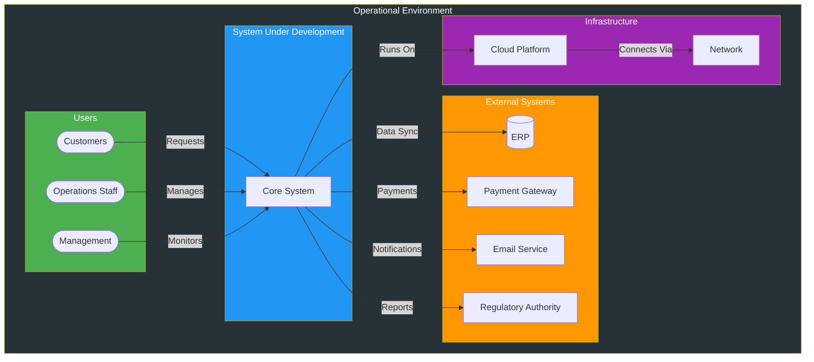
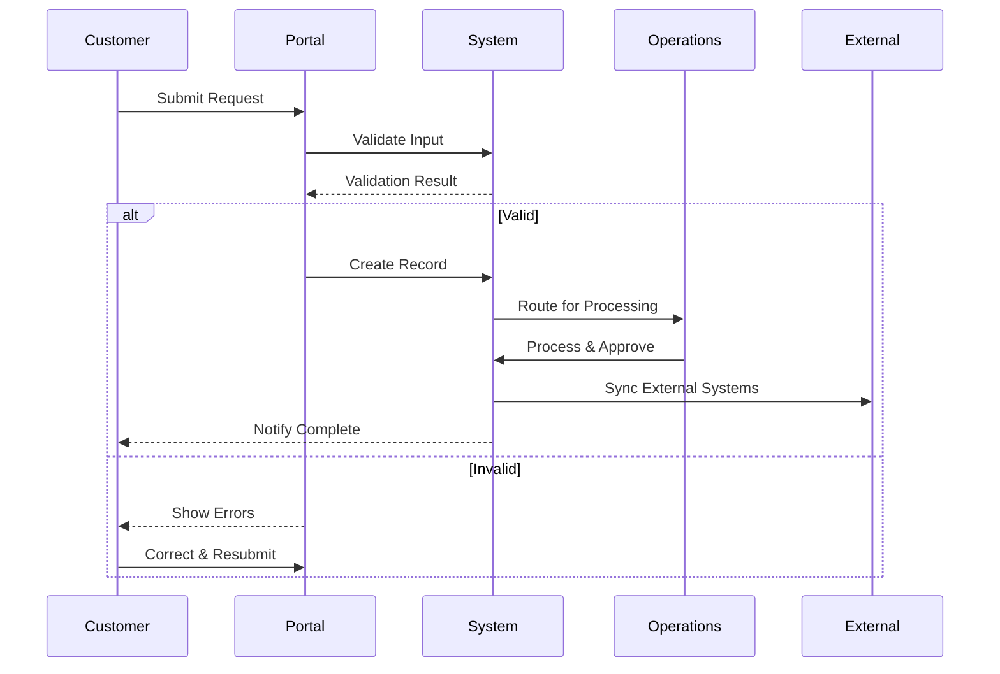
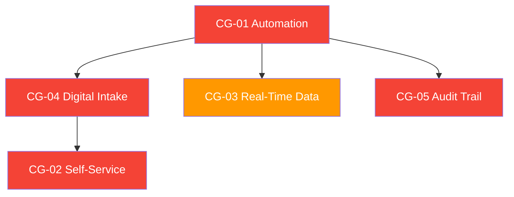

# Mission Analysis Report

> **Project:** [Project Name]
> **Version:** [X.Y] | **Status:** [Draft | Under Review | Approved | Archived]
> **Last Updated:** [YYYY-MM-DD]

---

## Document Control

| Field | Value |
|-------|-------|
| Document Owner | [Name / Role] |
| Systems Engineer | [Name / Role] |
| Sponsor | [Name / Role] |

### Revision History

| Version | Date | Author | Change Description |
|---------|------|--------|--------------------|
| 0.1 | [YYYY-MM-DD] | [Name] | Initial draft |
| 1.0 | [YYYY-MM-DD] | [Name] | Approved version |

### Approvals

| Role | Name | Signature | Date |
|------|------|-----------|------|
| Project Sponsor | | | |
| Systems Engineer | | | |
| Operations Director | | | |

---

## Table of Contents

1. [Mission Statement](#1-mission-statement)
2. [Operational Context](#2-operational-context)
3. [Operational Need](#3-operational-need)
4. [Mission Objectives](#4-mission-objectives)
5. [Operational Scenarios](#5-operational-scenarios)
6. [Environmental Context](#6-environmental-context)
7. [Capability Gaps](#7-capability-gaps)
8. [Measures of Effectiveness](#8-measures-of-effectiveness)
9. [Constraints & Assumptions](#9-constraints--assumptions)

---

## 1. Mission Statement

> A clear, concise statement of what the system must accomplish and why.

**"Enable [who] to [do what] in order to [achieve what outcome] under [what conditions]."**

[Write the mission statement here]

| Field | Detail |
|-------|--------|
| Mission | [1-2 sentence mission statement] |
| Purpose | [Why this mission exists] |
| Scope | [What is included and excluded] |
| Success Criteria | [How mission success will be measured] |
| Timeframe | [Mission duration or operational window] |

---

## 2. Operational Context

### 2.1 Operational Environment



### 2.2 Stakeholder Landscape

| Stakeholder | Role in Mission | Interest | Influence |
|------------|----------------|----------|----------|
| [End Users] | [Primary operators of the system] | High | Medium |
| [Customers] | [Beneficiaries of the service] | High | Low |
| [Operations Management] | [Mission oversight] | High | High |
| [IT Operations] | [System support and maintenance] | Medium | Medium |
| [Regulatory Bodies] | [Compliance oversight] | Medium | High |
| [Partners/Vendors] | [External system providers] | Low | Medium |

---

## 3. Operational Need

### 3.1 Problem Statement

| Field | Detail |
|-------|--------|
| Current Situation | [What exists today — brief description] |
| Problem | [What is wrong or inadequate] |
| Impact | [Consequences of not addressing — quantified] |
| Urgency | [Why now — time sensitivity] |
| Desired Outcome | [What success looks like] |

### 3.2 Need Statement

> **"There is a need for [what] to enable [who] to [do what] because [why]."**

[Write the need statement here]

### 3.3 Capability Gaps

| Gap ID | Current Capability | Required Capability | Gap Description | Priority |
|--------|-------------------|--------------------|--------------------|----------|
| CG-01 | [e.g., Manual processing] | [e.g., Automated processing] | [No automation capability] | 🔴 |
| CG-02 | [e.g., No self-service] | [e.g., Customer portal] | [No customer-facing system] | 🔴 |
| CG-03 | [e.g., Batch reporting] | [e.g., Real-time analytics] | [No real-time data capability] | 🟡 |
| CG-04 | [e.g., Paper-based forms] | [e.g., Digital forms] | [No digital intake] | 🔴 |
| CG-05 | | | | |

---

## 4. Mission Objectives

### 4.1 Objectives

| ID | Objective | Description | Measure | Target | Priority |
|----|-----------|-------------|---------|--------|----------|
| MO-01 | [e.g., Service Delivery Speed] | [Reduce time from request to delivery] | [Processing time] | [≤1 day] | 🔴 |
| MO-02 | [e.g., Service Quality] | [Reduce errors in service delivery] | [Error rate] | [<1%] | 🔴 |
| MO-03 | [e.g., Customer Access] | [Provide 24/7 self-service access] | [Availability] | [99.9%] | 🔴 |
| MO-04 | [e.g., Operational Efficiency] | [Reduce manual effort per transaction] | [Manual steps] | [≤3 steps] | 🟡 |
| MO-05 | [e.g., Compliance] | [Meet all regulatory requirements] | [Audit findings] | [Zero critical] | 🔴 |

### 4.2 Objective Traceability

```
Mission Statement
  ├── MO-01: Service Delivery Speed
  │     └── Drives: Processing time requirement
  ├── MO-02: Service Quality
  │     └── Drives: Error rate requirement, validation rules
  ├── MO-03: Customer Access
  │     └── Drives: Availability requirement, self-service portal
  ├── MO-04: Operational Efficiency
  │     └── Drives: Automation requirements
  └── MO-05: Compliance
        └── Drives: Audit trail, data retention, security requirements
```

---

## 5. Operational Scenarios

### 5.1 Scenario Overview

| ID | Scenario | Description | Frequency | Priority |
|----|----------|-------------|-----------|----------|
| OS-01 | [e.g., Normal Operations] | [Standard day-to-day operations] | Daily | 🔴 |
| OS-02 | [e.g., Peak Load] | [High-volume period — month-end, seasonal] | Monthly | 🔴 |
| OS-03 | [e.g., Exception Handling] | [Error, rejection, escalation scenarios] | Daily | 🔴 |
| OS-04 | [e.g., System Degradation] | [Partial system failure or slowdown] | Rare | 🟡 |
| OS-05 | [e.g., Disaster Recovery] | [Major system failure, failover] | Very Rare | 🟡 |

### 5.2 Scenario Detail: [Scenario Name]

> **Repeat for each scenario.**

#### OS-01: Normal Operations

| Field | Detail |
|-------|--------|
| **Trigger** | [Customer submits request] |
| **Actors** | [Customer, Operations Staff, System] |
| **Preconditions** | [System operational, staff available] |
| **Main Flow** | [Step-by-step normal process] |
| **Alternative Flows** | [Variations — e.g., incomplete submission, VIP customer] |
| **Exception Flows** | [Errors — e.g., validation failure, system timeout] |
| **Postconditions** | [Request processed, customer notified, records updated] |
| **Performance Requirements** | [Response time, throughput, accuracy] |

**Scenario Flow**



---

## 6. Environmental Context

### 6.1 Physical Environment

| Aspect | Description |
|--------|-------------|
| **Location** | [Where the system operates — cloud, on-prem, hybrid] |
| **Network** | [Network requirements — bandwidth, latency, redundancy] |
| **Hardware** | [Hardware requirements if applicable] |
| **Physical Constraints** | [Space, power, environmental conditions] |

### 6.2 Regulatory Environment

| Regulation | Requirement | Impact on Mission |
|-----------|-------------|------------------|
| [e.g., GDPR] | [Data protection, privacy] | [Consent management, data minimization] |
| [e.g., Industry Standard X] | [Audit trail, reporting] | [Logging, compliance reports] |
| [e.g., Local Law Y] | [Data residency] | [Hosting location constraint] |

### 6.3 Threat Environment

| Threat | Likelihood | Impact | Mitigation |
|--------|-----------|--------|-----------|
| [e.g., Cyber attack] | Medium | High | [Security controls, monitoring] |
| [e.g., Data breach] | Low | Critical | [Encryption, access controls] |
| [e.g., Service outage] | Medium | High | [HA, DR, SLA] |

---

## 7. Capability Gaps (Detailed)

### 7.1 Gap Analysis Summary

| Gap ID | Capability | Current State | Required State | Gap Severity | Approach |
|--------|-----------|--------------|---------------|-------------|----------|
| CG-01 | [Automation] | [Manual, 15 steps] | [Automated, 3 steps] | 🔴 Critical | Build |
| CG-02 | [Self-Service] | [None] | [Web + mobile portal] | 🔴 Critical | Build |
| CG-03 | [Real-Time Data] | [Batch, weekly] | [Real-time, continuous] | 🟡 High | Build |
| CG-04 | [Digital Intake] | [Paper forms] | [Online forms] | 🔴 Critical | Build |
| CG-05 | [Audit Trail] | [None] | [Full logging] | 🔴 Critical | Build |

### 7.2 Capability Dependencies



---

## 8. Measures of Effectiveness

### 8.1 MOEs

| ID | Measure | Description | Unit | Threshold | Objective | Source |
|----|---------|-------------|------|-----------|-----------|--------|
| MOE-01 | [Processing Time] | [End-to-end request processing] | Hours | [≤24h] | [≤8h] | [Operations] |
| MOE-02 | [Error Rate] | [Errors per 1000 transactions] | Per 1000 | [<10] | [<1] | [Quality] |
| MOE-03 | [Customer Satisfaction] | [NPS score] | Score | [≥40] | [≥60] | [Survey] |
| MOE-04 | [System Availability] | [Uptime percentage] | % | [≥99%] | [≥99.9%] | [Monitoring] |
| MOE-05 | [Compliance] | [Audit findings] | Count | [<5] | [0] | [Audit] |

### 8.2 Measurement Framework

| MOE | Baseline | Data Source | Collection Method | Frequency |
|-----|---------|------------|------------------|-----------|
| MOE-01 | [12 days] | [Operations logs] | [Automated] | Daily |
| MOE-02 | [80 per 1000] | [Quality system] | [Automated] | Weekly |
| MOE-03 | [35 NPS] | [Survey tool] | [Quarterly survey] | Quarterly |
| MOE-04 | [97%] | [Monitoring] | [Automated] | Continuous |
| MOE-05 | [12 findings] | [Audit reports] | [Per audit] | Per audit |

---

## 9. Constraints & Assumptions

### 9.1 Constraints

| ID | Constraint | Type | Impact |
|----|-----------|------|--------|
| CON-01 | [e.g., Must use existing cloud provider] | Technical | [Limits infrastructure options] |
| CON-02 | [e.g., Budget cap $500K] | Financial | [Limits scope and technology] |
| CON-03 | [e.g., Go-live by YYYY-MM-DD] | Time | [Limits scope, forces phased approach] |
| CON-04 | [e.g., Data sovereignty] | Legal | [Limits hosting options] |

### 9.2 Assumptions

| ID | Assumption | Impact if Invalid |
|----|-----------|-------------------|
| ASM-01 | [e.g., Current API remains available] | [Integration rework] |
| ASM-02 | [e.g., Staff available for training] | [Delayed adoption] |
| ASM-03 | [e.g., No regulatory changes] | [Scope change] |

---

## Related Documents

| Document | Relationship |
|----------|-------------|
| [[Stakeholder-Needs-Document]] | Stakeholder needs derived from mission analysis |
| [[Concept-of-Operations]] | Operational scenarios detailed in ConOps |
| [[System-Requirements-Specification]] | Mission objectives flow to system requirements |
| [[Business-Case]] | Mission need justifies the investment |
| [[Gap-Analysis]] | Capability gaps identified here feed gap analysis |

---

> **Template Standard:** Based on SEBoK v2 (Concept Definition), ISO/IEC/IEEE 15288 (§6.4.2)
> **Usage:** This is the *why* document — it establishes the operational need before any solution is defined. All subsequent requirements and design decisions should trace back to mission objectives.
