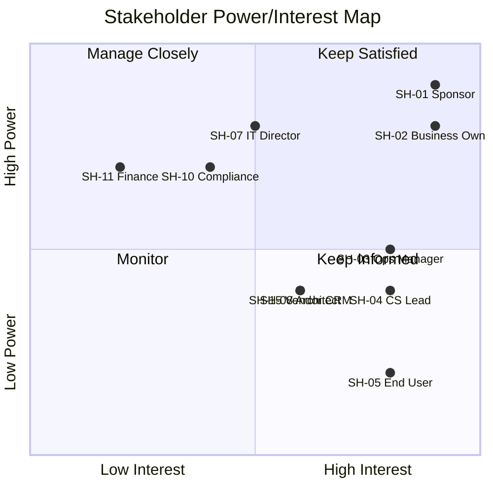

# Stakeholder Register

> **Project:** [Project Name]
> **Version:** [X.Y] | **Status:** [Draft | Under Review | Approved | Archived]
> **Last Updated:** [YYYY-MM-DD]

---

## Document Control

| Field | Value |
|-------|-------|
| Document Owner | [Name / Role] |
| Project Manager | [Name / Role] |
| Business Analyst | [Name / Role] |

### Revision History

| Version | Date | Author | Change Description |
|---------|------|--------|--------------------|
| 0.1 | [YYYY-MM-DD] | [Name] | Initial draft |
| 1.0 | [YYYY-MM-DD] | [Name] | Approved version |

---

## Table of Contents

1. [Executive Summary](#1-executive-summary)
2. [Stakeholder Register](#2-stakeholder-register)
3. [Stakeholder Classification](#3-stakeholder-classification)
4. [Stakeholder Analysis](#4-stakeholder-analysis)
5. [Engagement Planning](#5-engagement-planning)
6. [Stakeholder Change Log](#6-stakeholder-change-log)

---

## 1. Executive Summary

| Field | Detail |
|-------|--------|
| Total Stakeholders | [X individuals, Y groups] |
| Internal Stakeholders | [X] |
| External Stakeholders | [X] |
| High Influence / High Interest | [X — Manage Closely] |
| Key Risk | [e.g., Limited availability of operations team] |
| Last Updated | [YYYY-MM-DD] |

---

## 2. Stakeholder Register

### 2.1 Internal Stakeholders

| ID | Name | Title | Department | Role in Project | Contact | Influence | Interest | Attitude | Engagement Level |
|----|------|-------|-----------|----------------|---------|-----------|----------|---------|-----------------|
| SH-01 | [Name] | [Executive Sponsor] | [Leadership] | [Decision authority, funding] | [Email/Phone] | High | High | Supportive | Leading |
| SH-02 | [Name] | [Business Owner] | [Operations] | [Requirements owner, acceptance] | [Email/Phone] | High | High | Supportive | Leading |
| SH-03 | [Name] | [Operations Manager] | [Operations] | [Process expert, team lead] | [Email/Phone] | Medium | High | Neutral | Involving |
| SH-04 | [Name] | [Customer Service Lead] | [Operations] | [Customer voice, process expert] | [Email/Phone] | Medium | High | Supportive | Involving |
| SH-05 | [Name] | [End User — Senior] | [Operations] | [Subject matter expert] | [Email/Phone] | Low | High | Resistant | Consulting |
| SH-06 | [Name] | [End User — Junior] | [Operations] | [End user representative] | [Email/Phone] | Low | Medium | Neutral | Consulting |
| SH-07 | [Name] | [IT Director] | [IT] | [Technical governance, resources] | [Email/Phone] | High | Medium | Supportive | Involving |
| SH-08 | [Name] | [Solution Architect] | [IT] | [Technical design, integration] | [Email/Phone] | Medium | High | Supportive | Consulting |
| SH-09 | [Name] | [QA Lead] | [Quality] | [Testing strategy, acceptance] | [Email/Phone] | Medium | Medium | Supportive | Consulting |
| SH-10 | [Name] | [Compliance Officer] | [Governance] | [Regulatory requirements] | [Email/Phone] | High | Medium | Neutral | Informed |
| SH-11 | [Name] | [Finance Director] | [Finance] | [Budget oversight] | [Email/Phone] | High | Low | Neutral | Informed |
| SH-12 | [Name] | [HR Director] | [HR] | [Change impact on staff] | [Email/Phone] | Medium | Low | Neutral | Informed |
| SH-13 | [Name] | [Security Architect] | [Security] | [Security requirements] | [Email/Phone] | Medium | Medium | Supportive | Consulting |

### 2.2 External Stakeholders

| ID | Name | Organization | Role in Project | Contact | Influence | Interest | Attitude | Engagement Level |
|----|------|-------------|----------------|---------|-----------|----------|---------|-----------------|
| SH-14 | [Name] | [Customer Advisory] | [Customer representative] | [Email/Phone] | Low | High | Supportive | Consulting |
| SH-15 | [Name] | [Vendor — CRM] | [Technology provider] | [Email/Phone] | Medium | High | Supportive | Consulting |
| SH-16 | [Name] | [Vendor — ERP] | [Integration partner] | [Email/Phone] | Medium | Medium | Neutral | Informed |
| SH-17 | [Name] | [Regulatory Body] | [Compliance oversight] | [Email/Phone] | High | Low | Neutral | Informed |

---

## 3. Stakeholder Classification

### 3.1 Power/Interest Grid

| Quadrant | Strategy | Stakeholders |
|----------|----------|-------------|
| **High Power / High Interest** (Manage Closely) | [Regular engagement, involve in decisions, address concerns proactively] | SH-01, SH-02, SH-07 |
| **High Power / Low Interest** (Keep Satisfied) | [Periodic updates, don't overwhelm, ensure no negative surprises] | SH-10, SH-11, SH-17 |
| **Low Power / High Interest** (Keep Informed) | [Regular communication, involve in relevant activities, listen to input] | SH-03, SH-04, SH-05, SH-06, SH-08, SH-09, SH-14, SH-15 |
| **Low Power / Low Interest** (Monitor) | [Minimal communication, respond to inquiries] | SH-12, SH-16 |

### 3.2 Stakeholder Map

### 3.3 Stakeholder Categories

| Category | Stakeholders | Count | Primary Concern |
|----------|-------------|-------|----------------|
| **Decision Makers** | SH-01, SH-02, SH-07 | 3 | [ROI, timeline, risk] |
| **Subject Matter Experts** | SH-03, SH-04, SH-08, SH-09, SH-13 | 5 | [Requirements, design, quality] |
| **End Users** | SH-05, SH-06, SH-14 | 3 | [Usability, workload, job impact] |
| **Governance** | SH-10, SH-11, SH-12 | 3 | [Compliance, budget, people] |
| **External** | SH-15, SH-16, SH-17 | 3 | [Integration, contract, compliance] |

---

## 4. Stakeholder Analysis

### 4.1 Stakeholder Needs & Expectations

| ID | Stakeholder | Key Needs | Expectations | Concerns |
|----|------------|-----------|-------------|----------|
| SH-01 | Sponsor | [ROI, strategic alignment] | [On time, on budget, benefits realized] | [Risk of failure] |
| SH-02 | Business Owner | [Improved operations] | [System meets requirements] | [Disruption during transition] |
| SH-03 | Ops Manager | [Team efficiency] | [System reduces workload] | [Training burden, adoption] |
| SH-05 | End User | [Easier daily work] | [System is intuitive] | [Job security, learning curve] |
| SH-10 | Compliance | [Audit trail] | [Full compliance] | [Gaps in logging] |

### 4.2 Influence Assessment

| ID | Stakeholder | Influence Type | Decision Authority | Impact if Lost |
|----|------------|---------------|-------------------|---------------|
| SH-01 | Sponsor | [Formal authority] | [Budget, scope, go/no-go] | 🔴 Critical — project may be cancelled |
| SH-02 | Business Owner | [Domain authority] | [Requirements, acceptance] | 🔴 Critical — no requirements owner |
| SH-07 | IT Director | [Resource authority] | [Technical resources] | 🟠 High — resource constraints |
| SH-03 | Ops Manager | [Expert influence] | [Process decisions] | 🟡 Medium — delays in requirements |

### 4.3 Engagement Assessment Matrix

| Stakeholder | Current Awareness | Current Support | Desired Engagement | Gap | Strategy |
|------------|------------------|----------------|-------------------|-----|----------|
| SH-01 | High | High | Leading | None | Maintain — regular updates |
| SH-03 | Medium | Neutral | Involving | ↑1 level | Involve in workshops, co-design |
| SH-05 | Low | Resistant | Consulting | ↑2 levels | Address concerns, training, champion |
| SH-10 | Medium | Neutral | Informed | None | Monthly compliance updates |

---

## 5. Engagement Planning

### 5.1 Engagement Strategy per Stakeholder

| ID | Stakeholder | Strategy | Key Activities | Frequency | Owner |
|----|------------|----------|---------------|-----------|-------|
| SH-01 | Sponsor | [Decision partner] | [Steering committee, 1:1] | Weekly | PM |
| SH-02 | Business Owner | [Requirements partner] | [Workshops, reviews, sign-off] | Weekly | BA |
| SH-03 | Ops Manager | [Co-designer] | [Workshops, prototyping, UAT] | Bi-weekly | BA |
| SH-04 | CS Lead | [Customer advocate] | [Workshops, observation] | Bi-weekly | BA |
| SH-05 | End User — Senior | [Champion development] | [1:1, training, involvement in design] | Monthly | Change Mgr |
| SH-06 | End User — Junior | [User validation] | [Workshops, usability testing] | Monthly | BA |
| SH-07 | IT Director | [Technical governance] | [Architecture reviews, resource planning] | Monthly | PM |
| SH-08 | Architect | [Technical design] | [Design reviews, ADRs] | Bi-weekly | Tech Lead |
| SH-09 | QA Lead | [Quality assurance] | [Test planning, requirements review] | Bi-weekly | BA |
| SH-10 | Compliance | [Regulatory guidance] | [Compliance reviews, audit prep] | Monthly | BA |
| SH-11 | Finance | [Budget oversight] | [Monthly financial report] | Monthly | PM |
| SH-14 | Customer Rep | [Customer voice] | [Interviews, UAT] | As needed | BA |
| SH-15 | Vendor — CRM | [Technical partner] | [Integration reviews, support] | As needed | Tech Lead |

### 5.2 Communication Matrix

| Stakeholder | Communication | Channel | Frequency | Owner |
|------------|--------------|---------|-----------|-------|
| SH-01 Sponsor | [Status + decisions] | [Email + 1:1] | Weekly | PM |
| SH-02 Business Owner | [Requirements + approvals] | [Workshop + email] | Weekly | BA |
| SH-03-06 Operations | [Updates + training] | [Team meeting + newsletter] | Bi-weekly | BA |
| SH-07 IT Director | [Technical status] | [Email + meeting] | Monthly | PM |
| SH-08 Architect | [Design decisions] | [Tech review] | Bi-weekly | Tech Lead |
| SH-10 Compliance | [Compliance status] | [Email report] | Monthly | BA |
| SH-11 Finance | [Budget status] | [Email report] | Monthly | PM |

---

## 6. Stakeholder Change Log

| Date | Change | Reason | Impact | Updated By |
|------|--------|--------|--------|-----------|
| [YYYY-MM-DD] | [New stakeholder added: SH-XX] | [Identified during workshops] | [Added to engagement plan] | [BA] |
| [YYYY-MM-DD] | [SH-05 attitude changed: Resistant → Neutral] | [Addressed concerns in 1:1] | [Reduced risk] | [Change Mgr] |
| [YYYY-MM-DD] | [SH-12 role changed — new HR Director] | [Organizational change] | [Re-assess engagement] | [PM] |

---

## Related Documents

| Document | Relationship |
|----------|-------------|
| [[Stakeholder-Engagement-Approach]] | Detailed engagement strategy |
| [[Stakeholder-Needs-Document]] | Needs captured per stakeholder |
| [[Communications-Management-Plan]] | Communication procedures |
| [[Change-Strategy]] | Change management for resistant stakeholders |
| [[Governance-Approach]] | Decision authority per stakeholder |

---

> **Template Standard:** Based on SEBoK v2 (ISO/IEC/IEEE 15288 §6.4.1), PMBOK v8, BABOK v3
> **Usage:** This is a *living document* — update whenever stakeholders change (new, removed, role change, attitude change). Review at least monthly. The register drives all engagement and communication activities.
