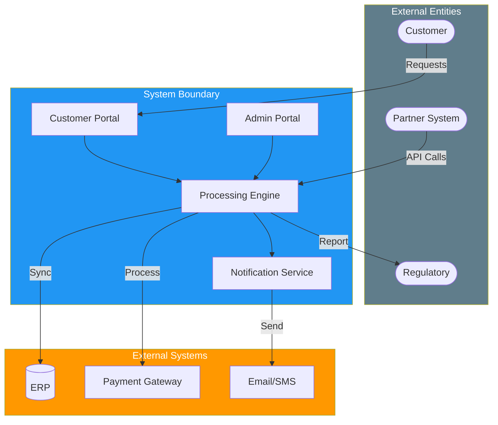

# System Requirements Specification (SyRS)

> **Project:** [Project Name]
> **Version:** [X.Y] | **Status:** [Draft | Under Review | Approved | Archived]
> **Last Updated:** [YYYY-MM-DD]

---

## Document Control

| Field | Value |
|-------|-------|
| Document Owner | [Name / Role] |
| Systems Engineer | [Name / Role] |
| Business Analyst | [Name / Role] |

### Revision History

| Version | Date | Author | Change Description |
|---------|------|--------|--------------------|
| 0.1 | [YYYY-MM-DD] | [Name] | Initial draft |
| 1.0 | [YYYY-MM-DD] | [Name] | Approved version |

### Approvals

| Role | Name | Signature | Date |
|------|------|-----------|------|
| Systems Engineer | | | |
| Solution Architect | | | |
| Operations Director | | | |

---

## Table of Contents

1. [Executive Summary](#1-executive-summary)
2. [System Context](#2-system-context)
3. [Functional Requirements](#3-functional-requirements)
4. [Non-Functional Requirements](#4-non-functional-requirements)
5. [Interface Requirements](#5-interface-requirements)
6. [Constraints](#6-constraints)
7. [Requirements Traceability](#7-requirements-traceability)

---

## 1. Executive Summary

| Field | Detail |
|-------|--------|
| System Purpose | [What the system does and for whom] |
| Total Requirements | [X functional, Y non-functional] |
| Priority Distribution | [🔴 X, 🟡 Y, 🟢 Z] |
| Source Documents | [[Stakeholder Needs Document]], [[Concept of Operations]] |

---

## 2. System Context

### 2.1 System Boundary

---

## 3. Functional Requirements

### 3.1 Requirement Categories

| Category | Description | Count |
|----------|-------------|-------|
| [Request Management] | [Submission, processing, tracking] | [X] |
| [Validation & Rules] | [Input validation, business rules] | [X] |
| [Workflow & Routing] | [Approval, escalation, assignment] | [X] |
| [User Management] | [Authentication, authorization, profiles] | [X] |
| [Reporting & Analytics] | [Dashboards, reports, exports] | [X] |
| [Integration] | [External system connectivity] | [X] |
| [Notification] | [Email, SMS, in-app notifications] | [X] |

### 3.2 Functional Requirements Register

| Req ID | Requirement | Category | Priority | Source | Status |
|--------|-------------|----------|----------|--------|--------|
| SYRS-001 | [System shall allow customers to submit requests via web portal] | Request Mgmt | 🔴 | SN-03 | Draft |
| SYRS-002 | [System shall validate all inputs in real-time against business rules] | Validation | 🔴 | SN-08 | Draft |
| SYRS-003 | [System shall auto-classify and route requests based on rules] | Workflow | 🔴 | SN-01 | Draft |
| SYRS-004 | [System shall auto-approve requests meeting all criteria] | Workflow | 🔴 | SN-01 | Draft |
| SYRS-005 | [System shall provide real-time status to customers via portal] | Request Mgmt | 🔴 | SN-04 | Draft |
| SYRS-006 | [System shall maintain complete audit trail of all actions] | Security | 🔴 | SN-06 | Draft |
| SYRS-007 | [System shall send notifications at each status change] | Notification | 🟡 | SN-04 | Draft |
| SYRS-008 | [System shall generate management dashboards with real-time data] | Reporting | 🟡 | SN-05 | Draft |
| SYRS-009 | [System shall integrate with ERP via REST API] | Integration | 🔴 | SN-09 | Draft |
| SYRS-010 | [System shall support role-based access control] | User Mgmt | 🔴 | SN-06 | Draft |
| SYRS-011 | | | | | |

### 3.3 Business Rules

| Rule ID | Rule | Category | Exception | Source |
|---------|------|----------|-----------|--------|
| BR-01 | [Incomplete requests shall be rejected with specific field identification] | Validation | None | BUR-01 |
| BR-02 | [Requests > $10K require manager approval] | Workflow | VIP: auto-approve ≤$25K | BUR-02 |
| BR-03 | [Duplicate requests (30 days) shall be flagged] | Validation | Re-submission after rejection | BUR-03 |
| BR-04 | [Requests processed in FIFO order] | Workflow | Priority and regulatory exceptions | BUR-04 |
| BR-05 | [Data retained 7 years after closure] | Data | Legal hold overrides | BUR-05 |

---

## 4. Non-Functional Requirements

### 4.1 Performance

| Req ID | Requirement | Target | Measurement |
|--------|-------------|--------|-------------|
| NFR-001 | [Page response time] | [<2 seconds] | [95th percentile under normal load] |
| NFR-002 | [API response time] | [<1 second] | [95th percentile under normal load] |
| NFR-003 | [Request processing time] | [<1 hour] | [End-to-end from submission to decision] |
| NFR-004 | [Concurrent users supported] | [100] | [Without performance degradation] |
| NFR-005 | [Daily transaction volume] | [500] | [Without performance degradation] |

### 4.2 Availability & Reliability

| Req ID | Requirement | Target | Measurement |
|--------|-------------|--------|-------------|
| NFR-006 | [System availability] | [99.9%] | [Monthly uptime, excluding planned maintenance] |
| NFR-007 | [Recovery Time Objective (RTO)] | [4 hours] | [Time to restore service after failure] |
| NFR-008 | [Recovery Point Objective (RPO)] | [1 hour] | [Maximum data loss in failure scenario] |
| NFR-009 | [Planned maintenance window] | [Saturday 02:00-06:00] | [Maximum 4 hours/month] |

### 4.3 Security

| Req ID | Requirement | Target | Standard |
|--------|-------------|--------|---------|
| NFR-010 | [Authentication] | [Multi-factor authentication for admin] | [OWASP] |
| NFR-011 | [Authorization] | [Role-based access control] | [ISO 27001] |
| NFR-012 | [Data encryption at rest] | [AES-256] | [NIST SP 800-57] |
| NFR-013 | [Data encryption in transit] | [TLS 1.3] | [NIST SP 800-52] |
| NFR-014 | [Audit logging] | [All actions logged with user, timestamp, action] | [ISO 27001] |
| NFR-015 | [Session timeout] | [30 minutes inactivity] | [OWASP] |

### 4.4 Usability

| Req ID | Requirement | Target | Measurement |
|--------|-------------|--------|-------------|
| NFR-016 | [Customer portal — time to complete submission] | [<5 minutes] | [First-time user test] |
| NFR-017 | [Admin portal — time to process request] | [<3 minutes] | [Trained user test] |
| NFR-018 | [Training time — customer] | [<15 minutes] | [Self-service guide] |
| NFR-019 | [Training time — operations staff] | [<2 days] | [Classroom + hands-on] |
| NFR-020 | [Accessibility] | [WCAG 2.1 AA] | [Automated + manual audit] |

### 4.5 Scalability & Maintainability

| Req ID | Requirement | Target | Measurement |
|--------|-------------|--------|-------------|
| NFR-021 | [Horizontal scalability] | [Scale to 10x current volume without architecture change] | [Load test] |
| NFR-022 | [Code maintainability] | [Cyclomatic complexity <10 per function] | [Static analysis] |
| NFR-023 | [API versioning] | [Backward compatible for 2 major versions] | [API contract test] |
| NFR-024 | [Deployment frequency] | [Support daily deployments without downtime] | [CI/CD pipeline] |

---

## 5. Interface Requirements

### 5.1 External Interfaces

| Interface ID | System | Type | Protocol | Data Exchanged | Direction |
|-------------|--------|------|---------|---------------|-----------|
| INT-001 | [ERP System] | API | [REST/JSON] | [Customer data, transactions] | Bidirectional |
| INT-002 | [Payment Gateway] | API | [REST/JSON] | [Payment requests, confirmations] | Outbound |
| INT-003 | [Email Service] | API | [SMTP/API] | [Notifications] | Outbound |
| INT-004 | [SMS Service] | API | [REST/JSON] | [Notifications] | Outbound |
| INT-005 | [Partner System] | API | [REST/JSON] | [Bulk requests] | Inbound |
| INT-006 | [Regulatory Reporting] | File | [CSV/XML] | [Compliance reports] | Outbound |

### 5.2 User Interfaces

| Interface | Users | Devices | Requirements |
|-----------|-------|---------|-------------|
| [Customer Portal] | [Customers] | [Desktop, tablet, mobile] | [Responsive, WCAG 2.1 AA, multi-language] |
| [Admin Portal] | [Operations, Management] | [Desktop] | [Chrome/Edge, keyboard navigation] |
| [Dashboard] | [Management] | [Desktop, tablet] | [Responsive, real-time refresh] |
| [API] | [Partners, developers] | [Programmatic] | [OpenAPI 3.0 spec, rate limiting] |

---

## 6. Constraints

| ID | Constraint | Type | Source | Impact |
|----|-----------|------|--------|--------|
| CON-01 | [Must use existing cloud provider] | Technical | [Organizational policy] | [Limits infrastructure options] |
| CON-02 | [Data must remain in-country] | Legal | [Data sovereignty law] | [Limits hosting options] |
| CON-03 | [Must integrate with existing ERP] | Technical | [Business decision] | [API dependency] |
| CON-04 | [Budget cap $500K] | Financial | [Business case] | [Limits scope and technology] |
| CON-05 | [Go-live by YYYY-MM-DD] | Time | [Regulatory deadline] | [Limits scope, forces phased approach] |

---

## 7. Requirements Traceability

### 7.1 Traceability Matrix

| System Req | Stakeholder Need | Mission Objective | Test Case | Status |
|-----------|-----------------|------------------|-----------|--------|
| SYRS-001 | SN-03 | MO-03 | TC-001 | Draft |
| SYRS-002 | SN-08 | MO-02 | TC-002 | Draft |
| SYRS-003 | SN-01 | MO-01 | TC-003 | Draft |
| SYRS-004 | SN-01 | MO-01 | TC-004 | Draft |
| SYRS-005 | SN-04 | MO-03 | TC-005 | Draft |
| SYRS-006 | SN-06 | MO-05 | TC-006 | Draft |
| SYRS-007 | SN-04 | MO-03 | TC-007 | Draft |
| SYRS-008 | SN-05 | MO-04 | TC-008 | Draft |
| SYRS-009 | SN-09 | MO-04 | TC-009 | Draft |
| SYRS-010 | SN-06 | MO-05 | TC-010 | Draft |

---

## Related Documents

| Document | Relationship |
|----------|-------------|
| [[Stakeholder Needs Document]] | Source of stakeholder needs |
| [[Concept of Operations (ConOps)]] | Operational scenarios driving these requirements |
| [[Mission Analysis Report]] | Mission objectives these requirements support |
| [[Business Requirements]] | Business-level requirements elaborated here |
| [[SRS]] | Software-level requirements derived from this SyRS |
| [[Interface Control Document (ICD)]] | Detailed interface specifications |
| [[Requirements Traceability Matrix]] | Full bidirectional traceability |

---

> **Template Standard:** Based on SEBoK v2, ISO/IEC/IEEE 15288 (§6.4.3), ISO/IEC/IEEE 29148
> **Usage:** The SyRS captures *system-level* requirements — what the system must do and how well. It is broader than the SRS (which focuses on software). The SyRS includes hardware, software, data, and interface requirements at the system boundary level.
