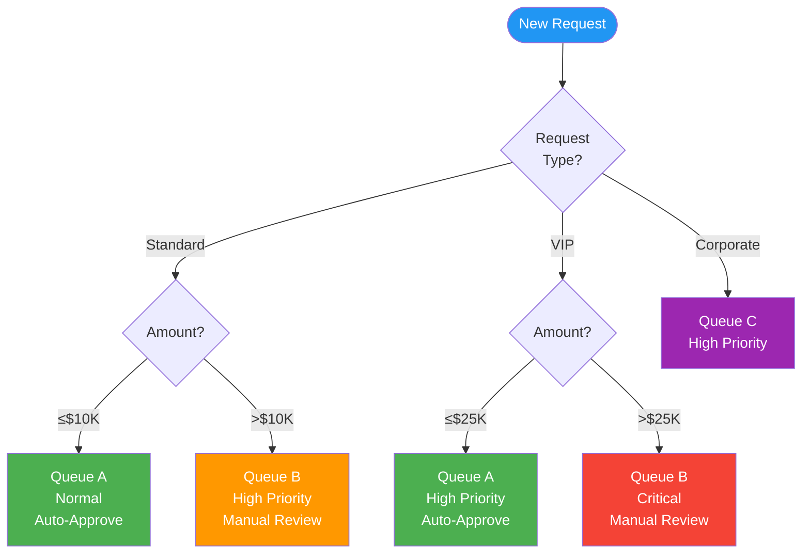
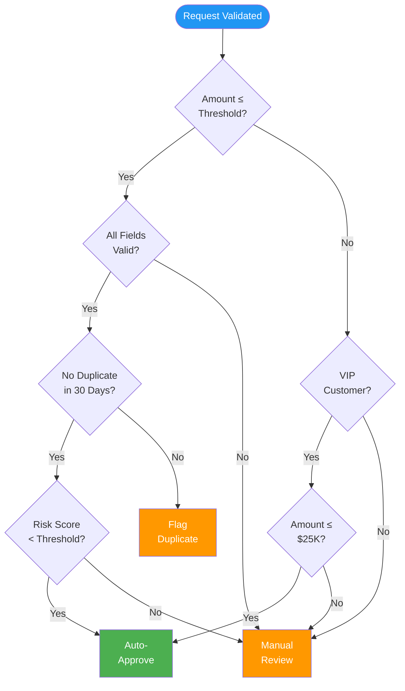

# Decision Tables / Decision Trees

> **Project:** [Project Name]
> **Version:** [X.Y] | **Status:** [Draft | Under Review | Approved]
> **Last Updated:** [YYYY-MM-DD]

---

## Document Control

| Field | Value |
|-------|-------|
| Document Owner | [Name / Role] |
| Business Analyst | [Name / Role] |

---

## 1. Purpose

> This document captures complex business rules as decision tables and decision trees. These visual representations complement textual requirements and reduce ambiguity in rule interpretation.

## 2. Decision Table Index

| # | Table/Tree | Business Rule | Related Requirement | Status |
|---|-----------|--------------|-------------------|--------|
| DT-01 | [Request Classification] | [How requests are classified] | FR-101 | Draft |
| DT-02 | [Auto-Approval Rules] | [When requests are auto-approved] | FR-103 | Draft |
| DT-03 | [Escalation Rules] | [When and where to escalate] | FR-107 | Draft |
| DT-04 | [Notification Rules] | [Who gets notified and when] | FR-201 to FR-205 | Draft |
| DT-05 | [Priority Assignment] | [How request priority is determined] | FR-102 | Draft |

## 3. Decision Tables

### DT-01: Request Classification

> **Rule:** Classify incoming requests based on type, source, and amount.

| | Rule 1 | Rule 2 | Rule 3 | Rule 4 | Rule 5 |
|--|--------|--------|--------|--------|--------|
| **CONDITIONS** | | | | | |
| Request Type | Standard | Standard | VIP | VIP | Corporate |
| Amount | ≤$10K | >$10K | ≤$25K | >$25K | Any |
| Submission Channel | Online | Online | Online | Online | API/Bulk |
| **ACTIONS** | | | | | |
| Classification | Standard | Standard-High | VIP | VIP-High | Corporate |
| Queue Assignment | Queue A | Queue B | Queue A | Queue B | Queue C |
| Priority | Normal | High | High | Critical | High |
| Auto-Approve? | Yes | No | Yes | No | No |
| SLA Target | 4 hours | 2 hours | 2 hours | 1 hour | 4 hours |

### DT-02: Auto-Approval Rules

> **Rule:** Determine if a request can be auto-approved.

| | Rule 1 | Rule 2 | Rule 3 | Rule 4 | Rule 5 | Rule 6 |
|--|--------|--------|--------|--------|--------|--------|
| **CONDITIONS** | | | | | | |
| Amount ≤ Threshold | Yes | No | Yes | Yes | Yes | Yes |
| VIP Customer | No | — | Yes | No | No | No |
| VIP Amount ≤ $25K | — | — | Yes | — | — | — |
| All Fields Valid | Yes | — | — | No | Yes | Yes |
| No Duplicate (30d) | Yes | — | — | — | No | Yes |
| Risk Score < Threshold | Yes | — | — | — | — | No |
| **ACTIONS** | | | | | | |
| Decision | ✅ Auto-Approve | ❌ Manual Review | ✅ Auto-Approve | ❌ Manual Review | ❌ Flag Duplicate | ❌ Manual Review |
| Notification | Customer | Ops Queue | Customer | Ops Queue | Ops Queue | Ops Queue |
| SLA Clock | Starts | Starts | Starts | Paused | Paused | Starts |

### DT-03: Escalation Rules

> **Rule:** Determine when and where to escalate.

| | Rule 1 | Rule 2 | Rule 3 | Rule 4 |
|--|--------|--------|--------|--------|
| **CONDITIONS** | | | | |
| Time in Queue | >4 hours | >8 hours | >24 hours | >48 hours |
| Priority | Normal | High | Critical | Any |
| Customer Complaint | No | No | No | Yes |
| **ACTIONS** | | | | |
| Escalation Level | Team Lead | Manager | Director | Director |
| Notification | Email | Email + Slack | Email + Slack + Phone | Email + Slack + Phone |
| SLA Extension | No | No | +4 hours | Case-by-case |

### DT-04: Notification Rules

> **Rule:** Who gets notified and via what channel.

| | Rule 1 | Rule 2 | Rule 3 | Rule 4 | Rule 5 |
|--|--------|--------|--------|--------|--------|
| **CONDITIONS** | | | | | |
| Event | Submitted | Status Change | Approved | Rejected | Escalated |
| Stakeholder | Customer | Customer | Customer | Customer | Manager |
| **ACTIONS** | | | | | |
| Email | ✅ | ✅ | ✅ | ✅ | ✅ |
| SMS | ❌ | ❌ | ✅ | ✅ | ✅ |
| In-App | ✅ | ✅ | ✅ | ✅ | ✅ |
| Timing | Immediate | Within 5 min | Immediate | Immediate | Immediate |

## 4. Decision Trees

### DT-01-Tree: Request Classification

### DT-02-Tree: Auto-Approval Decision

## 5. Rules Summary

| Rule Category | Table | Rules Count | Complexity | Automation Level |
|--------------|-------|------------|-----------|-----------------|
| [Classification] | DT-01 | [5 rules] | Medium | [Fully automated] |
| [Auto-Approval] | DT-02 | [6 rules] | High | [Fully automated] |
| [Escalation] | DT-03 | [4 rules] | Medium | [Fully automated] |
| [Notification] | DT-04 | [5 rules] | Low | [Fully automated] |
| [Priority] | DT-05 | [3 rules] | Low | [Fully automated] |

## 6. Rules Validation Checklist

| # | Check | Status |
|---|-------|--------|
| 1 | [All conditions have defined values] | ✅❌ |
| 2 | [All actions are specified for every rule] | ✅❌ |
| 3 | [No conflicting rules (same conditions, different actions)] | ✅❌ |
| 4 | [No gaps (all condition combinations covered)] | ✅❌ |
| 5 | [Rules reviewed by business stakeholders] | ✅❌ |
| 6 | [Rules tested with sample data] | ✅❌ |
| 7 | [Exceptions documented] | ✅❌ |

---

## Related Documents

| Document | Relationship |
|----------|-------------|
| [[SRS]] | Requirements these rules implement |
| [[Business Rules]] | Business rules visualized here |
| [[Requirements (Verified)]] | Rule completeness verified here |
| [[Acceptance Criteria]] | Rules tested via ACs |

---

> **Template Standard:** Based on SWEBOK v4, ISO/IEC/IEEE 29148
> **Usage:** Decision tables are *exhaustive* — every combination of conditions must have an action. Decision trees are *visual* — easier to follow but harder to verify completeness. Use both: tables for completeness, trees for communication.
