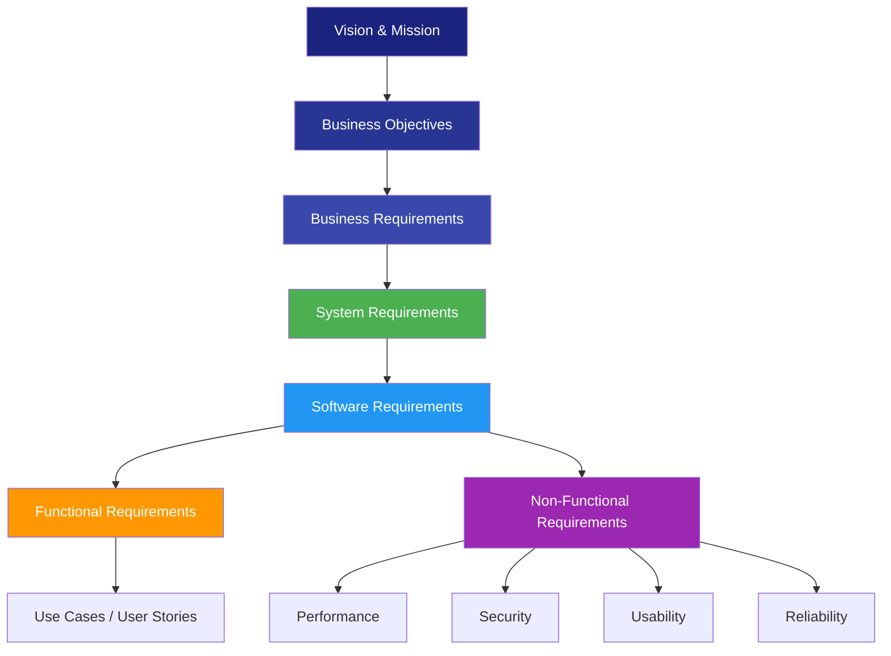
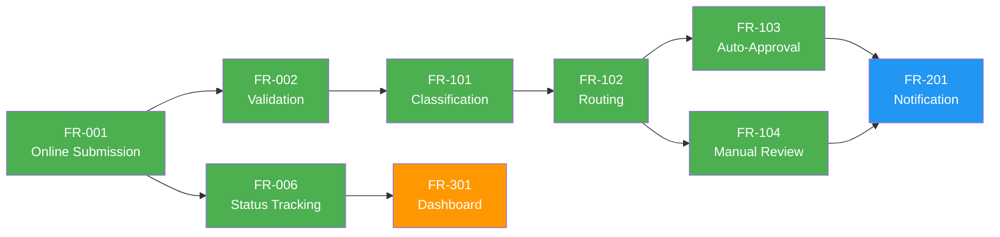

# Requirements Architecture

> **Project:** [Project Name]
> **Version:** [X.Y] | **Status:** [Draft | Under Review | Approved | Archived]
> **Last Updated:** [YYYY-MM-DD]

---

## Document Control

| Field | Value |
|-------|-------|
| Document Owner | [Name / Role] |
| Business Analyst | [Name / Role] |

### Revision History

| Version | Date | Author | Change Description |
|---------|------|--------|--------------------|
| 0.1 | [YYYY-MM-DD] | [Name] | Initial draft |
| 1.0 | [YYYY-MM-DD] | [Name] | Approved version |

---

## 1. Purpose

> This document defines the structure and organization of all requirements, their interrelationships, and the viewpoints representing different stakeholder concerns. It provides the architectural framework for managing requirements complexity.

## 2. Requirements Hierarchy

## 3. Requirements Decomposition

### 3.1 Feature Hierarchy

| Feature | Sub-Feature | Requirements | Priority |
|---------|------------|-------------|----------|
| **Request Management** | | | |
| | Online Submission | FR-001, FR-002, FR-003, FR-005 | 🔴 |
| | Status Tracking | FR-006 | 🔴 |
| | History | FR-007 | 🔴 |
| **Processing & Workflow** | | | |
| | Auto-Classification | FR-101 | 🔴 |
| | Auto-Routing | FR-102 | 🔴 |
| | Auto-Approval | FR-103 | 🔴 |
| | Manual Review | FR-104, FR-106 | 🔴 |
| | Escalation | FR-107 | 🟡 |
| **Notifications** | | | |
| | Email Notifications | FR-201, FR-202 | 🔴 |
| | SMS Notifications | FR-203 | 🟡 |
| | Templates | FR-204, FR-205 | 🟡 |
| **Reporting** | | | |
| | Dashboards | FR-301, FR-305 | 🟡 |
| | Standard Reports | FR-302 | 🟡 |
| | Ad-hoc Reports | FR-303, FR-304 | 🟢 |

### 3.2 Requirements Dependency Map

## 4. Requirements Viewpoints

### 4.1 Viewpoint Definitions

| Viewpoint | Stakeholder | Concerns | Requirements Focus |
|-----------|------------|---------|-------------------|
| **Business** | Sponsor, Business Owner | Value, ROI, compliance | BR-XX, OBJ-XX |
| **User** | End Users, Customers | Usability, efficiency | FR-001 to FR-007, USA-XX |
| **Operations** | Operations Staff | Processing, workflow | FR-101 to FR-107 |
| **Technical** | Architect, Developers | Performance, scalability, security | NFR-XX, SEC-XX, PERF-XX |
| **Compliance** | Compliance Officer | Audit, retention, regulation | BR-07, SEC-XX, CMP-XX |

### 4.2 Viewpoint Mapping

| Requirement | Business | User | Operations | Technical | Compliance |
|------------|----------|------|-----------|-----------|-----------|
| FR-001 Online Submission | ✅ | ✅ | | | |
| FR-002 Validation | ✅ | ✅ | ✅ | | |
| FR-101 Classification | | | ✅ | | |
| FR-103 Auto-Approval | ✅ | | ✅ | | |
| FR-007 Audit Trail | | | | | ✅ |
| PERF-001 Response Time | | ✅ | | ✅ | |
| SEC-001 MFA | | | | ✅ | ✅ |
| CMP-001 GDPR | ✅ | | | | ✅ |

## 5. Requirements Grouping

### 5.1 By Release/Phase

| Phase | Features | Requirements | Target Date |
|-------|---------|-------------|------------|
| **Phase 1 — Core** | Online Submission, Validation, Workflow, Notifications | FR-001 to FR-107, FR-201 to FR-202 | [YYYY-MM-DD] |
| **Phase 2 — Enhancement** | Dashboard, Reports, Bulk Upload | FR-301 to FR-305, FR-008 | [YYYY-MM-DD] |
| **Phase 3 — Advanced** | SMS, Advanced Analytics | FR-203, FR-303 | [YYYY-MM-DD] |

### 5.2 By Component

| Component | Requirements | Technology |
|-----------|-------------|-----------|
| [Customer Portal] | FR-001, FR-003, FR-005, FR-006 | [React, responsive] |
| [Admin Portal] | FR-101 to FR-107, FR-301, FR-302 | [React, desktop] |
| [API Layer] | FR-002, FR-004, FR-101, FR-102 | [REST, Node.js] |
| [Notification Service] | FR-201 to FR-205 | [Email/SMS service] |
| [Audit Service] | FR-007 | [Immutable log] |

## 6. Requirements Constraints & Trade-offs

| Constraint | Affected Requirements | Trade-off | Decision |
|-----------|---------------------|----------|---------|
| [Budget cap] | FR-303 (deferred) | [Advanced analytics deferred to Phase 3] | [Approved by Steering Committee] |
| [Timeline] | FR-203 (deferred) | [SMS notifications deferred to Phase 3] | [Approved by CCB] |
| [Performance] | PERF-001 | [CDN adds cost but meets <2s target] | [Approved — critical requirement] |

---

## Related Documents

| Document | Relationship |
|----------|-------------|
| [[SRS]] | Requirements organized by this architecture |
| [[Business Requirements]] | Business requirements in the hierarchy |
| [[Requirements Traceability Matrix]] | Traceability follows this structure |
| [[Architecture Decision Records]] | ADRs capture structural decisions |
| [[Release Notes]] | Releases align with phase grouping |

---

> **Template Standard:** Based on BABOK v3, ISO/IEC/IEEE 42010, ISO/IEC/IEEE 29148
> **Usage:** This document provides the *structural framework* for all requirements. When adding new requirements, place them in the correct position in the hierarchy. When stakeholders ask "where does requirement X fit?" — point them here.
