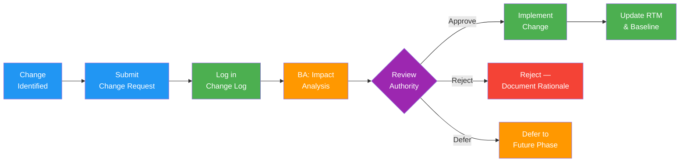

# Requirements Change Log

> **Project:** [Project Name]
> **Version:** [X.Y] | **Status:** [Active]
> **Last Updated:** [YYYY-MM-DD]

---

## Document Control

| Field | Value |
|-------|-------|
| Document Owner | [Name / Role] |
| Business Analyst | [Name / Role] |
| Change Control Authority | [PM / CCB] |

---

## 1. Purpose

> This log tracks all changes to baselined requirements. Every change must be logged, analyzed, and approved/rejected through the change control process defined in [[Governance Approach]].

## 2. Change Control Process

## 3. Change Register

| CR ID | Date | Requestor | Requirement ID | Change Description | Rationale | Classification | Impact Analysis | Decision | Decision Date | Authority |
|-------|------|-----------|---------------|-------------------|-----------|---------------|----------------|----------|--------------|-----------|
| CR-001 | [YYYY-MM-DD] | [Name] | [FR-005] | [Add "save draft" capability] | [User feedback — 40% abandon forms] | Moderate | [Scope: +1 feature, Schedule: +3 days, Cost: +$2K] | Approved | [YYYY-MM-DD] | CCB |
| CR-002 | [YYYY-MM-DD] | [Name] | [NFR-001] | [Change response time from <2s to <1s] | [Competitive benchmark] | Minor | [Scope: none, Schedule: none, Cost: +$5K (CDN)] | Approved | [YYYY-MM-DD] | PM |
| CR-003 | [YYYY-MM-DD] | [Name] | [FR-303] | [Add ML-based anomaly detection] | [Management request] | Major | [Scope: +large feature, Schedule: +3 months, Cost: +$50K] | Deferred | [YYYY-MM-DD] | Steering Committee |
| CR-004 | [YYYY-MM-DD] | [Name] | [BR-08] | [Add bulk upload for corporate clients] | [Missed in initial elicitation] | Moderate | [Scope: +1 feature, Schedule: +5 days, Cost: +$3K] | Approved | [YYYY-MM-DD] | CCB |
| CR-005 | | | | | | | | | | |

## 4. Impact Analysis Template

> **Use this template for each change request.**

### CR-XXX: [Change Title]

| Field | Detail |
|-------|--------|
| **Description** | [What is changing] |
| **Rationale** | [Why the change is needed] |
| **Affected Requirements** | [List of requirement IDs impacted] |
| **Affected Design** | [Design elements impacted] |
| **Affected Tests** | [Test cases that need updating] |
| **Scope Impact** | [What must be added/removed/modified] |
| **Schedule Impact** | [Days added/removed from timeline] |
| **Cost Impact** | [Additional cost or savings] |
| **Risk Impact** | [New risks or risk changes] |
| **Quality Impact** | [Effect on quality attributes] |
| **Recommendation** | [Approve / Reject / Defer with rationale] |

## 5. Change Statistics

| Metric | Value | Target |
|--------|-------|--------|
| [Total change requests] | [X] | — |
| [Approved] | [X] ([%]) | — |
| [Rejected] | [X] ([%]) | — |
| [Deferred] | [X] ([%]) | — |
| [Pending] | [X] | [<5] |
| [Requirements stability index] | [%] | [≥85%] |
| [Average processing time] | [X days] | [≤5 days] |

## 6. Change Impact Summary

| Category | Total Changes | Total Impact |
|----------|--------------|-------------|
| [Scope — features added] | [X] | [Y story points] |
| [Schedule — days added] | [X] | [Y days total] |
| [Cost — additional budget] | [$X] | [$Y total] |
| [Requirements — modified] | [X] | [Y requirements] |
| [Requirements — added] | [X] | — |
| [Requirements — removed] | [X] | — |

---

## Related Documents

| Document | Relationship |
|----------|-------------|
| [[SRS]] | Requirements being changed |
| [[Requirements Traceability Matrix]] | Traceability updated per change |
| [[Governance Approach]] | Change control authority and process |
| [[Change Strategy]] | Overall change management approach |
| [[Configuration Management Plan]] | Version control for requirements |

---

> **Template Standard:** Based on SWEBOK v4, ISO/IEC/IEEE 29148
> **Usage:** Every change to a baselined requirement MUST go through this log. The log provides audit trail, impact visibility, and requirements stability metrics. "Requirements stability index" = (Total - Changes) / Total × 100. Target: ≥85%.
