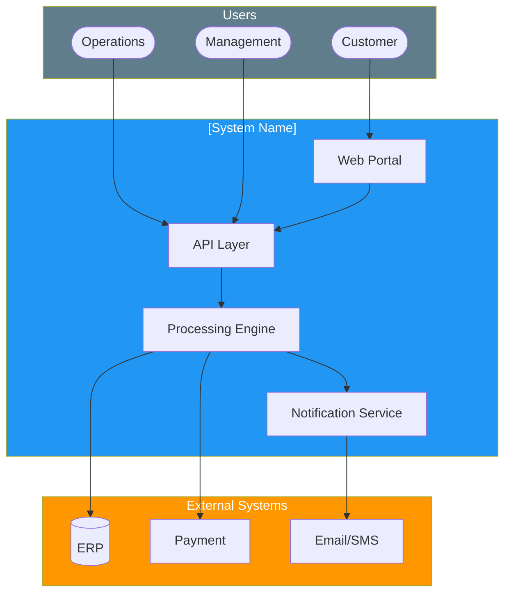

# Software Requirements Specification (SRS)

> **Project:** [Project Name]
> **Version:** [X.Y] | **Status:** [Draft | Under Review | Approved | Baselined]
> **Last Updated:** [YYYY-MM-DD]

---

## Document Control

| Field | Value |
|-------|-------|
| Document Owner | [Name / Role] |
| Business Analyst | [Name / Role] |
| Technical Lead | [Name / Role] |
| QA Lead | [Name / Role] |

### Revision History

| Version | Date | Author | Change Description |
|---------|------|--------|--------------------|
| 0.1 | [YYYY-MM-DD] | [Name] | Initial draft |
| 1.0 | [YYYY-MM-DD] | [Name] | Baselined version |

### Approvals

| Role | Name | Signature | Date |
|------|------|-----------|------|
| Business Owner | | | |
| Technical Lead | | | |
| BA Lead | | | |
| QA Lead | | | |

---

## Table of Contents

1. [Introduction](#1-introduction)
2. [System Overview](#2-system-overview)
3. [Functional Requirements](#3-functional-requirements)
4. [Non-Functional Requirements](#4-non-functional-requirements)
5. [Data Requirements](#5-data-requirements)
6. [Interface Requirements](#6-interface-requirements)
7. [Security Requirements](#7-security-requirements)
8. [Constraints](#8-constraints)
9. [Assumptions](#9-assumptions)
10. [Glossary](#10-glossary)
11. [Appendices](#11-appendices)

---

## 1. Introduction

### 1.1 Purpose

> This document specifies the software requirements for [System Name]. It serves as the baseline for design, development, testing, and acceptance.

### 1.2 Scope

| In Scope | Out of Scope |
|----------|-------------|
| [What this SRS covers] | [What is excluded] |
| | |

### 1.3 References

| Document | Version | Relationship |
|----------|---------|-------------|
| [[Business Requirements]] | v1.0 | Business needs this SRS addresses |
| [[System Requirements Specification (SyRS)]] | v1.0 | System-level requirements |
| [[Concept of Operations (ConOps)]] | v1.0 | Operational scenarios |

### 1.4 Requirements Attributes

| Attribute | Description |
|-----------|-------------|
| **ID** | Unique identifier (FR-XXX, NFR-XXX) |
| **Title** | Short descriptive name |
| **Description** | Detailed requirement text |
| **Priority** | 🔴 Must Have / 🟡 Should Have / 🟢 Could Have / ⚪ Won't Have |
| **Status** | Draft / Under Review / Approved / Baselined |
| **Source** | Origin — stakeholder, regulation, business rule |
| **Rationale** | Why this requirement exists |
| **Acceptance Criteria** | Testable conditions for acceptance |
| **Traceability** | Links to business requirement, design, test case |

---

## 2. System Overview

### 2.1 System Context

### 2.2 User Classes

| User Class | Description | Access Level | Frequency |
|-----------|-------------|-------------|-----------|
| [Customer] | [External user submitting requests] | [Portal — self-service] | Daily |
| [Operations Staff] | [Internal user processing requests] | [Admin portal — full access] | Daily |
| [Manager] | [Internal user overseeing operations] | [Admin portal + dashboard] | Daily |
| [System Admin] | [Technical user managing the system] | [Admin console] | Weekly |

---

## 3. Functional Requirements

### 3.1 Request Management

| ID | Requirement | Priority | Source | Status |
|----|-------------|----------|--------|--------|
| FR-001 | The system shall allow customers to submit requests via web portal | 🔴 | BR-01, SN-03 | Draft |
| FR-002 | The system shall validate all required fields before submission | 🔴 | BR-02, SN-08 | Draft |
| FR-003 | The system shall display real-time validation errors to the user | 🔴 | SN-08 | Draft |
| FR-004 | The system shall generate a unique reference number for each request | 🔴 | — | Draft |
| FR-005 | The system shall allow customers to save drafts and submit later | 🟡 | SN-03 | Draft |
| FR-006 | The system shall allow customers to view request status in real-time | 🔴 | SN-04, BR-03 | Draft |
| FR-007 | The system shall maintain a complete history of all request actions | 🔴 | SN-06 | Draft |
| FR-008 | | | | |

### 3.2 Processing & Workflow

| ID | Requirement | Priority | Source | Status |
|----|-------------|----------|--------|--------|
| FR-101 | The system shall auto-classify requests based on defined rules | 🔴 | BR-04 | Draft |
| FR-102 | The system shall auto-route requests to the appropriate queue | 🔴 | BR-04 | Draft |
| FR-103 | The system shall auto-approve requests meeting all criteria | 🔴 | BR-04 | Draft |
| FR-104 | The system shall flag requests requiring manual review | 🔴 | BR-02 | Draft |
| FR-105 | The system shall support configurable approval workflows | 🔴 | — | Draft |
| FR-106 | The system shall allow managers to reassign requests | 🟡 | — | Draft |
| FR-107 | The system shall escalate requests exceeding SLA thresholds | 🟡 | — | Draft |
| FR-108 | | | | |

### 3.3 Notifications

| ID | Requirement | Priority | Source | Status |
|----|-------------|----------|--------|--------|
| FR-201 | The system shall send email notification on request submission | 🔴 | SN-04 | Draft |
| FR-202 | The system shall send email notification on status change | 🔴 | SN-04 | Draft |
| FR-203 | The system shall send SMS notification for critical updates | 🟡 | SN-04 | Draft |
| FR-204 | The system shall support configurable notification templates | 🟡 | — | Draft |
| FR-205 | The system shall allow users to configure notification preferences | 🟢 | — | Draft |

### 3.4 Reporting & Analytics

| ID | Requirement | Priority | Source | Status |
|----|-------------|----------|--------|--------|
| FR-301 | The system shall provide real-time operational dashboards | 🟡 | SN-05 | Draft |
| FR-302 | The system shall generate standard reports (daily, weekly, monthly) | 🟡 | SN-05 | Draft |
| FR-303 | The system shall support ad-hoc report generation | 🟢 | SN-05 | Draft |
| FR-304 | The system shall export reports in CSV, PDF, Excel formats | 🟡 | — | Draft |
| FR-305 | The system shall track KPIs against defined targets | 🟡 | SN-05 | Draft |

---

## 4. Non-Functional Requirements

### 4.1 Performance

| ID | Requirement | Target | Measurement |
|----|-------------|--------|-------------|
| NFR-001 | Page response time shall be <2 seconds | [<2s] | [95th percentile, normal load] |
| NFR-002 | API response time shall be <1 second | [<1s] | [95th percentile, normal load] |
| NFR-003 | The system shall support 100 concurrent users | [100] | [Without performance degradation] |
| NFR-004 | The system shall process 500 requests per day | [500] | [Without queue backlog] |
| NFR-005 | Database query response time shall be <500ms | [<500ms] | [95th percentile] |

### 4.2 Availability & Reliability

| ID | Requirement | Target | Measurement |
|----|-------------|--------|-------------|
| NFR-010 | System availability shall be 99.9% | [99.9%] | [Monthly uptime] |
| NFR-011 | Recovery Time Objective (RTO) shall be 4 hours | [4 hours] | [DR test] |
| NFR-012 | Recovery Point Objective (RPO) shall be 1 hour | [1 hour] | [DR test] |
| NFR-013 | The system shall support zero-downtime deployments | [0 downtime] | [Deployment process] |

### 4.3 Usability

| ID | Requirement | Target | Measurement |
|----|-------------|--------|-------------|
| NFR-020 | Customer submission shall complete in <5 minutes | [<5 min] | [First-time user test] |
| NFR-021 | Operations processing shall complete in <3 minutes | [<3 min] | [Trained user test] |
| NFR-022 | The system shall be accessible (WCAG 2.1 AA) | [AA] | [Automated + manual audit] |
| NFR-023 | The system shall support responsive design (desktop, tablet, mobile) | [All] | [Cross-device testing] |
| NFR-024 | The system shall support Chrome, Firefox, Safari, Edge (latest 2 versions) | [4 browsers] | [Cross-browser testing] |

### 4.4 Scalability & Maintainability

| ID | Requirement | Target | Measurement |
|----|-------------|--------|-------------|
| NFR-030 | The system shall support horizontal scaling | [10x current] | [Load test] |
| NFR-031 | Code complexity shall not exceed cyclomatic complexity of 10 | [<10] | [Static analysis] |
| NFR-032 | The system shall support CI/CD deployment pipeline | [Daily deploys] | [Pipeline metrics] |
| NFR-033 | The system shall generate structured logs for troubleshooting | [JSON format] | [Log review] |

---

## 5. Data Requirements

### 5.1 Data Entities

| Entity | Description | Volume | Retention |
|--------|-------------|--------|-----------|
| [Request] | [Customer request record] | [500/day] | [7 years] |
| [Customer] | [Customer profile] | [500K] | [Active + 7 years] |
| [Audit Log] | [Action history] | [5K/day] | [7 years] |
| [Notification] | [Sent notifications] | [2K/day] | [1 year] |

### 5.2 Data Quality Rules

| Rule | Description | Validation |
|------|-------------|-----------|
| [Completeness] | [All required fields populated] | [On submission] |
| [Format] | [Email, phone, date formats valid] | [On input] |
| [Uniqueness] | [No duplicate requests within 30 days] | [On submission] |
| [Referential integrity] | [All foreign keys valid] | [On save] |

---

## 6. Interface Requirements

### 6.1 External System Interfaces

| Interface | System | Protocol | Data | Direction | Frequency |
|-----------|--------|---------|------|-----------|-----------|
| INT-001 | [ERP] | [REST/JSON] | [Customer, transaction data] | Bidirectional | Real-time |
| INT-002 | [Payment Gateway] | [REST/JSON] | [Payment requests] | Outbound | Per transaction |
| INT-003 | [Email Service] | [SMTP/API] | [Notifications] | Outbound | Per event |
| INT-004 | [SMS Service] | [REST/JSON] | [Notifications] | Outbound | Per event |

### 6.2 User Interfaces

| Interface | Users | Devices | Key Requirements |
|-----------|-------|---------|-----------------|
| [Customer Portal] | [Customers] | [Desktop, tablet, mobile] | [Responsive, WCAG 2.1 AA] |
| [Admin Portal] | [Operations, Managers] | [Desktop] | [Chrome/Edge, keyboard nav] |
| [Dashboard] | [Managers] | [Desktop, tablet] | [Real-time refresh] |
| [API] | [Partners] | [Programmatic] | [OpenAPI 3.0, rate limiting] |

---

## 7. Security Requirements

| ID | Requirement | Standard |
|----|-------------|---------|
| SEC-001 | [Multi-factor authentication for admin users] | [OWASP] |
| SEC-002 | [Role-based access control] | [ISO 27001] |
| SEC-003 | [Data encryption at rest — AES-256] | [NIST SP 800-57] |
| SEC-004 | [Data encryption in transit — TLS 1.3] | [NIST SP 800-52] |
| SEC-005 | [Complete audit trail — user, action, timestamp] | [ISO 27001] |
| SEC-006 | [Session timeout — 30 minutes inactivity] | [OWASP] |
| SEC-007 | [Input validation — SQL injection, XSS prevention] | [OWASP Top 10] |
| SEC-008 | [API rate limiting — 100 requests/minute per user] | [OWASP API Security] |

---

## 8. Constraints

| ID | Constraint | Type | Impact |
|----|-----------|------|--------|
| CON-001 | [Must use existing cloud provider] | Technical | [Infrastructure platform] |
| CON-002 | [Data must remain in-country] | Legal | [Hosting location] |
| CON-003 | [Must integrate with existing ERP] | Technical | [API dependency] |
| CON-004 | [Budget cap $500K] | Financial | [Scope limitation] |
| CON-005 | [Go-live by YYYY-MM-DD] | Time | [Schedule pressure] |

---

## 9. Assumptions

| ID | Assumption | Impact if Invalid |
|----|-----------|-------------------|
| ASM-001 | [ERP API remains available and stable] | [Integration rework] |
| ASM-002 | [Cloud provider maintains current SLA] | [Availability impact] |
| ASM-003 | [No major regulatory changes during project] | [Scope change] |

---

## 10. Glossary

| Term | Definition |
|------|-----------|
| [Request] | [A customer-initiated submission for service] |
| [Auto-approval] | [Automatic approval when all criteria are met] |
| [SLA] | [Service Level Agreement] |
| [RTO] | [Recovery Time Objective] |
| [RPO] | [Recovery Point Objective] |

---

## 11. Appendices

### Appendix A: Requirements Traceability

| SRS Requirement | Business Requirement | System Requirement | Design Element | Test Case |
|----------------|---------------------|-------------------|---------------|-----------|
| FR-001 | BR-01 | SYRS-001 | HLD-001 | TC-001 |
| FR-002 | BR-02 | SYRS-002 | HLD-002 | TC-002 |
| ... | ... | ... | ... | ... |

### Appendix B: Decision Tables

| Condition | Rule 1 | Rule 2 | Rule 3 |
|-----------|--------|--------|--------|
| [Amount > $10K] | Yes | No | No |
| [VIP Customer] | Yes | No | No |
| [Action] | Auto-approve (≤$25K) | Route to Ops | Route to Manager |

---

## Related Documents

| Document | Relationship |
|----------|-------------|
| [[Business Requirements]] | Business needs elaborated here |
| [[System Requirements Specification (SyRS)]] | System-level requirements |
| [[Nonfunctional Requirements Catalog]] | Detailed NFR specifications |
| [[Requirements Traceability Matrix]] | Full bidirectional traceability |
| [[Acceptance Criteria]] | Testable conditions per requirement |
| [[User Stories]] | Agile format for these requirements |
| [[API Specification]] | Detailed API contracts |

---

> **Template Standard:** Based on SWEBOK v4, ISO/IEC/IEEE 29148
> **Usage:** This is the *baseline* for software development. All design, code, and test decisions trace back to this document. Changes require formal change control via [[Requirements Change Log]].
