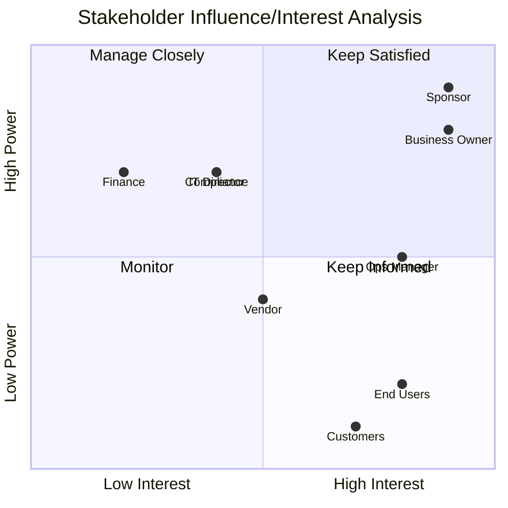

# Stakeholder Analysis

> **Project:** [Project Name]
> **Version:** [X.Y] | **Status:** [Draft | Under Review | Approved | Archived]
> **Last Updated:** [YYYY-MM-DD]

---

## Document Control

| Field | Value |
|-------|-------|
| Document Owner | [Name / Role] |
| Business Analyst | [Name / Role] |

### Revision History

| Version | Date | Author | Change Description |
|---------|------|--------|--------------------|
| 0.1 | [YYYY-MM-DD] | [Name] | Initial draft |
| 1.0 | [YYYY-MM-DD] | [Name] | Approved version |

---

## 1. Purpose

> This document analyzes stakeholders to understand their influence, interest, concerns, and impact on requirements. It informs engagement strategy and requirements prioritization.

## 2. Stakeholder Analysis Matrix

### 2.1 Influence/Interest Analysis

| Stakeholder | Influence | Interest | Power Type | Engagement Strategy | Communication |
|------------|----------|----------|-----------|-------------------|---------------|
| [Sponsor] | High | High | Formal authority | Manage Closely | Weekly 1:1 |
| [Business Owner] | High | High | Domain authority | Manage Closely | Weekly workshop |
| [Operations Manager] | Medium | High | Expert influence | Keep Informed | Bi-weekly workshop |
| [End Users] | Low | High | User voice | Keep Informed | Monthly workshop |
| [IT Director] | High | Medium | Resource authority | Keep Satisfied | Monthly report |
| [Compliance Officer] | High | Medium | Regulatory authority | Keep Satisfied | Monthly review |
| [Finance Director] | High | Low | Budget authority | Keep Satisfied | Monthly report |
| [Customers] | Low | High | Market voice | Keep Informed | Survey, UAT |
| [Vendor] | Medium | Medium | Technical dependency | Keep Informed | As needed |

### 2.2 Stakeholder Map

## 3. Stakeholder Concerns Analysis

### 3.1 Concerns by Stakeholder

| Stakeholder | Primary Concerns | Secondary Concerns | Fears | Success Criteria |
|------------|-----------------|-------------------|-------|-----------------|
| [Sponsor] | [ROI, timeline] | [Risk, quality] | [Project failure, budget overrun] | [Benefits realized] |
| [Business Owner] | [Requirements met] | [Team productivity] | [Wrong solution built] | [Business objectives achieved] |
| [Operations Manager] | [Team workload] | [Process disruption] | [System doesn't work, team resistance] | [Efficiency improvement] |
| [End Users] | [Ease of use] | [Job impact] | [Harder to do job, job loss] | [Daily tasks easier] |
| [Compliance Officer] | [Audit trail] | [Data protection] | [Compliance failure, fines] | [100% audit compliance] |
| [IT Director] | [Maintainability] | [Integration] | [Technical debt, outages] | [Stable, scalable system] |

### 3.2 Stakeholder Conflicts

| Conflict | Stakeholders | Nature | Resolution |
|----------|-------------|--------|-----------|
| [Speed vs Features] | [Sponsor, Business Owner] | [Sponsor wants fast; Business Owner wants complete] | [Phased approach — core fast, features later] |
| [Simplicity vs Control] | [End Users, Compliance] | [Users want simple; Compliance wants control] | [Simple UI with automated compliance] |
| [Cost vs Quality] | [Finance, IT Director] | [Finance wants low cost; IT wants quality] | [Invest in quality to reduce long-term cost] |

## 4. Stakeholder Impact Analysis

### 4.1 Impact of Project on Stakeholders

| Stakeholder | Impact Level | Nature of Impact | Change Required | Support Needed |
|------------|-------------|------------------|----------------|---------------|
| [Operations Staff] | 🔴 High | [New system, new processes] | [Learn new system, adapt workflows] | [Training, change management] |
| [Customers] | 🟡 Medium | [New channel, new experience] | [Learn portal, change habits] | [User guide, support] |
| [Management] | 🟢 Low | [New dashboards] | [Learn dashboard] | [Brief training] |
| [IT Team] | 🟡 Medium | [New system to maintain] | [Learn new technology] | [Technical training] |

### 4.2 Stakeholder Readiness

| Stakeholder | Current Readiness | Target Readiness | Gap | Action |
|------------|------------------|-----------------|-----|--------|
| [Operations Staff] | 🟡 50% | 🟢 90% | -40% | [Training program, champions] |
| [Customers] | 🟢 70% | 🟢 90% | -20% | [User guide, portal walkthrough] |
| [Management] | 🟢 80% | 🟢 95% | -15% | [Dashboard briefing] |

## 5. Stakeholder Engagement Priorities

### 5.1 Priority Matrix

| Priority | Stakeholders | Rationale | Engagement Investment |
|----------|-------------|----------|---------------------|
| 🔴 Critical | [Sponsor, Business Owner] | [Decision authority, requirements ownership] | [High — weekly touchpoints] |
| 🔴 Critical | [Operations Manager] | [Process expertise, team influence] | [High — bi-weekly workshops] |
| 🟡 Important | [End Users] | [Adoption success depends on them] | [Medium — monthly workshops + training] |
| 🟡 Important | [IT Director, Compliance] | [Technical and regulatory governance] | [Medium — monthly reviews] |
| 🟢 Standard | [Finance, Vendor] | [Supporting roles] | [Low — monthly reports] |

## 6. Requirements Influence Analysis

### 6.1 Stakeholder Requirements Influence

| Stakeholder | Requirements Influenced | Weight | Priority Impact |
|------------|------------------------|--------|----------------|
| [Sponsor] | [All — strategic direction] | High | [Drives 🔴 priorities] |
| [Business Owner] | [BR-01 to BR-08] | High | [Drives feature priorities] |
| [Operations Manager] | [FR-101 to FR-107, BUR-01 to BUR-05] | High | [Drives workflow requirements] |
| [End Users] | [FR-001 to FR-007, USA-XX] | Medium | [Drives usability requirements] |
| [Compliance Officer] | [SEC-XX, CMP-XX, BR-07] | Medium | [Drives security/compliance] |
| [IT Director] | [NFR-XX, SMA-XX] | Medium | [Drives technical requirements] |

---

## Related Documents

| Document | Relationship |
|----------|-------------|
| [[Stakeholder-Register]] | Detailed stakeholder information |
| [[Stakeholder-Engagement-Approach]] | Engagement strategy based on this analysis |
| [[Business-Requirements]] | Requirements influenced by stakeholders |
| [[Requirements-Architecture]] | Requirements viewpoints based on stakeholders |
| [[Governance-Approach]] | Decision authority per stakeholder |

---

> **Template Standard:** Based on SWEBOK v4, ISO/IEC/IEEE 29148, BABOK v3
> **Usage:** This analysis drives requirements prioritization — stakeholders with higher influence and interest have more weight in priority decisions. Update when stakeholder dynamics change.
