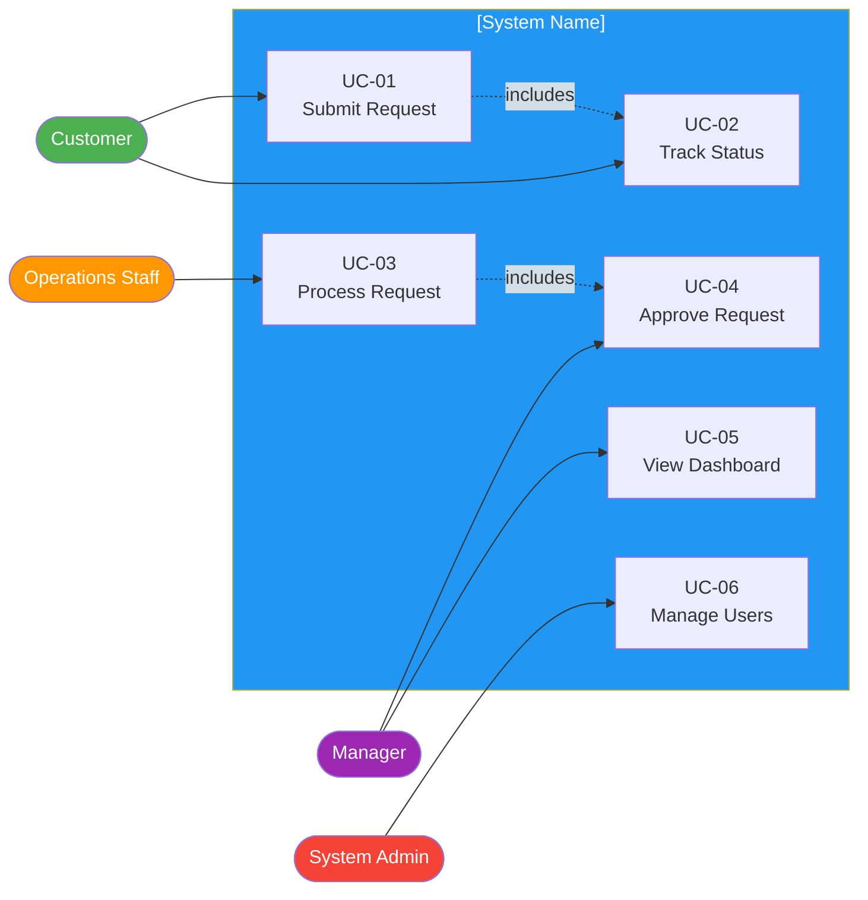

# Use Case Specifications

> **Project:** [Project Name]
> **Version:** [X.Y] | **Status:** [Draft | Under Review | Approved | Archived]
> **Last Updated:** [YYYY-MM-DD]

---

## Document Control

| Field | Value |
|-------|-------|
| Document Owner | [Name / Role] |
| Business Analyst | [Name / Role] |

### Revision History

| Version | Date | Author | Change Description |
|---------|------|--------|--------------------|
| 0.1 | [YYYY-MM-DD] | [Name] | Initial draft |
| 1.0 | [YYYY-MM-DD] | [Name] | Approved version |

---

## 1. Purpose

> This document specifies use cases — actor-goal interactions that describe how users interact with the system to achieve specific outcomes. Each use case includes actors, preconditions, main flow, alternative flows, and postconditions.

## 2. Use Case Diagram

## 3. Use Case Specifications

### UC-01: Submit Request

| Field | Detail |
|-------|--------|
| **Use Case ID** | UC-01 |
| **Use Case Name** | Submit Request |
| **Actor(s)** | Customer |
| **Goal** | Submit a new request for service |
| **Priority** | 🔴 Must Have |
| **Related Requirements** | FR-001, FR-002, FR-003, FR-004, FR-005 |

#### Preconditions
- [Customer is authenticated and logged in]
- [Customer has not exceeded submission limits]

#### Main Flow (Basic Flow)

| Step | Actor Action | System Response |
|------|-------------|----------------|
| 1 | [Customer navigates to Submit Request page] | [System displays request form with all required fields] |
| 2 | [Customer fills in required fields] | [System validates each field in real-time] |
| 3 | [Customer uploads supporting documents (optional)] | [System accepts files, displays upload list] |
| 4 | [Customer clicks Submit] | [System performs final validation] |
| 5 | | [System creates request with unique reference number] |
| 6 | | [System sends confirmation email to customer] |
| 7 | | [System displays success message with reference number] |

#### Alternative Flows

**A1: Save Draft (Step 3)**

| Step | Actor Action | System Response |
|------|-------------|----------------|
| 3a | [Customer clicks Save Draft] | [System saves current form data] |
| 3b | | [System displays "Draft saved" message] |
| 3c | | [Customer can resume later from My Drafts] |

**A2: Validation Error (Step 4)**

| Step | Actor Action | System Response |
|------|-------------|----------------|
| 4a | [System detects validation errors] | [System highlights invalid fields with error messages] |
| 4b | [Customer corrects errors] | [System re-validates in real-time] |
| 4c | [Customer clicks Submit again] | [System proceeds to Step 5] |

**A3: Duplicate Detected (Step 4)**

| Step | Actor Action | System Response |
|------|-------------|----------------|
| 4a | [System detects similar request within 30 days] | [System displays warning: "Similar request exists"] |
| 4b | [Customer chooses to continue or cancel] | [If continue — proceed to Step 5; If cancel — return to form] |

#### Exception Flows

**E1: System Unavailable (Step 4)**

| Step | Actor Action | System Response |
|------|-------------|----------------|
| 4e | [System cannot process submission] | [System displays error: "Please try again later"] |
| 4f | | [System preserves form data] |

**E2: Session Timeout (Any Step)**

| Step | Actor Action | System Response |
|------|-------------|----------------|
| - | [Session expires after 30 min inactivity] | [System redirects to login] |
| - | | [System preserves form data as draft] |

#### Postconditions
- [Request is created with status "Submitted"]
- [Unique reference number is generated]
- [Confirmation email is sent to customer]
- [Request appears in operations queue for processing]
- [Audit log entry is created]

---

### UC-02: Track Request Status

| Field | Detail |
|-------|--------|
| **Use Case ID** | UC-02 |
| **Use Case Name** | Track Request Status |
| **Actor(s)** | Customer |
| **Goal** | View the current status and history of submitted requests |
| **Priority** | 🔴 Must Have |
| **Related Requirements** | FR-006, FR-007 |

#### Preconditions
- [Customer is authenticated and logged in]
- [Customer has at least one submitted request]

#### Main Flow

| Step | Actor Action | System Response |
|------|-------------|----------------|
| 1 | [Customer navigates to My Requests] | [System displays list of all requests with status] |
| 2 | [Customer clicks on a specific request] | [System displays request detail with full timeline] |

#### Alternative Flows

**A1: Filter Requests (Step 1)**

| Step | Actor Action | System Response |
|------|-------------|----------------|
| 1a | [Customer applies filter (status, date range)] | [System filters request list] |

**A2: Export History (Step 2)**

| Step | Actor Action | System Response |
|------|-------------|----------------|
| 2a | [Customer clicks Export] | [System generates PDF/CSV of request history] |

#### Postconditions
- [No state change — read-only operation]
- [View is logged in audit trail]

---

### UC-03: Process Request

| Field | Detail |
|-------|--------|
| **Use Case ID** | UC-03 |
| **Use Case Name** | Process Request |
| **Actor(s)** | Operations Staff |
| **Goal** | Review and process a submitted request |
| **Priority** | 🔴 Must Have |
| **Related Requirements** | FR-101, FR-102, FR-104, FR-106 |

#### Preconditions
- [Staff member is authenticated and authorized]
- [Request is in "Pending Review" status]

#### Main Flow

| Step | Actor Action | System Response |
|------|-------------|----------------|
| 1 | [Staff opens their work queue] | [System displays assigned requests sorted by priority] |
| 2 | [Staff selects a request] | [System displays request detail with all submitted data] |
| 3 | [Staff reviews request against business rules] | [System displays rule validation results] |
| 4 | [Staff makes decision: Approve/Reject/Request Info] | [System updates request status] |
| 5 | | [System sends notification to customer] |
| 6 | | [System creates audit log entry] |

#### Alternative Flows

**A1: Request Additional Information (Step 4)**

| Step | Actor Action | System Response |
|------|-------------|----------------|
| 4a | [Staff clicks "Request Info"] | [System displays message template] |
| 4b | [Staff sends request for information] | [System changes status to "Info Requested"] |
| 4c | | [System sends email to customer] |

**A2: Escalate to Manager (Step 4)**

| Step | Actor Action | System Response |
|------|-------------|----------------|
| 4a | [Staff clicks "Escalate"] | [System displays escalation form] |
| 4b | [Staff submits escalation] | [System routes to manager queue] |

#### Postconditions
- [Request status updated (Approved/Rejected/Info Requested/Escalated)]
- [Customer notified of decision]
- [Audit log entry created]
- [If approved — downstream systems notified]

---

### UC-04: Approve Request (Manager)

| Field | Detail |
|-------|--------|
| **Use Case ID** | UC-04 |
| **Use Case Name** | Approve Request |
| **Actor(s)** | Manager |
| **Goal** | Approve or reject requests requiring management approval |
| **Priority** | 🔴 Must Have |
| **Related Requirements** | FR-103, FR-105 |

#### Preconditions
- [Manager is authenticated and authorized]
- [Request requires manager approval (>$10K or escalated)] |

#### Main Flow

| Step | Actor Action | System Response |
|------|-------------|----------------|
| 1 | [Manager opens approval queue] | [System displays pending approvals] |
| 2 | [Manager selects a request] | [System displays full request detail + staff recommendation] |
| 3 | [Manager reviews and decides: Approve/Reject] | [System updates status, notifies all parties] |

#### Postconditions
- [Request status updated]
- [All parties notified]
- [Audit trail updated]

---

### UC-05: View Dashboard

| Field | Detail |
|-------|--------|
| **Use Case ID** | UC-05 |
| **Use Case Name** | View Dashboard |
| **Actor(s)** | Manager |
| **Goal** | Monitor operational performance in real-time |
| **Priority** | 🟡 Should Have |
| **Related Requirements** | FR-301, FR-305 |

#### Preconditions
- [Manager is authenticated and authorized]

#### Main Flow

| Step | Actor Action | System Response |
|------|-------------|----------------|
| 1 | [Manager opens dashboard] | [System displays real-time KPIs: requests today, avg processing time, queue depth, SLA compliance] |
| 2 | [Manager clicks on a metric for drill-down] | [System displays detailed breakdown with filters] |

#### Postconditions
- [No state change — read-only]

---

## 4. Use Case Summary

| UC ID | Use Case | Actor(s) | Priority | Requirements | Status |
|-------|---------|---------|----------|-------------|--------|
| UC-01 | Submit Request | Customer | 🔴 | FR-001 to FR-005 | Draft |
| UC-02 | Track Status | Customer | 🔴 | FR-006, FR-007 | Draft |
| UC-03 | Process Request | Operations Staff | 🔴 | FR-101 to FR-106 | Draft |
| UC-04 | Approve Request | Manager | 🔴 | FR-103, FR-105 | Draft |
| UC-05 | View Dashboard | Manager | 🟡 | FR-301, FR-305 | Draft |
| UC-06 | Manage Users | System Admin | 🟡 | FR-XXX | Draft |

## 5. Use Case Relationships

| Relationship | From | To | Type | Description |
|-------------|------|-----|------|-------------|
| [includes] | UC-01 | UC-02 | Include | [After submission, customer can track status] |
| [extends] | UC-03 | UC-04 | Extend | [Processing may require manager approval] |
| [generalizes] | — | — | — | [No generalizations] |

---

## Related Documents

| Document | Relationship |
|----------|-------------|
| [[Software-Requirements-Specification]] | Use cases elaborate SRS functional requirements |
| [[User-Stories]] | Agile format for same requirements |
| [[Acceptance-Criteria]] | ACs derived from use case flows |
| [[Sequence-Diagrams]] | Design-level interaction details |
| [[Requirements-Traceability-Matrix]] | Use cases traced in RTM |

---

> **Template Standard:** Based on SWEBOK v4, ISO/IEC 19501 (UML), ISO/IEC/IEEE 29148
> **Usage:** Use cases describe *behavioral interactions* between actors and the system. They complement user stories — use cases for detailed behavioral specifications, user stories for backlog management. Both formats can coexist.
