# Activity List

> **Project:** [Project Name]
> **Version:** [X.Y] | **Status:** [Draft | Under Review | Approved | Baselined]
> **Last Updated:** [YYYY-MM-DD]

---

## Document Control

| Field | Value |
|-------|-------|
| Document Owner | [Name / Role] |
| Project Manager | [Name / Role] |

---

## 1. Purpose

> This document lists all activities required to complete the project work packages. Each activity includes duration, resources, dependencies, and the WBS element it belongs to.

## 2. Activity List

### 2.1 Initiation Phase

| Activity ID | Activity | WBS | Duration | Resources | Predecessors | Successors |
|------------|----------|-----|----------|----------|-------------|-----------|
| ACT-001 | [Draft Project Charter] | 1.1.1 | [3 days] | [PM, BA] | — | ACT-002 |
| ACT-002 | [Review & Approve Charter] | 1.1.1 | [2 days] | [PM, Sponsor] | ACT-001 | ACT-003 |
| ACT-003 | [Conduct Kickoff Meeting] | 1.1.1 | [1 day] | [PM, All] | ACT-002 | ACT-004 |

### 2.2 Planning Phase

| Activity ID | Activity | WBS | Duration | Resources | Predecessors | Successors |
|------------|----------|-----|----------|----------|-------------|-----------|
| ACT-004 | [Stakeholder Analysis] | 1.1.1 | [3 days] | [BA] | ACT-003 | ACT-005 |
| ACT-005 | [Requirements Elicitation — Workshops] | 1.2.1 | [10 days] | [BA, SMEs] | ACT-004 | ACT-006 |
| ACT-006 | [Requirements Elicitation — Interviews] | 1.2.1 | [5 days] | [BA] | ACT-004 | ACT-006 |
| ACT-007 | [Document Business Requirements] | 1.2.2 | [5 days] | [BA] | ACT-005, ACT-006 | ACT-008 |
| ACT-008 | [Document SRS] | 1.2.2 | [7 days] | [BA] | ACT-007 | ACT-009 |
| ACT-009 | [Requirements Review & Validation] | 1.2.2 | [3 days] | [BA, Stakeholders] | ACT-008 | ACT-010 |
| ACT-010 | [Requirements Baseline] | 1.2.2 | [1 day] | [PM, Sponsor] | ACT-009 | ACT-011 |
| ACT-011 | [Architecture Design] | 1.2.3 | [7 days] | [Architect, TL] | ACT-010 | ACT-012 |
| ACT-012 | [Architecture Review] | 1.2.3 | [2 days] | [Architect, TRB] | ACT-011 | ACT-013 |
| ACT-013 | [Detailed Design] | 1.2.4 | [10 days] | [TL, Developers] | ACT-012 | ACT-014 |
| ACT-014 | [Design Review] | 1.2.4 | [2 days] | [TL, QA, BA] | ACT-013 | ACT-015 |

### 2.3 Execution Phase — Sprints

| Activity ID | Activity | WBS | Duration | Resources | Predecessors | Successors |
|------------|----------|-----|----------|----------|-------------|-----------|
| ACT-015 | [Sprint 1 — Customer Portal Core] | 1.3.1 | [10 days] | [Dev team] | ACT-014 | ACT-016 |
| ACT-016 | [Sprint 1 Review & Retro] | 1.3.1 | [1 day] | [PM, Dev team] | ACT-015 | ACT-017 |
| ACT-017 | [Sprint 2 — Portal + Processing] | 1.3.1, 1.3.3 | [10 days] | [Dev team] | ACT-016 | ACT-018 |
| ACT-018 | [Sprint 2 Review & Retro] | 1.3.1, 1.3.3 | [1 day] | [PM, Dev team] | ACT-017 | ACT-019 |
| ACT-019 | [Sprint 3 — Processing + Admin] | 1.3.3, 1.3.2 | [10 days] | [Dev team] | ACT-018 | ACT-020 |
| ACT-020 | [Sprint 3 Review & Retro] | 1.3.3, 1.3.2 | [1 day] | [PM, Dev team] | ACT-019 | ACT-021 |
| ACT-021 | [Sprint 4 — Admin + Notifications] | 1.3.2, 1.3.4 | [10 days] | [Dev team] | ACT-020 | ACT-022 |
| ACT-022 | [Sprint 4 Review & Retro] | 1.3.2, 1.3.4 | [1 day] | [PM, Dev team] | ACT-021 | ACT-023 |
| ACT-023 | [Sprint 5 — Dashboard + Polish] | 1.3.1, 1.3.2 | [10 days] | [Dev team] | ACT-022 | ACT-024 |
| ACT-024 | [Sprint 5 Review & Retro] | 1.3.1, 1.3.2 | [1 day] | [PM, Dev team] | ACT-023 | ACT-025 |

### 2.4 Testing Phase

| Activity ID | Activity | WBS | Duration | Resources | Predecessors | Successors |
|------------|----------|-----|----------|----------|-------------|-----------|
| ACT-025 | [System Test Execution] | 1.4.1 | [10 days] | [QA team] | ACT-024 | ACT-026 |
| ACT-026 | [Integration Test Execution] | 1.4.2 | [5 days] | [QA, TL] | ACT-025 | ACT-027 |
| ACT-027 | [Performance Testing] | 1.4.3 | [3 days] | [QA, TL] | ACT-026 | ACT-028 |
| ACT-028 | [Security Testing] | 1.4.4 | [3 days] | [QA, Security] | ACT-026 | ACT-029 |
| ACT-029 | [Defect Fix & Retest] | 1.4.1 | [5 days] | [Dev team, QA] | ACT-027, ACT-028 | ACT-030 |
| ACT-030 | [UAT Execution] | 1.4.5 | [10 days] | [BA, End Users] | ACT-029 | ACT-031 |
| ACT-031 | [UAT Sign-off] | 1.4.5 | [2 days] | [BA, Business Owner] | ACT-030 | ACT-032 |

### 2.5 Deployment Phase

| Activity ID | Activity | WBS | Duration | Resources | Predecessors | Successors |
|------------|----------|-----|----------|----------|-------------|-----------|
| ACT-032 | [Deployment Preparation] | 1.5.1 | [5 days] | [TL, DevOps] | ACT-031 | ACT-033 |
| ACT-033 | [Data Migration] | 1.3.5 | [3 days] | [Data team] | ACT-032 | ACT-034 |
| ACT-034 | [Go-Live] | 1.5.2 | [1 day] | [PM, TL, DevOps] | ACT-033 | ACT-035 |
| ACT-035 | [Training Delivery] | 1.5.3 | [5 days] | [BA, Trainer] | ACT-034 | ACT-036 |
| ACT-036 | [Hypercare Support] | 1.5.4 | [20 days] | [Support team] | ACT-034 | ACT-037 |

### 2.6 Closure Phase

| Activity ID | Activity | WBS | Duration | Resources | Predecessors | Successors |
|------------|----------|-----|----------|----------|-------------|-----------|
| ACT-037 | [Lessons Learned Workshop] | 1.6.1 | [2 days] | [PM, All] | ACT-036 | ACT-038 |
| ACT-038 | [Documentation Archive] | 1.6.2 | [3 days] | [PM, BA] | ACT-037 | ACT-039 |
| ACT-039 | [Project Closure Report] | 1.6.3 | [2 days] | [PM] | ACT-038 | ACT-040 |
| ACT-040 | [Closure Sign-off] | 1.6.3 | [1 day] | [PM, Sponsor] | ACT-039 | — |

## 3. Activity Statistics

| Phase | Activities | Total Duration | Resources |
|-------|-----------|---------------|-----------|
| Initiation | [3] | [6 days] | [PM, BA, Sponsor] |
| Planning | [11] | [46 days] | [PM, BA, Architect, TL] |
| Execution | [10] | [55 days] | [Dev team] |
| Testing | [7] | [38 days] | [QA, BA, Dev, Users] |
| Deployment | [5] | [34 days] | [TL, DevOps, BA] |
| Closure | [4] | [8 days] | [PM, BA] |
| **Total** | **[40]** | **[187 days]** | |

## 4. Activity Network Diagram

```mermaid
flowchart LR
    ACT001[Charter] --> ACT002[Approve] --> ACT003[Kickoff]
    ACT003 --> ACT004[Stakeholder Analysis]
    ACT004 --> ACT005[Workshops]
    ACT004 --> ACT006[Interviews]
    ACT005 --> ACT007[BRD]
    ACT006 --> ACT007
    ACT007 --> ACT008[SRS] --> ACT009[Review] --> ACT010[Baseline]
    ACT010 --> ACT011[Architecture] --> ACT012[Arch Review]
    ACT012 --> ACT013[Detail Design] --> ACT014[Design Review]
    ACT014 --> ACT015[Sprint 1] --> ACT016[S1 Review]
    ACT016 --> ACT017[Sprint 2] --> ACT018[S2 Review]
    ACT018 --> ACT019[Sprint 3] --> ACT020[S3 Review]
    ACT020 --> ACT021[Sprint 4] --> ACT022[S4 Review]
    ACT022 --> ACT023[Sprint 5] --> ACT024[S5 Review]
    ACT024 --> ACT025[System Test] --> ACT026[Integration Test]
    ACT026 --> ACT027[Perf Test]
    ACT026 --> ACT028[Sec Test]
    ACT027 --> ACT029[Fix & Retest]
    ACT028 --> ACT029
    ACT029 --> ACT030[UAT] --> ACT031[UAT Sign-off]
    ACT031 --> ACT032[Deploy Prep] --> ACT033[Migration] --> ACT034[Go-Live]
    ACT034 --> ACT035[Training]
    ACT034 --> ACT036[Hypercare] --> ACT037[Lessons] --> ACT038[Archive] --> ACT039[Close Report] --> ACT040[Sign-off]

    style ACT001 fill:#1a237e,color:#fff
    style ACT010 fill:#4CAF50,color:#fff
    style ACT014 fill:#4CAF50,color:#fff
    style ACT024 fill:#4CAF50,color:#fff
    style ACT031 fill:#4CAF50,color:#fff
    style ACT034 fill:#f44336,color:#fff
    style ACT040 fill:#9C27B0,color:#fff
```

---

## Related Documents

| Document | Relationship |
|----------|-------------|
| [[WBS]] | Work packages decomposed into activities |
| [[Milestone List]] | Key milestones from activities |
| [[Project Schedule]] | Activities with dates |
| [[Schedule Management Plan]] | How activities are managed |

---

> **Template Standard:** Based on PMBOK v8, ISO 21502
> **Usage:** The activity list is the *detailed decomposition* of WBS work packages. Each activity should be small enough to estimate and assign, but large enough to track meaningfully.
