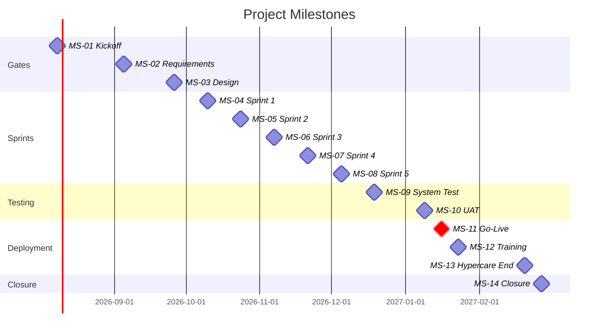

# Milestone List

> **Project:** [Project Name]
> **Version:** [X.Y] | **Status:** [Draft | Under Review | Approved | Baselined]
> **Last Updated:** [YYYY-MM-DD]

---

## Document Control

| Field | Value |
|-------|-------|
| Document Owner | [Name / Role] |
| Project Manager | [Name / Role] |

---

## 1. Purpose

> This document lists all project milestones — significant events with zero duration that mark key achievements, decision points, or phase transitions.

## 2. Milestone List

### 2.1 Phase Gate Milestones

| ID | Milestone | Date | Phase | Gate Criteria | Owner | Status |
|----|----------|------|-------|--------------|-------|--------|
| MS-01 | [Project Kickoff] | [YYYY-MM-DD] | Initiation | [Charter approved, team assembled] | PM | ⬜ |
| MS-02 | [Requirements Baselined] | [YYYY-MM-DD] | Planning | [SRS approved, stakeholder sign-off] | BA | ⬜ |
| MS-03 | [Design Approved] | [YYYY-MM-DD] | Planning | [Architecture + detailed design reviewed] | TL | ⬜ |
| MS-04 | [Sprint 1 Complete] | [YYYY-MM-DD] | Execution | [Portal core features working] | PM | ⬜ |
| MS-05 | [Sprint 2 Complete] | [YYYY-MM-DD] | Execution | [Processing engine working] | PM | ⬜ |
| MS-06 | [Sprint 3 Complete] | [YYYY-MM-DD] | Execution | [Admin portal working] | PM | ⬜ |
| MS-07 | [Sprint 4 Complete] | [YYYY-MM-DD] | Execution | [Notifications + integration working] | PM | ⬜ |
| MS-08 | [Sprint 5 Complete] | [YYYY-MM-DD] | Execution | [All features complete, code freeze] | PM | ⬜ |
| MS-09 | [System Testing Complete] | [YYYY-MM-DD] | Testing | [All system tests passed] | QA | ⬜ |
| MS-10 | [UAT Complete] | [YYYY-MM-DD] | Testing | [UAT sign-off from Business Owner] | BA | ⬜ |
| MS-11 | [Go-Live] | [YYYY-MM-DD] | Deployment | [Production system operational] | PM | ⬜ |
| MS-12 | [Training Complete] | [YYYY-MM-DD] | Deployment | [90% training completion] | BA | ⬜ |
| MS-13 | [Hypercare End] | [YYYY-MM-DD] | Deployment | [No P1 issues for 7 consecutive days] | PM | ⬜ |
| MS-14 | [Project Closure] | [YYYY-MM-DD] | Closure | [Lessons learned, closure report signed] | PM | ⬜ |

### 2.2 External Milestones

| ID | Milestone | Date | Source | Impact | Owner | Status |
|----|----------|------|--------|--------|-------|--------|
| EM-01 | [Budget Approval] | [YYYY-MM-DD] | [Finance Committee] | [Blocks project start] | Sponsor | ⬜ |
| EM-02 | [Vendor Contract Signed] | [YYYY-MM-DD] | [Procurement] | [Blocks Sprint 1] | PM | ⬜ |
| EM-03 | [Regulatory Deadline] | [YYYY-MM-DD] | [Regulator] | [Go-live must be before this] | PM | ⬜ |
| EM-04 | [ERP API Available] | [YYYY-MM-DD] | [IT / Vendor] | [Blocks integration work] | TL | ⬜ |

### 2.3 Dependency Milestones

| ID | Milestone | Depends On | Blocks | Critical Path |
|----|----------|-----------|--------|--------------|
| MS-02 | [Requirements Baselined] | [MS-01] | [MS-03] | ✅ Yes |
| MS-03 | [Design Approved] | [MS-02] | [MS-04] | ✅ Yes |
| MS-08 | [Sprint 5 Complete] | [MS-04 through MS-07] | [MS-09] | ✅ Yes |
| MS-10 | [UAT Complete] | [MS-09] | [MS-11] | ✅ Yes |
| MS-11 | [Go-Live] | [MS-10, EM-02] | [MS-12] | ✅ Yes |

## 3. Milestone Timeline

## 4. Milestone Tracking

| ID | Milestone | Baseline Date | Forecast Date | Actual Date | Variance | Status |
|----|----------|--------------|---------------|-------------|----------|--------|
| MS-01 | [Kickoff] | [YYYY-MM-DD] | | | | ⬜ |
| MS-02 | [Requirements] | [YYYY-MM-DD] | | | | ⬜ |
| MS-03 | [Design] | [YYYY-MM-DD] | | | | ⬜ |
| MS-04 | [Sprint 1] | [YYYY-MM-DD] | | | | ⬜ |
| MS-05 | [Sprint 2] | [YYYY-MM-DD] | | | | ⬜ |
| MS-06 | [Sprint 3] | [YYYY-MM-DD] | | | | ⬜ |
| MS-07 | [Sprint 4] | [YYYY-MM-DD] | | | | ⬜ |
| MS-08 | [Sprint 5] | [YYYY-MM-DD] | | | | ⬜ |
| MS-09 | [System Test] | [YYYY-MM-DD] | | | | ⬜ |
| MS-10 | [UAT] | [YYYY-MM-DD] | | | | ⬜ |
| MS-11 | [Go-Live] | [YYYY-MM-DD] | | | | ⬜ |
| MS-12 | [Training] | [YYYY-MM-DD] | | | | ⬜ |
| MS-13 | [Hypercare] | [YYYY-MM-DD] | | | | ⬜ |
| MS-14 | [Closure] | [YYYY-MM-DD] | | | | ⬜ |

## 5. Milestone Status Legend

| Status | Meaning |
|--------|---------|
| ⬜ Not Started | [Milestone not yet reached] |
| 🟢 On Track | [Expected to be met on time] |
| 🟡 At Risk | [May be delayed — mitigation in progress] |
| 🔴 Late | [Missed baseline date] |
| ✅ Achieved | [Milestone met on or before baseline] |

## 6. Milestone Reporting

| Report | Audience | Frequency | Content |
|--------|----------|-----------|---------|
| [Milestone Status] | [Sponsor, Steering Committee] | [Monthly] | [Baseline vs forecast vs actual] |
| [Milestone Alert] | [Sponsor] | [When at risk] | [Risk, impact, mitigation] |
| [Milestone Achieved] | [All stakeholders] | [When achieved] | [Achievement, next milestone] |

---

## Related Documents

| Document | Relationship |
|----------|-------------|
| [[Project Schedule]] | Detailed schedule with milestones |
| [[Activity List]] | Activities between milestones |
| [[Project Management Plan]] | Phase gates defined |
| [[Project Charter]] | High-level milestones |

---

> **Template Standard:** Based on PMBOK v8, ISO 21502
> **Usage:** Milestones are *decision points* and *progress markers*. Track them religiously — a missed milestone is an early warning signal. Report milestone status to the steering committee monthly.
