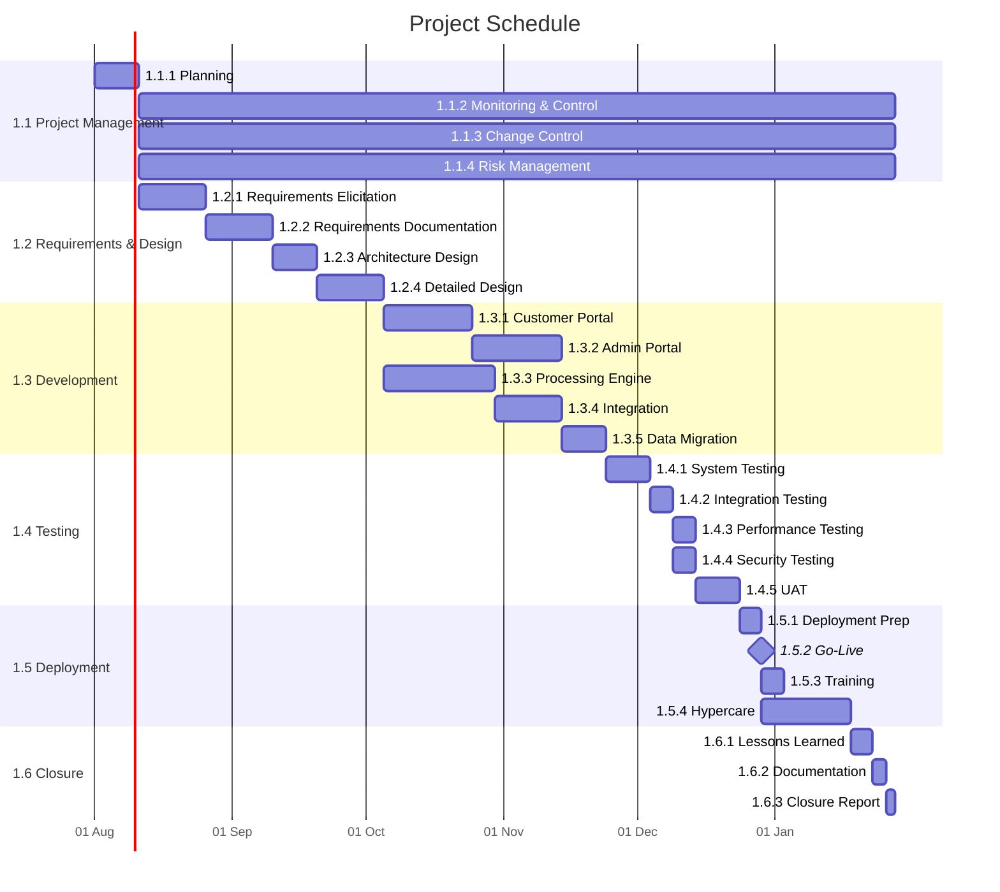

# Project Schedule

> **Project:** [Project Name]
> **Version:** [X.Y] | **Status:** [Draft | Under Review | Approved | Baselined]
> **Last Updated:** [YYYY-MM-DD]

---

## Document Control

| Field | Value |
|-------|-------|
| Document Owner | [Name / Role] |
| Project Manager | [Name / Role] |

### Approvals

| Role | Name | Signature | Date |
|------|------|-----------|------|
| Project Sponsor | | | |
| Project Manager | | | |

---

## 1. Purpose

> This document presents the detailed project schedule with activities, durations, dependencies, resources, and milestones.

## 2. Schedule Summary

| Field | Detail |
|-------|--------|
| Project Start | [YYYY-MM-DD] |
| Project End | [YYYY-MM-DD] |
| Total Duration | [X working days / Y weeks] |
| Critical Path Duration | [X working days] |
| Total Activities | [X] |
| Total Milestones | [X] |
| Calendar | [Monday-Friday, excluding public holidays] |

## 3. Project Schedule (Gantt)

## 4. Detailed Schedule Table

### 4.1 Initiation & Planning

| Activity ID | Activity | Start | End | Duration | Predecessors | Resources | Float |
|------------|----------|-------|-----|----------|-------------|----------|-------|
| ACT-001 | [Draft Charter] | [YYYY-MM-DD] | [YYYY-MM-DD] | 3d | — | PM, BA | 0 |
| ACT-002 | [Approve Charter] | [YYYY-MM-DD] | [YYYY-MM-DD] | 2d | ACT-001 | PM, Sponsor | 0 |
| ACT-003 | [Kickoff] | [YYYY-MM-DD] | [YYYY-MM-DD] | 1d | ACT-002 | PM, All | 0 |
| ACT-004 | [Stakeholder Analysis] | [YYYY-MM-DD] | [YYYY-MM-DD] | 3d | ACT-003 | BA | 5d |
| ACT-005 | [Requirements Workshops] | [YYYY-MM-DD] | [YYYY-MM-DD] | 10d | ACT-003 | BA, SMEs | 0 |
| ACT-006 | [Requirements Interviews] | [YYYY-MM-DD] | [YYYY-MM-DD] | 5d | ACT-003 | BA | 5d |
| ACT-007 | [Document BRD] | [YYYY-MM-DD] | [YYYY-MM-DD] | 5d | ACT-005, ACT-006 | BA | 0 |
| ACT-008 | [Document SRS] | [YYYY-MM-DD] | [YYYY-MM-DD] | 7d | ACT-007 | BA | 0 |
| ACT-009 | [Requirements Review] | [YYYY-MM-DD] | [YYYY-MM-DD] | 3d | ACT-008 | BA, Stakeholders | 0 |
| ACT-010 | [Requirements Baseline] | [YYYY-MM-DD] | [YYYY-MM-DD] | 1d | ACT-009 | PM, Sponsor | 0 |
| ACT-011 | [Architecture Design] | [YYYY-MM-DD] | [YYYY-MM-DD] | 7d | ACT-010 | Architect, TL | 0 |
| ACT-012 | [Architecture Review] | [YYYY-MM-DD] | [YYYY-MM-DD] | 2d | ACT-011 | Architect, TRB | 0 |
| ACT-013 | [Detailed Design] | [YYYY-MM-DD] | [YYYY-MM-DD] | 10d | ACT-012 | TL, Developers | 0 |
| ACT-014 | [Design Review] | [YYYY-MM-DD] | [YYYY-MM-DD] | 2d | ACT-013 | TL, QA, BA | 0 |

### 4.2 Execution (Sprints)

| Activity ID | Activity | Start | End | Duration | Predecessors | Resources | Story Points |
|------------|----------|-------|-----|----------|-------------|----------|-------------|
| ACT-015 | [Sprint 1 — Portal Core] | [YYYY-MM-DD] | [YYYY-MM-DD] | 10d | ACT-014 | Dev team | 20 |
| ACT-016 | [Sprint 1 Review] | [YYYY-MM-DD] | [YYYY-MM-DD] | 1d | ACT-015 | PM, Dev | — |
| ACT-017 | [Sprint 2 — Portal + Processing] | [YYYY-MM-DD] | [YYYY-MM-DD] | 10d | ACT-016 | Dev team | 20 |
| ACT-018 | [Sprint 2 Review] | [YYYY-MM-DD] | [YYYY-MM-DD] | 1d | ACT-017 | PM, Dev | — |
| ACT-019 | [Sprint 3 — Processing + Admin] | [YYYY-MM-DD] | [YYYY-MM-DD] | 10d | ACT-018 | Dev team | 20 |
| ACT-020 | [Sprint 3 Review] | [YYYY-MM-DD] | [YYYY-MM-DD] | 1d | ACT-019 | PM, Dev | — |
| ACT-021 | [Sprint 4 — Admin + Notifications] | [YYYY-MM-DD] | [YYYY-MM-DD] | 10d | ACT-020 | Dev team | 20 |
| ACT-022 | [Sprint 4 Review] | [YYYY-MM-DD] | [YYYY-MM-DD] | 1d | ACT-021 | PM, Dev | — |
| ACT-023 | [Sprint 5 — Dashboard + Polish] | [YYYY-MM-DD] | [YYYY-MM-DD] | 10d | ACT-022 | Dev team | 20 |
| ACT-024 | [Sprint 5 Review] | [YYYY-MM-DD] | [YYYY-MM-DD] | 1d | ACT-023 | PM, Dev | — |

### 4.3 Testing & Deployment

| Activity ID | Activity | Start | End | Duration | Predecessors | Resources | Float |
|------------|----------|-------|-----|----------|-------------|----------|-------|
| ACT-025 | [System Testing] | [YYYY-MM-DD] | [YYYY-MM-DD] | 10d | ACT-024 | QA team | 0 |
| ACT-026 | [Integration Testing] | [YYYY-MM-DD] | [YYYY-MM-DD] | 5d | ACT-025 | QA, TL | 0 |
| ACT-027 | [Performance Testing] | [YYYY-MM-DD] | [YYYY-MM-DD] | 5d | ACT-026 | QA, TL | 0 |
| ACT-028 | [Security Testing] | [YYYY-MM-DD] | [YYYY-MM-DD] | 5d | ACT-026 | QA, Security | 5d |
| ACT-029 | [Defect Fix & Retest] | [YYYY-MM-DD] | [YYYY-MM-DD] | 5d | ACT-027 | Dev, QA | 0 |
| ACT-030 | [UAT] | [YYYY-MM-DD] | [YYYY-MM-DD] | 10d | ACT-029 | BA, Users | 0 |
| ACT-031 | [UAT Sign-off] | [YYYY-MM-DD] | [YYYY-MM-DD] | 2d | ACT-030 | BA, Business Owner | 0 |
| ACT-032 | [Deployment Prep] | [YYYY-MM-DD] | [YYYY-MM-DD] | 5d | ACT-031 | TL, DevOps | 0 |
| ACT-033 | [Data Migration] | [YYYY-MM-DD] | [YYYY-MM-DD] | 3d | ACT-032 | Data team | 0 |
| ACT-034 | [Go-Live] | [YYYY-MM-DD] | [YYYY-MM-DD] | 1d | ACT-033 | PM, TL, DevOps | 0 |
| ACT-035 | [Training] | [YYYY-MM-DD] | [YYYY-MM-DD] | 5d | ACT-034 | BA, Trainer | 10d |
| ACT-036 | [Hypercare] | [YYYY-MM-DD] | [YYYY-MM-DD] | 20d | ACT-034 | Support team | 0 |

## 5. Critical Path

| # | Activity | Duration | Cumulative |
|---|---------|----------|-----------|
| 1 | ACT-001 Draft Charter | 3d | 3d |
| 2 | ACT-002 Approve Charter | 2d | 5d |
| 3 | ACT-003 Kickoff | 1d | 6d |
| 4 | ACT-005 Requirements Workshops | 10d | 16d |
| 5 | ACT-007 Document BRD | 5d | 21d |
| 6 | ACT-008 Document SRS | 7d | 28d |
| 7 | ACT-009 Requirements Review | 3d | 31d |
| 8 | ACT-010 Requirements Baseline | 1d | 32d |
| 9 | ACT-011 Architecture Design | 7d | 39d |
| 10 | ACT-012 Architecture Review | 2d | 41d |
| 11 | ACT-013 Detailed Design | 10d | 51d |
| 12 | ACT-014 Design Review | 2d | 53d |
| 13 | ACT-015-024 Sprints 1-5 | 55d | 108d |
| 14 | ACT-025 System Testing | 10d | 118d |
| 15 | ACT-026 Integration Testing | 5d | 123d |
| 16 | ACT-027 Performance Testing | 5d | 128d |
| 17 | ACT-029 Defect Fix | 5d | 133d |
| 18 | ACT-030 UAT | 10d | 143d |
| 19 | ACT-031 UAT Sign-off | 2d | 145d |
| 20 | ACT-032 Deployment Prep | 5d | 150d |
| 21 | ACT-033 Data Migration | 3d | 153d |
| 22 | ACT-034 Go-Live | 1d | 154d |
| **Total Critical Path** | | **154 working days** | |

## 6. Resource Allocation

| Resource | Allocation % | Activities | Peak Period |
|----------|-------------|-----------|------------|
| [Project Manager] | [50%] | [All] | [Full project] |
| [Business Analyst] | [100%] | [ACT-004 to ACT-010, ACT-030, ACT-035] | [Planning + UAT] |
| [Technical Lead] | [100%] | [ACT-011 to ACT-028, ACT-032 to ACT-034] | [Design + Test + Deploy] |
| [Developer 1] | [100%] | [ACT-015 to ACT-024, ACT-029] | [Sprints] |
| [Developer 2] | [100%] | [ACT-015 to ACT-024, ACT-029] | [Sprints] |
| [Developer 3] | [100%] | [ACT-015 to ACT-024, ACT-029] | [Sprints] |
| [QA Lead] | [100%] | [ACT-025 to ACT-031] | [Testing] |
| [QA Engineer] | [100%] | [ACT-025 to ACT-031] | [Testing] |

## 7. Schedule Assumptions

| # | Assumption | Impact if Invalid |
|---|-----------|-------------------|
| 1 | [Team velocity of 20 story points per sprint] | [Sprints may extend] |
| 2 | [No public holidays during sprint periods] | [Adjusted in calendar] |
| 3 | [Resources available as planned] | [Schedule delays] |
| 4 | [No major scope changes after baseline] | [Schedule rework] |

---

## Related Documents

| Document | Relationship |
|----------|-------------|
| [[Schedule-Management-Plan]] | How schedule is managed |
| [[Schedule-Baseline]] | Approved version of this schedule |
| [[Activity-List]] | Activities being scheduled |
| [[Milestone-List]] | Key milestones |
| [[WBS-WBS-Dictionary]] | Work packages being scheduled |

---

> **Template Standard:** Based on PMBOK v8, ISO 21502
> **Usage:** This is the *detailed schedule*. Update weekly with actual dates and forecast. Track critical path activities closely — any delay on the critical path delays the project.
