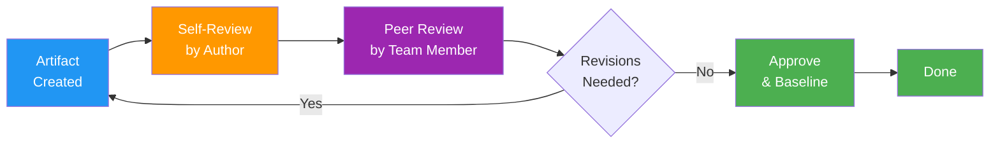
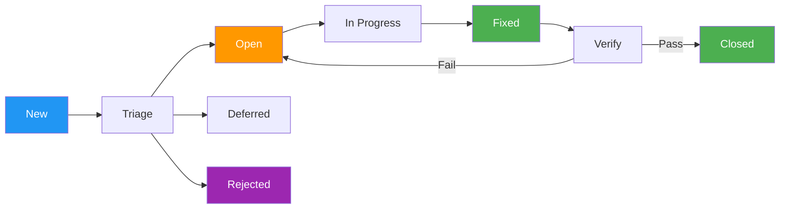

# Quality Management Plan

> **Project:** [Project Name]
> **Version:** [X.Y] | **Status:** [Draft | Under Review | Approved | Baselined]
> **Last Updated:** [YYYY-MM-DD]

---

## Document Control

| Field | Value |
|-------|-------|
| Document Owner | [Name / Role] |
| Project Manager | [Name / Role] |
| QA Lead | [Name / Role] |

### Approvals

| Role | Name | Signature | Date |
|------|------|-----------|------|
| Project Sponsor | | | |
| Project Manager | | | |
| QA Lead | | | |

---

## 1. Purpose

> This plan defines quality standards, quality assurance activities, and quality control procedures for the project.

## 2. Quality Approach

| Aspect | Approach |
|--------|---------|
| **Quality Philosophy** | [Quality is built in, not inspected in] |
| **Quality Standards** | [ISO 9001, IEEE 730, OWASP, WCAG 2.1 AA] |
| **QA Approach** | [Prevention-focused — reviews, standards, training] |
| **QC Approach** | [Detection-focused — testing, inspections, audits] |
| **Defect Management** | [Zero critical defects at go-live] |

## 3. Quality Standards

### 3.1 Standards Applicable

| Standard | Area | Requirement | Verification |
|----------|------|-------------|-------------|
| [ISO 9001] | [Quality Management] | [QMS documentation, process compliance] | [Audit] |
| [IEEE 730] | [Software QA] | [SQAP, review records, defect tracking] | [Review] |
| [ISO/IEC 29119] | [Software Testing] | [Test plan, cases, reports] | [Test execution] |
| [OWASP Top 10] | [Security] | [Secure coding, vulnerability prevention] | [SAST/DAST] |
| [WCAG 2.1 AA] | [Accessibility] | [Accessible UI] | [Accessibility audit] |
| [ISO/IEC 25010] | [Software Quality] | [Quality model — 8 characteristics] | [Quality metrics] |

### 3.2 Project-Specific Standards

| Area | Standard | Description |
|------|---------|-------------|
| [Coding] | [Language-specific style guide] | [Naming, formatting, documentation] |
| [Code Review] | [All PRs reviewed by ≥1 person] | [Before merge to main] |
| [Testing] | [≥80% code coverage] | [Unit + integration tests] |
| [Documentation] | [README, API docs, runbooks] | [Updated with each feature] |
| [Security] | [SAST on every commit, DAST weekly] | [No critical/high vulnerabilities] |

## 4. Quality Assurance (QA)

### 4.1 QA Activities

| Activity | Description | Frequency | Owner | Output |
|----------|-------------|-----------|-------|--------|
| [Requirements Review] | [Verify requirements quality — complete, consistent, testable] | [Per requirements baseline] | [BA, QA] | [Review records] |
| [Design Review] | [Verify design meets requirements and standards] | [Per design milestone] | [TL, QA] | [Review records] |
| [Code Review] | [Verify code quality, standards compliance] | [Every PR] | [Dev team] | [PR comments] |
| [Standards Compliance] | [Verify adherence to coding and documentation standards] | [Per sprint] | [QA Lead] | [Compliance report] |
| [Process Audit] | [Verify team follows defined processes] | [Monthly] | [QA Lead] | [Audit report] |
| [Training] | [Ensure team has necessary quality skills] | [As needed] | [PM, QA] | [Training records] |

### 4.2 Review Process

### 4.3 Review Types

| Review Type | When | Participants | Purpose |
|------------|------|-------------|---------|
| [Walkthrough] | [Informal — as needed] | [Author + 1-2 peers] | [Early feedback] |
| [Peer Review] | [Before formal review] | [Author + peer] | [Quality check] |
| [Technical Review] | [Design/code milestones] | [Technical team] | [Technical adequacy] |
| [Formal Review] | [Baseline milestones] | [All stakeholders] | [Approval] |
| [Inspection] | [Critical artifacts] | [Trained inspectors] | [Defect detection] |

## 5. Quality Control (QC)

### 5.1 Testing Strategy

| Test Level | Scope | Owner | Environment | Entry Criteria | Exit Criteria |
|-----------|-------|-------|-------------|---------------|--------------|
| [Unit Testing] | [Individual functions/methods] | [Developer] | [Local / CI] | [Code complete] | [≥80% coverage, all pass] |
| [Integration Testing] | [Component interactions] | [QA + Dev] | [Dev/Staging] | [Unit tests pass] | [All integration tests pass] |
| [System Testing] | [End-to-end functionality] | [QA] | [Staging] | [Integration tests pass] | [All system tests pass] |
| [Performance Testing] | [Load, stress, scalability] | [QA] | [Staging] | [System tests pass] | [NFRs met] |
| [Security Testing] | [Vulnerabilities, pen test] | [Security] | [Staging] | [System tests pass] | [No critical/high vulns] |
| [Accessibility Testing] | [WCAG 2.1 AA compliance] | [QA] | [Staging] | [UI complete] | [AA compliant] |
| [UAT] | [Business acceptance] | [BA + Users] | [Staging] | [All tests pass] | [UAT sign-off] |

### 5.2 Defect Management

| Severity | Definition | Response Time | Resolution Target | Go-Live Criteria |
|----------|-----------|--------------|------------------|-----------------|
| 🔴 Critical | [System crash, data loss, security breach] | [Immediate] | [24 hours] | [Zero open] |
| 🟠 High | [Major feature broken, no workaround] | [4 hours] | [48 hours] | [Zero open] |
| 🟡 Medium | [Feature partially broken, workaround exists] | [1 business day] | [1 sprint] | [≤3 open] |
| 🟢 Low | [Cosmetic, minor inconvenience] | [1 sprint] | [Best effort] | [No limit] |

### 5.3 Defect Lifecycle

## 6. Quality Metrics

| Metric | Target | Measurement | Frequency |
|--------|--------|-------------|-----------|
| [Defect Density] | [<X per feature] | [Defects / Features] | [Per sprint] |
| [Defect Escape Rate] | [<5%] | [Defects found in production / Total defects] | [Per release] |
| [Code Coverage] | [≥80%] | [Coverage tool] | [Per build] |
| [Code Review Coverage] | [100%] | [PRs reviewed / Total PRs] | [Per sprint] |
| [Requirements Traceability] | [100%] | [RTM] | [Per baseline] |
| [Test Case Pass Rate] | [≥95%] | [Passed / Total executed] | [Per test cycle] |
| [Sprint Velocity Variance] | [±10%] | [Actual / Planned] | [Per sprint] |
| [Customer Satisfaction] | [≥4/5] | [Survey] | [Quarterly] |

## 7. Quality Control Checklist

| # | Check | Phase | Owner | Frequency |
|---|-------|-------|-------|-----------|
| 1 | [Requirements reviewed and approved] | [Planning] | [BA] | [Per baseline] |
| 2 | [Design reviewed and approved] | [Design] | [TL] | [Per milestone] |
| 3 | [Code reviewed — all PRs] | [Development] | [Dev team] | [Every PR] |
| 4 | [Unit tests pass — ≥80% coverage] | [Development] | [Developer] | [Every build] |
| 5 | [Integration tests pass] | [Testing] | [QA] | [Per sprint] |
| 6 | [System tests pass] | [Testing] | [QA] | [Per release] |
| 7 | [Performance tests pass — NFRs met] | [Testing] | [QA] | [Pre-go-live] |
| 8 | [Security tests pass — no critical vulns] | [Testing] | [Security] | [Pre-go-live] |
| 9 | [Accessibility audit passed — WCAG AA] | [Testing] | [QA] | [Pre-go-live] |
| 10 | [UAT sign-off received] | [Acceptance] | [BA] | [Pre-go-live] |
| 11 | [Zero critical defects open] | [Go-Live] | [QA Lead] | [Go-live gate] |
| 12 | [Operations runbook approved] | [Deployment] | [TL] | [Pre-go-live] |

## 8. Quality Roles

| Role | Responsibility |
|------|---------------|
| [Project Manager] | [Overall quality accountability, resource allocation] |
| [QA Lead] | [Test strategy, quality standards, defect management] |
| [QA Engineer] | [Test execution, defect reporting, test automation] |
| [Technical Lead] | [Code quality, architecture standards, code reviews] |
| [Developers] | [Unit testing, code reviews, coding standards] |
| [Business Analyst] | [Requirements quality, UAT facilitation] |
| [Security Consultant] | [Security testing, vulnerability assessment] |

---

## Related Documents

| Document | Relationship |
|----------|-------------|
| [[Quality Metrics]] | Detailed quality metrics |
| [[Test Plan]] | Testing strategy and execution |
| [[Nonfunctional Requirements Catalog]] | Quality attribute requirements |
| [[Requirements (Verified)]] | Requirements quality verification |
| [[Project Management Plan]] | Parent plan |

---

> **Template Standard:** Based on PMBOK v8, ISO 9001, IEEE 730
> **Usage:** Quality is *everyone's responsibility*, not just QA's. Developers write quality code, BA writes quality requirements, QA verifies quality. This plan defines the standards and processes that make quality systematic.
