# Resource Breakdown Structure (RBS)

> **Project:** [Project Name]
> **Version:** [X.Y] | **Status:** [Draft | Under Review | Approved]
> **Last Updated:** [YYYY-MM-DD]

---

## 1. Purpose

> The Resource Breakdown Structure (RBS) provides a hierarchical representation of project resources by category and type. It helps identify all required resources and supports resource planning, allocation, and tracking.

## 2. RBS Diagram

```mermaid
flowchart TD
    RBS[Project<br>Resources] --> HR[Human<br>Resources]
    RBS --> PHYS[Physical<br>Resources]
    RBS --> TECH[Technology<br>Resources]
    RBS --> VENDOR[Vendor<br>Resources]

    HR --> MGMT[Management]
    HR --> TECH_TEAM[Technical]
    HR --> QA_TEAM[Quality]
    HR --> CHANGE[Change]

    MGMT --> PM[Project Manager]
    MGMT --> BA[Business Analyst]
    MGMT --> CM[Change Manager]

    TECH_TEAM --> ARCH[Solution Architect]
    TECH_TEAM --> TL[Technical Lead]
    TECH_TEAM --> DEV[Developers]
    TECH_TEAM --> DEVOPS[DevOps Engineer]

    DEV --> DEV_SR[Senior Dev ×2]
    DEV --> DEV_JR[Junior Dev ×1]

    QA_TEAM --> QA_LEAD[QA Lead]
    QA_TEAM --> QA_ENG[QA Engineer]

    PHYS --> FACILITY[Facilities]
    PHYS --> EQUIP[Equipment]

    FACILITY --> MEETING[Meeting Room]
    FACILITY --> TRAINING[Training Room]

    EQUIP --> WORKSTATION[Workstations ×6]
    EQUIP --> TEST_DEV[Test Devices ×3]

    TECH --> INFRA[Infrastructure]
    TECH --> TOOLS[Tools]

    INFRA --> DEV_ENV[Dev Environment]
    INFRA --> STAGE_ENV[Staging Environment]
    INFRA --> PROD_ENV[Production Environment]

    TOOLS --> PM_TOOL[PM Tool — Jira]
    TOOLS --> REPO[Code Repo — Git]
    TOOLS --> CI_CD[CI/CD — GitHub Actions]
    TOOLS --> MONITOR[Monitoring — Grafana]

    VENDOR --> IMPL[Implementation Consultant]
    VENDOR --> DATA[Data Migration Specialist]
    VENDOR --> SEC[Security Consultant]

    style RBS fill:#1a237e,color:#fff
    style HR fill:#4CAF50,color:#fff
    style PHYS fill:#2196F3,color:#fff
    style TECH fill:#FF9800,color:#fff
    style VENDOR fill:#9C27B0,color:#fff
```

## 3. RBS Table

| RBS Code | Resource | Category | Type | Quantity | Source | Availability |
|----------|---------|----------|------|----------|--------|-------------|
| 1.0 | Project Resources | — | — | — | — | — |
| 1.1 | Human Resources | — | — | — | — | — |
| 1.1.1 | Management | — | — | — | — | — |
| 1.1.1.1 | Project Manager | Management | Internal | 1 (50%) | IT Dept | [Date range] |
| 1.1.1.2 | Business Analyst | Management | Internal | 1 (100%) | IT Dept | [Date range] |
| 1.1.1.3 | Change Manager | Management | Internal | 1 (25%) | HR/Change | [Date range] |
| 1.1.2 | Technical | — | — | — | — | — |
| 1.1.2.1 | Solution Architect | Technical | Internal | 1 (25%) | IT Dept | [Date range] |
| 1.1.2.2 | Technical Lead | Technical | Internal | 1 (100%) | IT Dept | [Date range] |
| 1.1.2.3 | Senior Developer | Technical | Internal | 2 (100%) | IT Dept | [Date range] |
| 1.1.2.4 | Junior Developer | Technical | Internal | 1 (100%) | IT Dept | [Date range] |
| 1.1.2.5 | DevOps Engineer | Technical | Internal | 1 (50%) | IT Dept | [Date range] |
| 1.1.3 | Quality | — | — | — | — | — |
| 1.1.3.1 | QA Lead | Quality | Internal | 1 (100%) | IT Dept | [Date range] |
| 1.1.3.2 | QA Engineer | Quality | Internal | 1 (100%) | IT Dept | [Date range] |
| 1.2 | Physical Resources | — | — | — | — | — |
| 1.2.1 | Facilities | — | — | — | — | — |
| 1.2.1.1 | Meeting Room | Facility | Internal | 1 | Office | As needed |
| 1.2.1.2 | Training Room | Facility | Internal | 1 | Office | As needed |
| 1.2.2 | Equipment | — | — | — | — | — |
| 1.2.2.1 | Workstations | Equipment | Internal | 6 | IT Inventory | [Date range] |
| 1.2.2.2 | Test Devices | Equipment | Purchase | 3 | Procurement | [Date range] |
| 1.3 | Technology Resources | — | — | — | — | — |
| 1.3.1 | Infrastructure | — | — | — | — | — |
| 1.3.1.1 | Dev Environment | Cloud | Subscription | 1 | AWS/Azure | [Date range] |
| 1.3.1.2 | Staging Environment | Cloud | Subscription | 1 | AWS/Azure | [Date range] |
| 1.3.1.3 | Production Environment | Cloud | Subscription | 1 | AWS/Azure | [Date range] |
| 1.3.2 | Tools | — | — | — | — | — |
| 1.3.2.1 | PM Tool (Jira) | Tool | Subscription | 1 | Vendor | [Date range] |
| 1.3.2.2 | Code Repository (Git) | Tool | Subscription | 1 | GitHub | [Date range] |
| 1.3.2.3 | CI/CD Pipeline | Tool | Subscription | 1 | GitHub Actions | [Date range] |
| 1.3.2.4 | Monitoring | Tool | Subscription | 1 | Grafana Cloud | [Date range] |
| 1.4 | Vendor Resources | — | — | — | — | — |
| 1.4.1 | Implementation Consultant | Vendor | Contract | 1 | Vendor A | [Date range] |
| 1.4.2 | Data Migration Specialist | Vendor | Contract | 1 | Vendor A | [Date range] |
| 1.4.3 | Security Consultant | Vendor | Contract | 1 | Vendor B | [Date range] |

## 4. RBS Statistics

| Category | Resource Count | Total Cost | % of Budget |
|----------|--------------|-----------|------------|
| Human Resources | [10] | $[X] | [Y%] |
| Physical Resources | [6] | $[X] | [Y%] |
| Technology Resources | [7] | $[X] | [Y%] |
| Vendor Resources | [3] | $[X] | [Y%] |
| **Total** | **[26]** | **$[Sum]** | **100%** |

## 5. RBS Verification

| # | Check | Status |
|---|-------|--------|
| 1 | [All WBS elements have assigned resources] | ✅❌ |
| 2 | [No resource assigned to multiple conflicting tasks] | ✅❌ |
| 3 | [All resources have confirmed availability] | ✅❌ |
| 4 | [Vendor resources have contracts in place] | ✅❌ |
| 5 | [Infrastructure provisioned before needed] | ✅❌ |

---

## Related Documents

| Document | Relationship |
|----------|-------------|
| [[Resource Management Plan]] | How resources are managed |
| [[Resource Requirements]] | Detailed resource needs per WBS |
| [[WBS]] | Work packages requiring resources |
| [[Cost Estimates]] | Costs per resource |

---

> **Template Standard:** Based on PMBOK v8, ISO 21502
> **Usage:** The RBS provides a *complete inventory* of all project resources. Use it alongside the WBS to ensure every work package has resources assigned. The RBS also feeds into cost estimation and risk identification.
