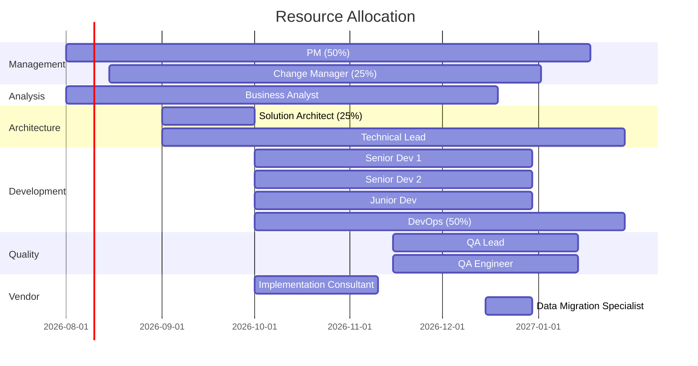

# Resource Management Plan

> **Project:** [Project Name]
> **Version:** [X.Y] | **Status:** [Draft | Under Review | Approved | Baselined]
> **Last Updated:** [YYYY-MM-DD]

---

## Document Control

| Field | Value |
|-------|-------|
| Document Owner | [Name / Role] |
| Project Manager | [Name / Role] |

### Approvals

| Role | Name | Signature | Date |
|------|------|-----------|------|
| Project Sponsor | | | |
| Project Manager | | | |
| HR Director | | | |

---

## 1. Purpose

> This plan defines how project resources (people, equipment, facilities) will be acquired, managed, and released.

## 2. Resource Strategy

| Aspect | Approach |
|--------|---------|
| **Staffing Model** | [Internal team + vendor augmentation] |
| **Acquisition Method** | [Internal assignment + vendor contract] |
| **Team Structure** | [Cross-functional, co-located + remote hybrid] |
| **Resource Pool** | [IT department + vendor partner] |
| **Release Strategy** | [Phased release — per phase completion] |

## 3. Resource Requirements

### 3.1 Human Resources

| Role | Count | Source | Start | End | Allocation | Skills Required |
|------|-------|--------|-------|-----|-----------|----------------|
| [Project Manager] | 1 | Internal | [YYYY-MM-DD] | [YYYY-MM-DD] | 50% | [PMP, Agile, stakeholder mgmt] |
| [Business Analyst] | 1 | Internal | [YYYY-MM-DD] | [YYYY-MM-DD] | 100% | [BABOK, requirements, workshops] |
| [Technical Lead] | 1 | Internal | [YYYY-MM-DD] | [YYYY-MM-DD] | 100% | [Architecture, cloud, APIs] |
| [Senior Developer] | 2 | Internal | [YYYY-MM-DD] | [YYYY-MM-DD] | 100% | [React, Node.js, PostgreSQL] |
| [Junior Developer] | 1 | Internal | [YYYY-MM-DD] | [YYYY-MM-DD] | 100% | [React, Node.js] |
| [QA Lead] | 1 | Internal | [YYYY-MM-DD] | [YYYY-MM-DD] | 100% | [Test strategy, automation] |
| [QA Engineer] | 1 | Internal | [YYYY-MM-DD] | [YYYY-MM-DD] | 100% | [Manual + automated testing] |
| [Solution Architect] | 1 | Internal | [YYYY-MM-DD] | [YYYY-MM-DD] | 25% | [Cloud architecture, security] |
| [Change Manager] | 1 | Internal | [YYYY-MM-DD] | [YYYY-MM-DD] | 25% | [ADKAR, training, communication] |
| [DevOps Engineer] | 1 | Internal | [YYYY-MM-DD] | [YYYY-MM-DD] | 50% | [CI/CD, cloud, monitoring] |
| [Implementation Consultant] | 1 | Vendor | [YYYY-MM-DD] | [YYYY-MM-DD] | 100% | [CRM platform expertise] |
| [Data Migration Specialist] | 1 | Vendor | [YYYY-MM-DD] | [YYYY-MM-DD] | 100% | [ETL, data quality] |

### 3.2 Physical Resources

| Resource | Type | Quantity | Start | End | Source | Cost |
|----------|------|----------|-------|-----|--------|------|
| [Development workstations] | Equipment | 6 | [YYYY-MM-DD] | [YYYY-MM-DD] | [IT inventory] | [Existing] |
| [Meeting room — workshops] | Facility | 1 | [YYYY-MM-DD] | [YYYY-MM-DD] | [Office] | [Existing] |
| [Cloud dev environment] | Infrastructure | 1 | [YYYY-MM-DD] | [YYYY-MM-DD] | [AWS/Azure] | $[X]/month |
| [Cloud staging environment] | Infrastructure | 1 | [YYYY-MM-DD] | [YYYY-MM-DD] | [AWS/Azure] | $[X]/month |
| [Cloud production environment] | Infrastructure | 1 | [YYYY-MM-DD] | [YYYY-MM-DD] | [AWS/Azure] | $[X]/month |
| [Testing devices] | Equipment | 3 | [YYYY-MM-DD] | [YYYY-MM-DD] | [Purchase] | $[X] one-time |

## 4. Resource Calendar

### 4.1 Resource Allocation Timeline

### 4.2 Resource Loading

| Resource | Phase 1 | Phase 2 | Phase 3 | Phase 4 | Phase 5 | Total |
|----------|---------|---------|---------|---------|---------|-------|
| [PM] | 50% | 50% | 50% | 50% | 50% | [85 days] |
| [BA] | 100% | 100% | 25% | 50% | 100% | [100 days] |
| [TL] | 50% | 100% | 100% | 100% | 50% | [120 days] |
| [Dev 1] | 0% | 0% | 100% | 50% | 0% | [55 days] |
| [Dev 2] | 0% | 0% | 100% | 50% | 0% | [55 days] |
| [Dev 3] | 0% | 0% | 100% | 50% | 0% | [55 days] |
| [QA Lead] | 0% | 0% | 0% | 100% | 25% | [35 days] |
| [QA Engineer] | 0% | 0% | 0% | 100% | 25% | [35 days] |

## 5. Resource Acquisition

### 5.1 Acquisition Process

| Resource | Process | Timeline | Authority | Risk |
|----------|---------|----------|----------|------|
| [Internal staff] | [Resource request to functional manager] | [2 weeks] | [PM + Functional Manager] | [Competing priorities] |
| [Vendor resources] | [Procurement — SOW + contract] | [4 weeks] | [PM + Procurement] | [Vendor delays] |
| [Infrastructure] | [IT provisioning request] | [1 week] | [PM + IT] | [Approval delays] |
| [Equipment] | [Purchase request] | [2 weeks] | [PM + Finance] | [Budget approval] |

### 5.2 Resource Release Plan

| Resource | Release Date | Reason | Knowledge Transfer |
|----------|-------------|--------|-------------------|
| [Solution Architect] | [YYYY-MM-DD] | [Architecture complete] | [Design docs, ADRs] |
| [Implementation Consultant] | [YYYY-MM-DD] | [Configuration complete] | [Config docs, runbook] |
| [Data Migration Specialist] | [YYYY-MM-DD] | [Migration complete] | [Migration scripts, validation] |
| [Developers] | [YYYY-MM-DD] | [Development complete] | [Code review, documentation] |
| [QA team] | [YYYY-MM-DD] | [Testing complete] | [Test results, defect log] |

## 6. Resource Conflict Resolution

| Conflict Type | Resolution Process | Escalation |
|--------------|-------------------|-----------|
| [Resource unavailable] | [Negotiate with functional manager] | [PM → Sponsor] |
| [Over-allocation] | [Re-prioritize, adjust timeline] | [PM → Steering Committee] |
| [Skill gap identified] | [Training or external hire] | [PM → HR + Sponsor] |
| [Vendor resource issue] | [Vendor management — SLA enforcement] | [PM → Procurement] |
| [Team conflict] | [Mediation, role clarification] | [PM → HR] |

## 7. Training Plan

| Training | Audience | Duration | Timing | Delivery | Cost |
|----------|---------|----------|--------|----------|------|
| [CRM Platform Training] | [Dev team, BA] | [3 days] | [Before Sprint 1] | [Vendor — classroom] | $[X] |
| [Cloud Platform Training] | [DevOps, TL] | [2 days] | [Before Phase 2] | [Online — certification] | $[X] |
| [Security Training] | [Dev team] | [1 day] | [Before Sprint 3] | [Internal — workshop] | $[X] |
| [Agile Refresher] | [All] | [Half day] | [Project kickoff] | [Internal — workshop] | $0 |

## 8. Team Performance

### 8.1 Performance Metrics

| Metric | Target | Measurement | Frequency |
|--------|--------|-------------|-----------|
| [Sprint velocity] | [20 points/sprint] | [Completed story points] | Per sprint |
| [Team satisfaction] | [≥4/5] | [Anonymous survey] | Monthly |
| [Resource utilization] | [80-90%] | [Time tracking] | Weekly |
| [Knowledge sharing] | [1 session/sprint] | [Session count] | Per sprint |
| [Turnover rate] | [0%] | [HR tracking] | Monthly |

### 8.2 Team Building Activities

| Activity | Frequency | Purpose | Budget |
|----------|-----------|---------|--------|
| [Sprint retrospective] | Bi-weekly | [Process improvement] | $0 |
| [Team lunch] | Monthly | [Team bonding] | $[X]/month |
| [Knowledge sharing session] | Bi-weekly | [Skill development] | $0 |
| [Project celebration] | Per milestone | [Motivation] | $[X] |

---

## Related Documents

| Document | Relationship |
|----------|-------------|
| [[Resource-Requirements]] | Detailed resource needs |
| [[Resource-Breakdown-Structure]] | Resource hierarchy |
| [[Team-Charter]] | Team working agreements |
| [[Skill-Matrix]] | Skills assessment |
| [[Project-Management-Plan]] | Parent plan |

---

> **Template Standard:** Based on PMBOK v8, ISO 21502
> **Usage:** This plan ensures the right resources are available at the right time. Acquire resources early — delays in staffing cascade into schedule delays. Release resources when their work is complete to control costs.
