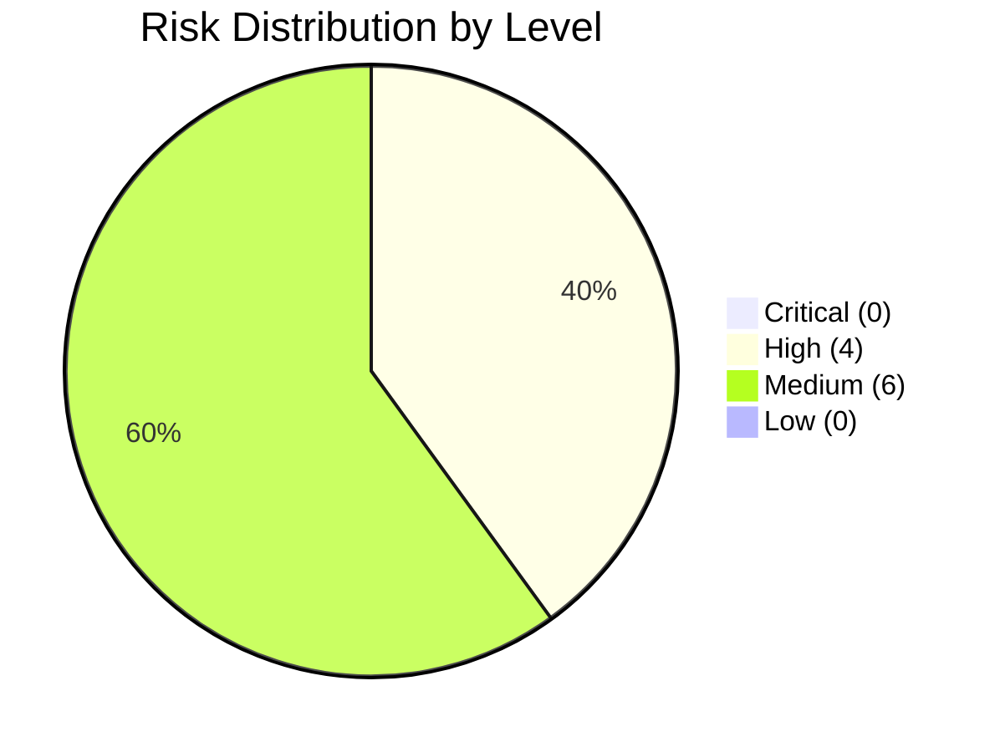

# Risk Report

> **Project:** [Project Name]
> **Report Date:** [YYYY-MM-DD]
> **Reporting Period:** [YYYY-MM-DD] to [YYYY-MM-DD]

---

## 1. Risk Dashboard

| Metric | Current | Previous | Trend | Target | Status |
|--------|---------|----------|-------|--------|--------|
| [Total Open Risks] | [10] | [12] | ↓ | [<15] | 🟢 |
| [🔴 Critical Risks] | [0] | [0] | → | [0] | 🟢 |
| [🟠 High Risks] | [4] | [5] | ↓ | [<3] | 🟡 |
| [🟡 Medium Risks] | [6] | [7] | ↓ | [<10] | 🟢 |
| [Risks with Mitigation Plan] | [100%] | [100%] | → | [100%] | 🟢 |
| [Overdue Risk Actions] | [1] | [2] | ↓ | [0] | 🟡 |
| [Risks Materialized This Period] | [0] | [0] | → | [0] | 🟢 |

## 2. Risk Summary

## 3. Top Risks

### 3.1 High Risks (🟠)

| Risk ID | Description | Score | Response | Owner | Status | Trend |
|---------|-------------|-------|----------|-------|--------|-------|
| R-001 | [Key developer leaves] | 12 | [Knowledge sharing, backup] | PM | 🟡 In Progress | ↓ |
| R-002 | [ERP API unstable] | 12 | [POC, fallback plan] | TL | 🟡 In Progress | → |
| R-004 | [Stakeholder availability for UAT] | 12 | [Early scheduling, commitment] | BA | 🟡 In Progress | ↓ |
| R-009 | [Scope creep] | 12 | [Change control, MoSCoW] | PM | 🟡 In Progress | ↓ |

### 3.2 Medium Risks (🟡)

| Risk ID | Description | Score | Response | Owner | Status | Trend |
|---------|-------------|-------|----------|-------|--------|-------|
| R-003 | [Data migration quality] | 9 | [Data profiling, parallel run] | Data Arch | ⬜ Not Started | → |
| R-005 | [Vendor price increase] | 6 | [Fixed-price contract] | PM | ✅ Mitigated | ↓ |
| R-006 | [Performance below NFRs] | 8 | [Load testing, CDN] | TL | 🟡 In Progress | → |
| R-007 | [Regulatory change] | 8 | [Monitor, contingency] | Compliance | 🟡 Monitoring | → |
| R-008 | [Skill gap — cloud] | 6 | [Training, vendor support] | PM | 🟡 In Progress | ↓ |
| R-010 | [Security vulnerability] | 10 | [SAST/DAST, pen test] | Security | 🟡 In Progress | → |

## 4. Risk Changes This Period

### 4.1 New Risks

| Risk ID | Description | Level | Source | Owner |
|---------|-------------|-------|--------|-------|
| [None this period] | | | | |

### 4.2 Risks Escalated

| Risk ID | Previous Level | New Level | Reason |
|---------|---------------|----------|--------|
| [None this period] | | | |

### 4.3 Risks Retired

| Risk ID | Reason | Outcome |
|---------|--------|---------|
| R-011 | [Vendor confirmed fixed pricing] | [Mitigated — contract signed] |

### 4.4 Risk Response Actions Completed

| Risk ID | Action | Completed | Outcome |
|---------|--------|-----------|---------|
| R-001 | [Identified backup developer] | [YYYY-MM-DD] | [Backup ready] |
| R-004 | [Scheduled UAT early with confirmed attendees] | [YYYY-MM-DD] | [80% confirmed] |

## 5. Risk Trend Analysis

| Period | Total | 🔴 | 🟠 | 🟡 | 🟢 | Trend |
|--------|-------|-----|-----|-----|-----|-------|
| [Month 1] | [8] | [0] | [3] | [5] | [0] | — |
| [Month 2] | [10] | [0] | [4] | [6] | [0] | ↑ |
| [Month 3] | [10] | [0] | [4] | [6] | [0] | → |
| **Current** | **[10]** | **[0]** | **[4]** | **[6]** | **[0]** | **→** |

## 6. Risks Materialized

| Risk ID | Original Risk | Materialized | Impact | Response Taken | Outcome |
|---------|--------------|-------------|--------|---------------|---------|
| [None this period] | | | | | |

## 7. Overdue Risk Actions

| Risk ID | Action | Due Date | Days Overdue | Owner | Escalation |
|---------|--------|----------|-------------|-------|-----------|
| R-003 | [Complete data profiling] | [YYYY-MM-DD] | [X days] | Data Arch | [Escalated to PM] |

## 8. Recommendations

| # | Recommendation | Priority | Owner |
|---|---------------|----------|-------|
| 1 | [Accelerate data profiling to reduce R-003] | 🟡 | Data Architect |
| 2 | [Continue knowledge sharing for R-001] | 🟡 | PM |
| 3 | [Schedule R-006 load testing in Sprint 3] | 🟡 | TL |

## 9. Risk Budget Status

| Reserve | Allocated | Used | Remaining | Status |
|---------|----------|------|----------|--------|
| [Contingency Reserve] | $[X] | $[Y] | $[X-Y] | 🟢 Sufficient |
| [Management Reserve] | $[X] | $0 | $[X] | 🟢 Untouched |

---

## Distribution

| Audience | Frequency | Channel |
|----------|-----------|---------|
| [Project Sponsor] | Bi-weekly | [Email + meeting] |
| [Steering Committee] | Monthly | [Dashboard + presentation] |
| [Project Team] | Bi-weekly | [Risk review meeting] |

---

## Related Documents

| Document | Relationship |
|----------|-------------|
| [[Risk Register]] | Detailed risk tracking |
| [[Risk Management Plan]] | How risks are managed |
| [[Risk Analysis Results]] | Initial risk analysis |

---

> **Template Standard:** Based on PMBOK v8, ISO 31000
> **Usage:** This report summarizes risk status for stakeholders. Keep it concise — focus on top risks, changes, and recommendations. The risk register has the detail; this report has the story.
