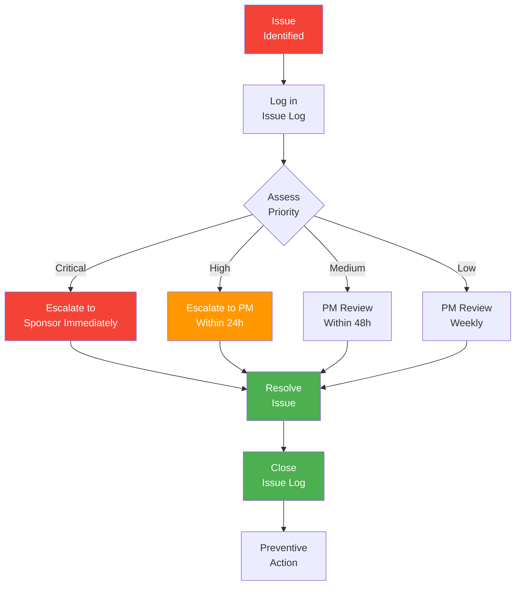

# Issue Log

> **Project:** [Project Name]
> **Version:** [X.Y] | **Status:** [Active]
> **Last Updated:** [YYYY-MM-DD]

---

## 1. Purpose

> This log tracks all project issues — problems that have occurred and need resolution. Unlike risks (which may happen), issues are *currently happening* and require action.

## 2. Issue Register

| Issue ID | Date Raised | Title | Description | Category | Priority | Impact | Owner | Status | Target Date | Resolution | Resolved Date |
|----------|-----------|-------|-------------|----------|---------|--------|-------|--------|-----------|------------|--------------|
| ISS-001 | [YYYY-MM-DD] | [ERP API intermittent failures] | [API returns 500 errors intermittently, blocking integration testing] | Technical | 🔴 Critical | [Blocks Sprint 3 integration] | TL | 🔴 Open | [YYYY-MM-DD] | | |
| ISS-002 | [YYYY-MM-DD] | [Stakeholder unavailable for UAT] | [Operations Manager on leave, can't attend UAT sessions] | Resource | 🟠 High | [UAT may be delayed] | PM | 🟡 In Progress | [YYYY-MM-DD] | [Delegated to Team Lead] | |
| ISS-003 | [YYYY-MM-DD] | [Performance below target] | [Page load time 3.5s vs 2s target under load] | Technical | 🟡 Medium | [NFR not met] | TL | 🟡 In Progress | [YYYY-MM-DD] | | |
| ISS-004 | [YYYY-MM-DD] | [Test environment unstable] | [Staging environment crashes during test execution] | Technical | 🟠 High | [Testing blocked] | DevOps | ✅ Resolved | [YYYY-MM-DD] | [Increased instance size] | [YYYY-MM-DD] |
| ISS-005 | [YYYY-MM-DD] | [Missing test data] | [No realistic test data for UAT scenarios] | Quality | 🟡 Medium | [UAT quality at risk] | BA | 🟡 In Progress | [YYYY-MM-DD] | | |

## 3. Issue Priority

| Priority | Definition | Response Time | Escalation |
|----------|-----------|--------------|-----------|
| 🔴 Critical | [Blocks project progress, no workaround] | [Immediate] | [PM → Sponsor within 24h] |
| 🟠 High | [Significant impact, workaround exists] | [Within 24h] | [PM within 48h] |
| 🟡 Medium | [Moderate impact, manageable] | [Within 48h] | [PM weekly review] |
| 🟢 Low | [Minor impact, can be deferred] | [Within 1 sprint] | [PM bi-weekly review] |

## 4. Issue Categories

| Category | Description | Examples |
|----------|-------------|---------|
| **Technical** | [System, integration, performance issues] | [API failures, bugs, environment issues] |
| **Resource** | [People, availability, skill issues] | [Unavailability, turnover, skill gaps] |
| **Requirements** | [Clarity, completeness, conflicts] | [Ambiguous requirements, missing details] |
| **External** | [Vendor, regulatory, third-party] | [Vendor delays, API changes] |
| **Quality** | [Testing, defects, standards] | [Test data, environment, coverage] |
| **Schedule** | [Delays, dependencies, blockers] | [Dependency delays, critical path impact] |
| **Scope** | [Scope disputes, additions] | [Scope creep, stakeholder disagreements] |

## 5. Issue Statistics

| Metric | Count | Target | Status |
|--------|-------|--------|--------|
| [Total Open Issues] | [3] | [<5] | 🟢 |
| [🔴 Critical Open] | [1] | [0] | 🔴 |
| [🟠 High Open] | [1] | [<2] | 🟢 |
| [🟡 Medium Open] | [1] | [<3] | 🟢 |
| [Avg Resolution Time] | [X days] | [<5 days] | 🟢🟡🔴 |
| [Overdue Issues] | [0] | [0] | 🟢 |

## 6. Issue Resolution Template

> **Use this template when resolving an issue.**

### ISS-XXX: [Issue Title]

| Field | Detail |
|-------|--------|
| **Issue ID** | [ISS-XXX] |
| **Date Raised** | [YYYY-MM-DD] |
| **Raised By** | [Name / Role] |
| **Description** | [Clear description of the issue] |
| **Impact** | [What is affected — scope, schedule, cost, quality] |
| **Priority** | [Critical / High / Medium / Low] |
| **Owner** | [Name / Role] |
| **Root Cause** | [Why the issue occurred] |
| **Resolution** | [What was done to resolve it] |
| **Preventive Action** | [How to prevent recurrence] |
| **Resolved Date** | [YYYY-MM-DD] |
| **Resolved By** | [Name / Role] |

## 7. Issue Escalation Process

## 8. Issue Review Cadence

| Review | Frequency | Participants | Purpose |
|--------|-----------|-------------|---------|
| [Daily Issue Check] | Daily | [PM] | [Review critical/high issues] |
| [Issue Review Meeting] | Bi-weekly | [PM, BA, TL] | [Review all open issues, assign owners] |
| [Escalation Review] | As needed | [PM, Sponsor] | [Review escalated issues] |
| [Issue Retrospective] | Monthly | [Full team] | [Root cause analysis, preventive actions] |

---

## Related Documents

| Document | Relationship |
|----------|-------------|
| [[Risk Register]] | Risks that may become issues |
| [[Change Log]] | Issues that require scope changes |
| [[Lessons Learned Register]] | Resolved issues feed lessons learned |
| [[Risk Report]] | Issue status in risk reporting |

---

> **Template Standard:** Based on PMBOK v8, ISO 21502
> **Usage:** Issues are *happening now* — unlike risks (which might happen). Log every issue, assign an owner, and track to resolution. Review daily for critical issues, bi-weekly for all open issues. Unresolved issues become risks.
