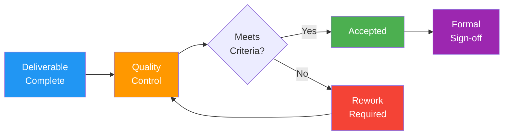

# Verified Deliverables

> **Project:** [Project Name]
> **Version:** [X.Y] | **Status:** [Draft | Under Review | Approved]
> **Last Updated:** [YYYY-MM-DD]

---

## 1. Purpose

> This document records the verification and acceptance of all project deliverables. Each deliverable is verified against its acceptance criteria before formal acceptance.

## 2. Verification Process

## 3. Verified Deliverables Register

| ID | Deliverable | Acceptance Criteria | Verification Method | Verified By | Date | Status | Accepted By | Accept Date |
|----|------------|-------------------|-------------------|------------|------|--------|------------|------------|
| D-01 | [Customer Portal] | [All portal FRs pass, WCAG AA, <2s response] | [UAT + Performance test + Accessibility audit] | [QA Lead] | [Date] | ✅ Verified | [Business Owner] | [Date] |
| D-02 | [Admin Portal] | [All admin FRs pass, keyboard nav, <2s response] | [UAT + Performance test] | [QA Lead] | [Date] | ✅ Verified | [Business Owner] | [Date] |
| D-03 | [Processing Engine] | [All workflow FRs pass, auto-approve works, <1h processing] | [System test + Performance test] | [QA Lead] | [Date] | ✅ Verified | [Business Owner] | [Date] |
| D-04 | [API Integrations] | [ERP sync works, payment processes, email sends] | [Integration test] | [QA Lead] | [Date] | ✅ Verified | [IT Director] | [Date] |
| D-05 | [Data Migration] | [100% record count, data validation passes] | [Data reconciliation report] | [Data Architect] | [Date] | ✅ Verified | [Data Owner] | [Date] |
| D-06 | [Training Package] | [90% completion, satisfaction ≥4/5] | [Training records + survey] | [BA] | [Date] | ✅ Verified | [Operations Mgr] | [Date] |
| D-07 | [User Documentation] | [Complete, accurate, reviewed] | [Peer review + user feedback] | [BA] | [Date] | ✅ Verified | [Business Owner] | [Date] |
| D-08 | [Admin Documentation] | [Complete, accurate, reviewed] | [Peer review + IT feedback] | [TL] | [Date] | ✅ Verified | [IT Director] | [Date] |
| D-09 | [Operations Runbook] | [Complete, tested, approved] | [IT team review + walkthrough] | [TL] | [Date] | ✅ Verified | [IT Director] | [Date] |
| D-10 | [Source Code] | [Code reviewed, tests pass, documented] | [PR reviews + CI/CD pipeline] | [TL] | [Date] | ✅ Verified | [Tech Lead] | [Date] |

## 4. Verification Statistics

| Metric | Count | Percentage |
|--------|-------|-----------|
| Total Deliverables | [10] | 100% |
| ✅ Verified & Accepted | [10] | 100% |
| ⚠️ Verified with Conditions | [0] | 0% |
| ❌ Not Verified | [0] | 0% |

## 5. Verification Evidence

| Deliverable | Evidence Location | Type |
|------------|------------------|------|
| [Customer Portal] | [Test report URL, UAT sign-off document] | [Report + Signature] |
| [Admin Portal] | [Test report URL, UAT sign-off document] | [Report + Signature] |
| [Processing Engine] | [Test report URL, performance test results] | [Report] |
| [API Integrations] | [Integration test report URL] | [Report] |
| [Data Migration] | [Reconciliation report URL] | [Report] |
| [Training] | [Training records URL, survey results] | [Records + Survey] |
| [Documentation] | [Confluence URLs, review records] | [Documents] |
| [Source Code] | [Git repository URL, CI/CD pipeline URL] | [Repository] |

## 6. Outstanding Issues

| # | Deliverable | Issue | Severity | Owner | Target Date | Status |
|---|-----------|-------|----------|-------|-----------|--------|
| 1 | [None — all deliverables verified] | | | | | |

## 7. Acceptance Summary

> All deliverables have been verified against their acceptance criteria and formally accepted by the designated stakeholders. The project deliverables are complete.

| Role | Name | Signature | Date |
|------|------|-----------|------|
| QA Lead | | | |
| Business Owner | | | |
| IT Director | | | |
| Project Sponsor | | | |

---

## Related Documents

| Document | Relationship |
|----------|-------------|
| [[Project-Closure-Document]] | Formal closure |
| [[Quality-Management-Plan]] | Quality standards applied |
| [[Acceptance-Criteria]] | Criteria used for verification |
| [[Usability-Test-Report]] | Test evidence |
| [[Acceptance-Criteria]] | User acceptance evidence |

---

> **Template Standard:** Based on PMBOK v8
> **Usage:** Every deliverable must be *verified* (meets criteria) before *acceptance* (stakeholder signs off). Verification is QA's job; acceptance is the business owner's job. Keep evidence links for audit purposes.
