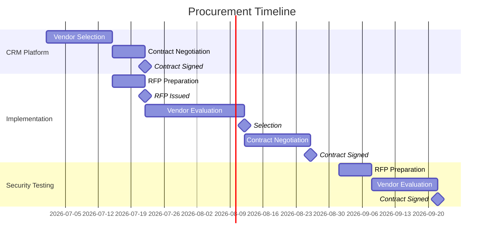

# Sourcing Strategy Plan

> **Project:** [Project Name]
> **Version:** [X.Y] | **Status:** [Draft | Under Review | Approved]
> **Last Updated:** [YYYY-MM-DD]

---

## 1. Purpose

> This plan defines the sourcing strategy — what to build, what to buy, and how to select vendors.

## 2. Sourcing Decisions

### 2.1 Make/Buy Analysis

| Component | Make (Internal) | Buy (External) | Decision | Rationale |
|-----------|----------------|---------------|---------|----------|
| [Core CRM Platform] | [$X, Y months, Z FTEs] | [$X, Y months, subscription] | **Buy** | [Faster TTO, vendor support, lower risk] |
| [Customer Portal] | [$X, Y months, Z FTEs] | [Limited customization available] | **Make** | [Core differentiator, custom UX required] |
| [Processing Engine] | [$X, Y months, Z FTEs] | [$X, Y months, subscription] | **Buy (CRM workflow)** | [CRM has built-in workflow engine] |
| [Integration Layer] | [$X, Y months, Z FTEs] | [$X/year, iPaaS] | **Make** | [Simple integrations, avoid vendor lock-in] |
| [Reporting Dashboard] | [$X, Y months, Z FTEs] | [$X/year, BI tool] | **Buy** | [BI tool more capable, self-service] |
| [Data Migration] | [$X, Y months, Z FTEs] | [$X, fixed price] | **Buy** | [Vendor has domain expertise and tools] |
| [Security Testing] | [Internal capability limited] | [$X, fixed price] | **Buy** | [Specialized expertise required] |
| [Training] | [$X, Y weeks] | [$X, fixed price] | **Make** | [Internal team knows the content best] |

### 2.2 Sourcing Summary

| Strategy | Components | Count | Total Value |
|----------|-----------|-------|------------|
| **Buy — SaaS** | [CRM, Reporting] | [2] | $[X]/year |
| **Buy — Service** | [Implementation, Migration, Security Testing] | [3] | $[X] one-time |
| **Make — Internal** | [Portal, Integration, Training] | [3] | $[X] internal cost |
| **Total** | | **[8]** | **$[Sum]** |

## 3. Vendor Selection Strategy

### 3.1 Selection Methods

| Method | When to Use | Threshold | Process |
|--------|------------|----------|---------|
| [Competitive Bid (RFP)] | [>$50K, significant scope] | [$50K] | [RFP → Evaluation → Selection → Contract] |
| [Direct Award] | [<$50K, sole source justified] | [$50K] | [Quote → Evaluation → Contract] |
| [Existing Contract] | [Extension of current vendor] | [Any] | [Amendment → Approval] |
| [Framework Agreement] | [Pre-negotiated terms] | [Any] | [Call-off → SOW] |

### 3.2 Vendor Selection per Component

| Component | Selection Method | Vendors Considered | Timeline | Status |
|-----------|----------------|-------------------|----------|--------|
| [CRM Platform] | [Direct — existing vendor] | [1] | [4 weeks] | ✅ Selected |
| [Implementation] | [Competitive bid] | [3] | [6 weeks] | ✅ Selected |
| [Migration] | [Direct — same vendor] | [1] | [2 weeks] | ✅ Selected |
| [Security Testing] | [Competitive bid] | [3] | [4 weeks] | ⏳ In Progress |
| [Reporting] | [Direct — existing vendor] | [1] | [2 weeks] | ✅ Selected |

## 4. Vendor Evaluation Criteria

| Criterion | Weight | Description |
|-----------|--------|-------------|
| [Functional Fit] | [25%] | [How well the solution meets requirements] |
| [Total Cost (5-year)] | [20%] | [TCO including implementation and operations] |
| [Vendor Viability] | [15%] | [Financial health, market position, roadmap] |
| [Implementation Risk] | [15%] | [Track record, complexity, timeline] |
| [Integration Capability] | [10%] | [API quality, pre-built connectors] |
| [Support Quality] | [10%] | [SLA, support model, responsiveness] |
| [Innovation Roadmap] | [5%] | [Product vision, R&D investment] |

## 5. Contract Strategy

| Component | Contract Type | Payment Terms | Key Clauses |
|-----------|--------------|--------------|------------|
| [CRM SaaS] | [Subscription] | [Annual, upfront] | [SLA, data portability, termination] |
| [Implementation] | [Fixed-price] | [Milestone-based] | [Acceptance criteria, warranty, IP] |
| [Migration] | [Fixed-price] | [Milestone-based] | [Data accuracy guarantee, warranty] |
| [Security Testing] | [Fixed-price] | [Upon completion] | [Confidentiality, findings ownership] |
| [Reporting SaaS] | [Subscription] | [Monthly] | [SLA, data portability] |

## 6. Procurement Timeline

## 7. Sourcing Risks

| Risk | Probability | Impact | Mitigation |
|------|-----------|--------|-----------|
| [Vendor delivery delays] | Medium | High | [SLA penalties, milestone payments] |
| [Vendor cost escalation] | Low | Medium | [Fixed-price contracts, price locks] |
| [Vendor lock-in] | Medium | Medium | [Data portability clauses, standard APIs] |
| [Single vendor dependency] | Medium | High | [Alternative vendors identified] |

---

## Related Documents

| Document | Relationship |
|----------|-------------|
| [[Procurement Management Plan]] | Overall procurement strategy |
| [[Source Selection Criteria]] | Detailed evaluation criteria |
| [[Bid Documents]] | RFP/RFQ documents |
| [[Design Options]] | Make/buy analysis |
| [[Market Analysis / Technology Assessment]] | Market research supporting sourcing |

---

> **Template Standard:** Based on PMBOK v8, ISO 21502
> **Usage:** This plan answers "What do we build vs buy, and how do we choose vendors?" It should be established early — procurement lead times can be 4-8 weeks. Delay procurement = delay project.
