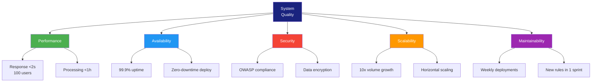

# Architecture Evaluation Report (ATAM)

> **Project:** [Project Name]
> **Version:** [X.Y] | **Status:** [Draft | Under Review | Approved]
> **Last Updated:** [YYYY-MM-DD]

---

## 1. Purpose

> This report documents the results of an Architecture Tradeoff Analysis Method (ATAM) evaluation — assessing the architecture's ability to meet quality attribute requirements and identifying trade-offs, risks, and sensitivity points.

## 2. Evaluation Summary

| Field | Detail |
|-------|--------|
| [Evaluation Date] | [YYYY-MM-DD] |
| [Evaluation Team] | [Names — architect, QA, external reviewer] |
| [Architecture Version] | [vX.Y] |
| [Overall Assessment] | ✅ Suitable / ⚠️ Suitable with conditions / ❌ Not suitable |
| [Critical Risks] | [X] |
| [Non-Critical Risks] | [X] |
| [Sensitivity Points] | [X] |
| [Trade-off Points] | [X] |

## 3. Quality Attribute Scenarios

| ID | Quality Attribute | Scenario | Response Measure | Priority |
|----|------------------|---------|-----------------|----------|
| QA-001 | [Performance] | [100 concurrent users submit requests] | [Response <2s at 95th percentile] | 🔴 |
| QA-002 | [Availability] | [Single AZ failure] | [Service continues, <1 min failover] | 🔴 |
| QA-003 | [Security] | [Attacker attempts SQL injection] | [Request blocked, logged, no data breach] | 🔴 |
| QA-004 | [Scalability] | [Volume increases 10x] | [Auto-scale, same SLA] | 🟡 |
| QA-005 | [Maintainability] | [New business rule needed] | [Implemented and deployed within 1 sprint] | 🟡 |
| QA-006 | [Modifiability] | [New integration required] | [New connector deployed within 2 sprints] | 🟡 |

## 4. Architecture Analysis

### 4.1 Sensitivity Points

> Architectural decisions that significantly affect one or more quality attributes.

| ID | Decision | Quality Attribute Affected | Sensitivity | Analysis |
|----|---------|--------------------------|------------|---------|
| SP-001 | [Use of message queue for notifications] | [Availability, Performance] | High | [Decouples services; if queue fails, notifications stop] |
| SP-002 | [Single database for all services] | [Scalability, Availability] | High | [Simple but limits independent scaling; single point of failure] |
| SP-003 | [JWT token expiration set to 30 min] | [Security, Usability] | Medium | [Shorter = more secure but more re-auth prompts] |

### 4.2 Trade-off Points

> Architectural decisions that affect multiple quality attributes in opposing ways.

| ID | Decision | Benefits | Costs | Trade-off |
|----|---------|---------|-------|----------|
| TP-001 | [Microservices architecture] | [Scalability, maintainability, fault isolation] | [Complexity, network latency, data consistency] | [Better scalability at cost of operational complexity] |
| TP-002 | [Synchronous API calls for ERP integration] | [Simplicity, immediate feedback] | [Coupling, availability dependency] | [Simple but tightly coupled to ERP availability] |
| TP-003 | [Caching at API gateway] | [Performance, reduced DB load] | [Stale data risk, cache invalidation complexity] | [Faster reads at cost of data freshness] |

### 4.3 Risks

| ID | Risk | Quality Attribute | Probability | Impact | Level | Mitigation |
|----|------|------------------|------------|--------|-------|-----------|
| R-001 | [Single database becomes bottleneck at 10x scale] | Scalability | Medium | High | 🟠 | [Read replicas, consider sharding] |
| R-002 | [Message queue failure stops notifications] | Availability | Low | High | 🟡 | [Queue clustering, dead letter queue, monitoring] |
| R-003 | [ERP API latency affects request processing] | Performance | Medium | Medium | 🟡 | [Timeout handling, async processing, circuit breaker] |
| R-004 | [JWT token compromise] | Security | Low | Critical | 🟡 | [Short expiration, refresh tokens, token revocation] |
| R-005 | [Cache invalidation bugs] | Correctness | Medium | Medium | 🟡 | [TTL-based expiration, cache-aside pattern] |

### 4.4 Non-Risks

| Aspect | Assessment | Rationale |
|--------|-----------|----------|
| [Performance under normal load] | ✅ Non-risk | [Auto-scaling + caching handles 100 users easily] |
| [Security — OWASP Top 10] | ✅ Non-risk | [WAF, input validation, parameterized queries] |
| [Deployment] | ✅ Non-risk | [Container orchestration, blue-green deployment] |

## 5. Utility Tree

## 6. Evaluation Results

### 6.1 Quality Attribute Achievement

| Quality Attribute | Scenario | Architecture Support | Confidence | Gap |
|------------------|---------|---------------------|-----------|-----|
| [Performance] | [100 users, <2s] | ✅ Strong | High | None |
| [Availability] | [99.9%] | ✅ Strong | High | None |
| [Security] | [OWASP Top 10] | ✅ Strong | High | None |
| [Scalability] | [10x volume] | ⚠️ Partial | Medium | [DB bottleneck at extreme scale] |
| [Maintainability] | [Weekly deploys] | ✅ Strong | High | None |
| [Modifiability] | [New rules in 1 sprint] | ✅ Strong | Medium | None |

### 6.2 Overall Assessment

| Aspect | Rating | Notes |
|--------|--------|-------|
| [Architecture fitness for purpose] | ✅ Good | [Addresses all critical quality attributes] |
| [Risk profile] | 🟡 Moderate | [5 risks identified, all manageable] |
| [Trade-off balance] | ✅ Good | [Trade-offs are reasonable and documented] |
| [Readiness for implementation] | ✅ Ready | [Architecture supports development start] |

## 7. Recommendations

| # | Recommendation | Priority | Owner | Due Date |
|---|---------------|----------|-------|----------|
| 1 | [Add read replica for database — address R-001] | 🟡 | Tech Lead | [Before Phase 2] |
| 2 | [Implement circuit breaker for ERP integration] | 🟡 | Tech Lead | [Sprint 3] |
| 3 | [Add queue monitoring and alerting] | 🟡 | DevOps | [Sprint 2] |
| 4 | [Document cache invalidation strategy] | 🟢 | Architect | [Sprint 2] |

---

## Related Documents

| Document | Relationship |
|----------|-------------|
| [[Software-Architecture-Document]] | Architecture being evaluated |
| [[ASR-Catalog]] | Quality attribute scenarios |
| [[Architecture-Decision-Records]] | Decisions analyzed here |
| [[Nonfunctional-Requirements-Catalog]] | NFRs driving quality attributes |

---

> **Template Standard:** Based on SWEBOK v4, ATAM (SEI/CMU), ISO/IEC/IEEE 42010
> **Usage:** Conduct ATAM evaluation *before* implementation begins. It's cheaper to fix architectural issues on paper than in code. Re-evaluate when quality attribute requirements change significantly.
