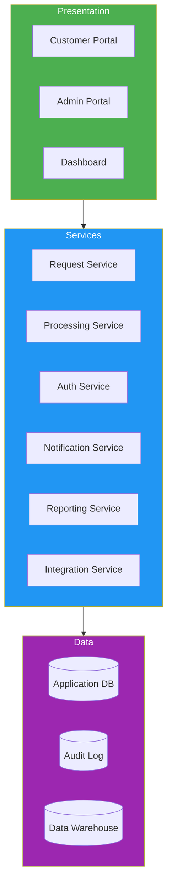
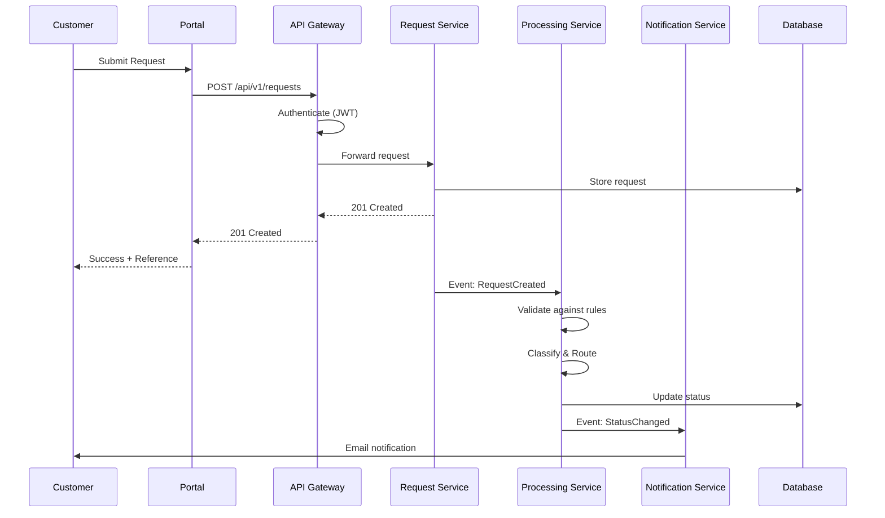
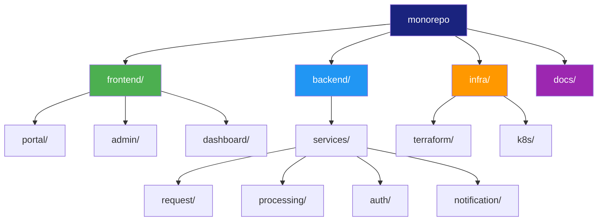
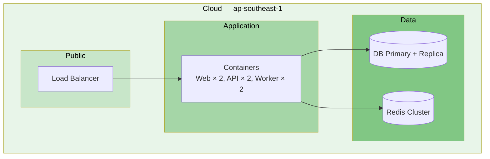

# Architecture Views (4+1)

> **Project:** [Project Name]
> **Version:** [X.Y] | **Status:** [Draft | Under Review | Approved]
> **Last Updated:** [YYYY-MM-DD]

---

## 1. Purpose

> This document presents the architecture using Kruchten's 4+1 View Model — five complementary views that address different stakeholder concerns.

## 2. View Model Overview

| View | Stakeholder | Concern | Diagram |
|------|-----------|---------|---------|
| **Logical** | End Users, Developers | Functionality, structure | [[Logical-Architecture]] |
| **Process** | System Integrators | Concurrency, performance | Sequence diagrams |
| **Development** | Developers, Managers | Organization, reuse | Module diagrams |
| **Physical** | System Engineers | Deployment, infrastructure | [[Physical-Architecture]] |
| **Scenarios (+1)** | All | Validation, use cases | Use case diagrams |

## 3. Logical View

> **Stakeholder:** End Users, Developers
> **Concern:** What does the system do? How is the functionality structured?

> **Detail:** See [[Logical-Architecture]]

## 4. Process View

> **Stakeholder:** System Integrators
> **Concern:** How does the system handle concurrency, performance, and runtime behavior?

### 4.1 Key Process: Request Submission

### 4.2 Process Characteristics

| Process | Concurrency | Performance | Error Handling |
|---------|-----------|-------------|---------------|
| [Request Submission] | [Async processing after sync response] | [<5s end-to-end] | [Retry 3x, dead letter queue] |
| [Auto-Approval] | [Single-threaded per request] | [<1 minute] | [Fallback to manual review] |
| [Notification] | [Async, batched] | [<5 minutes] | [Retry 3x, alert on failure] |

## 5. Development View

> **Stakeholder:** Developers, Managers
> **Concern:** How is the system organized for development?

### 5.1 Repository Structure

### 5.2 Module Dependencies

| Module | Depends On | Depended By |
|--------|-----------|------------|
| [Request Service] | [Auth, DB, Queue] | [Portal, Admin] |
| [Processing Service] | [Auth, DB, Queue] | [Request Service (events)] |
| [Auth Service] | [DB, Cache] | [All services] |
| [Notification Service] | [Queue, Email, SMS] | [Processing Service (events)] |

## 6. Physical View

> **Stakeholder:** System Engineers
> **Concern:** How is the system deployed?

> **Detail:** See [[Physical-Architecture]]

## 7. Scenarios View (+1)

> **Stakeholder:** All
> **Concern:** How do the views work together for key use cases?

### 7.1 Key Scenarios

| # | Scenario | Components | Views Validated |
|---|---------|-----------|----------------|
| 1 | [Customer submits request] | [Portal, API, Request Svc, DB, Notification] | Logical, Process, Physical |
| 2 | [Operations processes request] | [Admin, API, Processing Svc, DB, Notification] | Logical, Process |
| 3 | [Management views dashboard] | [Dashboard, API, Reporting Svc, DW] | Logical, Process |
| 4 | [System handles peak load] | [All — auto-scaled] | Process, Physical |
| 5 | [Service failure recovery] | [Health checks, failover, retry] | Process, Physical |

### 7.2 Scenario Validation Matrix

| Scenario | Logical | Process | Development | Physical | Status |
|----------|---------|---------|------------|---------|--------|
| [Submit Request] | ✅ | ✅ | ✅ | ✅ | ✅ Validated |
| [Process Request] | ✅ | ✅ | ✅ | ✅ | ✅ Validated |
| [View Dashboard] | ✅ | ✅ | ✅ | ✅ | ✅ Validated |
| [Peak Load] | N/A | ✅ | N/A | ✅ | ✅ Validated |
| [Service Failure] | N/A | ✅ | N/A | ✅ | ✅ Validated |

---

## Related Documents

| Document | Relationship |
|----------|-------------|
| [[Logical-Architecture]] | Logical view detail |
| [[Physical-Architecture]] | Physical view detail |
| [[Software-Architecture-Document]] | Comprehensive architecture |
| [[System-Architecture-Description]] | System-level architecture |

---

> **Template Standard:** Based on SWEBOK v4, ISO/IEC/IEEE 42010, Kruchten 4+1
> **Usage:** The 4+1 model ensures all stakeholder concerns are addressed. Use it for architecture reviews — each view can be reviewed independently by the relevant stakeholders.
