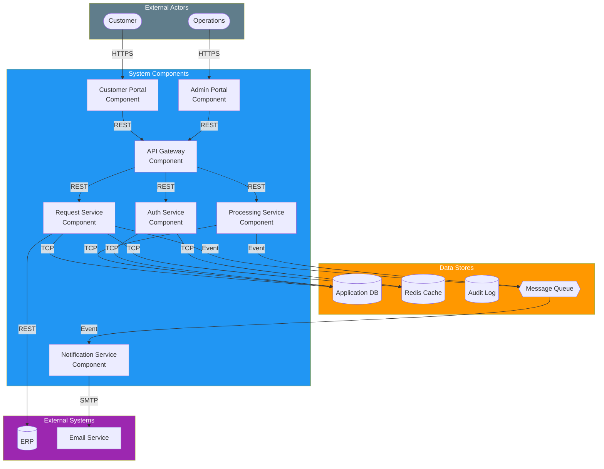
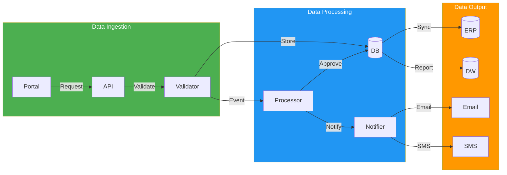

# Component-and-Connector (C&C) Views

> **Project:** [Project Name]
> **Version:** [X.Y] | **Status:** [Draft | Under Review | Approved]
> **Last Updated:** [YYYY-MM-DD]

---

## 1. Purpose

> C&C views show the runtime structure of the system — components (processing units) and connectors (communication mechanisms). Unlike module views (development-time), C&C views show how the system behaves when running.

## 2. C&C Legend

| Element | Representation | Description |
|---------|---------------|-------------|
| **Component** | [Rectangle] | [Processing unit — service, module, database] |
| **Connector** | [Arrow] | [Communication — REST, event, shared data] |
| **Port** | [Small square on component] | [Interface point] |
| **Process** | [Circle] | [Runtime process] |
| **Data Store** | [Cylinder] | [Persistent storage] |

## 3. C&C View: Request Processing

## 4. C&C View: Data Flow

## 5. Component Specification

| Component | Type | Ports | Connectors | Threading | State |
|-----------|------|-------|-----------|-----------|-------|
| [Customer Portal] | [Web App] | [HTTPS in] | [REST to Gateway] | [Stateless] | [Stateless] |
| [API Gateway] | [Gateway] | [HTTPS in, REST out] | [REST to Services] | [Stateless] | [Stateless] |
| [Request Service] | [Service] | [REST in, Event out] | [TCP to DB, Event to Queue] | [Multi-threaded] | [Stateless] |
| [Processing Service] | [Service] | [REST in, Event in/out] | [TCP to DB, Event to Queue] | [Multi-threaded] | [Stateless] |
| [Auth Service] | [Service] | [REST in] | [TCP to DB, TCP to Cache] | [Multi-threaded] | [Stateful (sessions)] |
| [Notification Service] | [Service] | [Event in] | [SMTP to Email, REST to SMS] | [Multi-threaded] | [Stateless] |
| [Application DB] | [Data Store] | [TCP in] | — | [Connection pool] | [Stateful] |
| [Message Queue] | [Middleware] | [AMQP in/out] | — | [Async] | [Stateful] |

## 6. Connector Specification

| Connector | Type | Protocol | Reliability | Ordering | Capacity |
|-----------|------|---------|------------|---------|----------|
| [REST API] | [Request-Response] | [HTTPS] | [At-most-once] | [N/A] | [100 req/s] |
| [Event Queue] | [Publish-Subscribe] | [AMQP] | [At-least-once] | [FIFO per queue] | [1000 msg/s] |
| [Database] | [Shared Data] | [TCP/5432] | [ACID] | [N/A] | [1000 conn] |
| [Cache] | [Shared Data] | [TCP/6379] | [Best effort] | [N/A] | [10000 ops/s] |
| [Email] | [Send] | [SMTP] | [At-most-once] | [N/A] | [100/min] |

---

## Related Documents

| Document | Relationship |
|----------|-------------|
| [[Logical-Architecture]] | Logical components |
| [[Physical-Architecture]] | Deployment of C&C |
| [[Interface-Control-Document]] | Connector specifications |
| [[Architecture-Views-4-1]] | Process view |

---

> **Template Standard:** Based on SWEBOK v4, ISO/IEC/IEEE 42010
> **Usage:** C&C views show *runtime* behavior — how components interact when the system is running. Use them for performance analysis, failure analysis, and understanding data flow.
