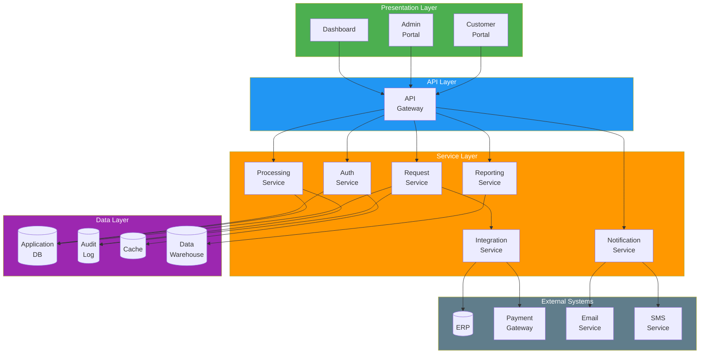
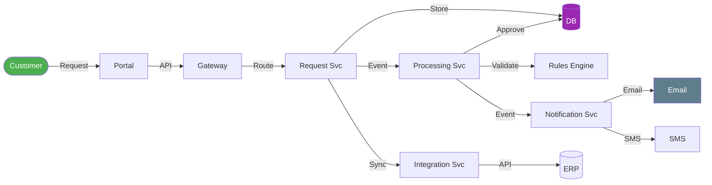

# Logical Architecture

> **Project:** [Project Name]
> **Version:** [X.Y] | **Status:** [Draft | Under Review | Approved]
> **Last Updated:** [YYYY-MM-DD]

---

## 1. Purpose

> This document defines the logical architecture — the abstract system structure showing components, interfaces, and data flows independent of technology choices.

## 2. Logical Architecture Diagram

## 3. Component Catalog

| Component | Layer | Responsibility | Interfaces | Status |
|-----------|-------|---------------|-----------|--------|
| [Customer Portal] | Presentation | [Customer-facing web application] | [API Gateway] | Planned |
| [Admin Portal] | Presentation | [Operations staff web application] | [API Gateway] | Planned |
| [Dashboard] | Presentation | [Management reporting UI] | [API Gateway] | Planned |
| [API Gateway] | API | [Request routing, auth, rate limiting] | [All services] | Planned |
| [Request Service] | Service | [Request CRUD, status tracking] | [DB, Audit, Integration] | Planned |
| [Processing Service] | Service | [Validation, classification, approval] | [DB, Audit] | Planned |
| [Auth Service] | Service | [Authentication, authorization] | [DB, Cache] | Planned |
| [Notification Service] | Service | [Email, SMS, in-app notifications] | [Email, SMS] | Planned |
| [Reporting Service] | Service | [Dashboards, reports] | [Data Warehouse] | Planned |
| [Integration Service] | Service | [External system connectivity] | [ERP, Payment] | Planned |

## 4. Interface Definitions

| Interface | From | To | Protocol | Data | Direction |
|-----------|------|-----|---------|------|-----------|
| INT-001 | [Customer Portal] | [API Gateway] | [HTTPS/REST] | [JSON] | Bidirectional |
| INT-002 | [Admin Portal] | [API Gateway] | [HTTPS/REST] | [JSON] | Bidirectional |
| INT-003 | [API Gateway] | [Request Service] | [HTTP/REST] | [JSON] | Bidirectional |
| INT-004 | [Processing Service] | [Notification Service] | [Event/Message] | [JSON] | Async |
| INT-005 | [Integration Service] | [ERP] | [REST API] | [JSON/XML] | Bidirectional |
| INT-006 | [Integration Service] | [Payment Gateway] | [REST API] | [JSON] | Outbound |
| INT-007 | [Notification Service] | [Email Service] | [SMTP/API] | [HTML/Text] | Outbound |
| INT-008 | [Notification Service] | [SMS Service] | [REST API] | [Text] | Outbound |

## 5. Data Flow

## 6. Component Interaction Matrix

| Component | Request Service | Processing | Auth | Notification | Reporting | Integration |
|-----------|---------------|-----------|------|-------------|-----------|------------|
| [Request Service] | — | ✅ Events | ✅ Auth | ✅ Events | ✅ Data | ✅ Sync |
| [Processing Service] | ✅ Read | — | ✅ Auth | ✅ Events | ✅ Data | ✅ Sync |
| [Auth Service] | ✅ Verify | ✅ Verify | — | ❌ | ❌ | ❌ |
| [Notification Service] | ❌ | ❌ | ❌ | — | ❌ | ❌ |
| [Reporting Service] | ✅ Read | ✅ Read | ✅ Auth | ❌ | — | ❌ |
| [Integration Service] | ✅ Receive | ✅ Receive | ✅ Auth | ❌ | ❌ | — |

## 7. Non-Functional Allocation

| NFR | Component | Strategy |
|-----|----------|---------|
| [Performance <2s] | [API Gateway, Services] | [Caching, async processing] |
| [Availability 99.9%] | [All] | [Multi-instance, health checks] |
| [Security] | [API Gateway, Auth Service] | [OAuth2, JWT, rate limiting] |
| [Scalability] | [Services] | [Horizontal scaling, stateless] |
| [Audit Trail] | [All Services] | [Centralized audit log] |

---

## Related Documents

| Document | Relationship |
|----------|-------------|
| [[Functional-Architecture]] | Functions allocated to logical components |
| [[Physical-Architecture]] | Physical deployment of logical components |
| [[Interface-Control-Document]] | Detailed interface specifications |
| [[Software-Architecture-Document]] | Software-level architecture |

---

> **Template Standard:** Based on SEBoK v2, ISO/IEC/IEEE 42010
> **Usage:** The logical architecture is *technology-agnostic* — it shows components and their interactions without specifying implementation technology. It's the bridge between functional architecture and physical architecture.
