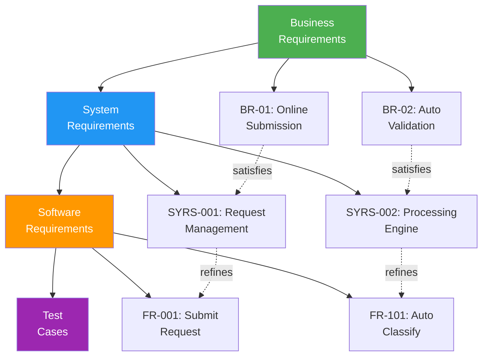
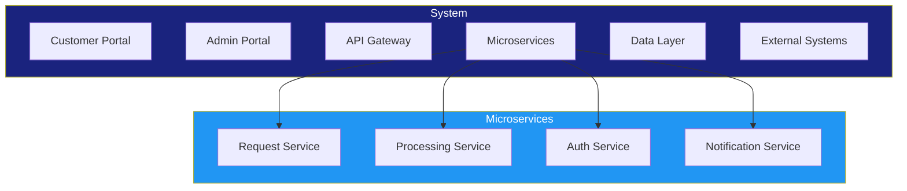
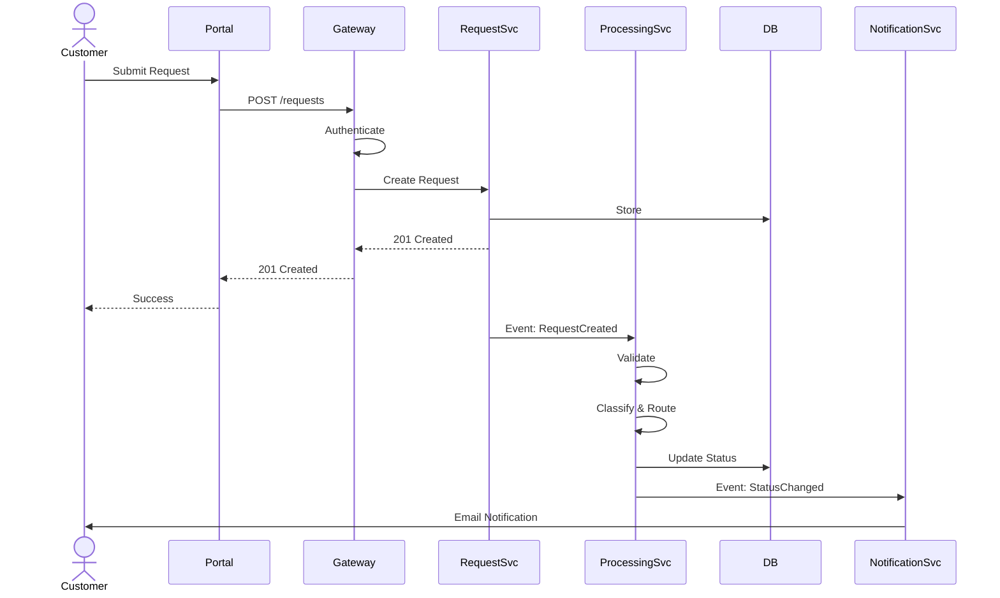
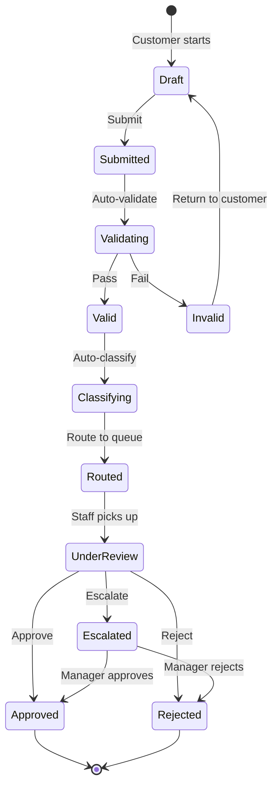
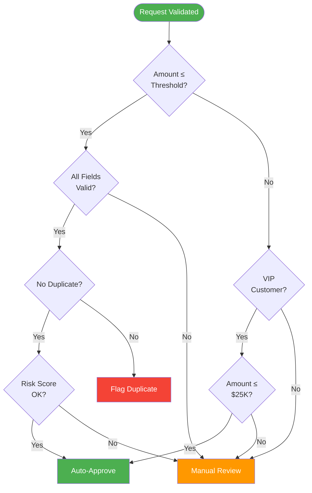

# MBSE Models (SysML)

> **Project:** [Project Name]
> **Version:** [X.Y] | **Status:** [Draft | Under Review | Approved]
> **Last Updated:** [YYYY-MM-DD]

---

## 1. Purpose

> This document captures Model-Based Systems Engineering (MBSE) artifacts using SysML notation. MBSE uses models (not just documents) as the primary means of capturing system requirements, design, and analysis.

## 2. MBSE Approach

| Aspect | Approach |
|--------|---------|
| [Modeling Language] | [SysML (OMG Systems Modeling Language)] |
| [Modeling Tool] | [Draw.io / PlantUML / Cameo] |
| [Model Scope] | [Requirements, structure, behavior, parametrics] |
| [Model Purpose] | [Communication, analysis, verification] |

## 3. SysML Diagram Types Applied

| Diagram Type | Purpose | Applied | Status |
|-------------|---------|---------|--------|
| [Requirements Diagram] | [Requirements structure and relationships] | ✅ | Complete |
| [Block Definition Diagram (BDD)] | [System structure — blocks, components] | ✅ | Complete |
| [Internal Block Diagram (IBD)] | [Internal structure — ports, flows] | ✅ | Complete |
| [Activity Diagram] | [Behavioral — process flows] | ✅ | Complete |
| [Sequence Diagram] | [Behavioral — interactions] | ✅ | Complete |
| [State Machine Diagram] | [Behavioral — state transitions] | ✅ | Complete |
| [Use Case Diagram] | [Functional — actor-goal modeling] | ✅ | Complete |
| [Parametric Diagram] | [Analysis — constraints and equations] | ⬜ | Not Started |

## 4. Requirements Diagram

## 5. Block Definition Diagram (BDD)

## 6. Sequence Diagram: Request Processing

## 7. State Machine Diagram: Request Lifecycle

## 8. Activity Diagram: Auto-Approval Logic

## 9. Model Traceability

| Model Element | Requirement | Design | Test |
|--------------|-----------|--------|------|
| [Request block] | [FR-001] | [Request Service] | [TC-001] |
| [Processing block] | [FR-101 to FR-107] | [Processing Service] | [TC-005] |
| [Auto-approval activity] | [FR-103] | [Rules Engine] | [TC-010] |
| [Request state machine] | [FR-006] | [Status tracking] | [TC-009] |

---

## Related Documents

| Document | Relationship |
|----------|-------------|
| [[System Architecture Description]] | Architecture modeled here |
| [[SRS]] | Requirements modeled here |
| [[Functional Architecture]] | Functions modeled here |
| [[Architecture Views (4+1)]] | Views using MBSE models |

---

> **Template Standard:** Based on SEBoK v2, ISO/IEC/IEEE 24641
> **Usage:** MBSE models are *executable* and *analyzable* — unlike documents. Use them for complex systems where visual models reduce ambiguity. Keep models in sync with requirements and code.
