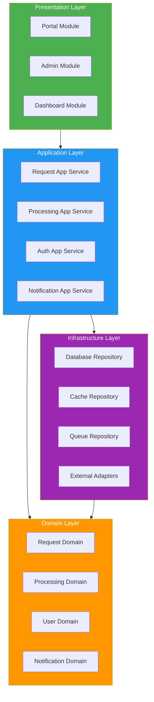

# Module Views

> **Project:** [Project Name]
> **Version:** [X.Y] | **Status:** [Draft | Under Review | Approved]
> **Last Updated:** [YYYY-MM-DD]

---

## 1. Purpose

> Module views show the development-time structure of the system — how code is organized into modules, packages, layers, and subsystems.

## 2. Layered Architecture View



## 3. Module Catalog

| Module | Layer | Package | Responsibility | Dependencies |
|--------|-------|---------|---------------|-------------|
| [Portal Module] | Presentation | [frontend.portal] | [Customer-facing UI] | [Application Layer] |
| [Admin Module] | Presentation | [frontend.admin] | [Operations UI] | [Application Layer] |
| [Dashboard Module] | Presentation | [frontend.dashboard] | [Management UI] | [Application Layer] |
| [Request App Service] | Application | [services.request.app] | [Request use cases] | [Domain, Infrastructure] |
| [Processing App Service] | Application | [services.processing.app] | [Processing use cases] | [Domain, Infrastructure] |
| [Auth App Service] | Application | [services.auth.app] | [Auth use cases] | [Domain, Infrastructure] |
| [Notification App Service] | Application | [services.notification.app] | [Notification use cases] | [Domain, Infrastructure] |
| [Request Domain] | Domain | [services.request.domain] | [Request entities, rules] | [None] |
| [Processing Domain] | Domain | [services.processing.domain] | [Processing entities, rules] | [None] |
| [User Domain] | Domain | [services.auth.domain] | [User entities, roles] | [None] |
| [Database Repository] | Infrastructure | [infra.database] | [Data access] | [Domain] |
| [Cache Repository] | Infrastructure | [infra.cache] | [Cache access] | [Domain] |
| [Queue Repository] | Infrastructure | [infra.queue] | [Message publishing] | [Domain] |
| [External Adapters] | Infrastructure | [infra.external] | [ERP, Payment, Email] | [Domain] |

## 4. Module Dependency Rules

| Rule | Description | Enforcement |
|------|-------------|-----------|
| [Presentation → Application only] | [UI never accesses domain/infra directly] | [Import rules] |
| [Application → Domain + Infrastructure] | [App services orchestrate domain and infra] | [Import rules] |
| [Domain → Nothing] | [Domain has zero external dependencies] | [Import rules] |
| [Infrastructure → Domain] | [Infra implements domain interfaces] | [Dependency injection] |
| [No circular dependencies] | [Dependencies flow one direction] | [Static analysis] |

## 5. Package Structure

```
services/
├── request/
│   ├── app/           # Application layer
│   │   ├── commands/  # Write operations
│   │   ├── queries/   # Read operations
│   │   └── dto/       # Data transfer objects
│   ├── domain/        # Domain layer
│   │   ├── entities/  # Business entities
│   │   ├── value-objects/
│   │   ├── events/    # Domain events
│   │   └── rules/     # Business rules
│   └── infra/         # Infrastructure layer
│       ├── persistence/
│       ├── messaging/
│       └── external/
├── processing/
│   ├── app/
│   ├── domain/
│   └── infra/
├── auth/
│   ├── app/
│   ├── domain/
│   └── infra/
└── notification/
    ├── app/
    ├── domain/
    └── infra/
```

## 6. Module Metrics

| Module | Lines of Code | Classes | Methods | Complexity | Coverage |
|--------|--------------|---------|---------|-----------|---------|
| [Request — app] | [X] | [Y] | [Z] | [W] | [V%] |
| [Request — domain] | [X] | [Y] | [Z] | [W] | [V%] |
| [Request — infra] | [X] | [Y] | [Z] | [W] | [V%] |
| [Processing — app] | [X] | [Y] | [Z] | [W] | [V%] |
| [Processing — domain] | [X] | [Y] | [Z] | [W] | [V%] |
| **Total** | **[Sum]** | **[Sum]** | **[Sum]** | **[Avg]** | **[Avg%]** |

---

## Related Documents

| Document | Relationship |
|----------|-------------|
| [[Logical-Architecture]] | Logical components mapped to modules |
| [[Architecture-Patterns-Catalog]] | Patterns applied |
| [[Architecture-Metrics-Report]] | Module-level metrics |
| [[Software-Architecture-Document]] | Architecture context |

---

> **Template Standard:** Based on SWEBOK v4, ISO/IEC/IEEE 42010
> **Usage:** Module views show *how code is organized*. Use them for development planning, code review, and enforcing architectural boundaries. The dependency rules prevent architectural erosion.
