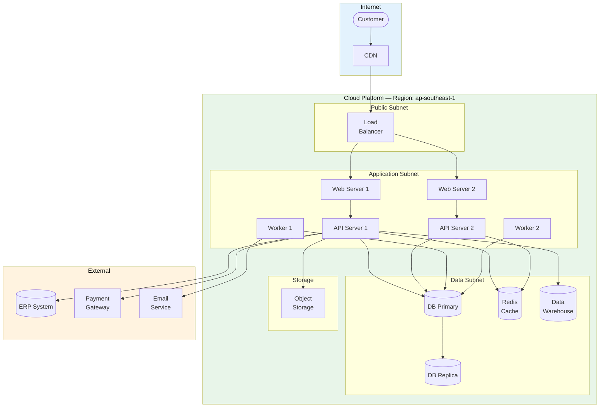

# Physical Architecture

> **Project:** [Project Name]
> **Version:** [X.Y] | **Status:** [Draft | Under Review | Approved]
> **Last Updated:** [YYYY-MM-DD]

---

## 1. Purpose

> This document defines the physical architecture — how logical components are deployed on actual infrastructure, including hardware, networking, and hosting.

## 2. Deployment Architecture

## 3. Infrastructure Components

| Component | Technology | Specification | Quantity | Environment | Cost/Month |
|-----------|-----------|--------------|----------|-------------|-----------|
| [Load Balancer] | [AWS ALB / Azure LB] | [Managed, auto-scaling] | [1] | [All] | $[X] |
| [Web Servers] | [Container — Node.js] | [2 vCPU, 4GB RAM] | [2] | [All] | $[X] |
| [API Servers] | [Container — Node.js] | [4 vCPU, 8GB RAM] | [2] | [All] | $[X] |
| [Workers] | [Container — Node.js] | [2 vCPU, 4GB RAM] | [2] | [All] | $[X] |
| [Database] | [PostgreSQL — managed] | [4 vCPU, 16GB RAM, 500GB] | [1 primary + 1 replica] | [All] | $[X] |
| [Cache] | [Redis — managed] | [2 vCPU, 4GB RAM] | [1] | [All] | $[X] |
| [Data Warehouse] | [Snowflake / BigQuery] | [On-demand] | [1] | [Prod] | $[X] |
| [Object Storage] | [S3 / Blob Storage] | [Standard, 100GB] | [1] | [All] | $[X] |
| [CDN] | [CloudFront / Azure CDN] | [Global edge] | [1] | [Prod] | $[X] |
| [Container Registry] | [ECR / ACR] | [Managed] | [1] | [All] | $[X] |

## 4. Network Architecture

| Zone | Subnet | Components | Security |
|------|--------|-----------|---------|
| [Public] | [10.0.1.0/24] | [Load Balancer] | [Internet-facing, WAF] |
| [Application] | [10.0.2.0/24] | [Web, API, Workers] | [Internal only, LB ingress] |
| [Data] | [10.0.3.0/24] | [DB, Cache, DW] | [App subnet only] |
| [Management] | [10.0.4.0/24] | [Bastion, monitoring] | [VPN only] |

## 5. Environment Architecture

| Environment | Purpose | Infrastructure | Data |
|------------|---------|---------------|------|
| [Development] | [Local development] | [Docker Compose] | [Synthetic] |
| [Staging] | [Pre-production testing] | [Cloud — scaled down] | [Anonymized prod copy] |
| [Production] | [Live system] | [Cloud — full scale] | [Real data] |

## 6. High Availability & Disaster Recovery

| Component | HA Strategy | DR Strategy | RTO | RPO |
|-----------|-----------|------------|-----|-----|
| [Web/API Servers] | [Multi-AZ, auto-scaling] | [Cross-region failover] | [5 min] | [0] |
| [Database] | [Multi-AZ, auto-failover] | [Cross-region replica] | [1 hour] | [1 hour] |
| [Cache] | [Cluster mode] | [Rebuild from DB] | [15 min] | [N/A] |
| [Object Storage] | [Cross-region replication] | [Automatic] | [Immediate] | [0] |
| [Load Balancer] | [Multi-AZ] | [DNS failover] | [5 min] | [0] |

## 7. Security Architecture

| Layer | Control | Implementation |
|-------|---------|---------------|
| [Network] | [Firewall, WAF, DDoS protection] | [Security groups, AWS WAF, Shield] |
| [Transport] | [TLS 1.3 everywhere] | [ACM certificates, HTTPS only] |
| [Application] | [OAuth2, JWT, rate limiting] | [API Gateway, Auth Service] |
| [Data] | [Encryption at rest, in transit] | [KMS, TLS] |
| [Access] | [IAM, RBAC, MFA] | [IAM policies, Auth Service] |
| [Audit] | [All actions logged] | [CloudTrail, application audit log] |

## 8. Monitoring & Observability

| Component | Tool | Metrics | Alerts |
|-----------|------|---------|--------|
| [Infrastructure] | [CloudWatch / Azure Monitor] | [CPU, memory, disk, network] | [Threshold alerts] |
| [Application] | [Prometheus + Grafana] | [Request rate, latency, errors] | [SLO alerts] |
| [Logs] | [ELK Stack / CloudWatch Logs] | [Structured JSON logs] | [Error patterns] |
| [Traces] | [Jaeger / X-Ray] | [Distributed traces] | [Slow traces] |
| [Uptime] | [Pingdom / UptimeRobot] | [Synthetic monitoring] | [Downtime alerts] |

---

## Related Documents

| Document | Relationship |
|----------|-------------|
| [[Logical Architecture]] | Logical components deployed here |
| [[System Architecture Description]] | Comprehensive architecture |
| [[Interface Control Document (ICD)]] | Interface specifications |
| [[Infrastructure-as-Code]] | IaC definitions |

---

> **Template Standard:** Based on SEBoK v2, ISO/IEC/IEEE 42010
> **Usage:** The physical architecture is *technology-specific* — it shows where things actually run. Use it for infrastructure planning, cost estimation, and security design.
