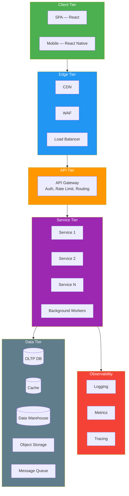

# Reference Architecture

> **Project:** [Project Name]
> **Version:** [X.Y] | **Status:** [Draft | Under Review | Approved]
> **Last Updated:** [YYYY-MM-DD]

---

## 1. Purpose

> This document defines the reference architecture — a standardized, reusable architecture template for the application domain. It provides proven patterns, technology recommendations, and best practices.

## 2. Reference Architecture Overview

| Field | Detail |
|-------|--------|
| [Domain] | [Web Application — Request Processing] |
| [Architecture Style] | [Layered + Microservices + Event-Driven] |
| [Deployment Model] | [Cloud-native, containerized] |
| [Based On] | [Industry best practices, AWS/Azure Well-Architected] |

## 3. Reference Architecture Diagram

## 4. Layer Specifications

### 4.1 Client Tier

| Component | Technology | Responsibility | Pattern |
|-----------|-----------|---------------|---------|
| [SPA] | [React + Next.js] | [Customer-facing web app] | [Component-based, state management] |
| [Mobile] | [React Native] | [Mobile app (future)] | [Shared logic with SPA] |

### 4.2 Edge Tier

| Component | Technology | Responsibility | Pattern |
|-----------|-----------|---------------|---------|
| [CDN] | [CloudFront / Azure CDN] | [Static asset delivery, DDoS protection] | [Edge caching] |
| [WAF] | [AWS WAF / Azure WAF] | [OWASP Top 10 protection] | [Rule-based filtering] |
| [Load Balancer] | [ALB / Azure LB] | [Traffic distribution, health checks] | [Round-robin, health-based] |

### 4.3 API Tier

| Component | Technology | Responsibility | Pattern |
|-----------|-----------|---------------|---------|
| [API Gateway] | [Kong / AWS API GW] | [Auth, rate limiting, routing, logging] | [Gateway pattern] |

### 4.4 Service Tier

| Component | Technology | Responsibility | Pattern |
|-----------|-----------|---------------|---------|
| [Services] | [Node.js + Express] | [Business logic] | [Repository, CQRS] |
| [Workers] | [Node.js] | [Async processing] | [Worker pattern] |

### 4.5 Data Tier

| Component | Technology | Responsibility | Pattern |
|-----------|-----------|---------------|---------|
| [OLTP DB] | [PostgreSQL] | [Transactional data] | [ACID, connection pooling] |
| [Cache] | [Redis] | [Session, reference data] | [Cache-aside] |
| [DW] | [Snowflake / BigQuery] | [Analytics, reporting] | [Star schema] |
| [Object Storage] | [S3 / Blob] | [Documents, files] | [Immutable objects] |
| [Message Queue] | [RabbitMQ / SQS] | [Async messaging] | [Pub-sub, work queue] |

### 4.6 Observability Tier

| Component | Technology | Responsibility | Pattern |
|-----------|-----------|---------------|---------|
| [Logging] | [ELK / CloudWatch] | [Structured JSON logs] | [Centralized logging] |
| [Metrics] | [Prometheus + Grafana] | [Application + infra metrics] | [Time-series] |
| [Tracing] | [Jaeger / X-Ray] | [Distributed tracing] | [Correlation ID] |

## 5. Cross-Cutting Concerns

| Concern | Implementation | Standard |
|---------|---------------|---------|
| [Authentication] | [OAuth2 + JWT] | [OpenID Connect] |
| [Authorization] | [RBAC] | [ABAC for complex rules] |
| [Encryption] | [TLS 1.3 + AES-256] | [NIST SP 800-57] |
| [Logging] | [Structured JSON, correlation ID] | [OpenTelemetry] |
| [Error Handling] | [Global exception handler, error codes] | [RFC 7807] |
| [API Versioning] | [URL path versioning] | [/api/v1/] |
| [Configuration] | [Environment variables, config service] | [12-Factor App] |

## 6. Technology Stack Recommendation

| Layer | Recommended | Alternative | Rationale |
|-------|-----------|------------|----------|
| [Frontend] | [React + Next.js] | [Vue + Nuxt] | [Team expertise, ecosystem] |
| [Backend] | [Node.js + Express] | [Go + Fiber] | [Full-stack JS, rapid development] |
| [Database] | [PostgreSQL] | [MySQL] | [ACID, JSON support, managed] |
| [Cache] | [Redis] | [Memcached] | [Data structures, persistence] |
| [Queue] | [RabbitMQ] | [AWS SQS] | [Feature richness, self-hosted option] |
| [Container] | [Docker + K8s] | [ECS / Azure Containers] | [Portability, ecosystem] |
| [CI/CD] | [GitHub Actions] | [GitLab CI] | [Team using GitHub] |
| [Monitoring] | [Prometheus + Grafana] | [Datadog] | [Cost, self-hosted option] |

---

## Related Documents

| Document | Relationship |
|----------|-------------|
| [[Software-Architecture-Document]] | Project-specific architecture |
| [[Architecture-Patterns-Catalog]] | Patterns from reference architecture |
| [[Market-Analysis-Technology-Assessment]] | Technology evaluation |

---

> **Template Standard:** Based on SWEBOK v4
> **Usage:** The reference architecture is a *starting point* — adapt it to your project's specific needs. Don't copy blindly; evaluate each recommendation against your constraints.
