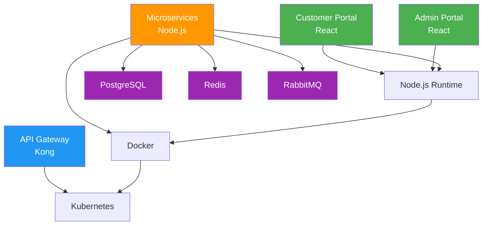

# System Bill of Materials

> **Project:** [Project Name]
> **Version:** [X.Y] | **Status:** [Draft | Under Review | Approved]
> **Last Updated:** [YYYY-MM-DD]

---

## 1. Purpose

> This document provides a complete listing of all hardware, software, and COTS components that make up the system.

## 2. Software Components

### 2.1 Application Components

| ID | Component | Type | Version | Vendor/Source | License | Status |
|----|----------|------|---------|--------------|---------|--------|
| SW-001 | [Customer Portal] | Custom | v1.0 | [Internal] | [Proprietary] | Planned |
| SW-002 | [Admin Portal] | Custom | v1.0 | [Internal] | [Proprietary] | Planned |
| SW-003 | [Dashboard] | Custom | v1.0 | [Internal] | [Proprietary] | Planned |
| SW-004 | [API Gateway] | COTS | v3.x | [Kong / AWS] | [Apache 2.0 / Commercial] | Planned |
| SW-005 | [Request Service] | Custom | v1.0 | [Internal] | [Proprietary] | Planned |
| SW-006 | [Processing Service] | Custom | v1.0 | [Internal] | [Proprietary] | Planned |
| SW-007 | [Auth Service] | Custom | v1.0 | [Internal] | [Proprietary] | Planned |
| SW-008 | [Notification Service] | Custom | v1.0 | [Internal] | [Proprietary] | Planned |
| SW-009 | [Reporting Service] | Custom | v1.0 | [Internal] | [Proprietary] | Planned |
| SW-010 | [Integration Service] | Custom | v1.0 | [Internal] | [Proprietary] | Planned |

### 2.2 Platform Components

| ID | Component | Type | Version | Vendor | License | Status |
|----|----------|------|---------|--------|---------|--------|
| PL-001 | [PostgreSQL] | Database | v15 | [PostgreSQL] | [PostgreSQL License] | Planned |
| PL-002 | [Redis] | Cache | v7.x | [Redis] | [BSD-3] | Planned |
| PL-003 | [RabbitMQ] | Message Queue | v3.x | [VMware] | [MPL 2.0] | Planned |
| PL-004 | [Docker] | Container Runtime | v24.x | [Docker] | [Apache 2.0] | Planned |
| PL-005 | [Kubernetes] | Container Orchestration | v1.28 | [CNCF] | [Apache 2.0] | Planned |
| PL-006 | [Nginx] | Web Server | v1.25 | [Nginx] | [BSD-2] | Planned |

### 2.3 Development Tools

| ID | Tool | Type | Version | Vendor | License |
|----|------|------|---------|--------|---------|
| DT-001 | [Node.js] | Runtime | v20 LTS | [OpenJS] | [MIT] |
| DT-002 | [React] | Frontend Framework | v18 | [Meta] | [MIT] |
| DT-003 | [Express] | Backend Framework | v4 | [OpenJS] | [MIT] |
| DT-004 | [Jest] | Testing Framework | v29 | [Meta] | [MIT] |
| DT-005 | [GitHub Actions] | CI/CD | N/A | [GitHub] | [Commercial] |
| DT-006 | [Terraform] | IaC | v1.x | [HashiCorp] | [BSL 1.1] |

### 2.4 Third-Party Services

| ID | Service | Type | Vendor | License/Plan | Status |
|----|---------|------|--------|-------------|--------|
| TS-001 | [CRM Platform] | SaaS | [Vendor A] | [Subscription] | Active |
| TS-002 | [Email Service] | SaaS | [SendGrid / SES] | [Pay-per-use] | Active |
| TS-003 | [SMS Service] | SaaS | [Twilio] | [Pay-per-use] | Active |
| TS-004 | [Monitoring] | SaaS | [Grafana Cloud] | [Subscription] | Active |
| TS-005 | [CDN] | SaaS | [CloudFront] | [Pay-per-use] | Active |

## 3. Hardware / Infrastructure

| ID | Component | Type | Specification | Vendor | Status |
|----|----------|------|--------------|--------|--------|
| HW-001 | [Cloud Compute] | Virtual Machines | [2-4 vCPU, 4-8 GB RAM] | [AWS / Azure] | Planned |
| HW-002 | [Managed Database] | Database Service | [4 vCPU, 16 GB RAM, 500 GB] | [AWS / Azure] | Planned |
| HW-003 | [Load Balancer] | Network | [Managed ALB] | [AWS / Azure] | Planned |
| HW-004 | [Object Storage] | Storage | [S3 / Blob, 100 GB] | [AWS / Azure] | Planned |

## 4. License Summary

| License Type | Count | Components |
|-------------|-------|-----------|
| [Proprietary (Internal)] | [7] | [Custom services] |
| [MIT] | [5] | [Node.js, React, Express, Jest, etc.] |
| [Apache 2.0] | [3] | [Kong, Docker, Kubernetes] |
| [BSD] | [2] | [Redis, Nginx] |
| [Commercial (Subscription)] | [5] | [CRM, Email, SMS, Monitoring, CDN] |
| [Other Open Source] | [3] | [PostgreSQL, RabbitMQ, Terraform] |

## 5. Dependency Graph

## 6. SBOM (Software Bill of Materials)

> For supply chain transparency, maintain an auto-generated SBOM.

| Tool | Format | Frequency | Output |
|------|--------|-----------|--------|
| [Syft] | [SPDX / CycloneDX] | [Per build] | [SBOM file] |
| [Trivy] | [SPDX] | [Per build] | [Vulnerability scan] |
| [npm audit] | [JSON] | [Per build] | [Dependency vulnerabilities] |

---

## Related Documents

| Document | Relationship |
|----------|-------------|
| [[Physical-Architecture]] | Infrastructure components |
| [[Software-Architecture-Document]] | Software components |
| [[Procurement-Management-Plan]] | Component procurement |
| [[System-Bill-of-Materials]] | Runtime dependencies |

---

> **Template Standard:** Based on SEBoK v2, ISO/IEC/IEEE 15288
> **Usage:** The BOM provides a *complete inventory* of everything that makes up the system. Use it for procurement, licensing compliance, vulnerability tracking, and supply chain management.
