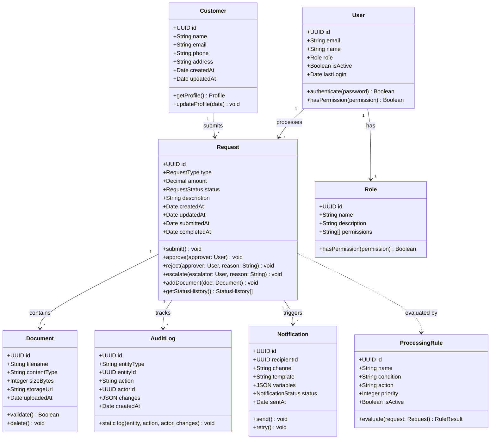
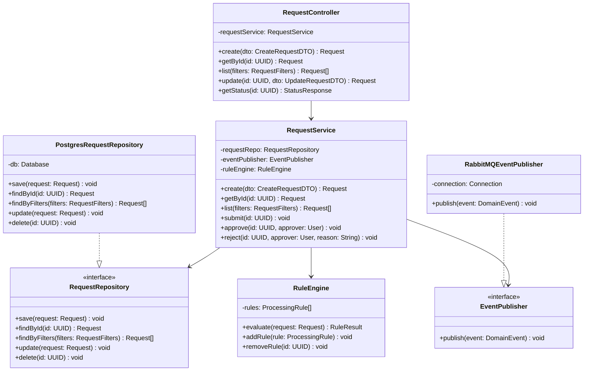
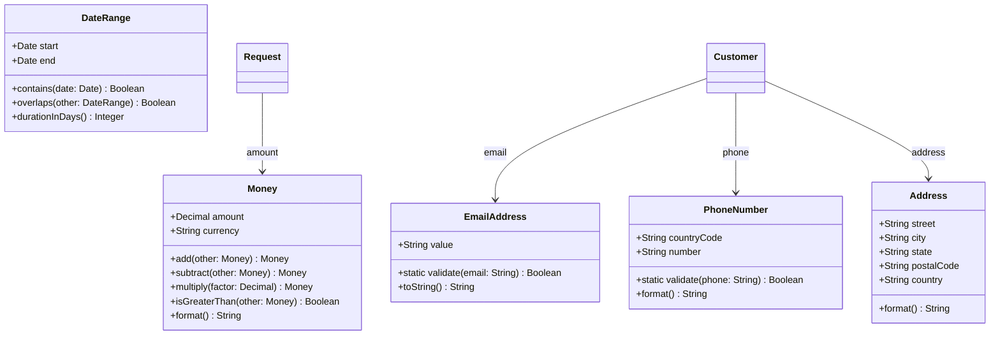

# Class Diagrams

> **Project:** [Project Name]
> **Version:** [X.Y] | **Status:** [Draft | Under Review | Approved]
> **Last Updated:** [YYYY-MM-DD]

---

## 1. Purpose

> This document contains UML class diagrams showing the static structure — classes, attributes, methods, and relationships.

## 2. Class Diagram: Domain Model

## 3. Class Diagram: Service Layer

## 4. Class Diagram: Value Objects

## 5. Design Patterns Applied

| Pattern | Classes | Purpose |
|---------|---------|---------|
| [Repository] | [RequestRepository, PostgresRequestRepository] | [Abstract data access] |
| [Strategy] | [RuleEngine, ProcessingRule] | [Different validation strategies] |
| [Observer] | [EventPublisher, DomainEvent] | [Decoupled event handling] |
| [Factory] | [Request.create()] | [Encapsulate object creation] |
| [Value Object] | [Money, EmailAddress, Address] | [Immutable, self-validating] |

---

## Related Documents

| Document | Relationship |
|----------|-------------|
| [[Low-Level-Design]] | Design details |
| [[Sequence-Diagrams]] | Behavioral interactions |
| [[ERD]] | Data model |

---

> **Template Standard:** Based on SWEBOK v4, ISO/IEC 19501 (UML)
> **Usage:** Class diagrams show *structure* — what classes exist and how they relate. Use them for code design, documentation, and onboarding new developers.
