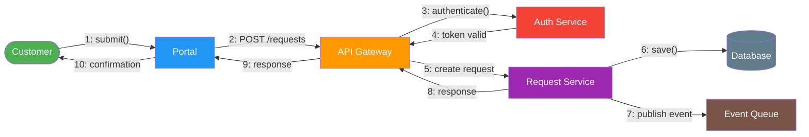
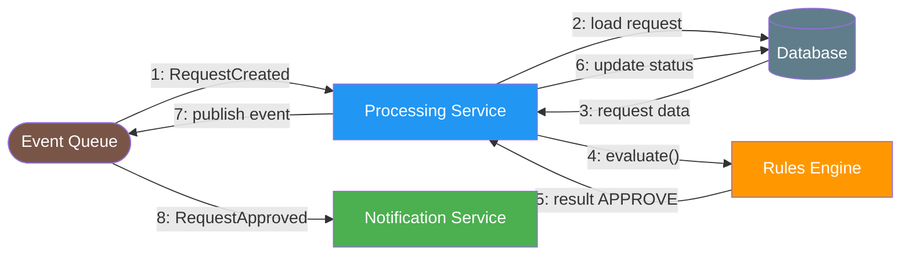
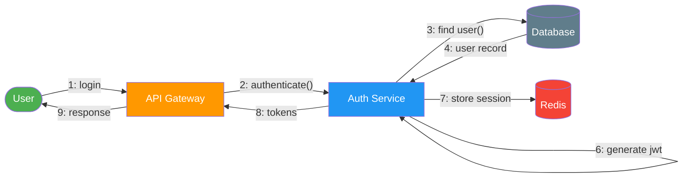

# Communication Diagrams

> **Project:** [Project Name]
> **Version:** [X.Y] | **Status:** [Draft | Under Review | Approved]
> **Last Updated:** [YYYY-MM-DD]

---

## 1. Purpose

> Communication diagrams (formerly collaboration diagrams) show object interactions emphasizing *relationships* rather than time sequence. Messages are numbered to show order.

## 2. Communication Diagram Index

| # | Scenario | Objects | Messages | Status |
|---|---------|---------|---------|--------|
| CD-001 | [Request Submission] | [6] | [8] | ✅ Approved |
| CD-002 | [Auto-Processing] | [5] | [7] | ✅ Approved |
| CD-003 | [Authentication] | [4] | [6] | ✅ Approved |

## 3. Communication Diagrams

### CD-001: Request Submission

### CD-002: Auto-Processing

### CD-003: Authentication

## 4. Message Sequence Summary

| Diagram | Message # | From | To | Message | Type |
|---------|----------|------|-----|---------|------|
| CD-001 | 1 | Customer | Portal | submit() | Synchronous |
| CD-001 | 2 | Portal | Gateway | POST /requests | Synchronous |
| CD-001 | 3 | Gateway | Auth | authenticate() | Synchronous |
| CD-001 | 5 | Gateway | RequestSvc | create_request() | Synchronous |
| CD-001 | 6 | RequestSvc | Database | save() | Synchronous |
| CD-001 | 7 | RequestSvc | Queue | publish(event) | Asynchronous |
| CD-002 | 1 | Queue | ProcessingSvc | RequestCreated | Asynchronous |
| CD-002 | 4 | ProcessingSvc | RulesEngine | evaluate() | Synchronous |
| CD-002 | 7 | ProcessingSvc | Queue | publish(event) | Asynchronous |
| CD-003 | 2 | Gateway | AuthSvc | authenticate() | Synchronous |
| CD-003 | 6 | AuthSvc | AuthSvc | generate_jwt() | Internal |

## 5. Communication Patterns

| Pattern | Description | Applied To |
|---------|-----------|-----------|
| [Synchronous Request-Response] | [Caller waits for response] | [API calls, DB queries] |
| [Asynchronous Fire-and-Forget] | [Caller doesn't wait] | [Event publishing, notifications] |
| [Publish-Subscribe] | [One-to-many messaging] | [Status change events] |
| [Point-to-Point] | [Direct communication] | [Service-to-service calls] |

---

## Related Documents

| Document | Relationship |
|----------|-------------|
| [[Sequence Diagrams]] | Time-ordered version of same interactions |
| [[Class Diagrams]] | Object structure |
| [[Interface Control Document (ICD)]] | Interface specifications |

---

> **Template Standard:** Based on SWEBOK v4, ISO/IEC 19501 (UML)
> **Usage:** Communication diagrams emphasize *relationships* — which objects know about each other. Use them when object relationships matter more than timing. For timing-focused analysis, use Sequence Diagrams instead.
