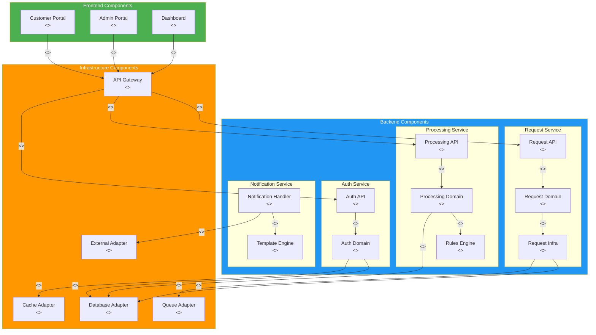
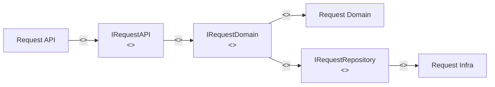

# Component Diagrams

> **Project:** [Project Name]
> **Version:** [X.Y] | **Status:** [Draft | Under Review | Approved]
> **Last Updated:** [YYYY-MM-DD]

---

## 1. Purpose

> This document shows UML component diagrams — the system's physical components, their interfaces, and dependencies.

## 2. Component Diagram: System Overview

## 3. Component Specifications

### 3.1 Request Service Components

| Component | Provided Interfaces | Required Interfaces | Dependencies |
|-----------|-------------------|-------------------|-------------|
| [Request API] | [IRequestAPI] | [IRequestDomain] | [Request Domain] |
| [Request Domain] | [IRequestDomain] | [IRequestRepository, IEventPublisher] | [Request Infra] |
| [Request Infra] | [IRequestRepository, IEventPublisher] | [IDatabase, IQueue] | [DB Adapter, Queue Adapter] |

### 3.2 Interface Definitions

| Interface | Component | Methods | Description |
|-----------|----------|---------|-------------|
| [IRequestAPI] | [Request API] | [create(), getById(), list(), update(), getStatus()] | [REST API for requests] |
| [IRequestDomain] | [Request Domain] | [create(), submit(), approve(), reject()] | [Domain logic for requests] |
| [IRequestRepository] | [Request Infra] | [save(), findById(), findByFilters(), update()] | [Data access for requests] |
| [IEventPublisher] | [Request Infra] | [publish(event)] | [Event publishing] |
| [IRuleEngine] | [Rules Engine] | [evaluate(request)] | [Business rule evaluation] |

### 3.3 Provided/Required Interfaces

## 4. Component Dependency Matrix

| Component | Request Domain | Processing Domain | Auth Domain | Notification | DB Adapter | Queue Adapter | Cache Adapter | External Adapter |
|-----------|---------------|------------------|------------|-------------|-----------|--------------|--------------|-----------------|
| [Request API] | ✅ | — | ✅ | — | — | — | — | — |
| [Request Domain] | — | — | — | — | ✅ | ✅ | — | — |
| [Processing API] | — | ✅ | ✅ | — | — | — | — | — |
| [Processing Domain] | ✅ | — | — | ✅ | ✅ | ✅ | — | — |
| [Auth API] | — | — | ✅ | — | — | — | — | — |
| [Auth Domain] | — | — | — | — | ✅ | — | ✅ | — |
| [Notification Handler] | — | — | — | — | ✅ | ✅ | — | ✅ |

## 5. Component Packaging

| Package | Components | Version | Repository |
|---------|-----------|---------|-----------|
| [frontend-portal] | [Customer Portal] | [v1.0] | [github.com/org/frontend-portal] |
| [frontend-admin] | [Admin Portal, Dashboard] | [v1.0] | [github.com/org/frontend-admin] |
| [service-request] | [Request API, Domain, Infra] | [v1.0] | [github.com/org/service-request] |
| [service-processing] | [Processing API, Domain, Rules] | [v1.0] | [github.com/org/service-processing] |
| [service-auth] | [Auth API, Domain] | [v1.0] | [github.com/org/service-auth] |
| [service-notification] | [Notification Handler, Templates] | [v1.0] | [github.com/org/service-notification] |
| [shared-infra] | [DB, Cache, Queue, External Adapters] | [v1.0] | [github.com/org/shared-infra] |

---

## Related Documents

| Document | Relationship |
|----------|-------------|
| [[Class Diagrams]] | Internal structure of components |
| [[Interface Control Document (ICD)]] | Interface specifications |
| [[Deployment Diagrams]] | Physical deployment of components |
| [[Architecture Views (4+1)]] | Development view |

---

> **Template Standard:** Based on SWEBOK v4, ISO/IEC 19501 (UML)
> **Usage:** Component diagrams show *physical structure* — what components exist and how they connect via interfaces. Use them for system integration, dependency management, and release planning.
