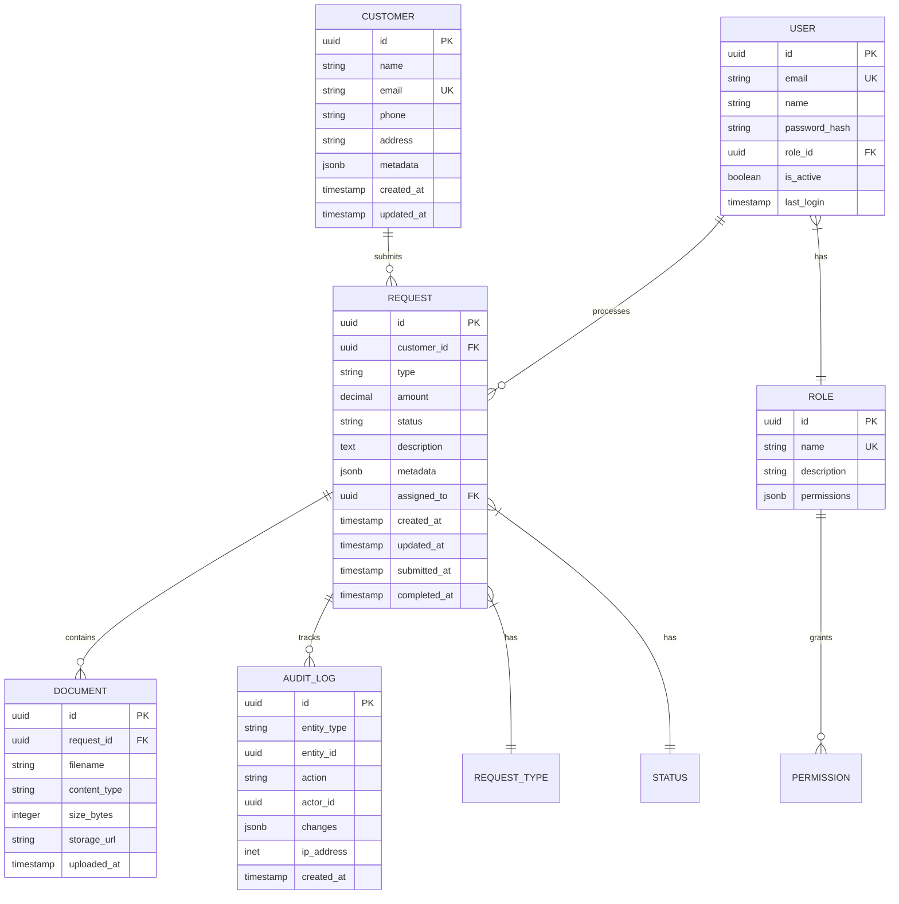

# ERD (Entity-Relationship Diagram)

> **Project:** [Project Name]
> **Version:** [X.Y] | **Status:** [Draft | Under Review | Approved | Baselined]
> **Last Updated:** [YYYY-MM-DD]

---

## 1. Purpose

> This document defines the entity-relationship model — the logical data structures, relationships, and constraints.

## 2. ERD Diagram

## 3. Entity Definitions

### 3.1 Customer

| Attribute | Type | Constraints | Description |
|-----------|------|-----------|-------------|
| [id] | [UUID] | [PK, auto-generated] | [Unique identifier] |
| [name] | [VARCHAR(255)] | [NOT NULL] | [Customer full name] |
| [email] | [VARCHAR(255)] | [UNIQUE, NOT NULL] | [Email address] |
| [phone] | [VARCHAR(20)] | [NULLABLE] | [Phone number] |
| [address] | [TEXT] | [NULLABLE] | [Mailing address] |
| [metadata] | [JSONB] | [NULLABLE] | [Additional flexible data] |
| [created_at] | [TIMESTAMP] | [DEFAULT NOW()] | [Record creation time] |
| [updated_at] | [TIMESTAMP] | [DEFAULT NOW()] | [Last update time] |

### 3.2 Request

| Attribute | Type | Constraints | Description |
|-----------|------|-----------|-------------|
| [id] | [UUID] | [PK, auto-generated] | [Unique identifier] |
| [customer_id] | [UUID] | [FK → customers.id, NOT NULL] | [Requesting customer] |
| [type] | [VARCHAR(50)] | [NOT NULL, ENUM] | [STANDARD, VIP, CORPORATE] |
| [amount] | [DECIMAL(12,2)] | [NOT NULL, > 0] | [Request amount] |
| [status] | [VARCHAR(20)] | [NOT NULL, DEFAULT 'DRAFT'] | [Current status] |
| [description] | [TEXT] | [NULLABLE] | [Request description] |
| [metadata] | [JSONB] | [NULLABLE] | [Additional flexible data] |
| [assigned_to] | [UUID] | [FK → users.id, NULLABLE] | [Assigned staff member] |
| [created_at] | [TIMESTAMP] | [DEFAULT NOW()] | [Record creation time] |
| [updated_at] | [TIMESTAMP] | [DEFAULT NOW()] | [Last update time] |
| [submitted_at] | [TIMESTAMP] | [NULLABLE] | [Submission time] |
| [completed_at] | [TIMESTAMP] | [NULLABLE] | [Completion time] |

### 3.3 Document

| Attribute | Type | Constraints | Description |
|-----------|------|-----------|-------------|
| [id] | [UUID] | [PK, auto-generated] | [Unique identifier] |
| [request_id] | [UUID] | [FK → requests.id, NOT NULL] | [Parent request] |
| [filename] | [VARCHAR(255)] | [NOT NULL] | [Original filename] |
| [content_type] | [VARCHAR(100)] | [NOT NULL] | [MIME type] |
| [size_bytes] | [INTEGER] | [NOT NULL] | [File size] |
| [storage_url] | [VARCHAR(500)] | [NOT NULL] | [S3/storage URL] |
| [uploaded_at] | [TIMESTAMP] | [DEFAULT NOW()] | [Upload time] |

### 3.4 User

| Attribute | Type | Constraints | Description |
|-----------|------|-----------|-------------|
| [id] | [UUID] | [PK, auto-generated] | [Unique identifier] |
| [email] | [VARCHAR(255)] | [UNIQUE, NOT NULL] | [Login email] |
| [name] | [VARCHAR(255)] | [NOT NULL] | [Display name] |
| [password_hash] | [VARCHAR(255)] | [NOT NULL] | [Hashed password] |
| [role_id] | [UUID] | [FK → roles.id, NOT NULL] | [Assigned role] |
| [is_active] | [BOOLEAN] | [DEFAULT true] | [Account active] |
| [last_login] | [TIMESTAMP] | [NULLABLE] | [Last login time] |

### 3.5 Audit Log

| Attribute | Type | Constraints | Description |
|-----------|------|-----------|-------------|
| [id] | [UUID] | [PK, auto-generated] | [Unique identifier] |
| [entity_type] | [VARCHAR(50)] | [NOT NULL] | [Entity type — REQUEST, USER, etc.] |
| [entity_id] | [UUID] | [NOT NULL] | [Entity ID] |
| [action] | [VARCHAR(50)] | [NOT NULL] | [CREATE, UPDATE, DELETE, STATUS_CHANGE] |
| [actor_id] | [UUID] | [NULLABLE] | [User who performed action] |
| [changes] | [JSONB] | [NULLABLE] | [Before/after values] |
| [ip_address] | [INET] | [NULLABLE] | [Client IP] |
| [created_at] | [TIMESTAMP] | [DEFAULT NOW()] | [Action time] |

## 4. Relationship Rules

| Relationship | Cardinality | Delete Rule | Description |
|-------------|-----------|------------|-------------|
| [Customer → Request] | [1:N] | [RESTRICT] | [Cannot delete customer with requests] |
| [Request → Document] | [1:N] | [CASCADE] | [Delete documents when request deleted] |
| [Request → Audit Log] | [1:N] | [CASCADE] | [Delete logs when request deleted] |
| [User → Request] | [1:N] | [SET NULL] | [Unassign if user deleted] |
| [Role → User] | [1:N] | [RESTRICT] | [Cannot delete role with users] |

## 5. Indexes

| Table | Index | Columns | Type | Purpose |
|-------|-------|---------|------|---------|
| [requests] | [idx_requests_customer] | [customer_id] | [B-tree] | [Customer lookup] |
| [requests] | [idx_requests_status] | [status] | [B-tree] | [Status filtering] |
| [requests] | [idx_requests_created] | [created_at] | [B-tree] | [Date sorting] |
| [requests] | [idx_requests_assigned] | [assigned_to] | [B-tree] | [Staff queue] |
| [audit_log] | [idx_audit_entity] | [entity_type, entity_id] | [B-tree] | [Entity history] |
| [audit_log] | [idx_audit_actor] | [actor_id] | [B-tree] | [Actor history] |
| [users] | [idx_users_email] | [email] | [Unique] | [Login lookup] |

## 6. Data Constraints

| Constraint | Table | Rule | Description |
|-----------|-------|------|-------------|
| [Valid status transition] | [requests] | [CHECK or trigger] | [Only valid status transitions allowed] |
| [Positive amount] | [requests] | [CHECK (amount > 0)] | [Amount must be positive] |
| [Valid email format] | [customers, users] | [CHECK or app validation] | [Email format validation] |
| [File size limit] | [documents] | [CHECK (size_bytes <= 10MB)] | [Max file size] |

---

## Related Documents

| Document | Relationship |
|----------|-------------|
| [[Database-Schema-DDL]] | Physical schema from this ERD |
| [[Data-Dictionary]] | Detailed data element definitions |
| [[Low-Level-Design]] | Design using this data model |

---

> **Template Standard:** Based on SWEBOK v4, DMBOK v2
> **Usage:** The ERD is the *logical* data model. It shows entities, attributes, and relationships. The [[Database-Schema-DDL]] is the *physical* implementation.
