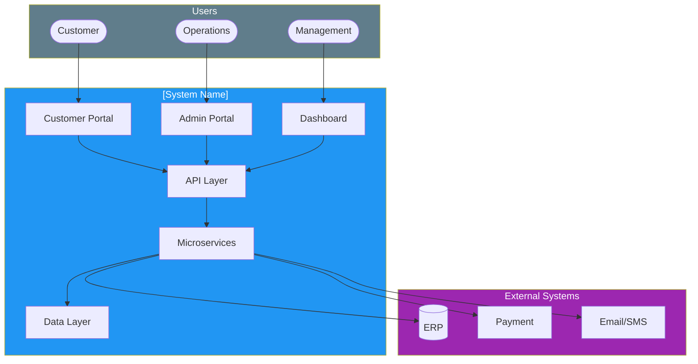
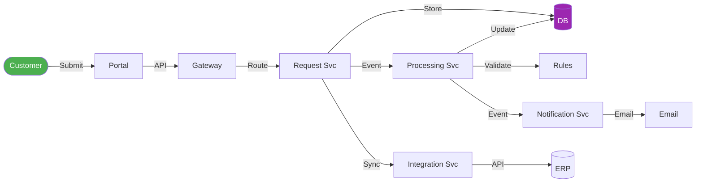
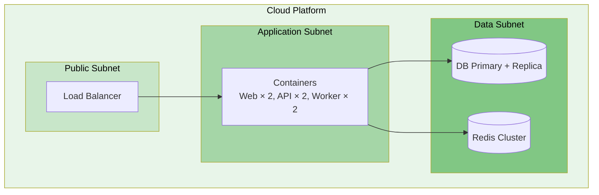

# High-Level Design (HLD)

> **Project:** [Project Name]
> **Version:** [X.Y] | **Status:** [Draft | Under Review | Approved | Baselined]
> **Last Updated:** [YYYY-MM-DD]

---

## Document Control

| Field | Value |
|-------|-------|
| Document Owner | [Name / Role] |
| Solution Architect | [Name / Role] |
| Technical Lead | [Name / Role] |

### Approvals

| Role | Name | Signature | Date |
|------|------|-----------|------|
| IT Director | | | |
| Solution Architect | | | |
| Technical Lead | | | |

---

## 1. Purpose

> This document provides the high-level design — module decomposition, interfaces, data flow, and technology decisions. It bridges the gap between architecture and detailed design.

## 2. System Overview

### 2.1 System Context

### 2.2 Module Decomposition

| Module | Responsibility | Technology | Team |
|--------|---------------|-----------|------|
| [Customer Portal] | [Customer-facing web application] | [React + Next.js] | [Frontend] |
| [Admin Portal] | [Operations staff web application] | [React + Next.js] | [Frontend] |
| [Dashboard] | [Management reporting and analytics] | [React] | [Frontend] |
| [API Gateway] | [Request routing, authentication, rate limiting] | [Kong / AWS API GW] | [DevOps] |
| [Request Service] | [Request CRUD, status tracking, documents] | [Node.js + Express] | [Backend] |
| [Processing Service] | [Validation, classification, routing, approval] | [Node.js + Express] | [Backend] |
| [Auth Service] | [Authentication, authorization, user management] | [Node.js + Passport] | [Backend] |
| [Notification Service] | [Email, SMS, in-app notifications] | [Node.js] | [Backend] |
| [Reporting Service] | [Dashboards, reports, analytics] | [Node.js] | [Backend] |
| [Integration Service] | [ERP, payment, email connectivity] | [Node.js] | [Backend] |

## 3. Interface Design

### 3.1 Internal Interfaces

| From | To | Protocol | Data | Frequency |
|------|-----|---------|------|-----------|
| [Portal] | [API Gateway] | [HTTPS/REST] | [JSON] | [Per request] |
| [API Gateway] | [Services] | [HTTP/REST] | [JSON] | [Per request] |
| [Request Service] | [Processing Service] | [Event/Queue] | [JSON] | [Per request] |
| [Processing Service] | [Notification Service] | [Event/Queue] | [JSON] | [Per status change] |

### 3.2 External Interfaces

| System | Protocol | Data | Direction | Authentication |
|--------|---------|------|-----------|---------------|
| [ERP] | [REST API] | [Customer, Transaction] | Bidirectional | [API Key + OAuth2] |
| [Payment Gateway] | [REST API] | [Payment requests] | Outbound | [API Key] |
| [Email Service] | [SMTP/API] | [Notifications] | Outbound | [API Key] |
| [SMS Service] | [REST API] | [Notifications] | Outbound | [API Key] |

## 4. Data Flow

## 5. Technology Stack

| Layer | Technology | Version | Rationale |
|-------|-----------|---------|----------|
| [Frontend] | [React + Next.js] | [v18] | [Team expertise, SSR, ecosystem] |
| [Backend] | [Node.js + Express] | [v20 LTS] | [Full-stack JS, performance] |
| [Database] | [PostgreSQL] | [v15] | [ACID, JSON, managed service] |
| [Cache] | [Redis] | [v7] | [Session, reference data] |
| [Queue] | [RabbitMQ] | [v3] | [Reliable messaging] |
| [Container] | [Docker + K8s] | [Latest] | [Portability, orchestration] |
| [CI/CD] | [GitHub Actions] | [N/A] | [Team using GitHub] |
| [Monitoring] | [Prometheus + Grafana] | [Latest] | [Open source, self-hosted option] |

## 6. Deployment Architecture

## 7. Security Design

| Layer | Control | Implementation |
|-------|---------|---------------|
| [Network] | [Firewall, WAF] | [Security groups, WAF rules] |
| [Transport] | [TLS 1.3] | [ACM certificates] |
| [Application] | [OAuth2, JWT] | [Auth Service] |
| [Data] | [Encryption at rest] | [KMS, AES-256] |
| [Audit] | [All actions logged] | [Audit Service] |

## 8. Design Decisions

| # | Decision | Rationale | Trade-off |
|---|---------|----------|----------|
| 1 | [Microservices over monolith] | [Independent scaling, team autonomy] | [Complexity] |
| 2 | [PostgreSQL over NoSQL] | [ACID compliance, team familiarity] | [Horizontal scaling] |
| 3 | [Event-driven notifications] | [Decoupling, resilience] | [Debugging complexity] |
| 4 | [Container-based deployment] | [Portability, orchestration] | [Operational overhead] |

## 9. Design Constraints

| Constraint | Impact | Mitigation |
|-----------|--------|-----------|
| [Must use existing cloud provider] | [Platform limitation] | [Use cloud-native services] |
| [Data sovereignty] | [In-country hosting only] | [Local cloud region] |
| [Budget cap $500K] | [Scope limitation] | [Prioritize 🔴 features] |

## 10. Open Issues

| # | Issue | Owner | Status | Impact |
|---|-------|-------|--------|--------|
| 1 | [ERP API documentation incomplete] | [Tech Lead] | Open | [Integration risk] |
| 2 | [Performance targets not validated] | [QA Lead] | Open | [NFR risk] |

---

## Related Documents

| Document | Relationship |
|----------|-------------|
| [[Software-Architecture-Document]] | Architecture driving this design |
| [[Low-Level-Design]] | Detailed design from this HLD |
| [[Interface-Control-Document]] | Interface specifications |
| [[API-Specification]] | API contracts |

---

> **Template Standard:** Based on SWEBOK v4, ISO/IEC/IEEE 42010
> **Usage:** The HLD shows *what* modules exist and *how* they interact. It's the blueprint for developers. Go to LLD for implementation details.
