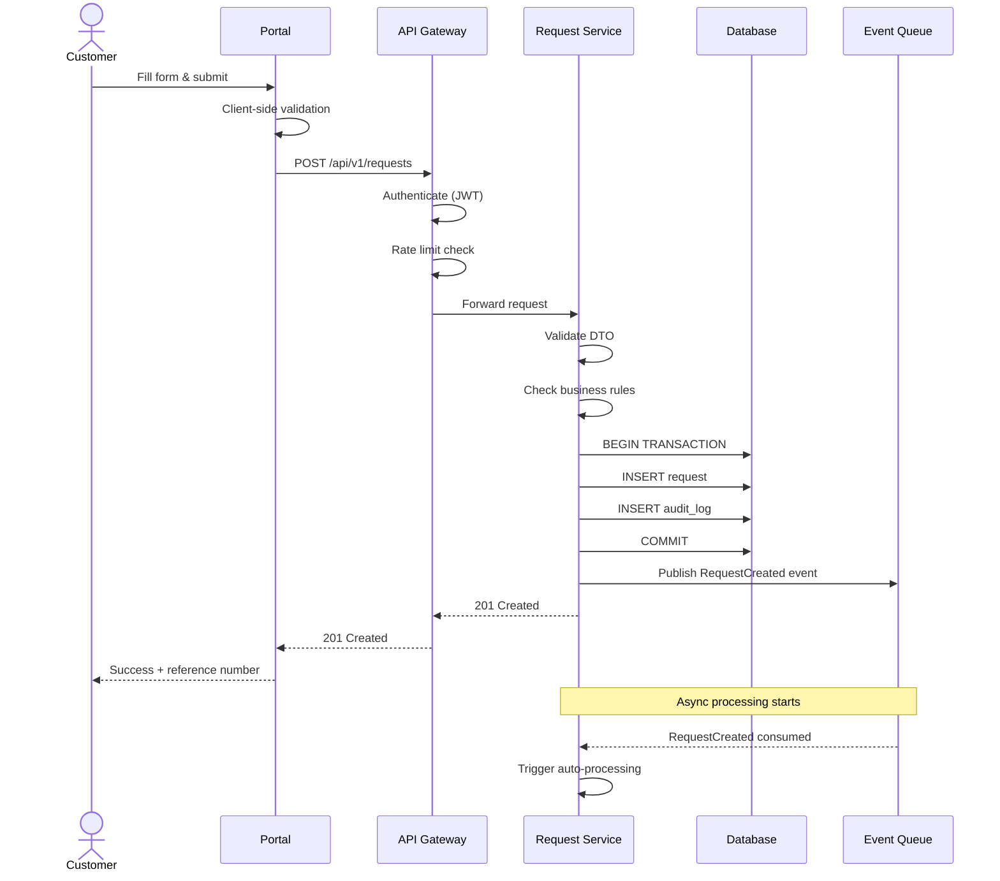
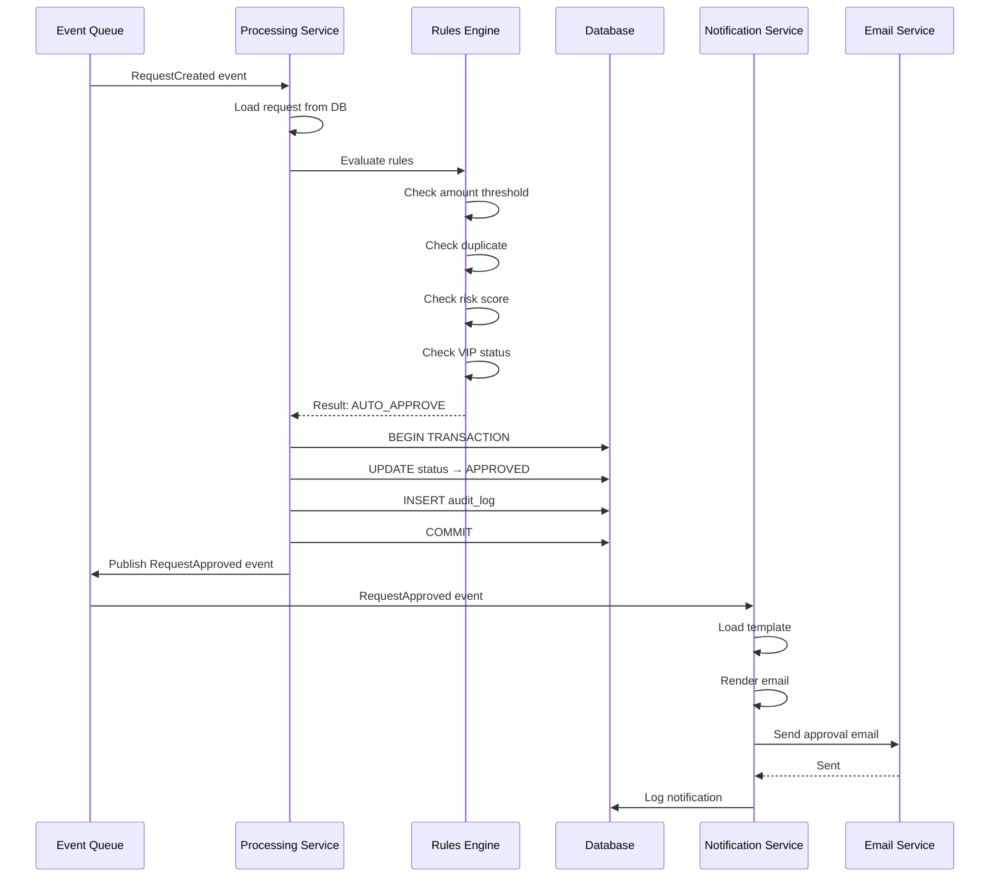
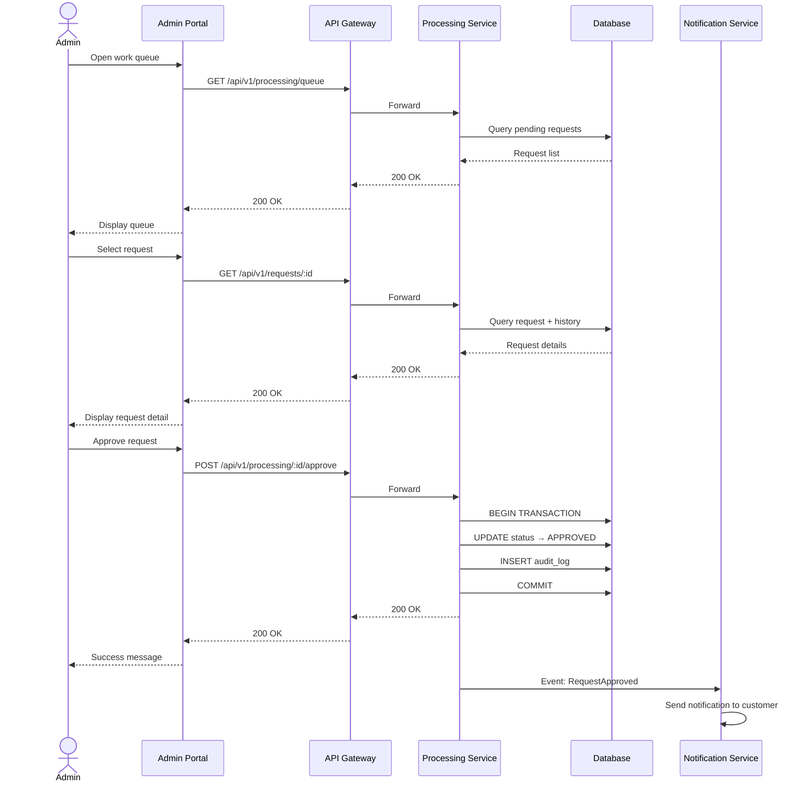
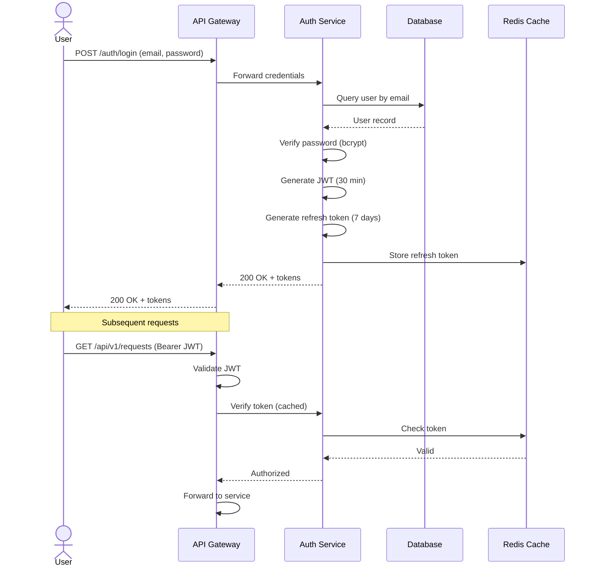
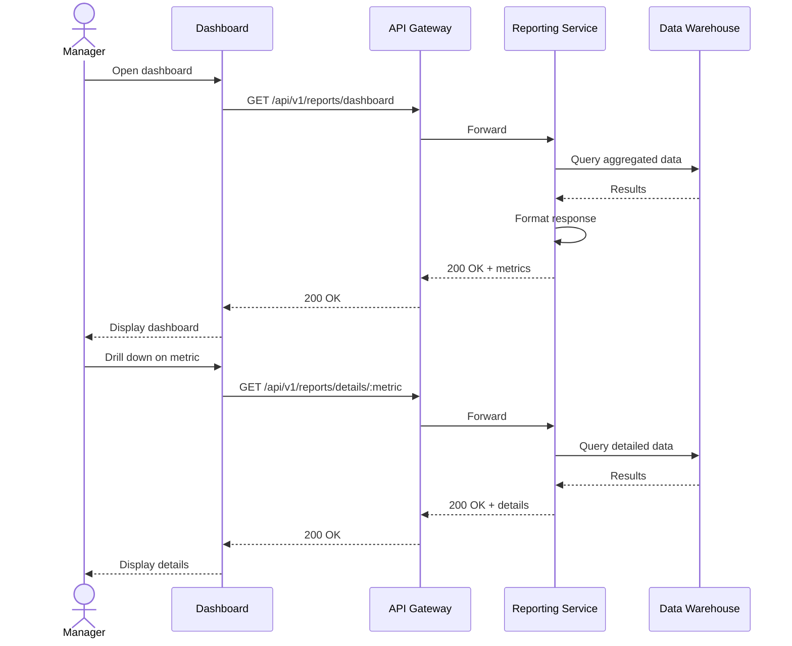
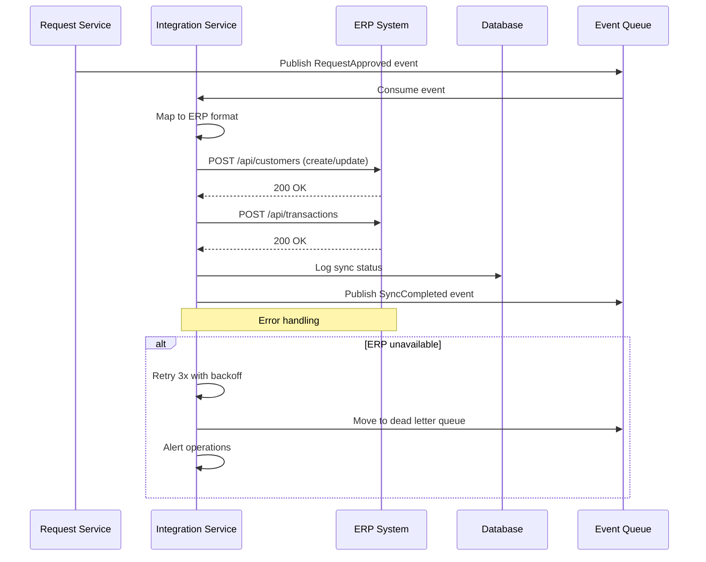

# Sequence Diagrams

> **Project:** [Project Name]
> **Version:** [X.Y] | **Status:** [Draft | Under Review | Approved]
> **Last Updated:** [YYYY-MM-DD]

---

## 1. Purpose

> This document contains UML sequence diagrams showing object interactions over time for key scenarios.

## 2. Sequence Diagram Index

| # | Scenario | Participants | Status |
|---|---------|-------------|--------|
| SD-001 | [Request Submission] | [Customer, Portal, API, Request Svc, DB] | ✅ Approved |
| SD-002 | [Auto-Processing] | [Request Svc, Processing Svc, Rules, DB, Notification] | ✅ Approved |
| SD-003 | [Manual Review] | [Admin, API, Processing Svc, DB, Notification] | ✅ Approved |
| SD-004 | [Authentication] | [User, API, Auth Svc, DB, Cache] | ✅ Approved |
| SD-005 | [Report Generation] | [Manager, API, Report Svc, DW] | ✅ Approved |
| SD-006 | [ERP Sync] | [Request Svc, Integration Svc, ERP] | ✅ Approved |

## 3. Sequence Diagrams

### SD-001: Request Submission

### SD-002: Auto-Processing (Auto-Approval)

### SD-003: Manual Review

### SD-004: Authentication Flow

### SD-005: Report Generation

### SD-006: ERP Synchronization

## 4. Interaction Patterns

| Pattern | Applied To | Purpose |
|---------|-----------|---------|
| [Request-Response] | [API calls] | [Synchronous operations] |
| [Publish-Subscribe] | [Event processing] | [Decoupled async operations] |
| [Retry with Backoff] | [External calls] | [Handle transient failures] |
| [Circuit Breaker] | [ERP integration] | [Prevent cascading failures] |
| [Dead Letter Queue] | [Failed events] | [Handle poison messages] |

---

## Related Documents

| Document | Relationship |
|----------|-------------|
| [[Class-Diagrams]] | Static structure |
| [[State-Diagrams]] | State transitions |
| [[Low-Level-Design]] | Implementation details |
| [[API-Specification]] | API contracts |

---

> **Template Standard:** Based on SWEBOK v4, ISO/IEC 19501 (UML)
> **Usage:** Sequence diagrams show *behavior over time* — how objects interact for specific scenarios. Use them to understand, communicate, and verify complex interactions.
